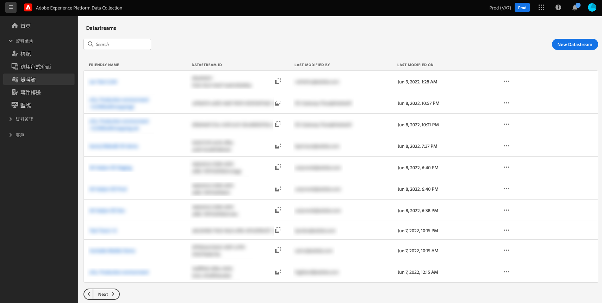
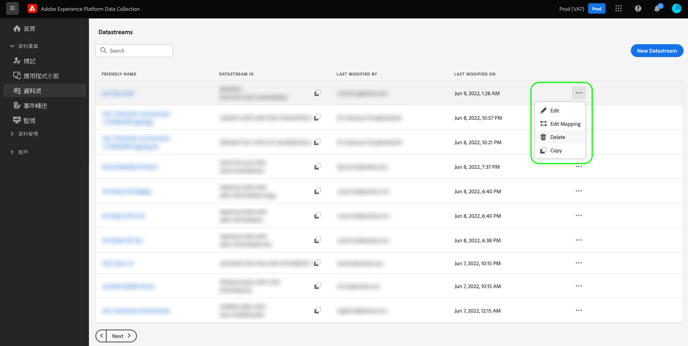
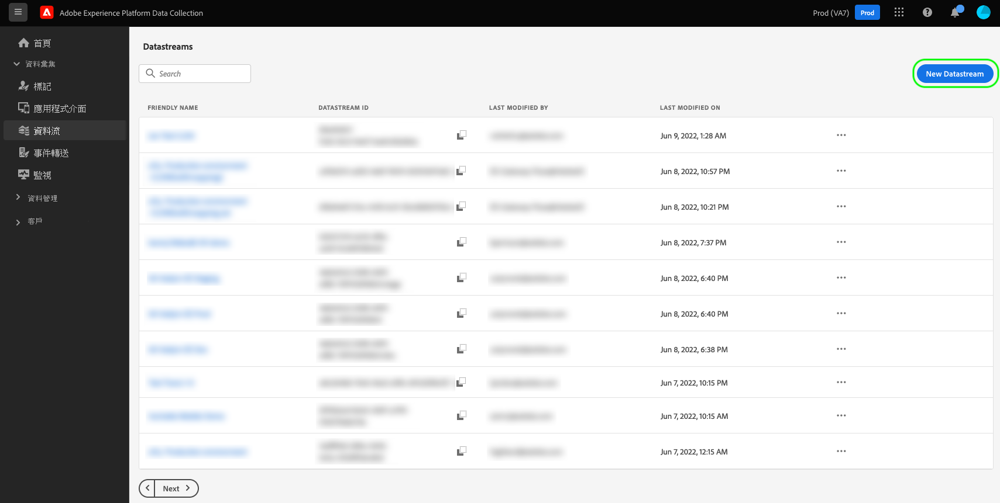
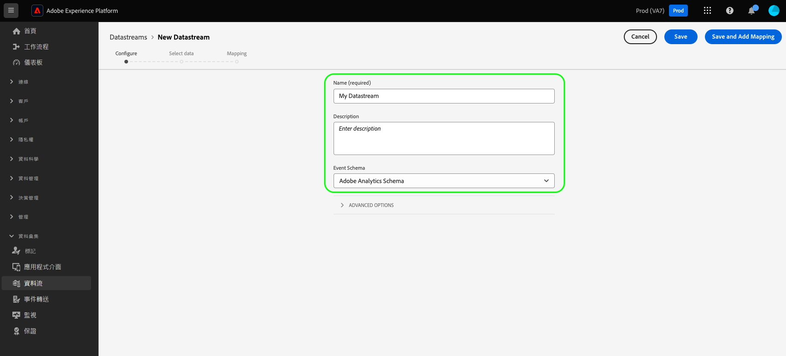
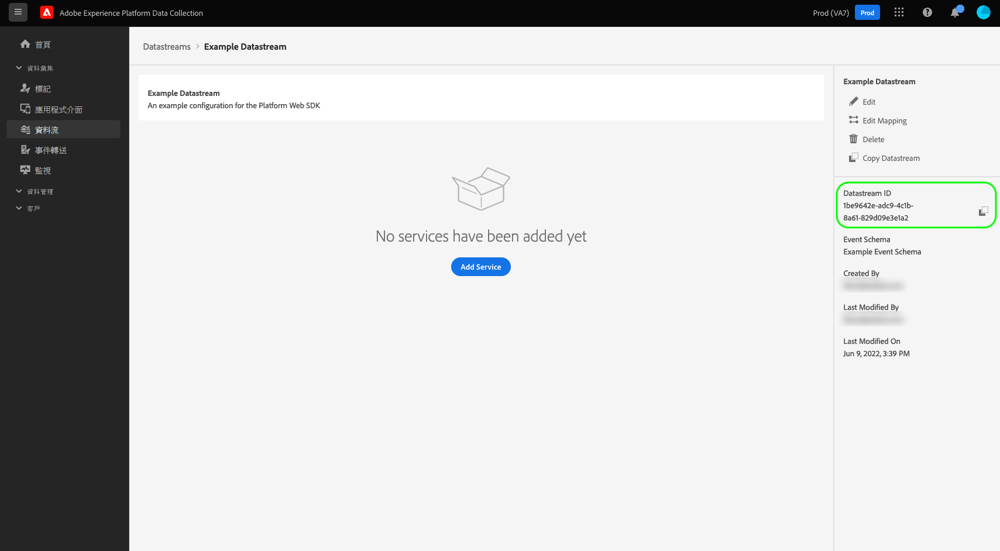
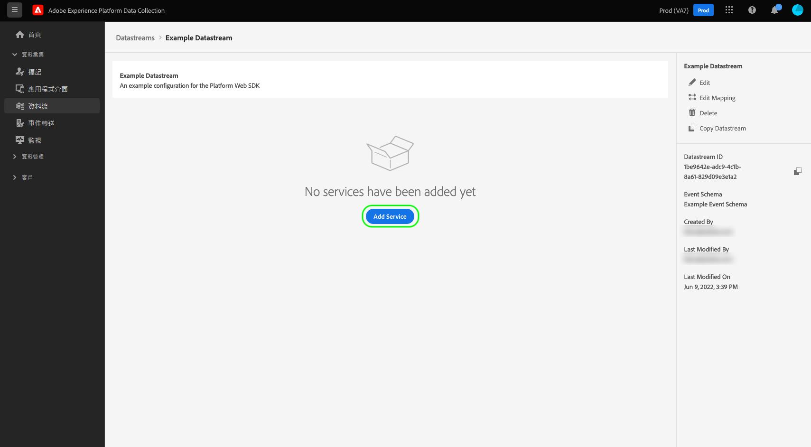
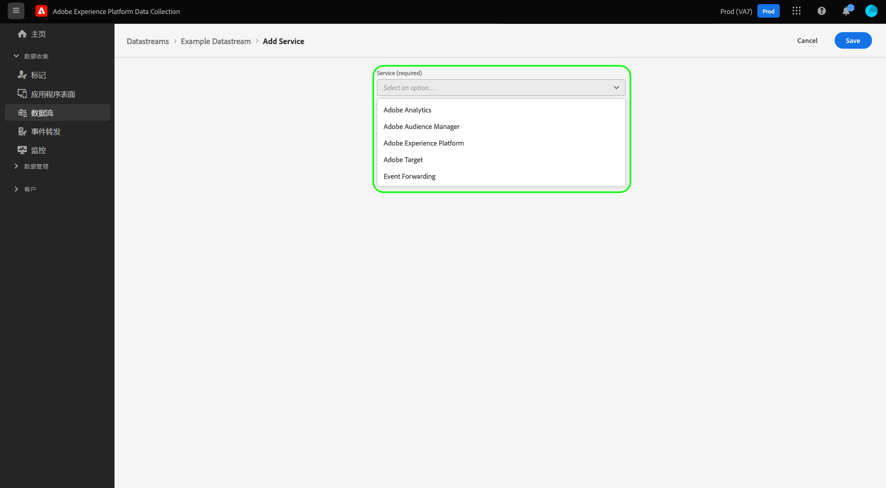
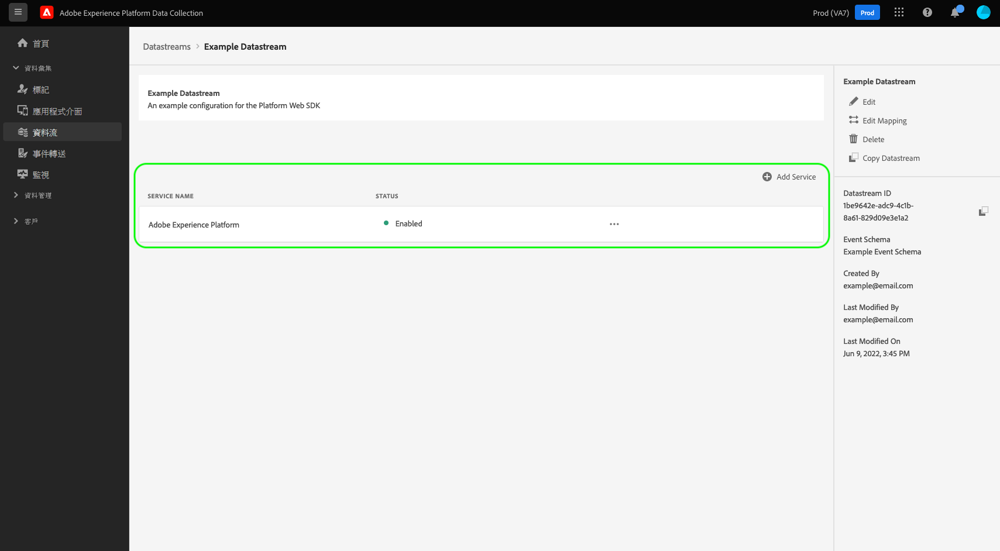
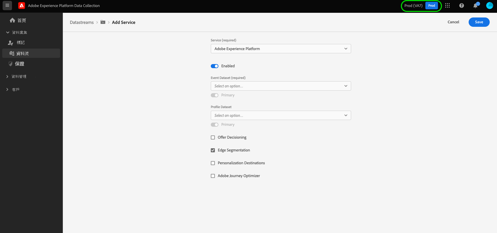
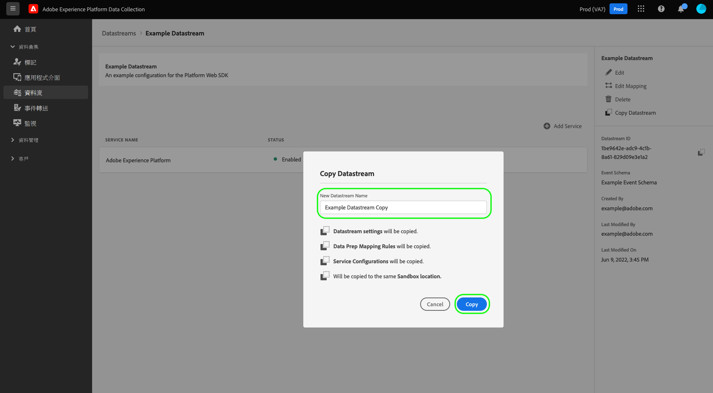

# 設定資料流

本檔案說明設定 [資料流](./overview.md) 在UI中。

## 存取 [!UICONTROL 資料串流] 工作區

您可以在資料收集UI或Experience Platform UI中建立和管理資料串流，方法是選取 **[!UICONTROL 資料串流]** ，位於左側導覽器中。

此 **[!UICONTROL 資料串流]** 索引標籤會顯示現有資料串流的清單，包括其易記名稱、ID和上次修改日期。 選取要傳送的資料流名稱 [檢視其詳細資訊並設定服務](#view-details).

選取「更多」圖示(**...**)以顯示更多選項。 選取 **[!UICONTROL 編輯]** 更新 [基本設定](#configure) 針對資料串流，或選取 **[!UICONTROL 刪除]** 以移除資料流。

## 建立新的資料流 {#create}

若要建立資料串流，請從選取 **[!UICONTROL 新增資料串流]**.

隨即顯示資料串流建立工作流程，從設定步驟開始。 從這裡，您必須提供資料串流的名稱和選擇性說明。

如果您要設定此資料流以用於Experience Platform並使用Platform Web SDK，您也必須選取 [事件型Experience Data Model (XDM)結構](../xdm/classes/experienceevent.md) 代表您計畫擷取的資料。

選取 **[!UICONTROL 進階選項]** 以顯示其他控制項來設定資料流。

 {#advanced-options}

>[!IMPORTANT]
>
> 您有責任確保已取得適用法律與法規所規定的一切必要許可權、同意、許可與授權，以收集、處理及傳輸個人資料，包括精確的地理位置資訊。
> 
> 您的IP位址模糊化選取不會影響將從IP位址衍生並傳送至您設定之Adobe解決方案的地理位置資訊等級。 地理位置查詢必須另外限制或停用。

| 設定 | 說明 |
| --- | --- |
| [!UICONTROL 地理查閱] | 根據訪客IP位址啟用所選選項的地理位置查閱。 可用選項： <ul><li>國家/地區</li><li>郵遞區號</li><li>州/省</li><li>DMA</li><li>城市</li><li>緯度 </li><li>經度</li></ul>選取 **[!UICONTROL 城市]**， **[!UICONTROL 緯度]**，或 **[!UICONTROL 經度]** 無論選取其他什麼選項，最多提供兩個小數點的座標。 這將視為城市層級的詳細程度。    未選取任何選項會停用任何地理位置查閱。 地理位置發生於 [!UICONTROL IP模糊化] 且不會受  [!UICONTROL IP模糊化] 設定。 |
| [!UICONTROL 網路查詢] | 根據訪客IP位址啟用所選選項的網路查詢。 可用選項： <ul><li>電信業者</li><li>網域</li><li>ISP</li></ul>使用這些選項可向其他服務提供有關請求源自的特定網路的詳細資訊。 |
| [!UICONTROL IP 模糊化] | 指示要套用至資料流的IP模糊化型別。 任何根據客戶IP的處理作業都會受到IP模糊化設定的影響。 這包括從您的資料流接收資料的所有Experience Cloud服務。 
可用選項：
 <ul><li>**[!UICONTROL 無]**：停用IP模糊化功能。 完整的使用者IP位址將透過資料流傳送。</li><li>**[!UICONTROL 部分]**：針對IPv4位址，將使用者IP位址的最後八位元模糊化。 針對IPv6位址，會模糊化位址的後80個位元。 
範例：
 <ul><li>IPv4： `1.2.3.4` -> `1.2.3.0`</li><li>IPv6： `2001:0db8:1345:fd27:0000:ff00:0042:8329` -> `2001:0db8:1345:0000:0000:0000:0000:0000`</li></ul></li><li>**[!UICONTROL 完整]**：模糊化整個IP位址。 
範例：
 <ul><li>IPv4： `1.2.3.4` -> `0.0.0.0`</li><li>IPv6： `2001:0db8:1345:fd27:0000:ff00:0042:8329` -> `0:0:0:0:0:0:0:0`</li></ul></li></ul> IP模糊化對其他Adobe產品的影響： <ul><li>**Adobe Target**：資料流層級 [!UICONTROL IP模糊化] 設定的優先順序高於Adobe Target中設定的任何IP模糊化選項。 例如，如果資料流層級 [!UICONTROL IP模糊化] 選項已設為 **[!UICONTROL 完整]** 且Adobe Target IP模糊化選項設為 **[!UICONTROL 最後一個八位元模糊化]**，Adobe Target會收到完全模糊化的IP。 請參閱Adobe Target檔案於 [IP模糊化](https://developer.adobe.com/target/before-implement/privacy/privacy/) 和 [地理位置](https://experienceleague.adobe.com/docs/target/using/audiences/create-audiences/categories-audiences/geo.html?lang=en) 以取得更多詳細資料。</li><li>**Audience Manager**：資料流層級IP模糊化設定的優先順序高於Audience Manager中設定的任何IP模糊化選項，且會套用至所有IP位址。 Audience Manager執行的任何地理位置查詢都會受到資料流層級的影響 [!UICONTROL IP模糊化] 選項。 在Audience Manager中，根據完全模糊化的IP進行地理位置查詢，將會產生未知區域，而且將不會實現任何根據結果地理位置資料的區段。 請參閱Audience Manager檔案於 [IP模糊化](https://experienceleague.adobe.com/docs/audience-manager/user-guide/features/administration/ip-obfuscation.html?lang=en) 以取得更多詳細資料。</li><li>**Adobe Analytics**：如果選取「無」以外的任何IP模糊化選項，Adobe Analytics目前會收到部分模糊化的IP位址。 若要讓Analytics接收完全模糊化的IP位址，您必須在Adobe Analytics中個別設定IP模糊化。 此行為會在未來版本中更新。請參閱Adobe Analytics [檔案](https://experienceleague.adobe.com/docs/analytics/admin/admin-tools/manage-report-suites/edit-report-suite/report-suite-general/general-acct-settings-admin.html) 以取得有關如何在Analytics中啟用IP模糊化的詳細資訊。</li></ul> |
| [!UICONTROL 第一方ID Cookie] | 啟用時，此設定會在查詢時通知Edge Network參考指定的Cookie。 [第一方裝置ID](../edge/identity/first-party-device-ids.md)，而不要在「身分對應」中查詢此值。  啟用此設定時，您必須提供預期儲存ID的Cookie名稱。 |
| [!UICONTROL 協力廠商ID同步] | ID同步可分組到容器中，以便在不同時間執行不同的ID同步。 啟用時，此設定可讓您指定針對此資料流執行的ID同步容器。 |
| [!UICONTROL 協力廠商ID同步容器ID] | 用於協力廠商ID同步的容器的數值ID。 |
| [!UICONTROL 容器ID覆蓋] | 在此區段中，您可以定義其他第三方ID同步容器ID，以用來覆寫預設的ID。 |
| [!UICONTROL 存取型別] | 定義Edge Network為資料流接受的驗證型別。 <ul><li>**[!UICONTROL 混合驗證]**：選取此選項時，邊緣網路會接受已驗證和未驗證的請求。 當您計畫使用Web SDK或是 [行動SDK](https://aep-sdks.gitbook.io/docs/)，以及 [伺服器API](../server-api/overview.md). </li><li>**[!UICONTROL 僅驗證]**：選取此選項時，Edge Network僅接受已驗證的要求。 當您只打算使用Server API，並想要防止Edge Network處理任何未驗證的請求時，請選取此選項。</li></ul> |

從這裡，如果您要設定用於Experience Platform的資料流，請遵循教學課程中的 [資料收集的資料準備](./data-prep.md) 在返回本指南之前，將您的資料對應至Platform事件結構。 否則，請選取 **[!UICONTROL 儲存]** 並繼續下一節。

## 檢視資料流詳細資料 {#view-details}

在設定新資料流或選取要檢視的現有資料流後，該資料流的詳細資訊頁面就會顯示。 您可以在這裡找到有關資料串流的進一步資訊，包括其ID。

從資料流詳細資訊畫面，您可以 [新增服務](#add-services) 啟用您有權存取之Adobe Experience Cloud產品的功能。 您也可以編輯資料流的 [基本設定](#create)，更新其 [對應規則](./data-prep.md)， [複製資料流](#copy)，或將其完全刪除。

## 將服務新增至資料串流 {#add-services}

在資料流的詳細資訊頁面上，選取 **[!UICONTROL 新增服務]** 以開始為該資料流新增可用服務。

在下一個畫面，使用下拉式選單來選取要為此資料流設定的服務。 此清單中只會顯示您有權存取的服務。

選取所需的服務，填寫顯示的組態選項，然後選取 **[!UICONTROL 儲存]** 以將服務新增至資料流。 所有新增的服務都會出現在資料流的詳細資料檢視中。

以下各小節說明每項服務的組態選項。

>[!NOTE]
>
>每個服務組態都包含 **[!UICONTROL 已啟用]** 在選取服務時自動啟用的切換按鈕。 若要為此資料流停用選取的服務，請選取 **[!UICONTROL 已啟用]** 再次切換。

### Adobe Analytics設定 {#analytics}

此服務可控制是否及如何將資料傳送至Adobe Analytics。 如需其他詳細資訊，請參閱指南，網址為 [傳送資料至Analytics](../edge/data-collection/adobe-analytics/analytics-overview.md).

| 設定 | 說明 |
| --- | --- |
| [!UICONTROL 報告套裝 ID] | **（必要）** 您要傳送資料的Analytics報表套裝ID。 此ID可在Adobe Analytics UI中找到，位於 [!UICONTROL 管理員] > [!UICONTROL 報告套裝]. 如果指定了多個報表套裝，則會將資料複製到每個報表套裝。 |
| [!UICONTROL 報表套裝覆寫] | 在此區段中，您可以新增其他報表套裝ID，以用於覆寫預設的ID。 |

### Adobe Audience Manager設定 {#audience-manager}

此服務可控制是否及如何將資料傳送至Adobe Audience Manager。 若要將資料傳送至Audience Manager，只需要啟用此區段即可。 其他設定是選用的，但建議使用。

| 設定 | 說明 |
| --- | --- |
| [!UICONTROL Cookie目的地已啟用] | 允許SDK透過分享區段資訊 [Cookie目的地](https://experienceleague.adobe.com/docs/audience-manager/user-guide/features/destinations/custom-destinations/create-cookie-destination.html) 從 [!DNL Audience Manager]. |
| [!UICONTROL 已啟用URL目的地] | 允許SDK透過分享區段資訊 [URL目的地](https://experienceleague.adobe.com/docs/audience-manager/user-guide/features/destinations/custom-destinations/create-url-destination.html) 從 [!DNL Audience Manager]. |

### Adobe Experience Platform設定 {#aep}

>[!IMPORTANT]
>
>為Platform啟用資料串流時，請記下您目前使用的Platform沙箱，如UI的頂端功能區中所顯示。
>
>
>
>沙箱是Adobe Experience Platform中的虛擬分割區，可讓您將資料和實作與組織中的其他人隔離。 建立資料流後，就無法變更其沙箱。 如需Experience Platform中沙箱角色的詳細資訊，請參閱 [沙箱檔案](../sandboxes/home.md).

此服務可控制是否及如何將資料傳送至Adobe Experience Platform。

| 設定 | 說明 |
|---| --- |
| [!UICONTROL 事件資料集] | **（必要）** 選取將串流至客戶事件資料的Platform資料集。 此結構描述必須使用 [XDM ExperienceEvent類別](../xdm/classes/experienceevent.md). 若要新增其他資料集，請選取 **[!UICONTROL 新增事件資料集]**. |
| [!UICONTROL 設定檔資料集] | 選取將傳送客戶屬性資料的Platform資料集。 此結構描述必須使用 [XDM個別設定檔類別](../xdm/classes/individual-profile.md). |
| [!UICONTROL Offer Decisioning] | 選取此核取方塊可啟用Platform Web SDK實作的Offer decisioning。 請參閱以下指南： [搭配Platform Web SDK使用Offer Decisioning](../edge/personalization/offer-decisioning/offer-decisioning-overview.md) 以取得更多實作詳細資訊。  如需Offer decisioning功能的詳細資訊，請參閱 [Adobe Journey Optimizer檔案](https://experienceleague.adobe.com/docs/journey-optimizer/using/offer-decisioniong/get-started/starting-offer-decisioning.html?lang=zh-Hant). |
| [!UICONTROL 邊緣細分] | 選取此核取方塊以啟用 [邊緣細分](../segmentation/ui/edge-segmentation.md) 用於此資料流。 當SDK透過啟用邊緣區段的資料流傳送資料時，有問題的設定檔的任何更新區段會籍都會在回應中傳回。  此選項可與搭配使用 [!UICONTROL 個人化目的地] 的 [下一頁個人化使用案例](../destinations/ui/activate-edge-personalization-destinations.md). |
| [!UICONTROL 個人化目的地] | 在啟用後啟用此專案時 [!UICONTROL 邊緣細分] 核取方塊，此選項可讓資料流連線至個人化目的地，例如 [自訂個人化](../destinations/catalog/personalization/custom-personalization.md).  如需以下專案的具體步驟，請參閱目的地檔案 [設定個人化目的地](../destinations/ui/activate-edge-personalization-destinations.md). |
| [!UICONTROL Adobe Journey Optimizer] | 選取此核取方塊以啟用 [Adobe Journey Optimizer](https://experienceleague.adobe.com/docs/journey-optimizer/using/ajo-home.html) 用於此資料流。    啟用此選項可讓資料流從的網頁和應用程式型傳入行銷活動傳回個人化內容。 [!DNL Adobe Journey Optimizer]. 此選項需要 [!UICONTROL 邊緣細分] 以啟用。 如果 [!UICONTROL 邊緣細分] 未勾選，則此選項會呈現灰色。 |

### Adobe Target設定 {#target}

此服務可控制是否及如何將資料傳送至Adobe Target。

| 設定 | 說明 |
| --- | --- |
| [!UICONTROL 屬性Token] | [!DNL Target] 可讓客戶透過使用屬性來控制許可權。 如需屬性的詳細資訊，請參閱以下指南： [設定企業許可權](https://experienceleague.adobe.com/docs/target/using/administer/manage-users/enterprise/properties-overview.html) 在 [!DNL Target] 檔案。  屬性代號可在Adobe Target UI中的 [!UICONTROL 設定] > [!UICONTROL 屬性]. |
| [!UICONTROL 目標環境ID] | [Adobe Target的環境](https://experienceleague.adobe.com/docs/target/using/administer/hosts.html) 協助您在開發的所有階段管理實施。 此設定會指定您要用於此資料流的環境。  最佳實務是為您的每個使用者設定不同的方式 `dev`， `stage`、和 `prod` 資料流環境讓事情變得簡單。 不過，如果您已定義Adobe Target環境，則可以使用這些環境。 |
| [!UICONTROL Target第三方ID名稱空間] | 的身分名稱空間 `mbox3rdPartyId` 您要用於此資料流。 請參閱以下指南： [實施 `mbox3rdPartyId` 使用Web SDK](../edge/personalization/adobe-target/using-mbox-3rdpartyid.md) 以取得詳細資訊。 |
| [!UICONTROL 屬性代號覆寫] | 在此區段中，您可以定義其他可用來覆寫預設屬性代號的屬性。 |

### [!UICONTROL 事件轉送] 設定

此服務控制是否及如何將資料傳送至 [事件轉送](../tags/ui/event-forwarding/overview.md).

| 設定 | 說明 |
| --- | --- |
| [!UICONTROL Launch屬性] | **（必要）** 您要傳送資料的目的地事件轉送屬性。 |
| [!UICONTROL Launch環境] | **（必要）** 選定屬性內您要將資料傳送到的環境。 |

>[!NOTE]
>
>您可以選取 **[!UICONTROL 手動輸入ID]** ，而不使用下拉式功能表輸入屬性和環境名稱。

## 複製資料流 {#copy}

您可以建立現有資料串流的復本，並視需要變更其詳細資訊。

>[!NOTE]
>
>資料串流只能複製在相同的 [沙箱](../sandboxes/home.md). 換言之，您不能將資料流從一個沙箱複製到另一個沙箱。

從的首頁面 [!UICONTROL 資料串流] 工作區中，選取省略符號(**....**)，然後選取「 **[!UICONTROL 複製]**.

![影像顯示 [!UICONTROL 複製] 從資料流清單檢視中選取的選項](assets/configure/copy-datastream-list.png)

或者，您可以選取 **[!UICONTROL 複製資料流]** 從指定資料流的詳細資料檢視。

![影像顯示 [!UICONTROL 複製] 從資料流詳細資料檢視中選取的選項](assets/configure/copy-datastream-details.png)

隨即顯示確認對話方塊，提示您為要建立的新資料流提供唯一名稱，以及將要複製的組態選項的相關詳細資訊。 準備就緒後，選擇 **[!UICONTROL 複製]**.

的首頁面 [!UICONTROL 資料串流] 工作區會重新出現，並列出新的資料流。

## 後續步驟

本指南說明如何在資料收集UI中管理資料串流。 如需如何在設定資料流後安裝和設定Web SDK的詳細資訊，請參閱 [Data Collection E2E指南](../collection/e2e.md#install).
