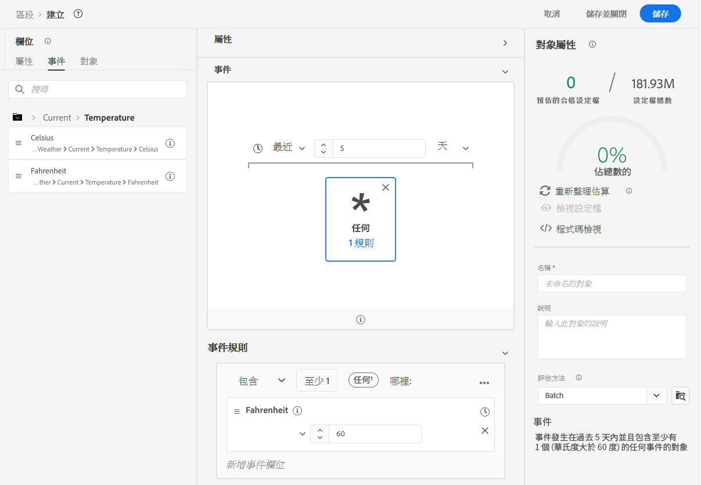
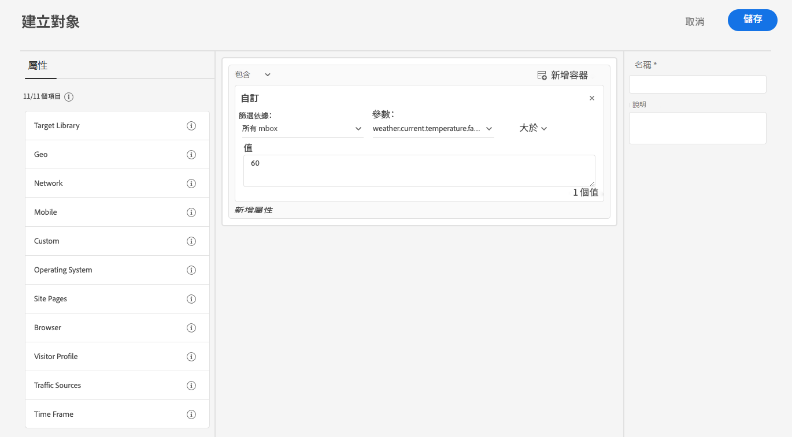

# 使用來自[!DNL The Weather Channel]的天氣資料增強資料彙集

Adobe 已和 [[!DNL [The Weather Company]]](https://www.ibm.com/weather) 合作，將美國天氣的附加內容引進透過資料流收集的資料中。您可以在Experience Platform中使用此資料來分析、鎖定目標和建立對象。

[!DNL The Weather Channel]提供三種型別的資料：

* **[!UICONTROL 目前的天氣]**：根據使用者的位置提供目前的天氣狀況。這包括目前的溫度、降水、雲端涵蓋範圍等。
* **[!UICONTROL 預測天氣]**：預測包括使用者地點的1、2、3、5、7和10天預測。
* **[!UICONTROL 觸發因素]**：觸發因素指對應至不同語義天氣狀況的特定組合。有三種不同類型的天氣觸發因素：

   * **[!UICONTROL 天氣觸發因素]**：具有語義意義的狀況，例如寒冷或下雨的天氣。這些在不同氣候下的定義可能有所不同。
   * **[!UICONTROL 產品觸發因素]**：會導致購買不同類型產品的狀況。例如：寒冷天氣預報可能表示您更有可能購買雨衣。
   * **[!UICONTROL 惡劣天氣觸發因素]**：惡劣天氣的警告，例如冬季暴風雨或颶風警告。

## 先決條件 {#prerequisites}

在使用天氣資料之前，請確保滿足以下先決條件：

* 您必須從[!DNL The Weather Channel]授權您將使用的天氣資料。 然後他們會在您的帳戶上啟用授權。
* 天氣資料只能透過資料流取得。若要使用天氣資料，您必須使用[!DNL Web SDK]、[!DNL Mobile Edge Extension]或[Edge Network API](https://developer.adobe.com/data-collection-apis/docs/api/)以包含此資料。
* 您的資料流必須啟用[[!UICONTROL 地理位置]](../configure.md#advanced-options)。
* 將[天氣欄位群組](#schema-configuration)新增到您正在使用的結構描述。

## 佈建 {#provisioning}

向 [!DNL The Weather Channel] 取得資料授權後，您的帳戶即會獲得啟用，可存取資料。接下來，您則必須和 Adob&#x200B;&#x200B;e 客戶服務聯絡，要求在您的資料流上啟用資料。啟用後，即會自動附加資料。

使用偵錯工具執行邊緣追蹤或使用 Assurance 追蹤通過 [!DNL Edge Network] 的點擊，即可驗證是否已新增。

### 結構描述設定 {#schema-configuration}

您必須將天氣欄位群組新增到和您在資料流中正在使用的事件資料集相對應的 Experience Platform 結構描述。可提供五種欄位群組：

* [!UICONTROL 預報的天氣]
* [!UICONTROL 目前的天氣]
* [!UICONTROL 產品觸發因素]
* [!UICONTROL 相對觸發因素]
* [!UICONTROL 惡劣天氣觸發因素]

## 存取天氣資料 {#access-weather-data}

您的資料獲得授權並可供使用後，您就可以在整個Adobe服務中以各種方式存取資料。

### Adobe Analytics {#analytics}

在 [!DNL Adobe Analytics] 中，可透過處理規則和您的其餘 [!DNL XDM] 結構描述一起對應天氣資料。

您可以在[天氣參考](weather-reference.md)頁面找到可以對應的欄位清單。和所有的 [!DNL XDM] 結構描述一樣，索引鍵的首碼為 `a.x`。例如，名為 `weather.current.temperature.farenheit` 的欄位會在 [!DNL Analytics] 中顯示為 `a.x.weather.current.temperature.farenheit`。

### Adobe Customer Journey Analytics {#cja}

在 [!DNL Adobe Customer Journey Analytics] 中，可在資料流中指定的資料集中取得天氣資料。只要天氣屬性是[新增到您的結構描述](#prerequisites-prerequisites)，就可用於[新增到[!DNL Customer Journey Analytics]中的資料檢視](https://experienceleague.adobe.com/docs/analytics-platform/using/cja-dataviews/create-dataview.html?lang=zh-Hant)。

### Real-Time Customer Data Platform {#rtcdp}

氣象資料可在[Real-Time Customer Data Platform](../../rtcdp/overview.md)中使用，以用於對象。 天氣資料會附加到事件。

由於天氣狀況經常變更，Adobe建議您為對象設定時間限制，如上例所示。 最後一兩天的寒冷天氣會比 6 個月前的寒冷天氣影響更大。

如需可用的欄位，請參閱[天氣參考](weather-reference.md)。

### Adobe Target {#target}

在 [!DNL Adobe Target] 中，您可以使用天氣資料即時提升個人化。天氣資料會傳遞至 [!DNL Target] (以 [!UICONTROL mBox] 參數的形式)，您可以透過自訂的 [!UICONTROL mBox] 參數進行存取。

此參數是到特定欄位的 [!DNL XDM] 路徑。如需可用的欄位及其相對應的路徑，請參閱[天氣參考](weather-reference.md)。

## 後續步驟 {#next-steps}

閱讀本文件後，您現在對於如何在各種 Adob&#x200B;&#x200B;e 解決方案中使用天氣資料有了更深入的了解。若要深入了解天氣資料欄位對應，請參閱[欄位對應參考](weather-reference.md)。
