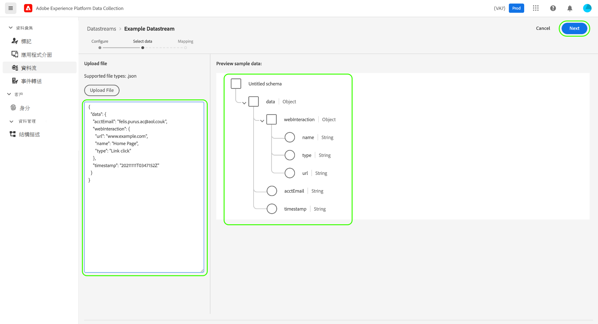
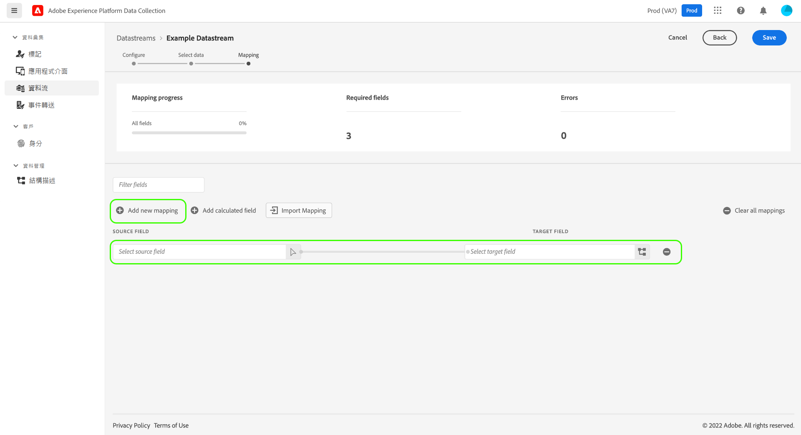
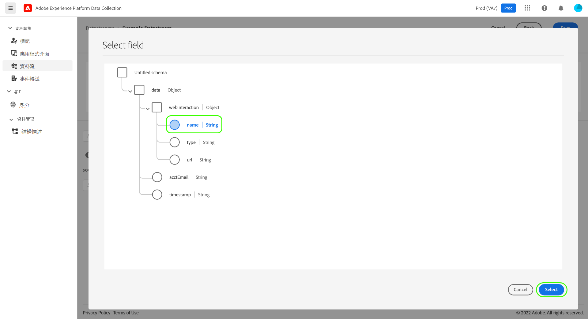
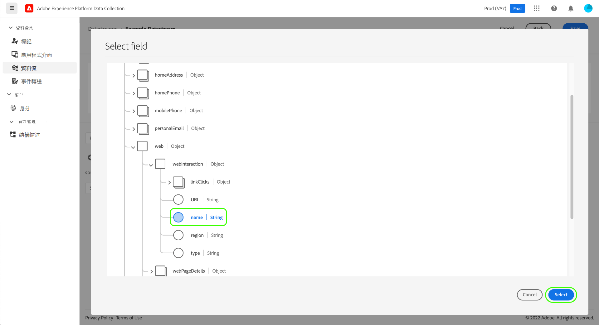
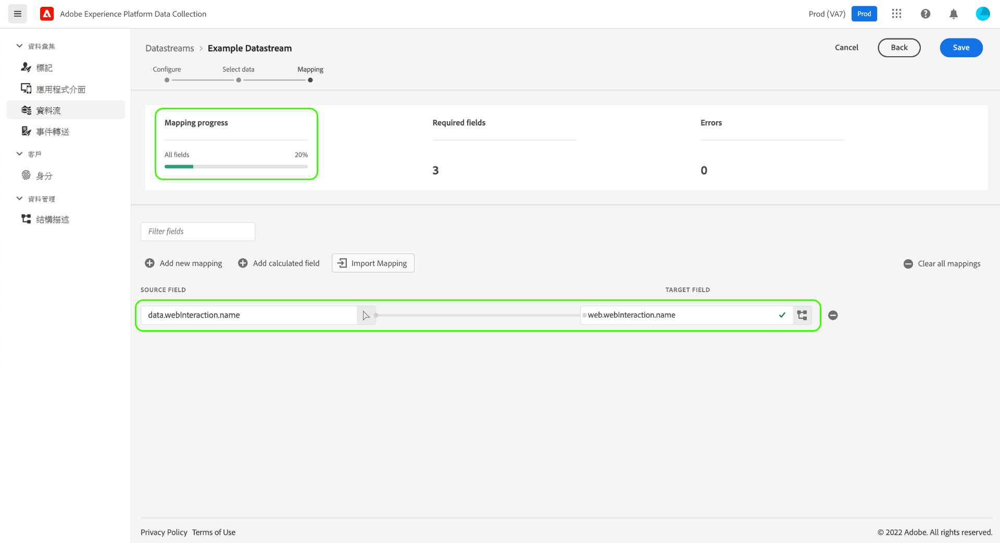
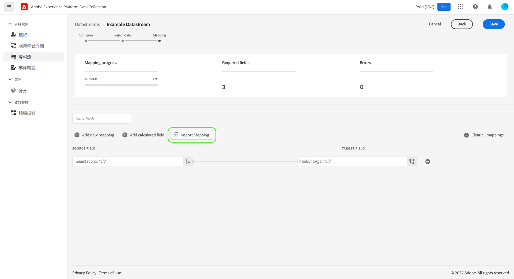
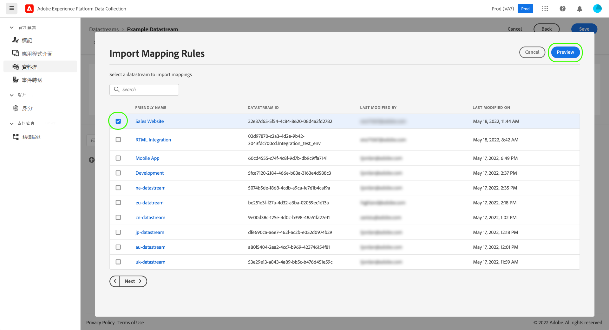
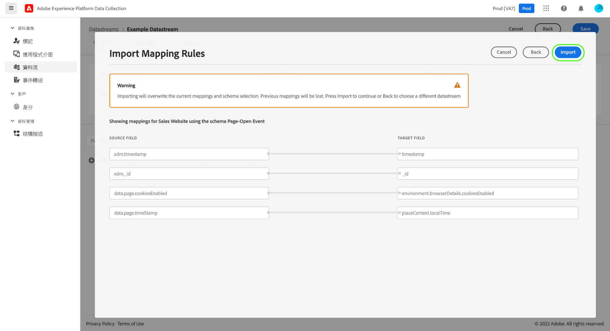
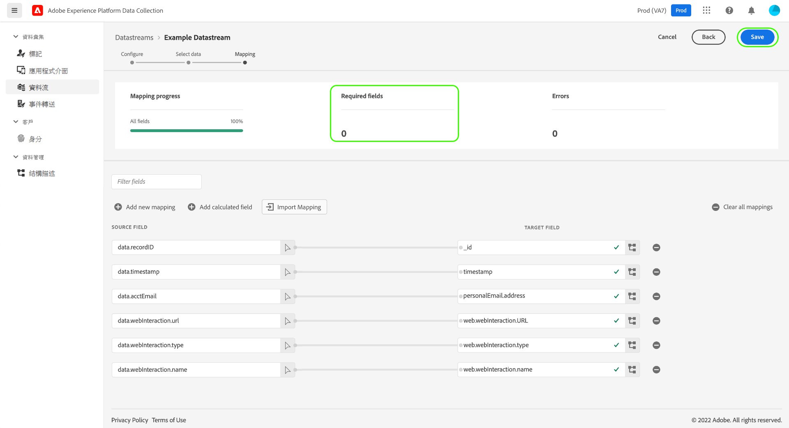

# 資料收集的資料準備

使用[!DNL Data Prep] （一種[!DNL Adobe Experience Platform]服務）來對應、轉換及驗證與[Experience Data Model (XDM)](/help/xdm/home.md)之間的資料。 設定啟用Experience Platform的[資料流](/help/datastreams/overview.md)時，您可以在將來源資料傳送至[!DNL Adobe Experience Platform Edge Network]時，使用[!DNL Data Prep]功能將來源資料對應至XDM。

所有從網頁傳送的資料都必須以XDM形式登入Experience Platform。 您有三種方式可以將資料從頁面上的資料層轉譯為Experience Platform接受的XDM：

1. 在網頁本身上將資料層重新格式化為XDM。
2. 使用[!DNL Tags]內建資料元素功能，將網頁的現有資料層格式重新格式化為XDM。
3. 使用資料收集的資料準備，透過[!DNL Edge Network]將網頁的現有資料層格式重新格式化為XDM。

本指南涵蓋第三個選項。

## 何時使用「資料準備」進行資料收集 {#when-to-use-data-prep}

「資料收集的資料準備」在以下兩種情況下很有用：

1. 網站具有格式正確、受控管和維護的資料層，而您偏好將資料層直接傳送給[!DNL Edge Network]，而非使用JavaScript操作在頁面上將其轉換為XDM （透過[!DNL Tags]資料元素或手動JavaScript操作）。
2. 在網站上部署了[!DNL Tags]以外的標籤系統。

## 透過網頁SDK將現有的資料層傳送至Edge Network {#send-datalayer-via-websdk}

必須使用`sendEvent`命令內的[`data`](/help/collection/js/commands/sendevent/data.md)物件來傳送現有的資料層。

如果您使用[!DNL Tags]，則必須使用[**[!UICONTROL Send Event]**](/help/tags/extensions/client/web-sdk/actions/send-event.md)動作型別的&#x200B;**[!UICONTROL Data]**&#x200B;欄位。

本指南的其餘部分說明在網頁SDK傳送資料層後，如何將資料層對應至XDM標準。

>[!NOTE]
>
>如需所有[!DNL Data Prep]功能的完整指引，包括計算欄位的轉換函式，請參閱下列檔案：
>
>* [資料準備概觀](/help/data-prep/home.md)
>* [資料準備對應函數](/help/data-prep/functions.md)
>* [使用資料準備處理資料格式](/help/data-prep/data-handling.md)

本指南會介紹如何在 UI 中對應資料。 若要完成這些步驟，請啟動建立資料串流的程式，直到（並包括）[基本設定步驟](/help/datastreams/configure.md#create)。

如需資料收集程式資料準備的快速示範，請參閱下列影片：

>[!VIDEO](https://video.tv.adobe.com/v/342120?quality=12&enable10seconds=on&speedcontrol=on)

## 提供範例資料 {#select-data}

完成資料流的基本設定後選取&#x200B;**[!UICONTROL Save and Add Mapping]**，並顯示&#x200B;**[!UICONTROL Select data]**&#x200B;步驟。 從這裡，您必須提供範例JSON物件，代表您計畫傳送至Experience Platform的資料結構。

若要直接從資料層擷取屬性，JSON 物件必須具有單一根屬性`data`。 然後應該以對應至您要擷取的資料層屬性的方式建構`data`物件的子屬性。 請選取以下區段，即可檢視正確格式化並具有 `data` 根的 JSON 物件範例。

+++具有`data`根的範例JSON檔案

```json
{
  "data": {
    "eventMergeId": "cce1b53c-571f-4f36-b3c1-153d85be6602",
    "eventType": "view:load",
    "timestamp": "2021-09-30T14:50:09.604Z",
    "web": {
      "webPageDetails": {
        "siteSection": "Product section",
        "server": "example.com",
        "name": "product home",
        "URL": "https://www.example.com"
      },
      "webReferrer": {
        "URL": "https://www.adobe.com/index2.html",
        "type": "external"
      }
    },
    "commerce": {
      "purchase": 1,
      "order": {
        "orderID": "1234"
      }
    },
    "product": [
      {
        "productInfo": {
          "productID": "123"
        }
      },
      {
        "productInfo": {
          "productID": "1234"
        }
      }
    ],
    "reservation": {
      "id": "anc45123xlm",
      "name": "Embassy Suits",
      "SKU": "12345-L",
      "skuVariant": "12345-LG-R",
      "priceTotal": "112.99",
      "currencyCode": "USD",
      "adults": 2,
      "children": 3,
      "productAddMethod": "PDP",
      "_namespace": {
        "test": 1,
        "priceTotal": "112.99",
        "category": "Overnight Stay"
      },
      "freeCancellation": false,
      "cancellationFee": 20,
      "refundable": true
    }
  }
}
```

+++

若要從 XDM 物件資料元素擷取屬性，相同的規則適用於 JSON 物件，但必須將根屬性鍵入為 `xdm`。 請選取以下區段，即可檢視正確格式化並具有 `xdm` 根的 JSON 物件範例。

+++具有`xdm`根的範例JSON檔案

```json
{
  "xdm": {
    "environment": {
      "type": "browser",
      "browserDetails": {
        "userAgent": "Mozilla/5.0 (Macintosh; Intel Mac OS X 10_7_5) AppleWebkit/537.36 (KHTML, like Gecko) Chrome/49.0.2623.112 Safari/537.36",
        "javaScriptEnabled": true,
        "javaScriptVersion": "1.8.5",
        "cookiesEnabled": true,
        "viewportHeight": 900,
        "viewportWidth": 1680,
        "javaEnabled": true
      },
      "domain": "adobe.com",
      "colorDepth": 24,
      "viewportHeight": 1050,
      "viewportWidth": 1680
    },
    "device": {
      "screenHeight": 1050,
      "screenWidth": 1680
    }
  }
}
```

+++

您可以選取將物件以檔案形式上傳的選項，或選擇將原始物件貼到所提供的文字方塊中。 如果 JSON 有效，則會在右側面板中顯示預覽結構描述。 選取&#x200B;**[!UICONTROL Next]**&#x200B;以繼續。

預期傳入資料的

>[!NOTE]
>
>使用範例JSON物件，代表任何頁面上可能使用的每個資料層元素。 例如，並非所有頁面都使用購物車資料層元素。 不過，請在此範例JSON物件中包含購物車資料層元素。

## 對應您的資料 {#mapping}

**[!UICONTROL Mapping]**&#x200B;步驟隨即顯示，可讓您將來源資料中的欄位對應到Experience Platform中的目標事件結構描述欄位。 在這裡，您可以使用兩種方式設定對應：

* [透過手動程式為此資料流建立對應規則](#create-mapping)。
* 從現有資料流[匯入對應規則](#import-mapping)。

>[!IMPORTANT]
>
>[!DNL Data Prep]對應會覆寫`identityMap`個XDM裝載，而這會進一步影響與[!DNL Real-Time CDP]個對象相符的設定檔。

### 建立對應規則 {#create-mapping}

若要建立對應規則，請選取&#x200B;**[!UICONTROL Add new mapping]**。



選取來源圖示（），然後在出現的對話方塊中，選取您要在提供的畫布中對應的來源欄位。 選擇欄位後，請使用&#x200B;**[!UICONTROL Select]**&#x200B;按鈕繼續。



接著，選取結構描述圖示（）以開啟目標事件結構描述的類似對話方塊。 在向&#x200B;**[!UICONTROL Select]**&#x200B;確認之前，選擇您要對應資料的欄位。



對應頁面會隨即重新顯示，並顯示已完成的欄位對應。 **[!UICONTROL Mapping progress]**&#x200B;區段會更新，以反映已成功對應的欄位總數。



>[!TIP]
>
>如果要將物件陣列 (在來源欄位中) 對應到不同物件的陣列 (在目標欄位中)，請在來源和目的地欄位路徑中的陣列名稱後新增 `[*]`，如下所示。
>
>

### 匯入現有對應規則 {#import-mapping}

如果您先前已建立資料流，您可以針對新資料流重複使用其已設定的對應規則。

>[!WARNING]
>
>從其他資料流匯入對應規則時，會覆寫您在匯入前可能已新增的任何欄位對應。

若要開始，請選取&#x200B;**[!UICONTROL Import Mapping]**。

正在選取

在顯示的對話框中，選取要匯入其對應規則的資料流。 選擇資料流後，請選取&#x200B;**[!UICONTROL Preview]**。



>[!NOTE]
>
>資料流只能在相同的[沙箱](/help/sandboxes/home.md)內匯入。 您無法將資料串流從一個沙箱匯入到另一個沙箱。

下一個畫面會顯示選取的資料流已儲存之對應規則的預覽。 確定顯示的對應符合您的預期，然後選取&#x200B;**[!UICONTROL Import]**&#x200B;以確認並將對應新增至新資料流。



>[!NOTE]
>
>如果匯入的對應規則中的任何來源欄位未包含在您[之前提供的 ](#select-data)JSON 資料範例中，則這些欄位對應並不會包含在匯入中。

### 完成對應 {#complete-mapping}

繼續將剩餘欄位對應到目標結構描述。 雖然您不必對應所有可用的來源欄位，但目標結構描述中設定為必要的任何欄位都必須對應，才能完成此步驟。 **[!UICONTROL Required fields]**&#x200B;計數器指出目前組態中尚未對應多少必要欄位。

當必要欄位計數達到零且您對對應感到滿意時，請選取&#x200B;**[!UICONTROL Save]**&#x200B;以完成變更。



## 後續步驟 {#next-steps}

本指南介紹了在 UI 中設定資料流時如何將資料對應到 XDM。 如果您遵循一般資料流教學課程，您現在可以返回[檢視資料流詳細資料](/help/datastreams/overview.md)上的步驟。
