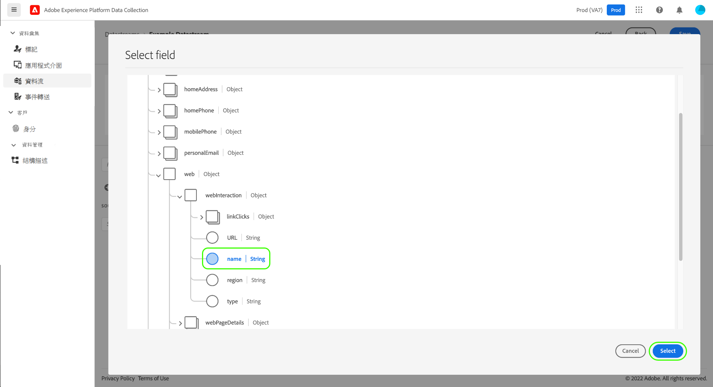

# 資料收集的資料準備

「資料準備」是一種 Adob&#x200B;&#x200B;e Experience Platform 服務，可讓您和[體驗資料模型 (XDM)](../xdm/home.md) 相互對應、轉換和驗證資料。設定啟用 Platform 的[資料流](./overview.md)時，若將來源資料傳送到 Platform Edge Network，可以使用資料準備功能將其對應到 XDM。

所有從網頁傳送的資料都必須以XDM的形式Experience Platform。 有3種方式可以將資料從頁面上的資料層轉譯為Experience Platform接受的XDM：

1. 在網頁本身上將資料層重新格式化為XDM。
2. 使用標籤原生資料元素功能，將網頁的現有資料層格式重新格式化為XDM。
3. 使用資料收集的資料準備，透過Edge Network將網頁的現有資料層格式重新格式化為XDM。

本指南著重於第3個選項。

## 何時使用「資料準備」進行資料收集 {#when-to-use-data-prep}

在兩種使用案例中，「資料收集的資料準備」很有用：

1. 網站具有格式正確、受控管和維護的資料層，且偏好直接傳送至Edge Network，而非使用JavaScript操作在頁面上將其轉換為XDM （透過Tags資料元素或手動JavaScript操作）。
2. 網站上會部署標籤系統以外的標籤系統。

## 透過WebSDK將現有的資料層傳送至Edge Network {#send-datalayer-via-websdk}

現有的資料層必須使用 `data` 的選項 `sendEvent` 命令，如 [Web SDK檔案](https://experienceleague.adobe.com/docs/experience-platform/edge/fundamentals/tracking-events.html#sending-non-xdm-data).

如果您使用標籤，則必須使用 **[!UICONTROL 資料]** 欄位屬於 **[!UICONTROL 傳送事件]** 動作型別，如 [Web SDK標籤擴充功能檔案](https://experienceleague.adobe.com/docs/experience-platform/tags/extensions/client/web-sdk/action-types.html).

本指南的其餘部分著重於在WebSDK傳送資料層後，如何將資料層對應至XDM標準。

>[!NOTE]
>
>如需有關所有資料準備功能 (包括計算欄位的轉換函數) 的綜合性指南，請參閱以下文件：
>
>* [資料準備概觀](../data-prep/home.md)
>* [資料準備對應函數](../data-prep/functions.md)
>* [使用資料準備處理資料格式](../data-prep/data-handling.md)

本指南會介紹如何在 UI 中對應資料。若要遵照這些步驟進行，請先開始從建立資料流一直到 (並包括) [基本設定步驟](./overview.md#create)的流程。

如需「資料集合的資料準備」流程的快速示範，請參考以下影片：

>[!VIDEO](https://video.tv.adobe.com/v/342120?quality=12&enable10seconds=on&speedcontrol=on)

## [!UICONTROL 選擇資料] {#select-data}

完成資料流的基本設定之後，請選取「**[!UICONTROL 儲存並新增對應]**」，「**[!UICONTROL 選取資料]**」步驟會隨即顯示。在這裡，您必須提供一個 JSON 物件範例 (代表您計劃傳送到 Platform 的資料的結構)。

若要直接從資料層擷取屬性，JSON 物件必須具有單一根屬性`data`。的子屬性 `data` 物件之後應該會以對應至您要擷取的資料層屬性的方式建構。 請選取以下區段，即可檢視正確格式化並具有 `data` 根的 JSON 物件範例。

+++具有 `data` 根的 JSON 檔案範例

```json
{
  "data": {
    "eventMergeId": "cce1b53c-571f-4f36-b3c1-153d85be6602",
    "eventType": "view:load",
    "timestamp": "2021-09-30T14:50:09.604Z",
    "web": {
      "webPageDetails": {
        "siteSection": "Product section",
        "server": "example.com",
        "name": "product home",
        "URL": "https://www.example.com"
      },
      "webReferrer": {
        "URL": "https://www.adobe.com/index2.html",
        "type": "external"
      }
    },
    "commerce": {
      "purchase": 1,
      "order": {
        "orderID": "1234"
      }
    },
    "product": [
      {
        "productInfo": {
          "productID": "123"
        }
      },
      {
        "productInfo": {
          "productID": "1234"
        }
      }
    ],
    "reservation": {
      "id": "anc45123xlm",
      "name": "Embassy Suits",
      "SKU": "12345-L",
      "skuVariant": "12345-LG-R",
      "priceTotal": "112.99",
      "currencyCode": "USD",
      "adults": 2,
      "children": 3,
      "productAddMethod": "PDP",
      "_namespace": {
        "test": 1,
        "priceTotal": "112.99",
        "category": "Overnight Stay"
      },
      "freeCancellation": false,
      "cancellationFee": 20,
      "refundable": true
    }
  }
}
```

+++

若要從 XDM 物件資料元素擷取屬性，相同的規則適用於 JSON 物件，但必須將根屬性鍵入為 `xdm`。請選取以下區段，即可檢視正確格式化並具有 `xdm` 根的 JSON 物件範例。

+++具有 `xdm` 根的 JSON 檔案範例

```json
{
  "xdm": {
    "environment": {
      "type": "browser",
      "browserDetails": {
        "userAgent": "Mozilla/5.0 (Macintosh; Intel Mac OS X 10_7_5) AppleWebkit/537.36 (KHTML, like Gecko) Chrome/49.0.2623.112 Safari/537.36",
        "javaScriptEnabled": true,
        "javaScriptVersion": "1.8.5",
        "cookiesEnabled": true,
        "viewportHeight": 900,
        "viewportWidth": 1680,
        "javaEnabled": true
      },
      "domain": "adobe.com",
      "colorDepth": 24,
      "viewportHeight": 1050,
      "viewportWidth": 1680
    },
    "device": {
      "screenHeight": 1050,
      "screenWidth": 1680
    }
  }
}
```

+++

您可以選取將物件以檔案形式上傳的選項，或選擇將原始物件貼到所提供的文字方塊中。如果 JSON 有效，則會在右側面板中顯示預覽綱要。選取&#x200B;**[!UICONTROL 「下一步」]**&#x200B;以繼續。


>[!NOTE]
>
> 使用範例JSON物件，代表任何頁面上可能使用的每個資料層元素。 例如，並非所有頁面都使用購物車資料層元素。 不過，此範例JSON物件中應包含購物車資料層元素。

## [!UICONTROL 對應]

**[!UICONTROL 對應]**&#x200B;步驟隨即顯示，可讓您將來源資料中的欄位對應到 Platform 中目標事件綱要的欄位。在這裡，您可以使用兩種方式設定對應：

* [建立對應規則](#create-mapping) 用於此資料流。
* 從現有資料流[匯入對應規則](#import-mapping)。

### 建立對應規則 {#create-mapping}

若要建立對應規則，請選取 **[!UICONTROL 新增對應]**.


選取來源圖示 ()，然後在顯示的對話框中選取要在所提供的畫布中對應的來源欄位。選擇欄位後，請使用「**[!UICONTROL 選取]**」按鈕以繼續進行。


接下來，選取綱要圖示 ()，開啟目標事件綱要的類似對話框。選擇要將資料對應到的欄位，然後再確認「**[!UICONTROL 選取]**」。



對應頁面會隨即重新顯示，並顯示已完成的欄位對應。**[!UICONTROL 對應流程]**&#x200B;區段會更新，以反映已成功對應的欄位總數。


>[!TIP]
>
>如果要將物件陣列 (在來源欄位中) 對應到不同物件的陣列 (在目標欄位中)，請在來源和目的地欄位路徑中的陣列名稱後新增 `[*]`，如下所示。
>
>

### 匯入現有對應規則 {#import-mapping}

如果您先前已建立資料流，您可以針對新資料流重複使用其已設定的對應規則。

>[!WARNING]
>
>從其他資料流匯入對應規則時，會覆寫您在匯入前可能已新增的任何欄位對應。

若要開始，請選取&#x200B;**[!UICONTROL 匯入對應]**。


在顯示的對話框中，選取要匯入其對應規則的資料流。選擇資料流後，請選取&#x200B;**[!UICONTROL 預覽]**。


>[!NOTE]
>
>資料流只能在相同的[沙箱](../sandboxes/home.md)內匯入。換句話說，您無法將資料流從一個沙箱匯入到另一個沙箱。

下一個畫面會顯示選取的資料流已儲存之對應規則的預覽。請確保顯示的對應符合您的預期，然後選取&#x200B;**[!UICONTROL 匯入]**，以確認對應並將其新增到新資料流。


>[!NOTE]
>
>如果匯入的對應規則中的任何來源欄位未包含在您[之前提供的 ](#select-data)JSON 資料範例中，則這些欄位對應並不會包含在匯入中。

### 完成對應

繼續依照上述步驟將其餘的欄位對應到目標綱要。雖然您不必對應所有可用的來源欄位，但目標結構描述中設定為必要的任何欄位都必須對應，才能完成此步驟。 **[!UICONTROL 必要欄位]**&#x200B;計數器會顯示目前的設定中有多少個必要欄位尚未對應。

必填欄位計數達到零且對對應滿意後，選擇 **[!UICONTROL 儲存]** 以完成變更。


## 後續步驟

本指南介紹了在 UI 中設定資料流時如何將資料對應到 XDM。如果您正在查看一般資料流教學課程，現在可以返回到[檢視資料流詳細資料](./overview.md)的步驟。
