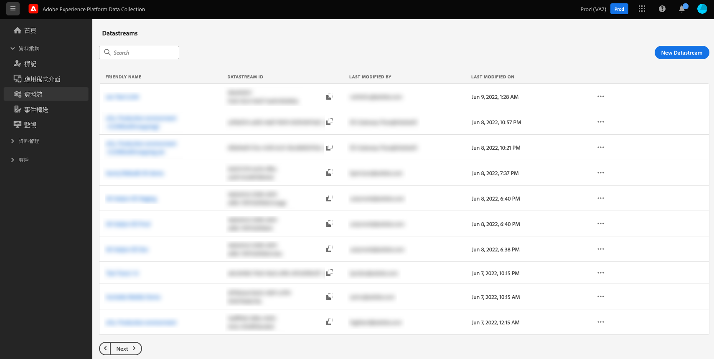

# 資料流概觀

資料流代表實作 Adobe Experience Platform Web 和 Mobile SDK 時的伺服器端設定。SDK 中的[設定命令](../edge/fundamentals/configuring-the-sdk.md)控制必須在用戶端處理的事情 (例如`edgeDomain`) 時，資料流則處理 SDK 的所有其他設定。當傳送請求到 Adob&#x200B;&#x200B;e Experience Platform Edge Network 時，`edgeConfigId` 會用於參照資料流。這讓您無須在網站上進行程式碼變更即可更新伺服器端設定。

在 Adob&#x200B;&#x200B;e Experience Platform UI 或資料集合 UI 的左側導覽中選取&#x200B;**[!UICONTROL 資料流]**，即可建立並管理資料流。

如需有關如何在 UI 中設定資料流的詳細資訊，請參閱[設定指南](./configure.md)。

## 處理資料流中的敏感資料 {#sensitive}

>[!IMPORTANT]
>
>本文件的內容並非法律建議，其用意並非取代專業的法律建議。如需有關處理敏感資料的建議，請和貴公司的法律部門商議。

企業資料盡責管理政策和監管要求對於能夠收集、處理和使用敏感客戶資料的方式施加了越來越多的限制。這包括對於受保護的健康資料 (PHI) 的收集、處理和使用，這類資料受到《健康保險可攜與責任法案》(HIPAA) 等法規的規範。

資料流提供三種方法協助您安全地處理敏感資料：

* [增強型加密](#encryption)
* [資料控管](#governance)
* [稽核記錄](#audit-logs)

### 增強型加密 {#encryption}

透過 Edge Network 進行的所有資料傳輸都會使用 [HTTPS TLS 1.2](https://datatracker.ietf.org/doc/html/rfc5246) 在安全、加密的連線上實施。如果資料流將資料帶入 Experience Platform，則接著會在 Experience Platform 資料湖中將待用的資料加密。如需詳細資訊，請至 [Experience Platform 中的資料加密](../landing/governance-privacy-security/encryption.md)參閱文件。

### 資料控管 {#governance}

資料流會利用 Experience Platform 的內建資料控管功能來防止敏感資料傳送到未符合 HIPAA 標準的服務。在資料流綱要中標記包含敏感資料的特定欄位，即可對於哪些資料欄位可用於特定目的採取精細的控制。

以下影片會針對如何在 UI 中設定資料流的資料使用限制並執行提供簡要概觀：

>[!VIDEO](https://video.tv.adobe.com/v/3409588/?quality=12&learn=on&speedcontrol=on)

在 Experience Platform 中，您可以將[敏感資料使用標籤](../data-governance/labels/reference.md#sensitive)套用在包含了貴組織視為敏感的資料的綱要和欄位上。例如，`RHD` 標籤用於標示受保護的健康資訊 (PHI)，而 `S1` 標籤則代表地理位置資料。

>[!NOTE]
>
>如需有關如何在 Experience Platform UI 或資料集合 UI 中的[!UICONTROL 綱要]索引標籤內套用資料使用標籤，請參閱[綱要標示教學課程](../xdm/tutorials/labels.md)。

建立新資料流時，如果選取的綱要包含敏感資料使用標籤，則只能將資料流設定為將該資料傳送至符合 HIPAA 標準的目的地。目前，資料流支援的唯一符合 HIPAA 標準的目的地為 Adob&#x200B;&#x200B;e Experience Platform。針對包含敏感資料使用標籤的資料流，停用其他目的地服務，包括 Adob&#x200B;&#x200B;e Target、Adobe Analytics、Adobe Audience Manager、事件轉送和邊緣目的地。

如果有綱要正用於具有不符合 HIPAA 標準的服務的現有資料流中，則嘗試向該綱要新增敏感資料使用標籤會導致出現政策違規訊息，且該動作會受到制止。該訊息會明確說明哪個資料流觸發了違規，並建議從資料流中移除任何不符合 HIPAA 標準的服務以解決問題。

### 稽核記錄

在 Experience Platform 中，可使用稽核記錄的形式監視資料流活動。稽核記錄可告知我們&#x200B;**誰**&#x200B;執行了&#x200B;**什麼**&#x200B;動作，以及&#x200B;**什麼時候**，還有其他可協助您針對和資料流相關的問題進行疑難排解的內容資料，以協助您的企業符合企業資料盡責管理政策和監管要求。

每當使用者建立、更新或刪除資料流時，都會建立稽核記錄以記錄動作。每當使用者透過[資料集合的資料準備](./data-prep.md)建立、更新或刪除對應時，同樣的情況就會發生。無論更新的是資料流或是對應，都會將產生的稽核記錄分類為[!UICONTROL 資料流]資源類型。

如需有關如何解讀資料流的記錄和其他支援服務的詳細資訊，請至[稽核記錄](../landing/governance-privacy-security/audit-logs/overview.md)參閱文件。

## 後續步驟

本指南提供了資料流及其在資料集合以及敏感資料處理中之使用的高層級概觀。如需有關如何設定新資料流的步驟，請參閱[資料流設定指南](./configure.md)。
