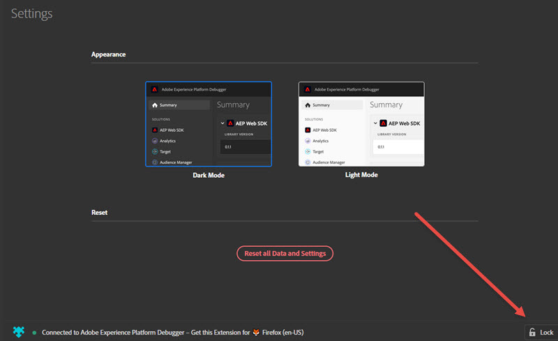

# 配置平台調試器

您可以配置Adobe Experience Platform調試器的外觀和工作方式的某些方面。

## 淺色或深色模式

開啟平台調試器後，您可以轉到 **[!UICONTROL 設定]** 選擇 **暗模式** （預設）或 **光模式**。

## 重設

選擇 **[!UICONTROL 重置所有資料和設定]** 返回以清除所有資料並返回到預設設定。

## 將 Experience Platform Debugger 鎖定在單一頁面

在您變更網站頁面後，Experience Platform Debugger 視窗會隨之更新，顯示該頁面的實際資訊。畫面底部會顯示您所連線的頁面名稱。要將Experience Platform調試器鎖定在一頁上，請選擇 **[!UICONTROL 鎖]** 在「平台調試器」窗口的右下角。

如果在頁面偵錯期間，您需要在其他頁面上閱讀文件或檢視資訊，這個功能會很有幫助。
