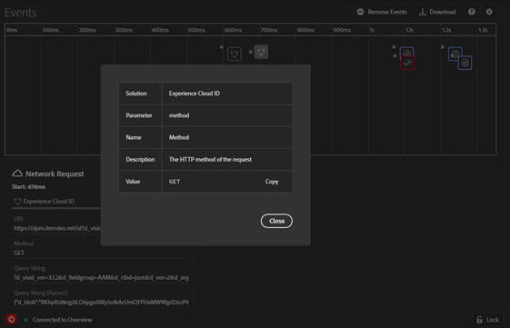

# 「事件」頁籤

的 **事件** 頁籤提供在時間軸上顯示的事件的圖形視圖。

時間軸上會對應每個事件，顯示適用的解決方案圖示。圖示也會顯示資料層的變更情形 (若已啟用)。將滑鼠指標停留在圖示上，即可查看事件摘要。在事件上選擇以瞭解詳細資訊。 可以按Shift-Select或按Control-Select查看多個事件。

在詳細資訊上選擇。

## 追蹤資料層變更情形

若要在時間軸中啟用資料層變更追蹤功能：

1. 選擇右上角的「齒輪」(Gear)表徵圖。
1. 輸入資料層名稱。

   

1. 選取「**[!UICONTROL 儲存]**」。

所有已刪除或新增的內容，都能從資料層變更的詳細資訊中一覽無遺。您可以選擇&#x200B;**{}**，以便更深入地查看資料層。

## 下載事件資訊

選擇 **[!UICONTROL 下載]** 下載顯示有關頁面調用資訊的Excel檔案。
