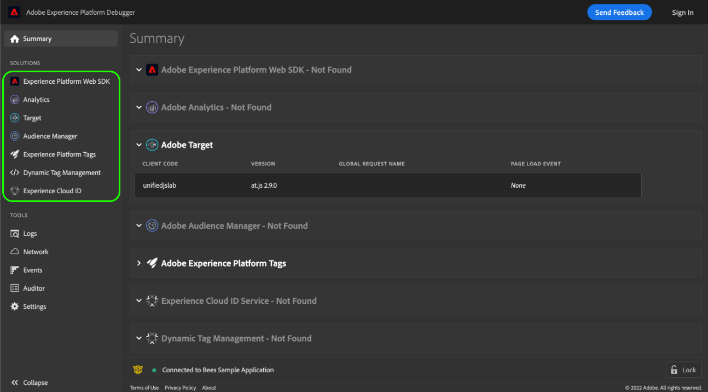

# 解決方案

Adobe Experience Platform調試器提供 **解決方案** 的子菜單。 選擇解決方案查看特定Adobe Experience Cloud技術的結果。

## Adobe Experience Platform Web SDK {#aep}

Adobe Experience Platform Web SDK 畫面會顯示 Adobe Experience Platform Web SDK 的相關資訊。選擇 **[!UICONTROL 配置]** 開啟或關閉控制台登錄。

## [!UICONTROL Analytics] {#section-f71dfcc22bb44c86bec328491606a482}

的 [!UICONTROL 分析] 頁籤 [Adobe Analytics實施](https://experienceleague.adobe.com/docs/analytics/implementation/home.html?lang=zh-Hant)。

## [!UICONTROL Target] {#section-988873ba5ede4317953193bd7ac5474c}

使用 [!UICONTROL 目標] 螢幕，查看 [Adobe Target](https://experienceleague.adobe.com/docs/target/using/target-home.html) 請求 [mbox跟蹤](https://experienceleague.adobe.com/docs/target/using/activities/troubleshoot-activities/content-trouble.html#section_256FCF7C14BB435BA2C68049EF0BA99E) 響應詳細資訊。

請參閱上的指南 [使用調試器實現目標](./target.md) 的子菜單。

## [!UICONTROL Audience Manager] {#section-1d4484f8b46f457f859ba88039a9a585}

使用 [[!UICONTROL Audience Manager]](https://experienceleague.adobe.com/docs/audience-manager/user-guide/aam-home.html) 頁籤，查看詳細資訊 [事件](https://experienceleague.adobe.com/docs/audience-manager/user-guide/api-and-sdk-code/dcs/dcs-event-calls/dcs-event-calls.html) 在Adobe Audience Manager。 選擇要展開的組織並顯示資訊。

## [!UICONTROL Adobe Experience Platform標籤] {#section-ee80a9c509f2462c89c1e5bd8d05d7c8}

使用 [!UICONTROL Adobe Experience Platform標籤] 的子菜單。 也可以選擇 **[!UICONTROL 配置]** 配置 [嵌入代碼](../../tags/ui/publishing/environments.md#embed-code)。 您可以在 Experience Platform Debugger 中編輯、替換或新增更多內嵌程式碼。登入的話，可以使用下拉式選單選取替代屬性。

## [!UICONTROL Experience Cloud ID] {#section-a96c32f8e63a4991abb296f6e8ea01cf}

使用 [!UICONTROL Experience CloudID] 頁籤 [Experience CloudID服務](https://experienceleague.adobe.com/docs/id-service/using/home.html) 請求。

## [!UICONTROL 動態標籤管理]

如果您以前在Experience Platform中實現了舊版本的標籤(稱為 [!DNL Dynamic Tag Management (DTM)])，您可以使用此頁籤配置嵌入代碼並查看網路請求詳細資訊。
