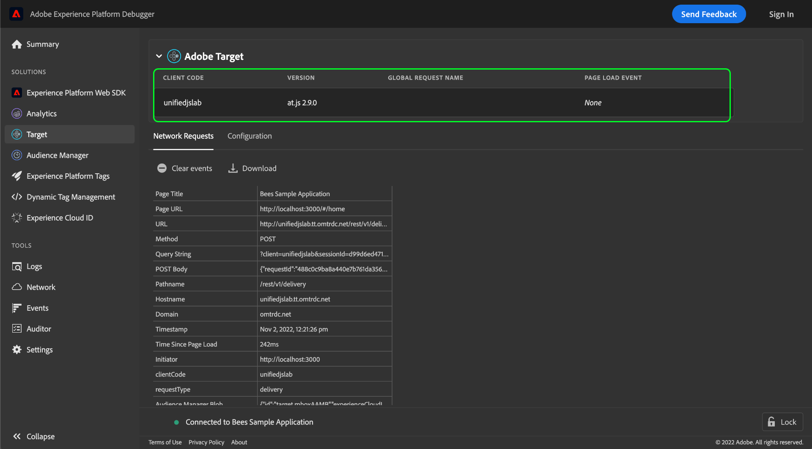

# 使用Adobe Experience Platform Debugger測試Adobe Target實施

Adobe Experience Platform Debugger提供一套實用工具，可用於測試和偵錯已使用Adobe Target實作工具的網站。 本指南涵蓋在啟用Target的網站上使用Platform Debugger時的一些常見工作流程和最佳實務。

## 先決條件

若要使用Platform Debugger for Target，網站必須使用 [at.js資料庫](https://developer.adobe.com/target/implement/client-side/atjs/how-atjs-works/) 1.x版或更新版本。 不支援舊版。

## 正在初始化Platform Debugger

在瀏覽器中開啟您要測試的網站，然後開啟Platform Debugger擴充功能。

選取 **[!DNL Target]** ，位於左側導覽器中。 如果Platform Debugger偵測到網站上正在執行相容的at.js版本，則會顯示Adobe Target實作詳細資料。

## 全域設定資訊

有關實作全域設定的資訊會顯示在Platform Debugger的Target檢視頂端。

| 名稱 | 說明 |
| --- | --- |
| 用戶端代碼 | 可識別您組織的唯一ID。 |
| 版本 | 網站上目前安裝的Adobe Target程式庫版本。 |
| 全域請求名稱 | 的名稱 [全域mbox](https://developer.adobe.com/target/implement/client-side/atjs/global-mbox/global-mbox-overview/?) 對於Target實作，預設名稱為 `target-global-mbox`. |
| 頁面載入事件 | 布林值，指出 [頁面載入事件](https://developer.adobe.com/target/implement/client-side/atjs/how-atjs-works/how-atjs-works/#atjs-2x-diagrams) 已發生。 只有at.js 2.x支援頁面載入事件。對於不相容的版本，此值預設為 `None`. |

{style="table-layout:auto"}

## [!DNL Network Requests] {#network}

選取 **[!DNL Network Requests]** 以檢視頁面上每個網路要求的摘要資訊。

![此 [!DNL Network Requests] 針對Platform Debugger中選取的目標區段](../images/solutions/target/network-requests.png)

當您在頁面上執行動作（包括重新載入頁面）時，新欄會自動新增至表格，讓您檢視動作的順序以及每個要求之間值的變更方式。

![此 [!DNL Network Requests] 針對Platform Debugger中選取的目標區段](../images/solutions/target/new-request.png)

擷取下列值：

| 名稱 | 說明 |
| --- | --- |
| [!DNL Page Title] | 起始此要求的頁面標題。 |
| [!DNL Page URL] | 起始要求的頁面URL。 |
| [!DNL URL] | 請求的原始URL。 |
| [!DNL Method] | 請求的HTTP方法。 |
| [!DNL Query String] | 要求的查詢字串（取自URL）。 |
| [!DNL POST Body] | 請求內文(僅針對POST請求設定)。 |
| [!DNL Pathname] | 請求URL的路徑名稱。 |
| [!DNL Hostname] | 要求URL的主機名稱。 |
| [!DNL Domain] | 請求URL的網域。 |
| [!DNL Timestamp] | 請求（或事件）在瀏覽器時區內發生的時間戳記。 |
| [!DNL Time Since Page Load] | 自頁面在要求時初次載入後經過的時間。 |
| [!DNL Initiator] | 請求的發起者。 換句話說，是誰提出要求？ |
| [!DNL clientCode] | Target所識別之您組織帳戶的識別碼。 |
| [!DNL requestType] | 用於請求的API。 如果使用at.js 1.x，則值為 `/json`. 如果使用at.js 2.x，則值為 `delivery`. |
| [!DNL Audience Manager Blob] | 提供有關加密的Audience Manager中繼資料的資訊，稱為「blob」。 |
| [!DNL Audience Location Hint] | 資料收集地區 ID。這是特定ID服務資料中心之地理位置的數值識別碼。 如需詳細資訊，請參閱Audience Manager檔案，位於 [DCS區域ID、位置與主機名稱](https://experienceleague.adobe.com/docs/audience-manager/user-guide/api-and-sdk-code/dcs/dcs-api-reference/dcs-regions.html?lang=zh-Hant) 以及上的Experience CloudIdentity Service指南 [`getLocationHint`](https://experienceleague.adobe.com/docs/id-service/using/id-service-api/methods/getlocationhint.html#reference-a761030ff06c4439946bb56febf42d4c). |
| [!DNL Browser Height] | 瀏覽器高度（畫素）。 |
| [!DNL Browser Time Offset] | 瀏覽器與其時區相關聯的時間位移。 |
| [!DNL Browser Width] | 瀏覽器寬度（畫素）。 |
| [!DNL Color Depth] | 熒幕的色彩深度。 |
| [!DNL context] | 此物件包含發出請求所用瀏覽器的相關內容資訊，包括熒幕維度和使用者端平台。 |
| [!DNL prefetch] | 期間使用的引數 `prefetch` 處理中。 |
| [!DNL execute] | 期間使用的引數 `execute` 處理中。 |
| [!DNL Experience Cloud Visitor ID] | 若偵測到這類專案，會提供以下資訊： [Experience CloudID (ECID)](https://experienceleague.adobe.com/docs/id-service/using/intro/overview.html?lang=zh-Hant) 指派給目前網站訪客的資訊。 |
| [!DNL experienceCloud] | 儲存這個特定使用者工作階段的Experience CloudID：a4T [補充資料ID](https://experienceleague.adobe.com/docs/target/using/integrate/a4t/before-implement.html?#section_2C1F745A2B7D41FE9E30915539226E3A)，和 [訪客ID (ECID)](https://experienceleague.adobe.com/docs/id-service/using/intro/overview.html?lang=zh-Hant). |
| [!DNL id] | 此 [目標ID](https://developers.adobetarget.com/api/delivery-api/#section/Identifying-Visitors/Target-ID) ，以供訪客使用。 |
| [!DNL Mbox Host] | 此 [主機](https://experienceleague.adobe.com/docs/target/using/administer/hosts.html) 發出Target請求的目標位置。 |
| [!DNL Mbox PC] | 字串，封裝 [`mbox`](https://developer.adobe.com/target/implement/client-side/atjs/global-mbox/global-mbox-overview/) 工作階段ID與 [Adobe Target Edge](https://experienceleague.adobe.com/docs/target/using/introduction/how-target-works.html#concept_0AE2ED8E9DE64288A8B30FCBF1040934) 位置提示。 at.js使用此值來確保工作階段和邊緣位置保持粘性。 |
| [!DNL Mbox Referrer] | 特定的URL反向連結 [`mbox`](https://developer.adobe.com/target/implement/client-side/atjs/global-mbox/global-mbox-overview/) 要求。 |
| [!DNL Mbox URL] | 的URL [`mbox`](https://developer.adobe.com/target/implement/client-side/atjs/global-mbox/global-mbox-overview/) 伺服器。 |
| [!DNL Mbox Version] | 的版本 [`mbox`](https://developer.adobe.com/target/implement/client-side/atjs/global-mbox/global-mbox-overview/) 已被使用。 |
| [!DNL mbox3rdPartyId] | 此 [`mbox3rdPartyId`](https://experienceleague.adobe.com/docs/target/using/audiences/visitor-profiles/3rd-party-id.html) 指派給目前訪客。 |
| [!DNL mboxRid] | 此 [`mbox`](https://developer.adobe.com/target/implement/client-side/atjs/global-mbox/global-mbox-overview/) 請求ID。 |
| [!DNL requestId] | 請求的唯一ID。 |
| [!DNL Screen Height] | 熒幕的高度（畫素）。 |
| [!DNL Screen Width] | 熒幕的寬度（畫素）。 |
| [!DNL Supplemental Data ID] | 系統產生的ID，用於將訪客與對應的Adobe Target和Adobe Analytics呼叫進行比對。 請參閱 [A4T疑難排解指南](https://experienceleague.adobe.com/docs/target/using/integrate/a4t/troubleshoot-a4t/a4t-troubleshooting.html?#section_75002584FA63456D8D9086172925DD8D) 以取得詳細資訊。 |
| [!DNL vst] | 此 [Experience CloudIdentity Service API設定](https://experienceleague.adobe.com/docs/id-service/using/id-service-api/configurations/function-vars.html). |
| [!DNL webGLRenderer] | 提供頁面上使用的WebGL轉譯器資訊（如果適用）。 |

{style="table-layout:auto"}

若要檢視特定網路事件上引數的詳細資訊，請選取相關表格儲存格。 此時會出現一個彈出視窗，提供有關引數的進一步資訊，包括說明及其值。 如果值是JSON物件，對話方塊會包含物件結構的完整可導覽檢視。

![此 [!DNL Network Requests] 針對Platform Debugger中選取的目標區段](../images/solutions/target/request-param-details.png)

## [!DNL Configuration]

選取 **[!DNL Configuration]** 啟用或停用為Target選取的其他偵錯工具。

![此 [!DNL Configuration Requests] 針對Platform Debugger中選取的目標區段](../images/solutions/target/configuration.png)

| 偵錯工具 | 說明 |
| --- | --- |
| [!DNL Target Console Logging] | 啟用後，可讓您存取瀏覽器主控台標籤中的at.js記錄檔。 此功能也可以透過新增以下專案來啟用 `mboxDebug` 查詢引數（含任何值）至瀏覽器URL。 |
| [!DNL Target Disable] | 啟用後，頁面上的所有Target功能都會停用。 這可用來判斷Target特定選件是否是導致頁面上問題的原因。 |
| [!DNL Target Trace] | **注意**：您必須登入才能啟用此功能。  啟用後，追蹤權杖會隨每個要求傳送，且每個回應中會傳回追蹤物件。 `at.js` 剖析回應 `window.__targetTraces`. 每個追蹤物件包含與[[!DNL Network Requests] tab]，並新增下列專案：<ul><li>設定檔快照，可讓您檢視請求前後的屬性。</li><li>相符與不相符的 [活動](https://experienceleague.adobe.com/docs/target/using/activities/target-activities-guide.html)，顯示目前設定檔符合或不符合特定活動資格的原因。<ul><li>這有助於識別設定檔在指定時間點符合哪些對象資格及其原因。</li><li>Target檔案包含不同活動型別的更多資訊</li></ul></li></ul> |

{style="table-layout:auto"}
