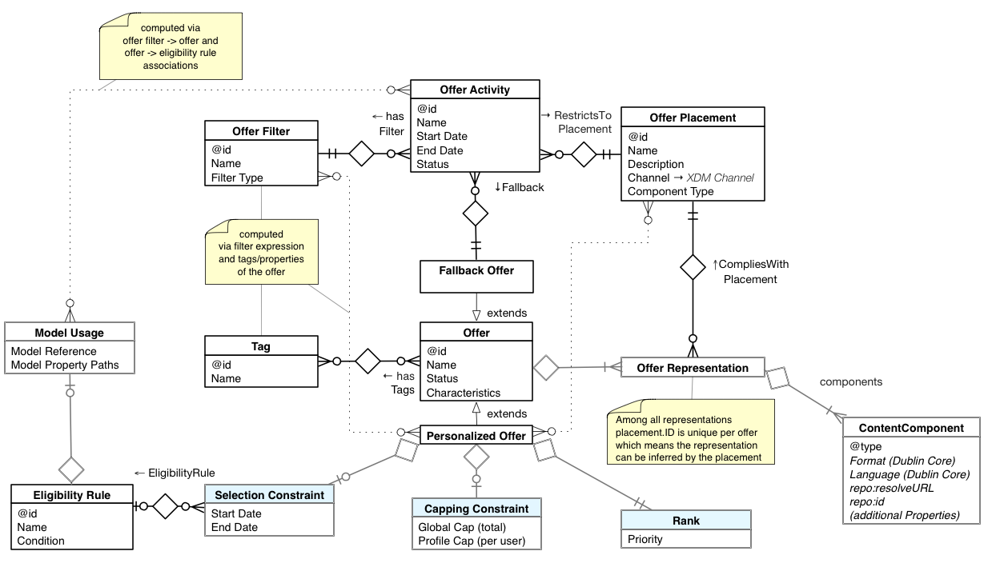

# 選件決策網域模型概觀

選件決策是您用來標準化 [!DNL Decisioning Service] 並集中管理用於吸引客戶提供選件的規則和預測的使用案例。 選件決策視為內容類型 _**決策**_。 在此使用案例中， _**決策選項**_ 稱為選件 _****_，其特徵在於附加在選件上的內容。 有關使用的對象模型的介紹 [!DNL Decisioning Service]，請參閱決 [策服務域模型](experience-model.md)。

其目標是根據目標准則、成本和頻率限制，以及各通道（包括建議的先前選件）之前的互動，在任何通道中為使用者提供「最佳選件」。

與所有決策使用案例一樣，決策選項（選件）是以任意數量應用程式共用的儲存空間來管理。 選件可由您組織的不同部門或合作夥伴建立，而且這些選件可以每天新增和移除。

透過提供體驗的應用程式，以視覺化方式將選件放入更大的體驗中。 _**位置**_（有時稱為點或槽）是制定策略的重要元件。 設計選件策略通常從這些位置的定義開始。 選件通常具有多 _**種內容表示**_ ，因此可正確整合至各種體驗中，其中每個體驗具有不同的維度或其他限制，並需要不同的媒體格式。

優惠通常與實物商品或服務相關，而且需計算成本。 組織必須能夠限制選件所耗用的資源，因此必須能夠 _**限制**_ 建議選件的總次數。

接受的選件對組織的預測值是最佳化准則，並與提供選件的成本相抵。 成本、接受可能性和預測值會用來排名選件。 最佳選件是對選件活動目標有最高預測正面影響的選件。

選件決策會考慮使用者在許多通道和應用 _**程式上的互動**_ ，運用使用者的設定檔和體驗事件資料。 例如，呼叫中心應用程式可使用選件決策功能，根據使用者所進行的購買和張貼的審核，啟用或隱藏選件；或者，電子郵件管理應用程式可依賴「選件決策」，根據網站的瀏覽記錄，在每週的電子報中選取「下一個最佳選件」。

選件有其他有趣的屬性。 當選件有效時，通常會有 _**定義的排程**_ 、日期和時間範圍，以及何時需要使選件失效。

最後，報價的吸引力隨著提出報價的頻率而變差。 屢次提議後無法接受的提案，因為本可以提出不同的提案，所以是一個失敗的機會。 因此，必須管理使用者 _**疲勞**_ 。

## 選件決策策略總覽

整體方法是縮小選件的選擇範圍，直到滿足所有限制，然後將排名模型套用至其餘的選項，然後使用覆蓋限制（去重複和避免備援選項）來最佳化多個活動。

| 策略元件 | 實現方式 |
| --- | --- |
| 決策活動 | 選件活動 |
| 決策選項 | 提供內容呈現功能 |
| 備援選項 | 備援選件及內容表示法 |
| 有限決策選項集 | 選件清單(亦即選件程式庫) |
| 專題類別 | 基於標籤和選件識別碼的選件篩選 |
| 決策產出 | 建議每個活動一次提供一個選件，以處理多個活動 |
| 決策結果 | 預期的體驗事件，如 `eventType='opened'` |
| 決策算法 | 內部服務邏輯，參數化 |
| 限制 | 位置約束、日曆約束、全局和每個用戶封閉約束、重複資料消除約束 |
| 決策規則 | 適用性規則 |
| 期望效用 *的型號* | 選件排名或優先順序 |

選項庫存中的選件總數通常相當龐大（依序為10,000秒），而每個選件活動可能都集中在屬於不同類別（主題）的選件上。 選件決策策略可讓選件篩選器附加至選件活動。 在要求作出決定時，將評估其他限制條件。
以下各節將詳細說明「選件決策」網域的元件。

## 一般選件

一般選件（也稱為個人化選件）是選件決策活動的核心選項。 它們具有名稱和狀態等屬性。 狀態屬性會指出實體是否已準備好加入有效已核准選件清單中。 一般選件會增加數個限制。 以下「限制」一節中有‎關此 [項的更多](#offer-constraints)。

## 選件中的內容

### 選件位置

位置會定義內容限制，並與活動搭配使用，以指定下一個最佳體驗的傳送位置。 這進一步減少了可考慮的選項數量，也是活動施加的另一種限制。 這稱為放置約束。 只有符合位置限制的內容選項（例如選件）才會被考慮。 在決策策略的早期階段對此進行評估。 當選項對象更改每個活動的放置約束時，系統會重新評估該選項，並且該選項可能會考慮到一個或多個活動，或從中消失。

將內容相依性的複雜細 [!DNL Decisioning Service] 節正規化並不是您的責任。 相反地，每個客戶會識別所有通道中的位置清單，並為這些位置指定唯一的識別碼和名稱。 設計人員參照特定位置，斷言特定內容將符合該位置。

在開發內容時，選件行銷人員和內容設計人員將只（必須）同意「隱含合約」，該合約位於「首頁英雄影像」或「服務呼叫開啟指令碼」的後面。 前者可以被認定為600px寬度和350px高度的影像，後者可以限制內容為兩種語言變體的文本，這兩種語言變體在具有語義結構的3或4個句子中不超過50個單詞。 位置，不會儲存隱藏合約的所有意義。

### 選件表示法

為確保選件能夠在頻道中位置的各種參數中正確顯示，必須建立該選件的不同表示法。 附加至選件的內容會依位置分組。 每個選件可以有一或多個表示，其中每個表示都參照一個定義的位置。 選件中的每個表示法必須使用不同的位置。 選件的表示方式越多，就越有機會在不同位置上下文中使用選件。

「位置」(Placement)會限制可添加到「表示法」(Representation)的內容項的類型。

## 備援選件

備援選件是除位置規則外沒有其他限制的決策選項。 備援選件具有與位置相關聯的內容呈現方式，就像其他選件一樣。

在活動中指定備援選件，以指出當結合的限制取消所有縮小選項的資格時，可使用的內容體驗。 由於它不依賴於運行時上下文或配置檔案，因此在裝配活動時可以提前檢查放置約束。 使用備援選件時，一律有下列問題的答案：目前最佳優惠方案為何？

## 選件限制

### 日曆限制

在選件決策網域中，選件具有有效期。 這表示選件在開始日期和時間過去之前無法建議，且在結束日期和時間過去之後無法再建議。 選件實體具有定義這些日曆限制的簡單結構。

過期的選件會定期從已考慮的選項清單中移除。 但是，日曆過濾器直接在請求決策時應用，以便精確地應用約束。

### 封閉約束

選件可以有選擇性的封閉限制。 它包含兩個值：

- 全域上限值會限制整個描述檔集（目標對象）中建議選件的頻率。

- 每個描述檔上限，並決定選件可建議給相同描述檔的頻率。

### 複製限制

當要求決策時，客戶可以一次要求多項活動的建議。 這是內容決策的典型案例。 每個活動都會提供一或多個內容選項給整體體驗。 由於構成方面，決策需要跨活動進行仲裁以避免重複——除非每個活動都從整體期權清單的分離子集中挑選一個活動。 高級選項可能在所有活動中排名較高，如果所有活動都提出相同的選項，則經驗不佳。 另一方面，如果傳送系統想要知道所有通道的「下一個最佳轉換」是什麼，且沒有上限限制，則建議不同活動的相同選項可行。

複製約束當前未寫入業務對象儲存庫。 相反，重複資料消除是運行時的預設策略。 請求參數可以覆蓋預設行為以隱藏重複資料消除步驟。

### [!DNL Profile] 限制——資格規則

目前，所討論的限制已適用，不論選件的對象為何。 體驗決策也支援使用案例，其中個人化建議是以客戶的記錄和時間系列事件為基礎。 會依個人檔案評估規則，以決定選件是否符合或必須隱藏給該使用者。 若要這麼做，資格規則可與每個選件關聯。 除了使用者的個人檔案和體驗事件外，資格規則還會考慮即時內容資料。 該資料由交付服務提供，可採用與庫存水準、氣象條件、航班時間表等概況無關的資料形式。

請務必區分定位和分段規則，以及決策資格和優先順序規則。 若要定位一組描述檔，是合格的輸出（觀眾選擇），一組選項（允許的選件）是評估的輸出。

## 選件系列

庫存是整個選項庫，用於決策。 庫存可進一步分為類別或收集。 選項集合由這些選項具有的通用標籤表示。 篩選器可用來測試選件是否屬於特定類別，或更確切地說，是否共用相同的標籤或標籤。

### 標記

標籤提供一種表示一組選項屬於某個類別的方法。

一個選項可以有多個標籤，因此可以同時在多個類別中。 類別也可以重疊或包含另一個類別。 當類別&quot;S&quot;由標籤為&quot;A&quot;的選件所定義，而類別&quot;R&quot;由標籤為&quot;A&quot;和&quot;B&quot;的選項所定義時，&quot;S&quot;將會是&quot;R&quot;的超集。

### 篩選條件

篩選器用於定義屬於某個類別的一組選項的標準。 篩選可視為對一般選件清單的查詢。 有兩種基本的篩選方式：指出選件有一或多個標籤，並明確選取選件集即可。 前一種方法可設定為指出該系列中的選件必須具有所有指定的標籤，或選項至少具有其中一個指定標籤時符合資格。

當選項明確放入系列時，其標籤集會忽略該系列。

## 選件活動

活動可設定並控制決策程式。 目前，決策策略主要是預先確定的，但未來的選件決策域模型將允許選擇模型、附加規則和約束。

您可以同時使用許多活動來組合體驗。 目前，在單一決策要求中最多可處理30個活動。 如果體驗中超過30個活動或槽必須填入內容，則可針對相同的描述檔提出多個要求。 但是，如果將活動納入同一決策請求，將對這些活動中的提案進行重複資料消除。

如果活動的定義方式是從分離的選件集合中選擇，則無論活動是結合在相同的請求中，還是分割為個別的請求，都不會有什麼不同。 但是，網路和響應時間限制可能要求將活動合併到同一請求中。 由於不同的請求可能被路由到不同的服務節點，因此可能需要將相同的配置檔案資料提取到不同的節點中。 這降低了可用於其他請求的有效IO頻寬。

活動是用來將內容插入體驗。 為協助（不確保）內容項目「符合」正確，活動會參照單一位置。 請注意，位置並不總是具體的位置／位置，但更像這些位置／位置的抽象。 例如，在具有圖格格的網頁中，每個圖格都可以受相同位置的約束，假設它們的形狀和大小都相似，而且可以容納類似的內容。 不過，個別圖格通常會由其本身的活動提供。

下圖說明了業務實體之間如何相互關聯：

當用戶端建立並連結物件圖表以做決策時，通常會有三種不同的工作串流。 以下是：

- 設定支援實體，例如標籤和位置。 這些實體用於構造、篩選和分組其他實體。 它們也可用來在第二工作流程和第三工作流程之間提供一些協調。 此工作流程包含一些前期工作，但可隨時對設定進行調整。 雖然標籤相對簡單，但放置位置需要稍做規劃。 企業至少需要盤點所有提出決策的地方。

- 使用各種表示法和業務規則（約束）建立選件。 此中央工作流程提供選項，供我們選擇最佳的選項。 第一個工作流程的標籤會用來分類選件，而位置則會用來指出可顯示哪些選項，以及可顯示的位置。

   - 此工作流程也會定義選件的絕對限制。 它們是絕對的，因為它們一律會強制執行，而且不僅會影響一組選件中的排名。 例如，設定日曆限制時，系統會強制選件在設定開始日期／時間之前永遠不會被選取，而且在其結束日期／時間之後永遠不會被選取。 在此工作流中將設定的約束是日曆約 [束](#calendar-constraints)、 [封閉約束](#capping-constraints)[和資格約束](#profile-constraints---eligibility-rules)。 此處的子工作流程是其他規則的定義，可決定誰有資格接收指定選件。

      - 同時為選件建立約束，並選取其表示法。 此工作流程會假設內容已在某處建立，而且只會上傳至內容存放庫並從中挑選。 這裡是第一個工作流程中的位置。 選件可以挑選位置，並關聯該位置下的 [內容](#offer-placements)。

      - 建立適當的備援選件是此工作流程的最後一個步驟。 備援選件與一般選件非常類似，不受限制。

- 最後一個工作流程是與建立活動有關。 不過，這個步驟不一定會在建立選件的工作流程後依序進行。 這兩個流程都是持續的和並行的。 活動用於按主題和決策提出地點縮小選項範圍。 活動會參照 [系列](#offer-collections) 和位置。 此外，還必須指定 [備援選件](#fallback-offers) ，以便在無法判斷合格選件時使用。

