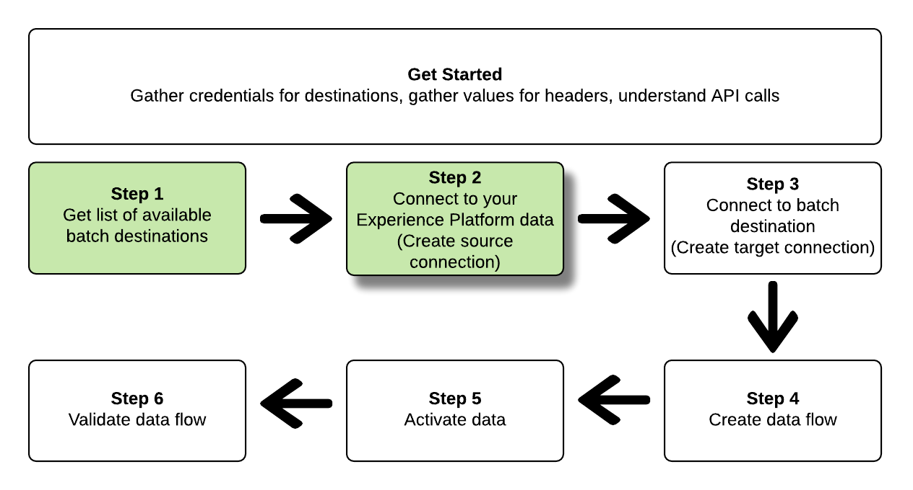
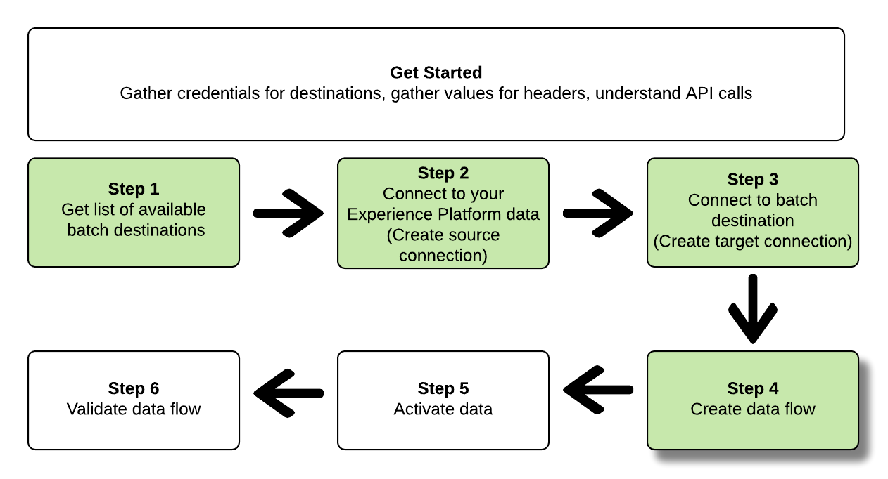

# 連線至檔案式電子郵件行銷目的地，並使用流量服務API啟用資料

>[!IMPORTANT]
> 
>* 若要連線到目的地，您需要 **[!UICONTROL 管理目的地]** [存取控制許可權](/help/access-control/home.md#permissions).
>
>* 若要啟用資料，您需要 **[!UICONTROL 管理目的地]**， **[!UICONTROL 啟用目的地]**， **[!UICONTROL 檢視設定檔]**、和 **[!UICONTROL 檢視區段]** [存取控制許可權](/help/access-control/home.md#permissions).
>
>* 要匯出 *身分*，您需要 **[!UICONTROL 檢視身分圖表]** [存取控制許可權](/help/access-control/home.md#permissions). <br> {width="100" zoomable="yes"}
>
>閱讀 [存取控制總覽](/help/access-control/ui/overview.md) 或聯絡您的產品管理員以取得必要許可權。

本教學課程示範如何使用流量服務API建立檔案式 [電子郵件行銷目的地](../catalog/email-marketing/overview.md)，建立資料流至您新建立的目的地，並透過CSV檔案將資料匯出至您新建立的目的地。

>[!TIP]
> 
>若要瞭解如何使用流量服務API啟用雲端儲存目的地的資料，請參閱 [專用的API教學課程](/help/destinations/api/activate-segments-file-based-destinations.md).

本教學課程使用 [!DNL Adobe Campaign] 目的地的所有範例，但檔案式電子郵件行銷目的地的步驟相同。


如果您偏好使用Platform使用者介面來連線至目的地並啟用資料，請參閱 [連線目的地](../ui/connect-destination.md) 和 [啟用對象資料至批次設定檔匯出目的地](../ui/activate-batch-profile-destinations.md) 教學課程。

## 快速入門 {#get-started}

本指南需要您深入了解下列 Adobe Experience Platform 元件：

* [[!DNL Experience Data Model (XDM) System]](../../xdm/home.md)：[!DNL Experience Platform] 據以組織客戶體驗資料的標準化框架。
* [[!DNL Segmentation Service]](../../segmentation/api/overview.md)： [!DNL Adobe Experience Platform Segmentation Service] 可讓您在中建立對象 [!DNL Adobe Experience Platform] 從您的 [!DNL Real-Time Customer Profile] 資料。
* [[!DNL Sandboxes]](../../sandboxes/home.md)： [!DNL Experience Platform] 提供分割單一區域的虛擬沙箱 [!DNL Platform] 將執行個體整合至個別的虛擬環境中，協助開發及改進數位體驗應用程式。

以下章節提供在Platform中啟用批次目的地資料所需的其他資訊。

### 收集必要的認證 {#gather-required-credentials}

若要完成本教學課程中的步驟，您應準備好下列憑證，端視您要連線及啟用對象的目的地型別而定。

* 的 [!DNL Amazon S3] 連線： `accessId`， `secretKey`
* 的 [!DNL Amazon S3] 連線到 [!DNL Adobe Campaign]： `accessId`， `secretKey`
* 對於SFTP連線： `domain`， `port`， `username`， `password` 或 `sshKey` （視與FTP位置的連線方法而定）
* 的 [!DNL Azure Blob] 連線： `connectionString`

>[!NOTE]
>
>認證 `accessId`， `secretKey` 的 [!DNL Amazon S3] 連線和 `accessId`， `secretKey` 的 [!DNL Amazon S3] 連線到 [!DNL Adobe Campaign] 相同。

### 讀取範例 API 呼叫 {#reading-sample-api-calls}

本教學課程提供範例API呼叫，示範如何格式化您的請求。 這些包括路徑、必要的標頭和正確格式化的請求承載。 此外，也提供 API 回應中傳回的範例 JSON。 如需文件中用於範例 API 呼叫的慣例相關資訊，請參閱 [ 疑難排解指南中的](../../landing/troubleshooting.md#how-do-i-format-an-api-request)如何讀取範例 API 呼叫[!DNL Experience Platform]一節。

### 收集必要和選用標題的值 {#gather-values-headers}

為了對 [!DNL Platform] API 進行呼叫，您必須先完成[驗證教學課程](https://www.adobe.com/go/platform-api-authentication-en)。完成驗證教學課程會提供所有 [!DNL Experience Platform] API 呼叫中每個必要標頭的值，如下所示：

* 授權：持有人 `{ACCESS_TOKEN}`
* x-api-key: `{API_KEY}`
* x-gw-ims-org-id: `{ORG_ID}`

中的資源 [!DNL Experience Platform] 可隔離至特定的虛擬沙箱。 在要求給 [!DNL Platform] API中，您可以指定要執行作業的沙箱名稱和ID。 這些是選用引數。

* x-sandbox-name: `{SANDBOX_NAME}`

>[!NOTE]
>
>如需中沙箱的詳細資訊 [!DNL Experience Platform]，請參閱 [沙箱概述檔案](../../sandboxes/home.md).

包含裝載(POST、PUT、PATCH)的所有請求都需要額外的媒體型別標頭：

* Content-Type: `application/json`

### API參考檔案 {#api-reference-documentation}

在本教學課程中，您可以找到所有API作業的隨附參考檔案。 請參閱 [有關Adobe I/O的流程服務API檔案](https://www.adobe.io/experience-platform-apis/references/flow-service/). 我們建議您同時使用本教學課程和API參考檔案。

## 取得可用目的地的清單 {#get-the-list-of-available-destinations}


首先，您必須決定要將資料啟動到的目的地。 首先，請執行呼叫以請求您可以連線並啟用對象的目標可用目的地清單。 向執行下列GET要求 `connectionSpecs` 端點以傳回可用目的地的清單：

**API格式**

```http
GET /connectionSpecs
```

**要求**

```shell
curl --location --request GET 'https://platform.adobe.io/data/foundation/flowservice/connectionSpecs' \
--header 'accept: application/json' \
--header 'x-gw-ims-org-id: {ORG_ID}' \
--header 'x-api-key: {API_KEY}' \
--header 'x-sandbox-name: {SANDBOX_NAME}' \
--header 'Authorization: Bearer {ACCESS_TOKEN}'
```


**回應**

成功的回應包含可用目的地的清單及其唯一識別碼(`id`)。 儲存您計畫使用的目的地值，因為後續步驟需要它。 例如，如果您想要連線並傳送對象至 [!DNL Adobe Campaign]，尋找回應中的下列程式碼片段：

```json
{
    "id": "0b23e41a-cb4a-4321-a78f-3b654f5d7d97",
  "name": "Adobe Campaign",
  ...
  ...
}
```

下表包含常用批次目的地的連線規格ID以供您參考：

| 目的地 | 連線規格ID |
---------|----------|
| [!DNL Adobe Campaign] | `0b23e41a-cb4a-4321-a78f-3b654f5d7d97` |
| [!DNL Oracle Eloqua] | `c1e44b6b-e7c8-404b-9031-58f0ef760604` |
| [!DNL Oracle Responsys] | `a5e28ddf-e265-426e-83a1-9d03a3a6822b` |
| [!DNL Salesforce Marketing Cloud] | `f599a5b3-60a7-4951-950a-cc4115c7ea27` |

{style="table-layout:auto"}

## 連線至您的 [!DNL Experience Platform] 資料 {#connect-to-your-experience-platform-data}



接下來，您必須連線至 [!DNL Experience Platform] 資料，以便您匯出設定檔資料，並在您偏好的目的地啟用該資料。 此包含兩個子步驟，如下所述。

1. 首先，您必須執行呼叫以授權存取中的資料 [!DNL Experience Platform]，方法是設定基礎連線。
2. 然後，使用基本連線ID執行另一個呼叫，您會在其中建立 *來源連線*，會建立與您的 [!DNL Experience Platform] 資料。

### 授權存取中的資料 [!DNL Experience Platform]

**API格式**

```http
POST /connections
```

**要求**

```shell
curl --location --request POST 'https://platform.adobe.io/data/foundation/flowservice/connections' \
--header 'Authorization: Bearer {ACCESS_TOKEN}' \
--header 'x-api-key: {API_KEY}' \
--header 'x-gw-ims-org-id: {ORG_ID}' \
--header 'x-sandbox-name: {SANDBOX_NAME}' \
--header 'Content-Type: application/json' \
--data-raw '{
            "name": "Base connection to Experience Platform",
            "description": "This call establishes the connection to Experience Platform data",
            "connectionSpec": {
                "id": "{CONNECTION_SPEC_ID}",
                "version": "1.0"
            }
}'
```

| 屬性 | 說明 |
| --------- | ----------- |
| `name` | 提供基本連線至Experience Platform的名稱 [!DNL Profile Store]. |
| `description` | 您可以選擇提供基本連線的說明。 |
| `connectionSpec.id` | 使用連線規格ID用於 [Experience Platform設定檔存放區](/help/profile/home.md#profile-data-store) - `8a9c3494-9708-43d7-ae3f-cda01e5030e1`. |

{style="table-layout:auto"}

**回應**

成功的回應包含基礎連線的唯一識別碼(`id`)。 將此值儲存為建立來源連線之下一個步驟所需的值。

```json
{
    "id": "1ed86558-59b5-42f7-9865-5859b552f7f4"
}
```

### 連線至您的 [!DNL Experience Platform] 資料 {#connect-to-platform-data}

**API格式**

```http
POST /sourceConnections
```

**要求**

```shell
curl --location --request POST 'https://platform.adobe.io/data/foundation/flowservice/sourceConnections' \
--header 'Authorization: Bearer {ACCESS_TOKEN}' \
--header 'x-api-key: {API_KEY}' \
--header 'x-gw-ims-org-id: {ORG_ID}' \
--header 'x-sandbox-name: {SANDBOX_NAME}' \
--header 'Content-Type: application/json' \
--data-raw '{
            "name": "Connecting to Profile Store",
            "description": "Optional",
            "connectionSpec": {
                "id": "{CONNECTION_SPEC_ID}",
                "version": "1.0"
            },
            "baseConnectionId": "{BASE_CONNECTION_ID}",
            "data": {
                "format": "CSV",
                "schema": null
            },
            "params" : {}
}'
```

| 屬性 | 說明 |
| --------- | ----------- |
| `name` | 提供來源連線至Experience Platform的名稱 [!DNL Profile Store]. |
| `description` | 您可以選擇提供來源連線的說明。 |
| `connectionSpec.id` | 使用連線規格ID用於 [Experience Platform設定檔存放區](/help/profile/home.md#profile-data-store) - `8a9c3494-9708-43d7-ae3f-cda01e5030e1`. |
| `baseConnectionId` | 使用您在上一步中取得的基本連線ID。 |
| `data.format` | `CSV` 是目前唯一支援的檔案匯出格式。 |

{style="table-layout:auto"}

**回應**

成功的回應會傳回唯一識別碼(`id`)作為新建立的來源連線至 [!DNL Profile Store]. 這可確認您已成功連線至您的 [!DNL Experience Platform] 資料。 將此值依後續步驟的需要儲存。

```json
{
    "id": "ed48ae9b-c774-4b6e-88ae-9bc7748b6e97"
}
```

## 連線到批次目的地 {#connect-to-batch-destination}


在此步驟中，您會設定與所需批次雲端儲存空間或電子郵件行銷目的地的連線。 此包含兩個子步驟，如下所述。

1. 首先，您必須透過設定基礎連線，執行呼叫以授權存取目的地平台。
2. 然後，使用基本連線ID進行另一個呼叫，您會在其中建立 *目標連線*，會指定儲存體帳戶中傳送已匯出資料檔案的位置，以及將會匯出的資料格式。

### 授權存取批次目的地 {#authorize-access-to-batch-destination}

**API格式**

```http
POST /connections
```

**要求**

以下請求會建立與的基底連線 [!DNL Adobe Campaign] 目的地。 視您要將檔案匯出到的儲存位置而定([!DNL Amazon S3]， SFTP， [!DNL Azure Blob])，保留適當的 `auth` 指定並刪除其他專案。

```shell
curl --location --request POST 'https://platform.adobe.io/data/foundation/flowservice/connections' \
--header 'Authorization: Bearer {ACCESS_TOKEN}' \
--header 'x-api-key: {API_KEY}' \
--header 'x-gw-ims-org-id: {ORG_ID}' \
--header 'x-sandbox-name: {SANDBOX_NAME}' \
--header 'Content-Type: application/json' \
--data-raw '{
    "name": "S3 Connection for Adobe Campaign",
    "description": "summer advertising campaign",
    "connectionSpec": {
        "id": "0b23e41a-cb4a-4321-a78f-3b654f5d7d97",
        "version": "1.0"
    },
    "auth": {
        "specName": "S3",
        "params": {
            "accessId": "{ACCESS_ID}",
            "secretKey": "{SECRET_KEY}"
        }
    }
    "auth": {
        "specName": "SFTP with Password",
        "params": {
            "domain": "{DOMAIN}",
            "host": "{HOST}",
            "username": "{USERNAME}",
            "password": "{PASSWORD}"
        }
    }
    "auth": {
        "specName": "SFTP with SSH Key",
        "params": {
            "domain": "{DOMAIN}",
            "host": "{HOST}",
            "username": "{USERNAME}",
            "sshKey": "{SSH_KEY}"
        }
    }        
    "auth": {
        "specName": "Azure Blob",
        "params": {
            "connectionString": "{AZURE_BLOB_CONNECTION_STRING}"
        }
    }    
}'
```

請參閱下列請求範例，以連線至其他支援的批次雲端儲存空間及電子郵件行銷目的地。

+++ 連線至的範例要求 [!DNL Amazon S3] 目的地

以下請求會建立與的基底連線 [!DNL Amazon S3] 目的地。

```shell
curl --location --request POST 'https://platform.adobe.io/data/foundation/flowservice/connections' \
--header 'Authorization: Bearer {ACCESS_TOKEN}' \
--header 'x-api-key: {API_KEY}' \
--header 'x-gw-ims-org-id: {ORG_ID}' \
--header 'x-sandbox-name: {SANDBOX_NAME}' \
--header 'Content-Type: application/json' \
--data-raw '{
    "name": "Connect to Amazon S3",
    "description": "summer advertising campaign",
    "connectionSpec": {
        "id": "4890fc95-5a1f-4983-94bb-e060c08e3f81",
        "version": "1.0"
    },
    "auth": {
        "specName": "Access Key",
        "params": {
            "s3AccessKey": "{AMAZON_S3_ACCESS_KEY}",
            "s3SecretKey": "{AMAZON_S3_SECRET_KEY}"
        }
    }
}'
```

+++

+++ 連線至的範例要求 [!DNL Azure Blob] 目的地

以下請求會建立與的基底連線 [!DNL Azure Blob] 目的地。

```shell
curl --location --request POST 'https://platform.adobe.io/data/foundation/flowservice/connections' \
--header 'Authorization: Bearer {ACCESS_TOKEN}' \
--header 'x-api-key: {API_KEY}' \
--header 'x-gw-ims-org-id: {ORG_ID}' \
--header 'x-sandbox-name: {SANDBOX_NAME}' \
--header 'Content-Type: application/json' \
--data-raw '{
    "name": "Connect to Azure Blob",
    "description": "Summer advertising campaign",
    "connectionSpec": {
        "id": "e258278b-a4cf-43ac-b158-4fa0ca0d948b",
        "version": "1.0"
    },
    "auth": {
        "specName": "ConnectionString",
        "params": {
            "connectionString": "{AZURE_BLOB_CONNECTION_STRING}"
        }
    }
}'
```

+++

+++ 連線至的範例要求 [!DNL Oracle Eloqua] 目的地

以下請求會建立與的基底連線 [!DNL Oracle Eloqua] 目的地。 根據您要將檔案匯出到的儲存位置，保留適當的 `auth` 指定並刪除其他專案。

```shell
curl --location --request POST 'https://platform.adobe.io/data/foundation/flowservice/connections' \
--header 'Authorization: Bearer {ACCESS_TOKEN}' \
--header 'x-api-key: {API_KEY}' \
--header 'x-gw-ims-org-id: {ORG_ID}' \
--header 'x-sandbox-name: {SANDBOX_NAME}' \
--header 'Content-Type: application/json' \
--data-raw '{
    "name": "Connect to Eloqua destination",
    "description": "summer advertising campaign",
    "connectionSpec": {
        "id": "c1e44b6b-e7c8-404b-9031-58f0ef760604",
        "version": "1.0"
    },
    "auth": {
        "specName": "SFTP with Password",
        "params": {
            "domain": "{DOMAIN}",
            "host": "{HOST}",
            "username": "{USERNAME}",
            "password": "{PASSWORD}"
        }
    }
    "auth": {
        "specName": "SFTP with SSH Key",
        "params": {
            "domain": "{DOMAIN}",
            "host": "{HOST}",
            "username": "{USERNAME}",
            "sshKey": "{SSH_KEY}"
        }
    }    
}'
```

+++

+++ 連線至的範例要求 [!DNL Oracle Responsys] 目的地

以下請求會建立與的基底連線 [!DNL Oracle Responsys] 目的地。 根據您要將檔案匯出到的儲存位置，保留適當的 `auth` 指定並刪除其他專案。

```shell
curl --location --request POST 'https://platform.adobe.io/data/foundation/flowservice/connections' \
--header 'Authorization: Bearer {ACCESS_TOKEN}' \
--header 'x-api-key: {API_KEY}' \
--header 'x-gw-ims-org-id: {ORG_ID}' \
--header 'x-sandbox-name: {SANDBOX_NAME}' \
--header 'Content-Type: application/json' \
--data-raw '{
    "name": "Connect to Responsys destination",
    "description": "summer advertising campaign",
    "connectionSpec": {
        "id": "a5e28ddf-e265-426e-83a1-9d03a3a6822b",
        "version": "1.0"
    },
    "auth": {
        "specName": "SFTP with Password",
        "params": {
            "domain": "{DOMAIN}",
            "host": "{HOST}",
            "username": "{USERNAME}",
            "password": "{PASSWORD}"
        }
    }
    "auth": {
        "specName": "SFTP with SSH Key",
        "params": {
            "domain": "{DOMAIN}",
            "host": "{HOST}",
            "username": "{USERNAME}",
            "sshKey": "{SSH_KEY}"
        }
    }    
}'
```

+++

+++ 連線至的範例要求 [!DNL Salesforce Marketing Cloud] 目的地

以下請求會建立與的基底連線 [!DNL Salesforce Marketing Cloud] 目的地。 根據您要將檔案匯出到的儲存位置，保留適當的 `auth` 指定並刪除其他專案。

```shell
curl --location --request POST 'https://platform.adobe.io/data/foundation/flowservice/connections' \
--header 'Authorization: Bearer {ACCESS_TOKEN}' \
--header 'x-api-key: {API_KEY}' \
--header 'x-gw-ims-org-id: {ORG_ID}' \
--header 'x-sandbox-name: {SANDBOX_NAME}' \
--header 'Content-Type: application/json' \
--data-raw '{
    "name": "Connect to Salesforce Marketing Cloud",
    "description": "summer advertising campaign",
    "connectionSpec": {
        "id": "f599a5b3-60a7-4951-950a-cc4115c7ea27",
        "version": "1.0"
    },
    "auth": {
        "specName": "SFTP with Password",
        "params": {
            "domain": "{DOMAIN}",
            "host": "{HOST}",
            "username": "{USERNAME}",
            "password": "{PASSWORD}"
        }
    }
    "auth": {
        "specName": "SFTP with SSH Key",
        "params": {
            "domain": "{DOMAIN}",
            "host": "{HOST}",
            "username": "{USERNAME}",
            "sshKey": "{SSH_KEY}"
        }
    }    
}'
```

+++

+++ 使用密碼目的地連線至SFTP的請求範例

以下請求會建立與SFTP目的地的基底連線。

```shell
curl --location --request POST 'https://platform.adobe.io/data/foundation/flowservice/connections' \
--header 'Authorization: Bearer {ACCESS_TOKEN}' \
--header 'x-api-key: {API_KEY}' \
--header 'x-gw-ims-org-id: {ORG_ID}' \
--header 'x-sandbox-name: {SANDBOX_NAME}' \
--header 'Content-Type: application/json' \
--data-raw '{
    "name": "Connect to SFTP with password",
    "description": "summer advertising campaign",
    "connectionSpec": {
        "id": "64ef4b8b-a6e0-41b5-9677-3805d1ee5dd0",
        "version": "1.0"
    },
    "auth": {
        "specName": "Basic Authentication for sftp",
        "params": {
            "host": "{HOST}",
            "username": "{USERNAME}",
            "password": "{PASSWORD}"
        }
    }
}'
```

+++

| 屬性 | 說明 |
| --------- | ----------- |
| `name` | 提供批次目的地的基本連線名稱。 |
| `description` | 您可以選擇提供基本連線的說明。 |
| `connectionSpec.id` | 使用所需批次目的地的連線規格ID。 您已在步驟中取得此ID [取得可用目的地的清單](#get-the-list-of-available-destinations). |
| `auth.specname` | 表示目的地的驗證格式。 若要找出目的地的specName，請執行 [對連線規格端點的GET呼叫](https://developer.adobe.com/experience-platform-apis/references/flow-service/#operation/retrieveConnectionSpec)，提供您所需目的地的連線規格。 尋找引數 `authSpec.name` 在回應中。 <br> 例如，針對Adobe Campaign目的地，您可以使用任何 `S3`， `SFTP with Password`，或 `SFTP with SSH Key`. |
| `params` | 根據您連線的目的地，您必須提供不同的必要驗證引數。 針對Amazon S3連線，您必須提供Amazon S3儲存位置的存取ID和秘密金鑰。 <br> 若要找出您目的地所需的引數，請執行 [對連線規格端點的GET呼叫](https://developer.adobe.com/experience-platform-apis/references/flow-service/#operation/retrieveConnectionSpec)，提供您所需目的地的連線規格。 尋找引數 `authSpec.spec.required` 在回應中。 |

{style="table-layout:auto"}

**回應**

成功的回應包含基礎連線的唯一識別碼(`id`)。 將此值儲存為建立目標連線的下一個步驟所需的值。

```json
{
    "id": "1ed86558-59b5-42f7-9865-5859b552f7f4"
}
```

### 指定儲存位置和資料格式 {#specify-storage-location-data-format}

[!DNL Adobe Experience Platform] 以下列形式匯出批次電子郵件行銷和雲端儲存目的地的資料： [!DNL CSV] 檔案。 在此步驟中，您可以決定要匯出檔案之儲存位置的路徑。

>[!IMPORTANT]
> 
>[!DNL Adobe Experience Platform] 自動將匯出檔案分割為每檔案500萬筆記錄（列）。 每一列代表一個設定檔。
>
>分割檔案名稱會附加一個數字，指示檔案是較大匯出的一部分，例如： `filename.csv`， `filename_2.csv`， `filename_3.csv`.

**API格式**

```http
POST /targetConnections
```

**要求**

以下請求會建立目標連線至 [!DNL Adobe Campaign] 目的地，以判斷匯出的檔案會停留在您的儲存位置。 根據您要將檔案匯出到的儲存位置，保留適當的 `params` 指定並刪除其他專案。

```shell
curl --location --request POST 'https://platform.adobe.io/data/foundation/flowservice/targetConnections' \
--header 'Authorization: Bearer {ACCESS_TOKEN}' \
--header 'x-api-key: {API_KEY}' \
--header 'x-gw-ims-org-id: {ORG_ID}' \
--header 'Content-Type: application/json' \
--data-raw '{
    "name": "TargetConnection for Adobe Campaign",
    "description": "Connection to Adobe Campaign",
    "baseConnectionId": "{BASE_CONNECTION_ID}",
    "connectionSpec": {
        "id": "0b23e41a-cb4a-4321-a78f-3b654f5d7d97",
        "version": "1.0"
    },
    "data": {
        "format": "json",
        "schema": {
            "id": "1.0",
            "version": "1.0"
        }
    },
    "params": {
        "mode": "S3",
        "bucketName": "{BUCKET_NAME}",
        "path": "{FILEPATH}",
        "format": "CSV"
    }
    "params": {
        "mode": "AZURE_BLOB",
        "container": "{CONTAINER}",
        "path": "{FILEPATH}",
        "format": "CSV"
    }
    "params": {
        "mode": "FTP",
        "remotePath": "{REMOTE_PATH}",
        "format": "CSV"
    }        
}'
```

請參閱下列請求範例，為其他支援的批次雲端儲存和電子郵件行銷目的地設定儲存位置。

+++ 設定儲存位置的請求範例 [!DNL Amazon S3] 目的地

以下請求會建立目標連線至 [!DNL Amazon S3] 目的地，以判斷匯出的檔案會停留在您的儲存位置。

```shell
curl --location --request POST 'https://platform.adobe.io/data/foundation/flowservice/targetConnections' \
--header 'Authorization: Bearer {ACCESS_TOKEN}' \
--header 'x-api-key: {API_KEY}' \
--header 'x-gw-ims-org-id: {ORG_ID}' \
--header 'Content-Type: application/json' \
--data-raw '{
    "name": "TargetConnection for Amazon S3",
    "description": "Connection to Amazon S3",
    "baseConnectionId": "{BASE_CONNECTION_ID}",
    "connectionSpec": {
        "id": "4890fc95-5a1f-4983-94bb-e060c08e3f81",
        "version": "1.0"
    },
    "data": {
        "format": "json",
        "schema": {
            "id": "1.0",
            "version": "1.0"
        }
    },
    "params": {
        "mode": "S3",
        "bucketName": "{BUCKET_NAME}",
        "path": "{FILEPATH}",
        "format": "CSV"
    }
}'
```

+++

+++ 設定儲存位置的請求範例 [!DNL Azure Blob] 目的地

以下請求會建立目標連線至 [!DNL Azure Blob] 目的地，以判斷匯出的檔案會停留在您的儲存位置。

```shell
curl --location --request POST 'https://platform.adobe.io/data/foundation/flowservice/targetConnections' \
--header 'Authorization: Bearer {ACCESS_TOKEN}' \
--header 'x-api-key: {API_KEY}' \
--header 'x-gw-ims-org-id: {ORG_ID}' \
--header 'Content-Type: application/json' \
--data-raw '{
    "name": "TargetConnection for Azure Blob",
    "description": "Connection to Azure Blob",
    "baseConnectionId": "{BASE_CONNECTION_ID}",
    "connectionSpec": {
        "id": "e258278b-a4cf-43ac-b158-4fa0ca0d948b",
        "version": "1.0"
    },
    "data": {
        "format": "json",
        "schema": {
            "id": "1.0",
            "version": "1.0"
        }
    },
    "params": {
        "mode": "AZURE_BLOB",
        "container": "{CONTAINER}",
        "path": "{FILEPATH}",
        "format": "CSV"
    }
}'
```

+++

+++ 設定儲存位置的請求範例 [!DNL Oracle Eloqua] 目的地

以下請求會建立目標連線至 [!DNL Oracle Eloqua] 目的地，以判斷匯出的檔案會停留在您的儲存位置。 根據您要將檔案匯出到的儲存位置，保留適當的 `params` 指定並刪除其他專案。

```shell
curl --location --request POST 'https://platform.adobe.io/data/foundation/flowservice/targetConnections' \
--header 'Authorization: Bearer {ACCESS_TOKEN}' \
--header 'x-api-key: {API_KEY}' \
--header 'x-gw-ims-org-id: {ORG_ID}' \
--header 'Content-Type: application/json' \
--data-raw '{
    "name": "TargetConnection for Oracle Eloqua",
    "description": "Connection to Oracle Eloqua",
    "baseConnectionId": "{BASE_CONNECTION_ID}",
    "connectionSpec": {
        "id": "c1e44b6b-e7c8-404b-9031-58f0ef760604",
        "version": "1.0"
    },
    "data": {
        "format": "json",
        "schema": {
            "id": "1.0",
            "version": "1.0"
        }
    },
    "params": {
        "mode": "S3",
        "bucketName": "{BUCKET_NAME}",
        "path": "{FILEPATH}",
        "format": "CSV"
    }
    "params": {
        "mode": "FTP",
        "remotePath": "{REMOTE_PATH}",
        "format": "CSV"
    }        
}'
```

+++

+++ 設定儲存位置的請求範例 [!DNL Oracle Responsys] 目的地

以下請求會建立目標連線至 [!DNL Oracle Responsys] 目的地，以判斷匯出的檔案會停留在您的儲存位置。 根據您要將檔案匯出到的儲存位置，保留適當的 `params` 指定並刪除其他專案。

```shell
curl --location --request POST 'https://platform.adobe.io/data/foundation/flowservice/targetConnections' \
--header 'Authorization: Bearer {ACCESS_TOKEN}' \
--header 'x-api-key: {API_KEY}' \
--header 'x-gw-ims-org-id: {ORG_ID}' \
--header 'Content-Type: application/json' \
--data-raw '{
    "name": "TargetConnection for Oracle Responsys",
    "description": "Connection to Oracle Responsys",
    "baseConnectionId": "{BASE_CONNECTION_ID}",
    "connectionSpec": {
        "id": "a5e28ddf-e265-426e-83a1-9d03a3a6822b",
        "version": "1.0"
    },
    "data": {
        "format": "json",
        "schema": {
            "id": "1.0",
            "version": "1.0"
        }
    },
    "params": {
        "mode": "S3",
        "bucketName": "{BUCKET_NAME}",
        "path": "{FILEPATH}",
        "format": "CSV"
    }
    "params": {
        "mode": "FTP",
        "remotePath": "{REMOTE_PATH}",
        "format": "CSV"
    }        
}'
```

+++

+++ 設定儲存位置的請求範例 [!DNL Salesforce Marketing Cloud] 目的地

以下請求會建立目標連線至 [!DNL Salesforce Marketing Cloud] 目的地，以判斷匯出的檔案會停留在您的儲存位置。 根據您要將檔案匯出到的儲存位置，保留適當的 `params` 指定並刪除其他專案。

```shell
curl --location --request POST 'https://platform.adobe.io/data/foundation/flowservice/targetConnections' \
--header 'Authorization: Bearer {ACCESS_TOKEN}' \
--header 'x-api-key: {API_KEY}' \
--header 'x-gw-ims-org-id: {ORG_ID}' \
--header 'Content-Type: application/json' \
--data-raw '{
    "name": "TargetConnection for Salesforce Marketing Cloud",
    "description": "Connection to Salesforce Marketing Cloud",
    "baseConnectionId": "{BASE_CONNECTION_ID}",
    "connectionSpec": {
        "id": "f599a5b3-60a7-4951-950a-cc4115c7ea27",
        "version": "1.0"
    },
    "data": {
        "format": "json",
        "schema": {
            "id": "1.0",
            "version": "1.0"
        }
    },
    "params": {
        "mode": "S3",
        "bucketName": "{BUCKET_NAME}",
        "path": "{FILEPATH}",
        "format": "CSV"
    }
    "params": {
        "mode": "FTP",
        "remotePath": "{REMOTE_PATH}",
        "format": "CSV"
    }        
}'
```

+++

+++ 設定SFTP目的地儲存位置的請求範例

以下請求會建立與SFTP目的地的目標連線，以判斷匯出的檔案會著陸至您的儲存位置。

```shell
curl --location --request POST 'https://platform.adobe.io/data/foundation/flowservice/targetConnections' \
--header 'Authorization: Bearer {ACCESS_TOKEN}' \
--header 'x-api-key: {API_KEY}' \
--header 'x-gw-ims-org-id: {ORG_ID}' \
--header 'Content-Type: application/json' \
--data-raw '{
    "name": "TargetConnection for SFTP",
    "description": "Connection to SFTP",
    "baseConnectionId": "{BASE_CONNECTION_ID}",
    "connectionSpec": {
        "id": "64ef4b8b-a6e0-41b5-9677-3805d1ee5dd0",
        "version": "1.0"
    },
    "data": {
        "format": "json",
        "schema": {
            "id": "1.0",
            "version": "1.0"
        }
    },
    "params": {
        "mode": "FTP",
        "remotePath": "{REMOTE_PATH}",
    }
}'
```

+++


| 屬性 | 說明 |
| --------- | ----------- |
| `name` | 提供批次目的地的目標連線名稱。 |
| `description` | 您可以選擇提供目標連線的說明。 |
| `baseConnectionId` | 使用您在上述步驟中建立之基本連線的ID。 |
| `connectionSpec.id` | 使用所需批次目的地的連線規格ID。 您已在步驟中取得此ID [取得可用目的地的清單](#get-the-list-of-available-destinations). |
| `params` | 視您連線的目的地而定，您必須為儲存位置提供不同的必要引數。 針對Amazon S3連線，您必須提供Amazon S3儲存位置的存取ID和秘密金鑰。 <br> 若要找出您目的地所需的引數，請執行 [對連線規格端點的GET呼叫](https://developer.adobe.com/experience-platform-apis/references/flow-service/#operation/retrieveConnectionSpec)，提供您所需目的地的連線規格。 尋找引數 `targetSpec.spec.required` 在回應中。 |
| `params.mode` | 視您目的地支援的模式而定，您必須在此處提供不同的值。 若要找出您目的地所需的引數，請執行 [對連線規格端點的GET呼叫](https://developer.adobe.com/experience-platform-apis/references/flow-service/#operation/retrieveConnectionSpec)，提供您所需目的地的連線規格。 尋找引數 `targetSpec.spec.properties.mode.enum` ，並選取所需的模式。 |
| `params.bucketName` | 對於S3連線，請提供要匯出檔案的儲存貯體名稱。 |
| `params.path` | 對於S3連線，請在要匯出檔案的儲存位置中提供檔案路徑。 |
| `params.format` | `CSV` 是目前唯一支援的檔案匯出型別。 |

{style="table-layout:auto"}

**回應**

成功的回應會傳回唯一識別碼(`id`)作為新建立之批次目的地的目標連線。 視需要在後續步驟中儲存此值。

```json
{
    "id": "12ab90c7-519c-4291-bd20-d64186b62da8"
}
```

## 建立資料流 {#create-dataflow}



使用您在上一步中取得的流量規格、來源連線和目標連線ID，您現在可以在以下專案之間建立資料流： [!DNL Experience Platform] 資料以及匯出資料檔案的目的地。 將此步驟視為建構稍後資料將流經的管道 [!DNL Experience Platform] 以及您想要的目的地。

若要建立資料流，請執行POST請求，如下所示，同時在裝載中提供下列提及的值。

**API格式**

```http
POST /flows
```

**要求**

```shell
curl -X POST \
'https://platform.adobe.io/data/foundation/flowservice/flows' \
-H 'Authorization: Bearer {ACCESS_TOKEN}' \
-H 'x-api-key: {API_KEY}' \
-H 'x-gw-ims-org-id: {ORG_ID}' \
-H 'x-sandbox-name: {SANDBOX_NAME}' \
-H 'Content-Type: application/json' \
-d  '{
   
        "name": "activate audiences to Adobe Campaign",
        "description": "This operation creates a dataflow which we will later use to activate audiences to Adobe Campaign",
        "flowSpec": {
            "id": "{FLOW_SPEC_ID}",
            "version": "1.0"
        },
        "sourceConnectionIds": [
            "{SOURCE_CONNECTION_ID}"
        ],
        "targetConnectionIds": [
            "{TARGET_CONNECTION_ID}"
        ],
        "transformations": [
            {
                "name": "GeneralTransform",
                "params": {
                    "segmentSelectors": {
                        "selectors": []
                    },
                    "profileSelectors": {
                        "selectors": []
                    }
                }
            }
        ]
    }
```

| 屬性 | 說明 |
| --------- | ----------- |
| `name` | 為您正在建立的資料流命名。 |
| `description` | 您可以選擇為資料流提供說明。 |
| `flowSpec.Id` | 使用您要連線之批次目的地的流程規格ID。 GET若要擷取流量規格ID，請對 `flowspecs` 端點，如 [流程規格API參考檔案](https://www.adobe.io/experience-platform-apis/references/flow-service/#operation/retrieveFlowSpec). 在回應中，尋找 `upsTo` 並複製您要連線之批次目的地的對應ID。 例如，Adobe Campaign會搜尋 `upsToCampaign` 並複製 `id` 引數。 |
| `sourceConnectionIds` | 使用您在步驟中取得的來源連線ID [連線至您的Experience Platform資料](#connect-to-your-experience-platform-data). |
| `targetConnectionIds` | 使用您在步驟中取得的目標連線ID [連線到批次目的地](#connect-to-batch-destination). |
| `transformations` | 在下一步中，您會將要啟用的對象和設定檔屬性填入此區段中。 |

下表包含常用批次目的地的流量規格ID以供您參考：

| 目的地 | 流量規格ID |
---------|----------|
| 所有雲端儲存空間目的地([!DNL Amazon S3]， SFTP， [!DNL Azure Blob])和 [!DNL Oracle Eloqua] | `71471eba-b620-49e4-90fd-23f1fa0174d8` |
| [!DNL Oracle Responsys] | `51d675ce-e270-408d-91fc-22717bdf2148` |
| [!DNL Salesforce Marketing Cloud] | `493b2bd6-26e4-4167-ab3b-5e910bba44f0` |

**回應**

成功的回應會傳回ID (`id`)的資料流和 `etag`. 視需要在下一個步驟記下這兩個值，以啟動對象並匯出資料檔案。

```json
{
    "id": "8256cfb4-17e6-432c-a469-6aedafb16cd5",
    "etag": "8256cfb4-17e6-432c-a469-6aedafb16cd5"
}
```


## 啟用新目的地的資料 {#activate-data}


建立所有連線和資料流後，您現在可以將設定檔資料啟動到目的地平台。 在此步驟中，您可以選取要匯出至目的地的對象和設定檔屬性。

您也可以決定匯出檔案的檔案命名格式，以及應該使用哪些屬性作為 [重複資料刪除索引鍵](../ui/activate-batch-profile-destinations.md#mandatory-keys) 或 [強制屬性](../ui/activate-batch-profile-destinations.md#mandatory-attributes). 在此步驟中，您也可以決定傳送資料至目的地的排程。

若要將對象啟用至您的新目的地，您必須執行JSONPATCH操作，類似於以下範例。 您可以在一次呼叫中啟用多個對象和設定檔屬性。 若要進一步瞭解JSONPATCH，請參閱 [RFC規格](https://tools.ietf.org/html/rfc6902).

**API格式**

```http
PATCH /flows
```

**要求**

```shell
curl --location --request PATCH 'https://platform.adobe.io/data/foundation/flowservice/flows/{DATAFLOW_ID}' \
--header 'Authorization: Bearer {ACCESS_TOKEN}' \
--header 'x-api-key: {API_KEY}' \
--header 'x-gw-ims-org-id: {ORG_ID}' \
--header 'Content-Type: application/json' \
--header 'x-sandbox-name: {SANDBOX_NAME}' \
--header 'If-Match: "{ETAG}"' \
--data-raw '[
    {
        "op": "add",
        "path": "/transformations/0/params/segmentSelectors/selectors/-",
        "value": {
            "type": "PLATFORM_SEGMENT",
            "value": {
                "name": "Name of the audience that you are activating",
                "description": "Description of the audience that you are activating",
                "id": "{SEGMENT_ID}",
                "filenameTemplate": "%DESTINATION_NAME%_%SEGMENT_ID%_%DATETIME(YYYYMMdd_HHmmss)%",
                "exportMode": "DAILY_FULL_EXPORT",
                "schedule": {
                    "frequency": "ONCE",
                    "startDate": "2021-12-20",
                    "startTime": "17:00"
                } 
            }
        }
    },
{
        "op": "add",
        "path": "/transformations/0/params/segmentSelectors/selectors/-",
        "value": {
            "type": "PLATFORM_SEGMENT",
            "value": {
                "name": "Name of the audience that you are activating",
                "description": "Description of the audience that you are activating",
                "id": "{SEGMENT_ID}",
                "filenameTemplate": "%DESTINATION_NAME%_%SEGMENT_ID%_%DATETIME(YYYYMMdd_HHmmss)%",
                "exportMode": "DAILY_FULL_EXPORT",
                "schedule": {
                    "frequency": "ONCE",
                    "triggerType": "SCHEDULED",
                    "startDate": "2021-12-20",
                    "startTime": "17:00"
                },   
            }
        }
    },
{
        "op": "add",
        "path": "/transformations/0/params/profileSelectors/selectors/-",
        "value": {
            "type": "JSON_PATH",
            "value": {
                "path": "{PROFILE_ATTRIBUTE}"
            }
        }
    }
]
```

| 屬性 | 說明 |
| --------- | ----------- |
| `{DATAFLOW_ID}` | 在URL中，使用您在上一步建立的資料流ID。 |
| `{ETAG}` | 取得 `{ETAG}` 根據上一步驟中的回應， [建立資料流](#create-dataflow). 上一步驟中的回應格式已逸出引號。 您必須在請求標頭中使用未逸出的值。 請參閱下列範例： <br> <ul><li>回應範例： `"etag":""7400453a-0000-1a00-0000-62b1c7a90000""`</li><li>要在您的請求中使用的值： `"etag": "7400453a-0000-1a00-0000-62b1c7a90000"`</li></ul> <br> 每次成功更新資料流時，etag值都會更新。 |
| `{SEGMENT_ID}` | 提供您要匯出至此目的地的對象ID。 若要擷取您要啟用之對象的對象ID，請參閱 [擷取對象定義](https://www.adobe.io/experience-platform-apis/references/segmentation/#operation/retrieveSegmentDefinitionById) 在Experience Platform API參考中。 |
| `{PROFILE_ATTRIBUTE}` | 例如, `"person.lastName"` |
| `op` | 用於定義更新資料流所需動作的操作呼叫。 操作包括： `add`， `replace`、和 `remove`. 若要將對象新增至資料流，請使用 `add` 作業。 |
| `path` | 定義要更新的流程部分。 將對象新增至資料流時，請使用範例中指定的路徑。 |
| `value` | 您想要用來更新引數的新值。 |
| `id` | 指定您要新增至目的地資料流的對象ID。 |
| `name` | *可選*. 指定您要新增至目的地資料流的對象名稱。 請注意，此欄位並非必填欄位，您可以在不提供名稱的情況下成功將對象新增至目的地資料流。 |
| `filenameTemplate` | 此欄位會決定匯出至目的地之檔案的檔案名稱格式。 <br> 提供下列選項：: <br> <ul><li>`%DESTINATION_NAME%`: 必要. 匯出的檔案包含目的地名稱。</li><li>`%SEGMENT_ID%`: 必要. 匯出的檔案包含匯出對象的ID。</li><li>`%SEGMENT_NAME%`: 選填. 匯出的檔案包含匯出對象的名稱。</li><li>`DATETIME(YYYYMMdd_HHmmss)` 或 `%TIMESTAMP%`：選填。 選取這兩個選項之一，讓您的檔案包含Experience Platform產生檔案的時間。</li><li>`custom-text`: 選填. 將此預留位置取代為您要在檔案名稱結尾附加的任何自訂文字。</li></ul> <br> 有關設定檔案名稱的詳細資訊，請參閱 [設定檔案名稱](/help/destinations/ui/activate-batch-profile-destinations.md#file-names) 區段。 |
| `exportMode` | 必要. 選取「`"DAILY_FULL_EXPORT"`」或「`"FIRST_FULL_THEN_INCREMENTAL"`」。如需有關這兩個選項的詳細資訊，請參閱 [匯出完整檔案](/help/destinations/ui/activate-batch-profile-destinations.md#export-full-files) 和 [匯出增量檔案](/help/destinations/ui/activate-batch-profile-destinations.md#export-incremental-files) 在「批次目的地啟動」教學課程中。 |
| `startDate` | 選取對象應開始將設定檔匯出至您的目的地的日期。 |
| `frequency` | 必要. <br> <ul><li>對於 `"DAILY_FULL_EXPORT"` 匯出模式，您可以選取 `ONCE` 或 `DAILY`.</li><li>對於 `"FIRST_FULL_THEN_INCREMENTAL"` 匯出模式，您可以選取 `"DAILY"`， `"EVERY_3_HOURS"`， `"EVERY_6_HOURS"`， `"EVERY_8_HOURS"`， `"EVERY_12_HOURS"`.</li></ul> |
| `triggerType` | 的 *批次目的地* 僅限。 只有在選取 `"DAILY_FULL_EXPORT"` 中的模式 `frequency` 選擇器。 <br> 必要. <br> <ul><li>選取 `"AFTER_SEGMENT_EVAL"` 讓啟動工作在每日Platform批次分段工作完成後立即執行。 這可確保在啟動工作執行時，最新的設定檔會匯出至您的目的地。</li><li>選取 `"SCHEDULED"` 讓啟動工作以固定時間執行。 這可確保Experience Platform設定檔資料每天在同一時間匯出，但您匯出的設定檔可能不是最新的，這取決於批次細分工作是否在啟動工作開始之前完成。 選取此選項時，您也必須新增 `startTime` 以指示每日匯出應在UTC中發生的時間。</li></ul> |
| `endDate` | 的 *批次目的地* 僅限。 只有在批次檔案匯出目的地(例如Amazon S3、SFTP或Azure Blob)中將對象新增至資料流時，才需要此欄位。 <br> 選取時不適用 `"exportMode":"DAILY_FULL_EXPORT"` 和 `"frequency":"ONCE"`. <br> 設定對象成員停止匯出至目的地的日期。 |
| `startTime` | 的 *批次目的地* 僅限。 只有在批次檔案匯出目的地(例如Amazon S3、SFTP或Azure Blob)中將對象新增至資料流時，才需要此欄位。 <br> 必要. 選取包含對象成員的檔案應該產生並匯出至您的目的地的時間。 |

{style="table-layout:auto"}

>[!TIP]
>
> 另請參閱 [更新資料流中的對象元件](/help/destinations/api/update-destination-dataflows.md#update-segment) 瞭解如何更新匯出對象的各種元件（檔案名稱範本、匯出時間等）。

**回應**

尋找202接受的回應。 未傳回任何回應內文。 若要驗證請求是否正確，請參閱下一步， [驗證資料流](#validate-dataflow).

## 驗證資料流 {#validate-dataflow}


在教學課程的最後一步，您應該驗證對象和設定檔屬性是否確實已正確對應至資料流。

若要驗證，請執行以下的GET要求：

**API格式**

```http
GET /flows
```

**要求**

```shell
curl --location --request PATCH 'https://platform.adobe.io/data/foundation/flowservice/flows/{DATAFLOW_ID}' \
--header 'Authorization: Bearer {ACCESS_TOKEN}' \
--header 'x-api-key: {API_KEY}' \
--header 'x-gw-ims-org-id: {ORG_ID}' \
--header 'Content-Type: application/json' \
--header 'x-sandbox-name: prod' \
--header 'If-Match: "{ETAG}"' 
```

* `{DATAFLOW_ID}`：使用上一步驟的資料流。
* `{ETAG}`：使用上一步驟中的etag。

**回應**

傳回的回應應包含在 `transformations` 引數您在上一步中提交的對象和設定檔屬性。 範例 `transformations` 回應中的引數可能如下所示：

```json
"transformations":[
   {
      "name":"GeneralTransform",
      "params":{
         "profileSelectors":{
            "selectors":[
               {
                  "type":"JSON_PATH",
                  "value":{
                     "path":"homeAddress.countryCode",
                     "operator":"EXISTS",
                     "mapping":{
                        "sourceType":"text/x.schema-path",
                        "source":"homeAddress.countryCode",
                        "destination":"homeAddress.countryCode",
                        "identity":false,
                        "primaryIdentity":false,
                        "functionVersion":0,
                        "copyModeMapping":false,
                        "sourceAttribute":"homeAddress.countryCode",
                        "destinationXdmPath":"homeAddress.countryCode"
                     }
                  }
               },
               {
                  "type":"JSON_PATH",
                  "value":{
                     "path":"person.name.firstName",
                     "operator":"EXISTS",
                     "mapping":{
                        "sourceType":"text/x.schema-path",
                        "source":"person.name.firstName",
                        "destination":"person.name.firstName",
                        "identity":false,
                        "primaryIdentity":false,
                        "functionVersion":0,
                        "copyModeMapping":false,
                        "sourceAttribute":"person.name.firstName",
                        "destinationXdmPath":"person.name.firstName"
                     }
                  }
               },
               {
                  "type":"JSON_PATH",
                  "value":{
                     "path":"person.name.lastName",
                     "operator":"EXISTS",
                     "mapping":{
                        "sourceType":"text/x.schema-path",
                        "source":"person.name.lastName",
                        "destination":"person.name.lastName",
                        "identity":false,
                        "primaryIdentity":false,
                        "functionVersion":0,
                        "copyModeMapping":false,
                        "sourceAttribute":"person.name.lastName",
                        "destinationXdmPath":"person.name.lastName"
                     }
                  }
               },
               {
                  "type":"JSON_PATH",
                  "value":{
                     "path":"personalEmail.address",
                     "operator":"EXISTS",
                     "mapping":{
                        "sourceType":"text/x.schema-path",
                        "source":"personalEmail.address",
                        "destination":"personalEmail.address",
                        "identity":false,
                        "primaryIdentity":false,
                        "functionVersion":0,
                        "copyModeMapping":false,
                        "sourceAttribute":"personalEmail.address",
                        "destinationXdmPath":"personalEmail.address"
                     }
                  }
               },
               {
                  "type":"JSON_PATH",
                  "value":{
                     "path":"segmentMembership.status",
                     "operator":"EXISTS",
                     "mapping":{
                        "sourceType":"text/x.schema-path",
                        "source":"segmentMembership.status",
                        "destination":"segmentMembership.status",
                        "identity":false,
                        "primaryIdentity":false,
                        "functionVersion":0,
                        "copyModeMapping":false,
                        "sourceAttribute":"segmentMembership.status",
                        "destinationXdmPath":"segmentMembership.status"
                     }
                  }
               }
            ],
            "mandatoryFields":[
               "person.name.firstName",
               "person.name.lastName"
            ],
            "primaryFields":[
               {
                  "fieldType":"ATTRIBUTE",
                  "attributePath":"personalEmail.address"
               }
            ]
         },
         "segmentSelectors":{
            "selectors":[
               {
                  "type":"PLATFORM_SEGMENT",
                  "value":{
                     "id":"9f7d37fd-7039-4454-94ef-2b0cd6c3206a",
                     "name":"Interested in Mountain Biking",
                     "filenameTemplate":"%DESTINATION_NAME%_%SEGMENT_ID%_%DATETIME(YYYYMMdd_HHmmss)%",
                     "exportMode":"DAILY_FULL_EXPORT",
                     "schedule":{
                        "frequency":"ONCE",
                        "startDate":"2021-12-20",
                        "startTime":"17:00"
                     },
                     "createTime":"1640016962",
                     "updateTime":"1642534355"
                  }
               },
               {
                  "type":"PLATFORM_SEGMENT",
                  "value":{
                     "id":"25768be6-ebd5-45cc-8913-12fb3f348613",
                     "name":"Loyalty Segment",
                     "filenameTemplate":"%DESTINATION_NAME%_%SEGMENT_ID%_%DATETIME(YYYYMMdd_HHmmss)%",
                     "exportMode":"FIRST_FULL_THEN_INCREMENTAL",
                     "schedule":{
                        "frequency":"EVERY_6_HOURS",
                        "startDate":"2021-12-22",
                        "endDate":"2021-12-31",
                        "startTime":"17:00"
                     },
                     "createTime":"1640016962",
                     "updateTime":"1642534355"
                  }
               }
            ]
         }
      }
   }
]
```

## API錯誤處理 {#api-error-handling}

本教學課程中的API端點會遵循一般Experience PlatformAPI錯誤訊息原則。 請參閱 [API狀態代碼](/help/landing/troubleshooting.md#api-status-codes) 和 [請求標頭錯誤](/help/landing/troubleshooting.md#request-header-errors) （位於平台疑難排解指南中），以取得有關解譯錯誤回應的詳細資訊。

## 後續步驟 {#next-steps}

依照本教學課程中的指示，您已成功將Platform連線至其中一個慣用的檔案式電子郵件行銷目的地，並設定資料流至個別目的地以匯出資料檔案。 現在，傳出資料可用於電子郵件行銷活動、目標定位廣告和許多其他使用案例的目的地。 如需詳細資訊，請參閱下列頁面，例如如何使用流量服務API編輯現有資料流：

* [目的地概觀](../home.md)
* [目的地目錄概觀](../catalog/overview.md)
* [使用流程服務API更新目的地資料流程](../api/update-destination-dataflows.md)
