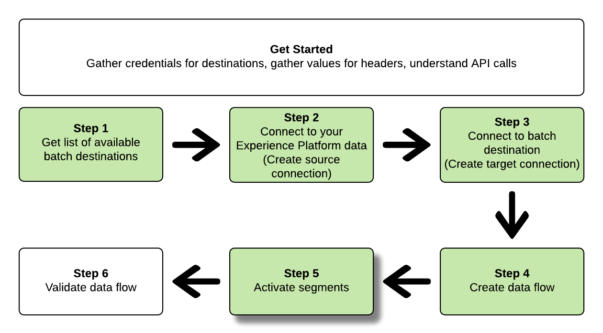

# 使用流服務API連接到批處理目標並激活資料

>[!IMPORTANT]
> 
>要連接到目標，您需要 **[!UICONTROL 管理目標]** [訪問控制權限](/help/access-control/home.md#permissions)。
>
>要激活資料，您需要 **[!UICONTROL 管理目標]**。 **[!UICONTROL 激活目標]**。 **[!UICONTROL 查看配置檔案]**, **[!UICONTROL 查看段]** [訪問控制權限](/help/access-control/home.md#permissions)。
>
>閱讀 [訪問控制概述](/help/access-control/ui/overview.md) 或聯繫您的產品管理員以獲取所需權限。

本教程演示如何使用流服務API建立批 [雲儲存](../catalog/cloud-storage/overview.md) 或 [電子郵件營銷目標](../catalog/email-marketing/overview.md)，建立資料流到新建立的目標，並通過CSV檔案將資料導出到新建立的目標。

本教程使用 [!DNL Adobe Campaign] 所有示例中的目標，但所有批雲儲存和電子郵件營銷目標的步驟相同。


如果您希望使用平台用戶介面連接到目標並激活資料，請參閱 [連接目標](../ui/connect-destination.md) 和 [將受眾資料激活到批配置檔案導出目標](../ui/activate-batch-profile-destinations.md) 教程。

## 快速入門 {#get-started}

本指南要求對Adobe Experience Platform的下列組成部分有工作上的理解：

* [[!DNL Experience Data Model (XDM) System]](../../xdm/home.md):標準化框架 [!DNL Experience Platform] 組織客戶體驗資料。
* [[!DNL Segmentation Service]](../../segmentation/api/overview.md): [!DNL Adobe Experience Platform Segmentation Service] 允許您在 [!DNL Adobe Experience Platform] 從 [!DNL Real-Time Customer Profile] 資料。
* [[!DNL Sandboxes]](../../sandboxes/home.md): [!DNL Experience Platform] 提供虛擬沙箱，將單個沙箱 [!DNL Platform] 實例到獨立的虛擬環境，以幫助開發和發展數字型驗應用程式。

以下各節提供了您需要瞭解的附加資訊，以便在平台中將資料激活到批處理目標。

### 收集所需憑據 {#gather-required-credentials}

要完成本教程中的步驟，您應準備好以下憑據，具體取決於要連接和激活段的目標類型。

* 對於 [!DNL Amazon S3] 連接： `accessId`。 `secretKey`
* 對於 [!DNL Amazon S3] 連接 [!DNL Adobe Campaign]: `accessId`。 `secretKey`
* 對於SFTP連接： `domain`。 `port`。 `username`。 `password` 或 `sshKey` （取決於到FTP位置的連接方法）
* 對於 [!DNL Azure Blob] 連接： `connectionString`

>[!NOTE]
>
>憑據 `accessId`。 `secretKey` 為 [!DNL Amazon S3] 連接和 `accessId`。 `secretKey` 為 [!DNL Amazon S3] 連接 [!DNL Adobe Campaign] 完全相同。

### 讀取示例API調用 {#reading-sample-api-calls}

本教程提供了示例API調用，以演示如何格式化請求。 這些包括路徑、必需的標頭和正確格式化的請求負載。 還提供了API響應中返回的示例JSON。 有關示例API調用文檔中使用的約定的資訊，請參見上的 [如何讀取示例API調用](../../landing/troubleshooting.md#how-do-i-format-an-api-request) 的 [!DNL Experience Platform] 疑難解答指南。

### 收集所需和可選標頭的值 {#gather-values-headers}

為了呼叫 [!DNL Platform] API，必須首先完成 [驗證教程](https://www.adobe.com/go/platform-api-authentication-en)。 完成身份驗證教程將提供所有中每個必需標頭的值 [!DNL Experience Platform] API調用，如下所示：

* 授權：持 `{ACCESS_TOKEN}`
* x-api-key: `{API_KEY}`
* x-gw-ims-org-id: `{ORG_ID}`

資源 [!DNL Experience Platform] 可以與特定的虛擬沙箱隔離。 在請求中 [!DNL Platform] API，您可以指定操作將在其中進行的沙盒的名稱和ID。 這些是可選參數。

* x-sandbox-name: `{SANDBOX_NAME}`

>[!NOTE]
>
>有關中的沙箱的詳細資訊 [!DNL Experience Platform]，請參見 [沙盒概述文檔](../../sandboxes/home.md)。

所有包含負載(POST、PUT、PATCH)的請求都需要附加的媒體類型報頭：

* Content-Type: `application/json`

### API參考文檔 {#api-reference-documentation}

您可以在本教程中找到所有API操作的附帶參考文檔。 請參閱 [流服務API文檔，關於Adobe I/O](https://www.adobe.io/experience-platform-apis/references/flow-service/)。 我們建議您並行使用本教程和API參考文檔。

## 獲取可用目標清單 {#get-the-list-of-available-destinations}


作為第一步，您應確定要激活資料的目標。 首先，執行呼叫以請求可連接和激活段到的可用目標的清單。 對執行以下GET請求 `connectionSpecs` 要返回可用目標清單的終結點：

**API格式**

```http
GET /connectionSpecs
```

**要求**

```shell
curl --location --request GET 'https://platform.adobe.io/data/foundation/flowservice/connectionSpecs' \
--header 'accept: application/json' \
--header 'x-gw-ims-org-id: {ORG_ID}' \
--header 'x-api-key: {API_KEY}' \
--header 'x-sandbox-name: {SANDBOX_NAME}' \
--header 'Authorization: Bearer {ACCESS_TOKEN}'
```


**回應**

成功的響應包含可用目標及其唯一標識符的清單(`id`)。 儲存您計畫使用的目標值，因為在後續步驟中需要它。 例如，如果要將段連接和傳送到 [!DNL Adobe Campaign]，在響應中查找以下代碼段：

```json
{
    "id": "0b23e41a-cb4a-4321-a78f-3b654f5d7d97",
  "name": "Adobe Campaign",
  ...
  ...
}
```

下表包含常用批處理目標的連接規範ID供參考：

| 目的地 | 連接規範ID |
---------|----------|
| [!DNL Adobe Campaign] | `0b23e41a-cb4a-4321-a78f-3b654f5d7d97` |
| [!DNL Amazon S3] | `4890fc95-5a1f-4983-94bb-e060c08e3f81` |
| [!DNL Azure Blob] | `e258278b-a4cf-43ac-b158-4fa0ca0d948b` |
| [!DNL Oracle Eloqua] | `c1e44b6b-e7c8-404b-9031-58f0ef760604` |
| [!DNL Oracle Responsys] | `a5e28ddf-e265-426e-83a1-9d03a3a6822b` |
| [!DNL Salesforce Marketing Cloud] | `f599a5b3-60a7-4951-950a-cc4115c7ea27` |
| SFTP | `64ef4b8b-a6e0-41b5-9677-3805d1ee5dd0` |

{style="table-layout:auto"}

## 連接到 [!DNL Experience Platform] 資料 {#connect-to-your-experience-platform-data}


接下來，必須連接到 [!DNL Experience Platform] 資料，因此您可以導出配置檔案資料並在首選目標中將其激活。 這包括以下兩個子步驟。

1. 首先，您必須執行呼叫以授權訪問中的資料 [!DNL Experience Platform]，通過設定基本連接。
2. 然後，使用基本連接ID執行另一呼叫，在其中建立 *源連接*，它建立與您的 [!DNL Experience Platform] 資料。

### 授權訪問中的資料 [!DNL Experience Platform]

**API格式**

```http
POST /connections
```

**要求**

```shell
curl --location --request POST 'https://platform.adobe.io/data/foundation/flowservice/connections' \
--header 'Authorization: Bearer {ACCESS_TOKEN}' \
--header 'x-api-key: {API_KEY}' \
--header 'x-gw-ims-org-id: {ORG_ID}' \
--header 'x-sandbox-name: {SANDBOX_NAME}' \
--header 'Content-Type: application/json' \
--data-raw '{
            "name": "Base connection to Experience Platform",
            "description": "This call establishes the connection to Experience Platform data",
            "connectionSpec": {
                "id": "{CONNECTION_SPEC_ID}",
                "version": "1.0"
            }
}'
```

| 屬性 | 說明 |
| --------- | ----------- |
| `name` | 提供與Experience Platform的基連接的名稱 [!DNL Profile Store]。 |
| `description` | （可選）您可以提供基本連接的說明。 |
| `connectionSpec.id` | 將連接規範ID用於 [Experience Platform配置檔案儲存](/help/profile/home.md#profile-data-store) - `8a9c3494-9708-43d7-ae3f-cda01e5030e1`。 |

{style="table-layout:auto"}

**回應**

成功的響應包含基連接的唯一標識符(`id`)。 在建立源連接的下一步中根據需要儲存此值。

```json
{
    "id": "1ed86558-59b5-42f7-9865-5859b552f7f4"
}
```

### 連接到 [!DNL Experience Platform] 資料 {#connect-to-platform-data}

**API格式**

```http
POST /sourceConnections
```

**要求**

```shell
curl --location --request POST 'https://platform.adobe.io/data/foundation/flowservice/sourceConnections' \
--header 'Authorization: Bearer {ACCESS_TOKEN}' \
--header 'x-api-key: {API_KEY}' \
--header 'x-gw-ims-org-id: {ORG_ID}' \
--header 'x-sandbox-name: {SANDBOX_NAME}' \
--header 'Content-Type: application/json' \
--data-raw '{
            "name": "Connecting to Profile Store",
            "description": "Optional",
            "connectionSpec": {
                "id": "{CONNECTION_SPEC_ID}",
                "version": "1.0"
            },
            "baseConnectionId": "{BASE_CONNECTION_ID}",
            "data": {
                "format": "CSV",
                "schema": null
            },
            "params" : {}
}'
```

| 屬性 | 說明 |
| --------- | ----------- |
| `name` | 提供源連接到Experience Platform的名稱 [!DNL Profile Store]。 |
| `description` | （可選）您可以提供源連接的說明。 |
| `connectionSpec.id` | 將連接規範ID用於 [Experience Platform配置檔案儲存](/help/profile/home.md#profile-data-store) - `8a9c3494-9708-43d7-ae3f-cda01e5030e1`。 |
| `baseConnectionId` | 使用您在上一步中獲得的基本連接ID。 |
| `data.format` | `CSV` 是當前唯一支援的檔案導出格式。 |

{style="table-layout:auto"}

**回應**

成功的響應返回唯一標識符(`id`)，用於新建立的源連接 [!DNL Profile Store]。 這確認您已成功連接到 [!DNL Experience Platform] 資料。 在後續步驟中根據需要儲存此值。

```json
{
    "id": "ed48ae9b-c774-4b6e-88ae-9bc7748b6e97"
}
```

## 連接到批處理目標 {#connect-to-batch-destination}


在此步驟中，您正在設定到所需的批量雲儲存或電子郵件營銷目標的連接。 這包括以下兩個子步驟。

1. 首先，必須通過設定基本連接來執行呼叫以授權對目標平台的訪問。
2. 然後，使用基本連接ID，將進行另一次調用，在其中建立 *目標連接*，它指定儲存帳戶中要傳送導出資料檔案的位置以及要導出的資料的格式。

### 授權對批處理目標的訪問 {#authorize-access-to-batch-destination}

**API格式**

```http
POST /connections
```

**要求**

以下請求建立與 [!DNL Adobe Campaign] 目標。 根據要將檔案導出到的儲存位置([!DNL Amazon S3], SFTP, [!DNL Azure Blob])，保持適當 `auth` 並刪除其他。

```shell
curl --location --request POST 'https://platform.adobe.io/data/foundation/flowservice/connections' \
--header 'Authorization: Bearer {ACCESS_TOKEN}' \
--header 'x-api-key: {API_KEY}' \
--header 'x-gw-ims-org-id: {ORG_ID}' \
--header 'x-sandbox-name: {SANDBOX_NAME}' \
--header 'Content-Type: application/json' \
--data-raw '{
    "name": "S3 Connection for Adobe Campaign",
    "description": "summer advertising campaign",
    "connectionSpec": {
        "id": "0b23e41a-cb4a-4321-a78f-3b654f5d7d97",
        "version": "1.0"
    },
    "auth": {
        "specName": "S3",
        "params": {
            "accessId": "{ACCESS_ID}",
            "secretKey": "{SECRET_KEY}"
        }
    }
    "auth": {
        "specName": "SFTP with Password",
        "params": {
            "domain": "{DOMAIN}",
            "host": "{HOST}",
            "username": "{USERNAME}",
            "password": "{PASSWORD}"
        }
    }
    "auth": {
        "specName": "SFTP with SSH Key",
        "params": {
            "domain": "{DOMAIN}",
            "host": "{HOST}",
            "username": "{USERNAME}",
            "sshKey": "{SSH_KEY}"
        }
    }        
    "auth": {
        "specName": "Azure Blob",
        "params": {
            "connectionString": "{AZURE_BLOB_CONNECTION_STRING}"
        }
    }    
}'
```

請參閱下面的示例請求，以連接到其他支援的批處理雲儲存和電子郵件營銷目標。

+++ 連接到的示例請求 [!DNL Amazon S3] 目的地

以下請求建立與 [!DNL Amazon S3] 目標。

```shell
curl --location --request POST 'https://platform.adobe.io/data/foundation/flowservice/connections' \
--header 'Authorization: Bearer {ACCESS_TOKEN}' \
--header 'x-api-key: {API_KEY}' \
--header 'x-gw-ims-org-id: {ORG_ID}' \
--header 'x-sandbox-name: {SANDBOX_NAME}' \
--header 'Content-Type: application/json' \
--data-raw '{
    "name": "Connect to Amazon S3",
    "description": "summer advertising campaign",
    "connectionSpec": {
        "id": "4890fc95-5a1f-4983-94bb-e060c08e3f81",
        "version": "1.0"
    },
    "auth": {
        "specName": "Access Key",
        "params": {
            "s3AccessKey": "{AMAZON_S3_ACCESS_KEY}",
            "s3SecretKey": "{AMAZON_S3_SECRET_KEY}"
        }
    }
}'
```

+++

+++ 連接到的示例請求 [!DNL Azure Blob] 目的地

以下請求建立與 [!DNL Azure Blob] 目標。

```shell
curl --location --request POST 'https://platform.adobe.io/data/foundation/flowservice/connections' \
--header 'Authorization: Bearer {ACCESS_TOKEN}' \
--header 'x-api-key: {API_KEY}' \
--header 'x-gw-ims-org-id: {ORG_ID}' \
--header 'x-sandbox-name: {SANDBOX_NAME}' \
--header 'Content-Type: application/json' \
--data-raw '{
    "name": "Connect to Azure Blob",
    "description": "Summer advertising campaign",
    "connectionSpec": {
        "id": "e258278b-a4cf-43ac-b158-4fa0ca0d948b",
        "version": "1.0"
    },
    "auth": {
        "specName": "ConnectionString",
        "params": {
            "connectionString": "{AZURE_BLOB_CONNECTION_STRING}"
        }
    }
}'
```

+++

+++ 連接到的示例請求 [!DNL Oracle Eloqua] 目的地

以下請求建立與 [!DNL Oracle Eloqua] 目標。 根據要將檔案導出到的儲存位置，保留相應的 `auth` 並刪除其他。

```shell
curl --location --request POST 'https://platform.adobe.io/data/foundation/flowservice/connections' \
--header 'Authorization: Bearer {ACCESS_TOKEN}' \
--header 'x-api-key: {API_KEY}' \
--header 'x-gw-ims-org-id: {ORG_ID}' \
--header 'x-sandbox-name: {SANDBOX_NAME}' \
--header 'Content-Type: application/json' \
--data-raw '{
    "name": "Connect to Eloqua destination",
    "description": "summer advertising campaign",
    "connectionSpec": {
        "id": "c1e44b6b-e7c8-404b-9031-58f0ef760604",
        "version": "1.0"
    },
    "auth": {
        "specName": "SFTP with Password",
        "params": {
            "domain": "{DOMAIN}",
            "host": "{HOST}",
            "username": "{USERNAME}",
            "password": "{PASSWORD}"
        }
    }
    "auth": {
        "specName": "SFTP with SSH Key",
        "params": {
            "domain": "{DOMAIN}",
            "host": "{HOST}",
            "username": "{USERNAME}",
            "sshKey": "{SSH_KEY}"
        }
    }    
}'
```

+++

+++ 連接到的示例請求 [!DNL Oracle Responsys] 目的地

以下請求建立與 [!DNL Oracle Responsys] 目標。 根據要將檔案導出到的儲存位置，保留相應的 `auth` 並刪除其他。

```shell
curl --location --request POST 'https://platform.adobe.io/data/foundation/flowservice/connections' \
--header 'Authorization: Bearer {ACCESS_TOKEN}' \
--header 'x-api-key: {API_KEY}' \
--header 'x-gw-ims-org-id: {ORG_ID}' \
--header 'x-sandbox-name: {SANDBOX_NAME}' \
--header 'Content-Type: application/json' \
--data-raw '{
    "name": "Connect to Responsys destination",
    "description": "summer advertising campaign",
    "connectionSpec": {
        "id": "a5e28ddf-e265-426e-83a1-9d03a3a6822b",
        "version": "1.0"
    },
    "auth": {
        "specName": "SFTP with Password",
        "params": {
            "domain": "{DOMAIN}",
            "host": "{HOST}",
            "username": "{USERNAME}",
            "password": "{PASSWORD}"
        }
    }
    "auth": {
        "specName": "SFTP with SSH Key",
        "params": {
            "domain": "{DOMAIN}",
            "host": "{HOST}",
            "username": "{USERNAME}",
            "sshKey": "{SSH_KEY}"
        }
    }    
}'
```

+++

+++ 連接到的示例請求 [!DNL Salesforce Marketing Cloud] 目的地

以下請求建立與 [!DNL Salesforce Marketing Cloud] 目標。 根據要將檔案導出到的儲存位置，保留相應的 `auth` 並刪除其他。

```shell
curl --location --request POST 'https://platform.adobe.io/data/foundation/flowservice/connections' \
--header 'Authorization: Bearer {ACCESS_TOKEN}' \
--header 'x-api-key: {API_KEY}' \
--header 'x-gw-ims-org-id: {ORG_ID}' \
--header 'x-sandbox-name: {SANDBOX_NAME}' \
--header 'Content-Type: application/json' \
--data-raw '{
    "name": "Connect to Salesforce Marketing Cloud",
    "description": "summer advertising campaign",
    "connectionSpec": {
        "id": "f599a5b3-60a7-4951-950a-cc4115c7ea27",
        "version": "1.0"
    },
    "auth": {
        "specName": "SFTP with Password",
        "params": {
            "domain": "{DOMAIN}",
            "host": "{HOST}",
            "username": "{USERNAME}",
            "password": "{PASSWORD}"
        }
    }
    "auth": {
        "specName": "SFTP with SSH Key",
        "params": {
            "domain": "{DOMAIN}",
            "host": "{HOST}",
            "username": "{USERNAME}",
            "sshKey": "{SSH_KEY}"
        }
    }    
}'
```

+++

+++ 連接到SFTP的口令目標示例

以下請求建立到SFTP目標的基本連接。

```shell
curl --location --request POST 'https://platform.adobe.io/data/foundation/flowservice/connections' \
--header 'Authorization: Bearer {ACCESS_TOKEN}' \
--header 'x-api-key: {API_KEY}' \
--header 'x-gw-ims-org-id: {ORG_ID}' \
--header 'x-sandbox-name: {SANDBOX_NAME}' \
--header 'Content-Type: application/json' \
--data-raw '{
    "name": "Connect to SFTP with password",
    "description": "summer advertising campaign",
    "connectionSpec": {
        "id": "64ef4b8b-a6e0-41b5-9677-3805d1ee5dd0",
        "version": "1.0"
    },
    "auth": {
        "specName": "Basic Authentication for sftp",
        "params": {
            "host": "{HOST}",
            "username": "{USERNAME}",
            "password": "{PASSWORD}"
        }
    }
}'
```

+++

| 屬性 | 說明 |
| --------- | ----------- |
| `name` | 提供到批處理目標的基本連接的名稱。 |
| `description` | （可選）您可以提供基本連接的說明。 |
| `connectionSpec.id` | 將連接規範ID用於所需的批處理目標。 您在步驟中獲得了此ID [獲取可用目標清單](#get-the-list-of-available-destinations)。 |
| `auth.specname` | 指示目標的驗證格式。 要查找目標的specName，請執行 [GET調用連接規範終結點](https://developer.adobe.com/experience-platform-apis/references/flow-service/#operation/retrieveConnectionSpec)，提供所需目標的連接規範。 查找參數 `authSpec.name` 來回應。 <br> 例如，對於Adobe Campaign目的地，您可以使用 `S3`。 `SFTP with Password`或 `SFTP with SSH Key`。 |
| `params` | 根據您要連接到的目標，必須提供不同的所需身份驗證參數。 對於AmazonS3連接，必須提供訪問AmazonS3儲存位置的ID和密鑰。 <br> 要查找目標所需的參數，請執行 [GET調用連接規範終結點](https://developer.adobe.com/experience-platform-apis/references/flow-service/#operation/retrieveConnectionSpec)，提供所需目標的連接規範。 查找參數 `authSpec.spec.required` 來回應。 |

{style="table-layout:auto"}

**回應**

成功的響應包含基連接的唯一標識符(`id`)。 根據建立目標連接所需儲存此值。

```json
{
    "id": "1ed86558-59b5-42f7-9865-5859b552f7f4"
}
```

### 指定儲存位置和資料格式 {#specify-storage-location-data-format}

[!DNL Adobe Experience Platform] 以下格式導出批量電子郵件營銷和雲儲存目標的資料： [!DNL CSV] 的子菜單。 在此步驟中，您可以確定儲存位置中要導出檔案的路徑。

>[!IMPORTANT]
> 
>[!DNL Adobe Experience Platform] 自動拆分每個檔案500萬條記錄（行）的導出檔案。 每行代表一個配置檔案。
>
>拆分檔案名後附加一個數字，表示檔案是較大導出的一部分，如下所示： `filename.csv`。 `filename_2.csv`。 `filename_3.csv`。

**API格式**

```http
POST /targetConnections
```

**要求**

以下請求建立與 [!DNL Adobe Campaign] 確定導出檔案在儲存位置中的位置。 根據要將檔案導出到的儲存位置，保留相應的 `params` 並刪除其他。

```shell
curl --location --request POST 'https://platform.adobe.io/data/foundation/flowservice/targetConnections' \
--header 'Authorization: Bearer {ACCESS_TOKEN}' \
--header 'x-api-key: {API_KEY}' \
--header 'x-gw-ims-org-id: {ORG_ID}' \
--header 'Content-Type: application/json' \
--data-raw '{
    "name": "TargetConnection for Adobe Campaign",
    "description": "Connection to Adobe Campaign",
    "baseConnectionId": "{BASE_CONNECTION_ID}",
    "connectionSpec": {
        "id": "0b23e41a-cb4a-4321-a78f-3b654f5d7d97",
        "version": "1.0"
    },
    "data": {
        "format": "json",
        "schema": {
            "id": "1.0",
            "version": "1.0"
        }
    },
    "params": {
        "mode": "S3",
        "bucketName": "{BUCKET_NAME}",
        "path": "{FILEPATH}",
        "format": "CSV"
    }
    "params": {
        "mode": "AZURE_BLOB",
        "container": "{CONTAINER}",
        "path": "{FILEPATH}",
        "format": "CSV"
    }
    "params": {
        "mode": "FTP",
        "remotePath": "{REMOTE_PATH}",
        "format": "CSV"
    }        
}'
```

請參閱下面的示例請求，為其他受支援的批處理雲儲存和電子郵件營銷目標設定儲存位置。

+++ 設定儲存位置的示例請求 [!DNL Amazon S3] 目的地

以下請求建立與 [!DNL Amazon S3] 確定導出檔案在儲存位置中的位置。

```shell
curl --location --request POST 'https://platform.adobe.io/data/foundation/flowservice/targetConnections' \
--header 'Authorization: Bearer {ACCESS_TOKEN}' \
--header 'x-api-key: {API_KEY}' \
--header 'x-gw-ims-org-id: {ORG_ID}' \
--header 'Content-Type: application/json' \
--data-raw '{
    "name": "TargetConnection for Amazon S3",
    "description": "Connection to Amazon S3",
    "baseConnectionId": "{BASE_CONNECTION_ID}",
    "connectionSpec": {
        "id": "4890fc95-5a1f-4983-94bb-e060c08e3f81",
        "version": "1.0"
    },
    "data": {
        "format": "json",
        "schema": {
            "id": "1.0",
            "version": "1.0"
        }
    },
    "params": {
        "mode": "S3",
        "bucketName": "{BUCKET_NAME}",
        "path": "{FILEPATH}",
        "format": "CSV"
    }
}'
```

+++

+++ 設定儲存位置的示例請求 [!DNL Azure Blob] 目的地

以下請求建立與 [!DNL Azure Blob] 確定導出檔案在儲存位置中的位置。

```shell
curl --location --request POST 'https://platform.adobe.io/data/foundation/flowservice/targetConnections' \
--header 'Authorization: Bearer {ACCESS_TOKEN}' \
--header 'x-api-key: {API_KEY}' \
--header 'x-gw-ims-org-id: {ORG_ID}' \
--header 'Content-Type: application/json' \
--data-raw '{
    "name": "TargetConnection for Azure Blob",
    "description": "Connection to Azure Blob",
    "baseConnectionId": "{BASE_CONNECTION_ID}",
    "connectionSpec": {
        "id": "e258278b-a4cf-43ac-b158-4fa0ca0d948b",
        "version": "1.0"
    },
    "data": {
        "format": "json",
        "schema": {
            "id": "1.0",
            "version": "1.0"
        }
    },
    "params": {
        "mode": "AZURE_BLOB",
        "container": "{CONTAINER}",
        "path": "{FILEPATH}",
        "format": "CSV"
    }
}'
```

+++

+++ 設定儲存位置的示例請求 [!DNL Oracle Eloqua] 目的地

以下請求建立與 [!DNL Oracle Eloqua] 確定導出檔案在儲存位置中的位置。 根據要將檔案導出到的儲存位置，保留相應的 `params` 並刪除其他。

```shell
curl --location --request POST 'https://platform.adobe.io/data/foundation/flowservice/targetConnections' \
--header 'Authorization: Bearer {ACCESS_TOKEN}' \
--header 'x-api-key: {API_KEY}' \
--header 'x-gw-ims-org-id: {ORG_ID}' \
--header 'Content-Type: application/json' \
--data-raw '{
    "name": "TargetConnection for Oracle Eloqua",
    "description": "Connection to Oracle Eloqua",
    "baseConnectionId": "{BASE_CONNECTION_ID}",
    "connectionSpec": {
        "id": "c1e44b6b-e7c8-404b-9031-58f0ef760604",
        "version": "1.0"
    },
    "data": {
        "format": "json",
        "schema": {
            "id": "1.0",
            "version": "1.0"
        }
    },
    "params": {
        "mode": "S3",
        "bucketName": "{BUCKET_NAME}",
        "path": "{FILEPATH}",
        "format": "CSV"
    }
    "params": {
        "mode": "FTP",
        "remotePath": "{REMOTE_PATH}",
        "format": "CSV"
    }        
}'
```

+++

+++ 設定儲存位置的示例請求 [!DNL Oracle Responsys] 目的地

以下請求建立與 [!DNL Oracle Responsys] 確定導出檔案在儲存位置中的位置。 根據要將檔案導出到的儲存位置，保留相應的 `params` 並刪除其他。

```shell
curl --location --request POST 'https://platform.adobe.io/data/foundation/flowservice/targetConnections' \
--header 'Authorization: Bearer {ACCESS_TOKEN}' \
--header 'x-api-key: {API_KEY}' \
--header 'x-gw-ims-org-id: {ORG_ID}' \
--header 'Content-Type: application/json' \
--data-raw '{
    "name": "TargetConnection for Oracle Responsys",
    "description": "Connection to Oracle Responsys",
    "baseConnectionId": "{BASE_CONNECTION_ID}",
    "connectionSpec": {
        "id": "a5e28ddf-e265-426e-83a1-9d03a3a6822b",
        "version": "1.0"
    },
    "data": {
        "format": "json",
        "schema": {
            "id": "1.0",
            "version": "1.0"
        }
    },
    "params": {
        "mode": "S3",
        "bucketName": "{BUCKET_NAME}",
        "path": "{FILEPATH}",
        "format": "CSV"
    }
    "params": {
        "mode": "FTP",
        "remotePath": "{REMOTE_PATH}",
        "format": "CSV"
    }        
}'
```

+++

+++ 設定儲存位置的示例請求 [!DNL Salesforce Marketing Cloud] 目的地

以下請求建立與 [!DNL Salesforce Marketing Cloud] 確定導出檔案在儲存位置中的位置。 根據要將檔案導出到的儲存位置，保留相應的 `params` 並刪除其他。

```shell
curl --location --request POST 'https://platform.adobe.io/data/foundation/flowservice/targetConnections' \
--header 'Authorization: Bearer {ACCESS_TOKEN}' \
--header 'x-api-key: {API_KEY}' \
--header 'x-gw-ims-org-id: {ORG_ID}' \
--header 'Content-Type: application/json' \
--data-raw '{
    "name": "TargetConnection for Salesforce Marketing Cloud",
    "description": "Connection to Salesforce Marketing Cloud",
    "baseConnectionId": "{BASE_CONNECTION_ID}",
    "connectionSpec": {
        "id": "f599a5b3-60a7-4951-950a-cc4115c7ea27",
        "version": "1.0"
    },
    "data": {
        "format": "json",
        "schema": {
            "id": "1.0",
            "version": "1.0"
        }
    },
    "params": {
        "mode": "S3",
        "bucketName": "{BUCKET_NAME}",
        "path": "{FILEPATH}",
        "format": "CSV"
    }
    "params": {
        "mode": "FTP",
        "remotePath": "{REMOTE_PATH}",
        "format": "CSV"
    }        
}'
```

+++

+++ 為SFTP目標設定儲存位置的請求示例

以下請求將建立到SFTP目標的目標連接，以確定導出的檔案在您的儲存位置中的位置。

```shell
curl --location --request POST 'https://platform.adobe.io/data/foundation/flowservice/targetConnections' \
--header 'Authorization: Bearer {ACCESS_TOKEN}' \
--header 'x-api-key: {API_KEY}' \
--header 'x-gw-ims-org-id: {ORG_ID}' \
--header 'Content-Type: application/json' \
--data-raw '{
    "name": "TargetConnection for SFTP",
    "description": "Connection to SFTP",
    "baseConnectionId": "{BASE_CONNECTION_ID}",
    "connectionSpec": {
        "id": "64ef4b8b-a6e0-41b5-9677-3805d1ee5dd0",
        "version": "1.0"
    },
    "data": {
        "format": "json",
        "schema": {
            "id": "1.0",
            "version": "1.0"
        }
    },
    "params": {
        "mode": "FTP",
        "remotePath": "{REMOTE_PATH}",
    }
}'
```

+++


| 屬性 | 說明 |
| --------- | ----------- |
| `name` | 提供指向批處理目標的目標連接的名稱。 |
| `description` | （可選）您可以提供目標連接的說明。 |
| `baseConnectionId` | 使用您在上面的步驟中建立的基本連接的ID。 |
| `connectionSpec.id` | 將連接規範ID用於所需的批處理目標。 您在步驟中獲得了此ID [獲取可用目標清單](#get-the-list-of-available-destinations)。 |
| `params` | 根據您要連接到的目標，必須為儲存位置提供不同的所需參數。 對於AmazonS3連接，必須提供訪問AmazonS3儲存位置的ID和密鑰。 <br> 要查找目標所需的參數，請執行 [GET調用連接規範終結點](https://developer.adobe.com/experience-platform-apis/references/flow-service/#operation/retrieveConnectionSpec)，提供所需目標的連接規範。 查找參數 `targetSpec.spec.required` 來回應。 |
| `params.mode` | 根據目標支援的模式，您必須在此處提供其他值。 要查找目標所需的參數，請執行 [GET調用連接規範終結點](https://developer.adobe.com/experience-platform-apis/references/flow-service/#operation/retrieveConnectionSpec)，提供所需目標的連接規範。 查找參數 `targetSpec.spec.properties.mode.enum` ，然後選擇所需模式。 |
| `params.bucketName` | 對於S3連接，請提供要導出檔案的儲存桶的名稱。 |
| `params.path` | 對於S3連接，請在要導出檔案的儲存位置提供檔案路徑。 |
| `params.format` | `CSV` 是當前唯一支援的檔案導出類型。 |

{style="table-layout:auto"}

**回應**

成功的響應返回唯一標識符(`id`)。 根據後續步驟中的要求儲存此值。

```json
{
    "id": "12ab90c7-519c-4291-bd20-d64186b62da8"
}
```

## 建立資料流 {#create-dataflow}


使用在前面步驟中獲得的流規範、源連接和目標連接ID，現在可以在您的 [!DNL Experience Platform] 資料和要導出資料檔案的目標。 將此步驟視為構建管線，資料稍後將通過該管線在 [!DNL Experience Platform] 和你的目標。

要建立資料流，請執行如下所示的POST請求，同時在負載中提供下面提到的值。

**API格式**

```http
POST /flows
```

**要求**

```shell
curl -X POST \
'https://platform.adobe.io/data/foundation/flowservice/flows' \
-H 'Authorization: Bearer {ACCESS_TOKEN}' \
-H 'x-api-key: {API_KEY}' \
-H 'x-gw-ims-org-id: {ORG_ID}' \
-H 'x-sandbox-name: {SANDBOX_NAME}' \
-H 'Content-Type: application/json' \
-d  '{
   
        "name": "Activate segments to Adobe Campaign",
        "description": "This operation creates a dataflow which we will later use to activate segments to Adobe Campaign",
        "flowSpec": {
            "id": "{FLOW_SPEC_ID}",
            "version": "1.0"
        },
        "sourceConnectionIds": [
            "{SOURCE_CONNECTION_ID}"
        ],
        "targetConnectionIds": [
            "{TARGET_CONNECTION_ID}"
        ],
        "transformations": [
            {
                "name": "GeneralTransform",
                "params": {
                    "segmentSelectors": {
                        "selectors": []
                    },
                    "profileSelectors": {
                        "selectors": []
                    }
                }
            }
        ]
    }
```

| 屬性 | 說明 |
| --------- | ----------- |
| `name` | 提供要建立的資料流的名稱。 |
| `description` | 或者，您可以提供資料流的說明。 |
| `flowSpec.Id` | 將流規範ID用於要連接的批處理目標。 要檢索流規範ID，請對 `flowspecs` 端點，如 [流規範API參考文檔](https://www.adobe.io/experience-platform-apis/references/flow-service/#operation/retrieveFlowSpec)。 在回應中，查找 `upsTo` 並複製要連接的批處理目標的相應ID。 例如，對於Adobe Campaign, `upsToCampaign` 複製 `id` 的下界。 |
| `sourceConnectionIds` | 使用在步驟中獲得的源連接ID [連接到Experience Platform資料](#connect-to-your-experience-platform-data)。 |
| `targetConnectionIds` | 使用在步驟中獲得的目標連接ID [連接到批處理目標](#connect-to-batch-destination)。 |
| `transformations` | 在下一步中，您將用要激活的段和配置檔案屬性填充此部分。 |

有關參考，下表包含常用批處理目標的流規範ID:

| 目的地 | 流規範ID |
---------|----------|
| 所有雲儲存目標([!DNL Amazon S3], SFTP, [!DNL Azure Blob]) [!DNL Oracle Eloqua] | `71471eba-b620-49e4-90fd-23f1fa0174d8` |
| [!DNL Oracle Responsys] | `51d675ce-e270-408d-91fc-22717bdf2148` |
| [!DNL Salesforce Marketing Cloud] | `493b2bd6-26e4-4167-ab3b-5e910bba44f0` |

**回應**

成功的響應返回ID(`id`)和 `etag`。 請記下這兩個值，因為在下一步中需要它們以激活段和導出資料檔案。

```json
{
    "id": "8256cfb4-17e6-432c-a469-6aedafb16cd5",
    "etag": "8256cfb4-17e6-432c-a469-6aedafb16cd5"
}
```


## 將資料激活到新目標 {#activate-data}



建立了所有連接和資料流後，現在可以將配置檔案資料激活到目標平台。 在此步驟中，選擇要導出到目標的段和配置檔案屬性。

還可以確定導出檔案的檔案命名格式以及應將哪些屬性用作 [重複資料消除密鑰](../ui/activate-batch-profile-destinations.md#mandatory-keys) 或 [必備屬性](../ui/activate-batch-profile-destinations.md#mandatory-attributes)。 在此步驟中，您還可以確定向目標發送資料的時間表。

要將段激活到新目標，必須執行JSONPATCH操作，如下例所示。 您可以在一次調用中激活多個段和配置檔案屬性。 要瞭解有關JSONPATCH的詳細資訊，請參閱 [RFC規範](https://tools.ietf.org/html/rfc6902)。

**API格式**

```http
PATCH /flows
```

**要求**

```shell
curl --location --request PATCH 'https://platform.adobe.io/data/foundation/flowservice/flows/{DATAFLOW_ID}' \
--header 'Authorization: Bearer {ACCESS_TOKEN}' \
--header 'x-api-key: {API_KEY}' \
--header 'x-gw-ims-org-id: {ORG_ID}' \
--header 'Content-Type: application/json' \
--header 'x-sandbox-name: {SANDBOX_NAME}' \
--header 'If-Match: "{ETAG}"' \
--data-raw '[
    {
        "op": "add",
        "path": "/transformations/0/params/segmentSelectors/selectors/-",
        "value": {
            "type": "PLATFORM_SEGMENT",
            "value": {
                "name": "Name of the segment that you are activating",
                "description": "Description of the segment that you are activating",
                "id": "{SEGMENT_ID}",
                "filenameTemplate": "%DESTINATION_NAME%_%SEGMENT_ID%_%DATETIME(YYYYMMdd_HHmmss)%",
                "exportMode": "DAILY_FULL_EXPORT",
                "schedule": {
                    "frequency": "ONCE",
                    "startDate": "2021-12-20",
                    "startTime": "17:00"
                } 
            }
        }
    },
{
        "op": "add",
        "path": "/transformations/0/params/segmentSelectors/selectors/-",
        "value": {
            "type": "PLATFORM_SEGMENT",
            "value": {
                "name": "Name of the segment that you are activating",
                "description": "Description of the segment that you are activating",
                "id": "{SEGMENT_ID}",
                "filenameTemplate": "%DESTINATION_NAME%_%SEGMENT_ID%_%DATETIME(YYYYMMdd_HHmmss)%",
                "exportMode": "DAILY_FULL_EXPORT",
                "schedule": {
                    "frequency": "ONCE",
                    "triggerType": "SCHEDULED",
                    "startDate": "2021-12-20",
                    "startTime": "17:00"
                },   
            }
        }
    },
{
        "op": "add",
        "path": "/transformations/0/params/profileSelectors/selectors/-",
        "value": {
            "type": "JSON_PATH",
            "value": {
                "path": "{PROFILE_ATTRIBUTE}"
            }
        }
    }
]
```

| 屬性 | 說明 |
| --------- | ----------- |
| `{DATAFLOW_ID}` | 在URL中，使用在上一步中建立的資料流的ID。 |
| `{ETAG}` | 獲取 `{ETAG}` 從上一步的反應中， [建立資料流](#create-dataflow)。 上一步中的響應格式已轉義引號。 必須在請求的標題中使用未轉義值。 請參閱以下示例： <br> <ul><li>響應示例： `"etag":""7400453a-0000-1a00-0000-62b1c7a90000""`</li><li>在請求中使用的值： `"etag": "7400453a-0000-1a00-0000-62b1c7a90000"`</li></ul> <br> etag值會隨著資料流的每次成功更新而更新。 |
| `{SEGMENT_ID}` | 提供要導出到此目標的段ID。 要檢索要激活的段的段ID，請參見 [檢索段定義](https://www.adobe.io/experience-platform-apis/references/segmentation/#operation/retrieveSegmentDefinitionById) Experience PlatformAPI引用中。 |
| `{PROFILE_ATTRIBUTE}` | 例如, `"person.lastName"` |
| `op` | 用於定義更新資料流所需操作的操作調用。 操作包括： `add`。 `replace`, `remove`。 要將段添加到資料流，請使用 `add` 的下界。 |
| `path` | 定義要更新的流的部分。 將段添加到資料流時，請使用示例中指定的路徑。 |
| `value` | 要用更新參數的新值。 |
| `id` | 指定要添加到目標資料流的段的ID。 |
| `name` | *可選*. 指定要添加到目標資料流的段的名稱。 請注意，此欄位不是必需欄位，您可以在不提供段名稱的情況下成功將段添加到目標資料流。 |
| `filenameTemplate` | 此欄位確定導出到目標的檔案的檔案名格式。 <br> 提供下列選項：: <br> <ul><li>`%DESTINATION_NAME%`: 必要. 導出的檔案包含目標名稱。</li><li>`%SEGMENT_ID%`: 必要. 導出的檔案包含導出段的ID。</li><li>`%SEGMENT_NAME%`: 選填. 導出的檔案包含導出段的名稱。</li><li>`DATETIME(YYYYMMdd_HHmmss)` 或 `%TIMESTAMP%`:可選。 為檔案選擇以下兩個選項之一，以包括通過Experience Platform生成檔案的時間。</li><li>`custom-text`: 選填. 將此佔位符替換為要在檔案名末尾附加的任何自定義文本。</li></ul> <br> 有關配置檔案名的詳細資訊，請參閱 [配置檔案名](/help/destinations/ui/activate-batch-profile-destinations.md#file-names) 的子目錄。 |
| `exportMode` | 必要. 選取「`"DAILY_FULL_EXPORT"`」或「`"FIRST_FULL_THEN_INCREMENTAL"`」。有關兩個選項的詳細資訊，請參閱 [導出完整檔案](/help/destinations/ui/activate-batch-profile-destinations.md#export-full-files) 和 [導出增量檔案](/help/destinations/ui/activate-batch-profile-destinations.md#export-incremental-files) 在批處理目標激活教程中。 |
| `startDate` | 選擇段應開始將配置檔案導出到目標的日期。 |
| `frequency` | 必要. <br> <ul><li>對於 `"DAILY_FULL_EXPORT"` 導出模式，可以選擇 `ONCE` 或 `DAILY`。</li><li>對於 `"FIRST_FULL_THEN_INCREMENTAL"` 導出模式，可以選擇 `"DAILY"`。 `"EVERY_3_HOURS"`。 `"EVERY_6_HOURS"`。 `"EVERY_8_HOURS"`。 `"EVERY_12_HOURS"`。</li></ul> |
| `triggerType` | 對於 *批處理目標* 只是。 僅當選擇 `"DAILY_FULL_EXPORT"` 的 `frequency` 選擇器。 <br> 必要. <br> <ul><li>選擇 `"AFTER_SEGMENT_EVAL"` 使激活作業在每日平台批處理分段作業完成後立即運行。 這可確保在激活作業運行時，最新的配置檔案會導出到目標。</li><li>選擇 `"SCHEDULED"` 使激活作業在固定時間運行。 這可確保每天同時導出Experience Platform配置檔案資料，但導出的配置檔案可能不是最新的，具體取決於激活作業開始前批分段作業是否已完成。 選擇此選項時，還必須添加 `startTime` 以UTC表示日導出應在何時進行。</li></ul> |
| `endDate` | 對於 *批處理目標* 只是。 僅當將段添加到批處理檔案導出目標(如AmazonS3、SFTP或Azure Blob)中的資料流時，才需要此欄位。 <br> 選擇時不適用 `"exportMode":"DAILY_FULL_EXPORT"` 和 `"frequency":"ONCE"`。 <br> 設定段成員停止導出到目標的日期。 |
| `startTime` | 對於 *批處理目標* 只是。 僅當將段添加到批處理檔案導出目標(如AmazonS3、SFTP或Azure Blob)中的資料流時，才需要此欄位。 <br> 必要. 選擇生成包含段成員的檔案並將其導出到目標的時間。 |

{style="table-layout:auto"}

>[!TIP]
>
> 請參閱 [更新資料流中段的元件](/help/destinations/api/update-destination-dataflows.md#update-segment) 瞭解如何更新導出段的各個元件（檔案名模板、導出時間等）。

**回應**

查找202接受的響應。 未返迴響應正文。 要驗證請求是否正確，請參閱下一步， [驗證資料流](#validate-dataflow)。

## 驗證資料流 {#validate-dataflow}


作為本教程的最後一步，您應驗證段和配置檔案屬性確實已正確映射到資料流。

要驗證此操作，請執行以下GET請求：

**API格式**

```http
GET /flows
```

**要求**

```shell
curl --location --request PATCH 'https://platform.adobe.io/data/foundation/flowservice/flows/{DATAFLOW_ID}' \
--header 'Authorization: Bearer {ACCESS_TOKEN}' \
--header 'x-api-key: {API_KEY}' \
--header 'x-gw-ims-org-id: {ORG_ID}' \
--header 'Content-Type: application/json' \
--header 'x-sandbox-name: prod' \
--header 'If-Match: "{ETAG}"' 
```

* `{DATAFLOW_ID}`:使用上一步驟中的資料流。
* `{ETAG}`:使用上一步中的etag。

**回應**

返回的響應應包括在 `transformations` 參數在上一步中提交的段和配置檔案屬性。 示例 `transformations` 響應中的參數如下所示：

```json
"transformations":[
   {
      "name":"GeneralTransform",
      "params":{
         "profileSelectors":{
            "selectors":[
               {
                  "type":"JSON_PATH",
                  "value":{
                     "path":"homeAddress.countryCode",
                     "operator":"EXISTS",
                     "mapping":{
                        "sourceType":"text/x.schema-path",
                        "source":"homeAddress.countryCode",
                        "destination":"homeAddress.countryCode",
                        "identity":false,
                        "primaryIdentity":false,
                        "functionVersion":0,
                        "copyModeMapping":false,
                        "sourceAttribute":"homeAddress.countryCode",
                        "destinationXdmPath":"homeAddress.countryCode"
                     }
                  }
               },
               {
                  "type":"JSON_PATH",
                  "value":{
                     "path":"person.name.firstName",
                     "operator":"EXISTS",
                     "mapping":{
                        "sourceType":"text/x.schema-path",
                        "source":"person.name.firstName",
                        "destination":"person.name.firstName",
                        "identity":false,
                        "primaryIdentity":false,
                        "functionVersion":0,
                        "copyModeMapping":false,
                        "sourceAttribute":"person.name.firstName",
                        "destinationXdmPath":"person.name.firstName"
                     }
                  }
               },
               {
                  "type":"JSON_PATH",
                  "value":{
                     "path":"person.name.lastName",
                     "operator":"EXISTS",
                     "mapping":{
                        "sourceType":"text/x.schema-path",
                        "source":"person.name.lastName",
                        "destination":"person.name.lastName",
                        "identity":false,
                        "primaryIdentity":false,
                        "functionVersion":0,
                        "copyModeMapping":false,
                        "sourceAttribute":"person.name.lastName",
                        "destinationXdmPath":"person.name.lastName"
                     }
                  }
               },
               {
                  "type":"JSON_PATH",
                  "value":{
                     "path":"personalEmail.address",
                     "operator":"EXISTS",
                     "mapping":{
                        "sourceType":"text/x.schema-path",
                        "source":"personalEmail.address",
                        "destination":"personalEmail.address",
                        "identity":false,
                        "primaryIdentity":false,
                        "functionVersion":0,
                        "copyModeMapping":false,
                        "sourceAttribute":"personalEmail.address",
                        "destinationXdmPath":"personalEmail.address"
                     }
                  }
               },
               {
                  "type":"JSON_PATH",
                  "value":{
                     "path":"segmentMembership.status",
                     "operator":"EXISTS",
                     "mapping":{
                        "sourceType":"text/x.schema-path",
                        "source":"segmentMembership.status",
                        "destination":"segmentMembership.status",
                        "identity":false,
                        "primaryIdentity":false,
                        "functionVersion":0,
                        "copyModeMapping":false,
                        "sourceAttribute":"segmentMembership.status",
                        "destinationXdmPath":"segmentMembership.status"
                     }
                  }
               }
            ],
            "mandatoryFields":[
               "person.name.firstName",
               "person.name.lastName"
            ],
            "primaryFields":[
               {
                  "fieldType":"ATTRIBUTE",
                  "attributePath":"personalEmail.address"
               }
            ]
         },
         "segmentSelectors":{
            "selectors":[
               {
                  "type":"PLATFORM_SEGMENT",
                  "value":{
                     "id":"9f7d37fd-7039-4454-94ef-2b0cd6c3206a",
                     "name":"Interested in Mountain Biking",
                     "filenameTemplate":"%DESTINATION_NAME%_%SEGMENT_ID%_%DATETIME(YYYYMMdd_HHmmss)%",
                     "exportMode":"DAILY_FULL_EXPORT",
                     "schedule":{
                        "frequency":"ONCE",
                        "startDate":"2021-12-20",
                        "startTime":"17:00"
                     },
                     "createTime":"1640016962",
                     "updateTime":"1642534355"
                  }
               },
               {
                  "type":"PLATFORM_SEGMENT",
                  "value":{
                     "id":"25768be6-ebd5-45cc-8913-12fb3f348613",
                     "name":"Loyalty Segment",
                     "filenameTemplate":"%DESTINATION_NAME%_%SEGMENT_ID%_%DATETIME(YYYYMMdd_HHmmss)%",
                     "exportMode":"FIRST_FULL_THEN_INCREMENTAL",
                     "schedule":{
                        "frequency":"EVERY_6_HOURS",
                        "startDate":"2021-12-22",
                        "endDate":"2021-12-31",
                        "startTime":"17:00"
                     },
                     "createTime":"1640016962",
                     "updateTime":"1642534355"
                  }
               }
            ]
         }
      }
   }
]
```

## API錯誤處理 {#api-error-handling}

本教程中的API端點遵循一般Experience PlatformAPI錯誤消息原則。 請參閱 [API狀態代碼](/help/landing/troubleshooting.md#api-status-codes) 和 [請求標頭錯誤](/help/landing/troubleshooting.md#request-header-errors) 有關解釋錯誤響應的詳細資訊，請參閱「Platform troubleshooting guide（平台故障排除指南）」。

## 後續步驟 {#next-steps}

按照本教程，您已成功將平台連接到您首選的批處理雲儲存或電子郵件營銷目標之一，並將資料流設定到相應目標以導出資料檔案。 現在，外發資料可用於目標中的電子郵件活動、目標廣告和許多其他使用案例。 有關更多詳細資訊，請參閱以下頁，如如何使用流服務API編輯現有資料流：

* [目的地概觀](../home.md)
* [目標目錄概述](../catalog/overview.md)
* [使用流服務API更新目標資料流](../api/update-destination-dataflows.md)
