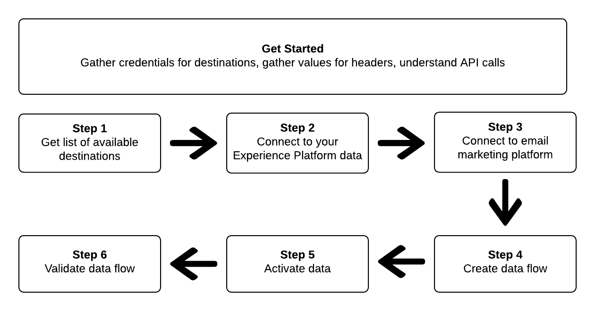
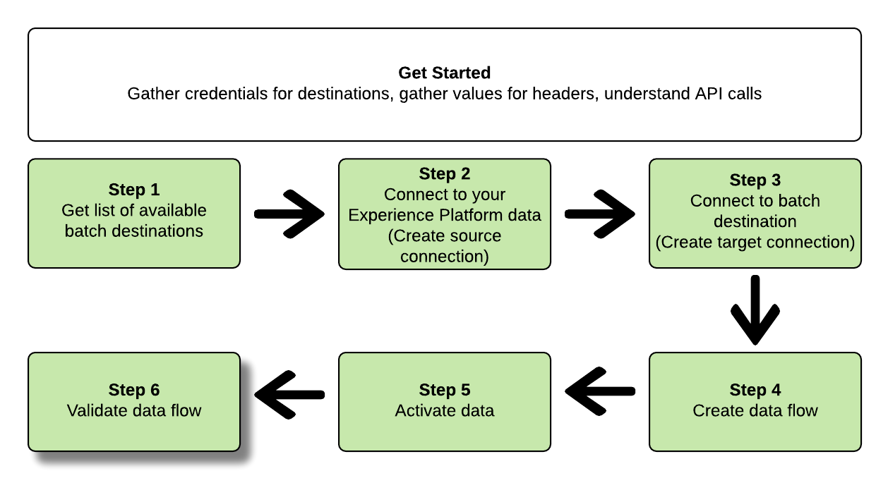

# 使用流量服務API連線至批次目的地並啟動資料

>[!IMPORTANT]
> 
>若要連線至目的地，您需要 **[!UICONTROL 管理目的地]** [存取控制權限](/help/access-control/home.md#permissions).
>
>若要啟用資料，您需要 **[!UICONTROL 管理目的地]**, **[!UICONTROL 啟動目的地]**, **[!UICONTROL 檢視設定檔]**，和 **[!UICONTROL 檢視區段]** [存取控制權限](/help/access-control/home.md#permissions).
>
>閱讀 [存取控制概觀](/help/access-control/ui/overview.md) 或聯絡您的產品管理員以取得所需的權限。

本教學課程示範如何使用流量服務API來建立批次 [雲端儲存](../catalog/cloud-storage/overview.md) 或 [電子郵件行銷目的地](../catalog/email-marketing/overview.md)，請建立資料流至新建立的目的地，並透過CSV檔案將資料匯出至新建立的目的地。

本教學課程使用 [!DNL Adobe Campaign] 目的地，但所有批次雲端儲存空間和電子郵件行銷目的地的步驟都相同。



如果您偏好使用Platform使用者介面連線至目的地並啟用資料，請參閱 [連接目標](../ui/connect-destination.md) 和 [啟用受眾資料以批次設定檔匯出目的地](../ui/activate-batch-profile-destinations.md) 教學課程。

## 快速入門 {#get-started}

本指南需要妥善了解下列Adobe Experience Platform元件：

* [[!DNL Experience Data Model (XDM) System]](../../xdm/home.md):標準化框架 [!DNL Experience Platform] 組織客戶體驗資料。
* [[!DNL Segmentation Service]](../../segmentation/api/overview.md): [!DNL Adobe Experience Platform Segmentation Service] 可讓您在 [!DNL Adobe Experience Platform] 從 [!DNL Real-Time Customer Profile] 資料。
* [[!DNL Sandboxes]](../../sandboxes/home.md): [!DNL Experience Platform] 提供可分割單一沙箱的虛擬沙箱 [!DNL Platform] 例項放入個別的虛擬環境，以協助開發及改進數位體驗應用程式。

以下小節提供您需要了解的其他資訊，以便在Platform中啟動資料至批次目的地。

### 收集所需憑據 {#gather-required-credentials}

若要完成本教學課程中的步驟，您應備妥下列憑證，視您要連線和啟用區段的目的地類型而定。

* 針對 [!DNL Amazon S3] 連接： `accessId`, `secretKey`
* 針對 [!DNL Amazon S3] 連接到 [!DNL Adobe Campaign]: `accessId`, `secretKey`
* 若為SFTP連線： `domain`, `port`, `username`, `password` 或 `sshKey` （視連線至FTP位置的方法而定）
* 針對 [!DNL Azure Blob] 連接： `connectionString`

>[!NOTE]
>
>憑證 `accessId`, `secretKey` for [!DNL Amazon S3] 連線和 `accessId`, `secretKey` for [!DNL Amazon S3] 連接到 [!DNL Adobe Campaign] 是相同的。

### 讀取範例API呼叫 {#reading-sample-api-calls}

本教學課程提供範例API呼叫，以示範如何設定要求格式。 這些功能包括路徑、必要標題和格式正確的請求裝載。 也提供API回應中傳回的範例JSON。 如需範例API呼叫檔案中所使用慣例的相關資訊，請參閱 [如何閱讀API呼叫範例](../../landing/troubleshooting.md#how-do-i-format-an-api-request) 在 [!DNL Experience Platform] 疑難排解指南。

### 收集必要和選用標題的值 {#gather-values-headers}

若要對 [!DNL Platform] API，您必須先完成 [驗證教學課程](https://www.adobe.com/go/platform-api-authentication-en). 完成驗證教學課程會提供所有 [!DNL Experience Platform] API呼叫，如下所示：

* 授權：承載 `{ACCESS_TOKEN}`
* x-api-key: `{API_KEY}`
* x-gw-ims-org-id: `{ORG_ID}`

資源 [!DNL Experience Platform] 可隔離至特定虛擬沙箱。 在 [!DNL Platform] API，您可以指定要進行操作之沙箱的名稱和ID。 這些是選用參數。

* x-sandbox-name: `{SANDBOX_NAME}`

>[!NOTE]
>
>如需中沙箱的詳細資訊，請參閱 [!DNL Experience Platform]，請參閱 [沙箱概述檔案](../../sandboxes/home.md).

所有包含裝載(POST、PUT、PATCH)的請求都需要其他媒體類型標題：

* Content-Type: `application/json`

### API參考檔案 {#api-reference-documentation}

您可在本教學課程中找到隨附的參考檔案，以了解所有API操作。 請參閱 [Adobe I/O上的流量服務API檔案](https://www.adobe.io/experience-platform-apis/references/flow-service/). 建議您同時使用本教學課程和API參考檔案。

## 取得可用目的地的清單 {#get-the-list-of-available-destinations}


首先，您應決定要啟用資料的目標。 若要開始使用，請執行呼叫，以要求可供連線及啟用區段的可用目的地清單。 對執行下列GET要求 `connectionSpecs` 端點，返回可用目的地清單：

**API格式**

```http
GET /connectionSpecs
```

**要求**

```shell
curl --location --request GET 'https://platform.adobe.io/data/foundation/flowservice/connectionSpecs' \
--header 'accept: application/json' \
--header 'x-gw-ims-org-id: {ORG_ID}' \
--header 'x-api-key: {API_KEY}' \
--header 'x-sandbox-name: {SANDBOX_NAME}' \
--header 'Authorization: Bearer {ACCESS_TOKEN}'
```


**回應**

成功的回應包含可用目的地及其唯一識別碼的清單(`id`)。 儲存您打算使用的目的地值，因為後續步驟將需要它。 例如，如果您想要連線並將區段傳送至 [!DNL Adobe Campaign]，在回應中尋找下列程式碼片段：

```json
{
    "id": "0b23e41a-cb4a-4321-a78f-3b654f5d7d97",
  "name": "Adobe Campaign",
  ...
  ...
}
```

下表包含常用批目的地的連接規範ID供參考：

| 目的地 | 連接規範ID |
---------|----------|
| [!DNL Adobe Campaign] | `0b23e41a-cb4a-4321-a78f-3b654f5d7d97` |
| [!DNL Amazon S3] | `4890fc95-5a1f-4983-94bb-e060c08e3f81` |
| [!DNL Azure Blob] | `e258278b-a4cf-43ac-b158-4fa0ca0d948b` |
| [!DNL Oracle Eloqua] | `c1e44b6b-e7c8-404b-9031-58f0ef760604` |
| [!DNL Oracle Responsys] | `a5e28ddf-e265-426e-83a1-9d03a3a6822b` |
| [!DNL Salesforce Marketing Cloud] | `f599a5b3-60a7-4951-950a-cc4115c7ea27` |
| SFTP | `64ef4b8b-a6e0-41b5-9677-3805d1ee5dd0` |

{style="table-layout:auto"}

## 連線至您的 [!DNL Experience Platform] 資料 {#connect-to-your-experience-platform-data}


接下來，您必須連線至 [!DNL Experience Platform] 資料，以便您匯出設定檔資料，並在您偏好的目的地啟用它。 這包含兩個子步驟，如下所述。

1. 首先，您必須執行呼叫，以授權存取 [!DNL Experience Platform]，方法是設定基本連線。
2. 然後，使用基本連線ID，執行您建立 *源連接*，可建立與您的 [!DNL Experience Platform] 資料。

### 授權存取 [!DNL Experience Platform]

**API格式**

```http
POST /connections
```

**要求**

```shell
curl --location --request POST 'https://platform.adobe.io/data/foundation/flowservice/connections' \
--header 'Authorization: Bearer {ACCESS_TOKEN}' \
--header 'x-api-key: {API_KEY}' \
--header 'x-gw-ims-org-id: {ORG_ID}' \
--header 'x-sandbox-name: {SANDBOX_NAME}' \
--header 'Content-Type: application/json' \
--data-raw '{
            "name": "Base connection to Experience Platform",
            "description": "This call establishes the connection to Experience Platform data",
            "connectionSpec": {
                "id": "{CONNECTION_SPEC_ID}",
                "version": "1.0"
            }
}'
```

| 屬性 | 說明 |
| --------- | ----------- |
| `name` | 提供與Experience Platform的基本連接的名稱 [!DNL Profile Store]. |
| `description` | 或者，您可以提供基本連接的說明。 |
| `connectionSpec.id` | 將連接規範ID用於 [Experience Platform設定檔存放區](/help/profile/home.md#profile-data-store) - `8a9c3494-9708-43d7-ae3f-cda01e5030e1`. |

{style="table-layout:auto"}

**回應**

成功的回應包含基本連線的唯一識別碼(`id`)。 在下一步建立源連接時，按需要儲存此值。

```json
{
    "id": "1ed86558-59b5-42f7-9865-5859b552f7f4"
}
```

### 連線至您的 [!DNL Experience Platform] 資料 {#connect-to-platform-data}

**API格式**

```http
POST /sourceConnections
```

**要求**

```shell
curl --location --request POST 'https://platform.adobe.io/data/foundation/flowservice/sourceConnections' \
--header 'Authorization: Bearer {ACCESS_TOKEN}' \
--header 'x-api-key: {API_KEY}' \
--header 'x-gw-ims-org-id: {ORG_ID}' \
--header 'x-sandbox-name: {SANDBOX_NAME}' \
--header 'Content-Type: application/json' \
--data-raw '{
            "name": "Connecting to Profile Store",
            "description": "Optional",
            "connectionSpec": {
                "id": "{CONNECTION_SPEC_ID}",
                "version": "1.0"
            },
            "baseConnectionId": "{BASE_CONNECTION_ID}",
            "data": {
                "format": "CSV",
                "schema": null
            },
            "params" : {}
}'
```

| 屬性 | 說明 |
| --------- | ----------- |
| `name` | 提供與Experience Platform的源連接的名稱 [!DNL Profile Store]. |
| `description` | 或者，您可以提供源連接的說明。 |
| `connectionSpec.id` | 將連接規範ID用於 [Experience Platform設定檔存放區](/help/profile/home.md#profile-data-store) - `8a9c3494-9708-43d7-ae3f-cda01e5030e1`. |
| `baseConnectionId` | 使用您在上一步中取得的基本連線ID。 |
| `data.format` | `CSV` 是目前唯一支援的檔案匯出格式。 |

{style="table-layout:auto"}

**回應**

成功的回應會傳回唯一識別碼(`id`)，將新建立的來源連線 [!DNL Profile Store]. 這可確認您已成功連線至 [!DNL Experience Platform] 資料。 在後續步驟中，視需要儲存此值。

```json
{
    "id": "ed48ae9b-c774-4b6e-88ae-9bc7748b6e97"
}
```

## 連接到批處理目標 {#connect-to-batch-destination}


在此步驟中，您要設定與所需批次雲端儲存空間或電子郵件行銷目的地的連線。 這包含兩個子步驟，如下所述。

1. 首先，您必須透過設定基本連線，執行呼叫以授權存取目的地平台。
2. 然後，使用基本連線ID，您將進行另一個呼叫，在中建立 *目標連線*，指定儲存帳戶中要傳送匯出資料檔案的位置，以及要匯出的資料格式。

### 授權對批目的地的存取 {#authorize-access-to-batch-destination}

**API格式**

```http
POST /connections
```

**要求**

以下請求會建立與 [!DNL Adobe Campaign] 目的地。 根據要將檔案導出到的儲存位置([!DNL Amazon S3]、SFTP、 [!DNL Azure Blob])，保持適當 `auth` 規範和刪除其他。

```shell
curl --location --request POST 'https://platform.adobe.io/data/foundation/flowservice/connections' \
--header 'Authorization: Bearer {ACCESS_TOKEN}' \
--header 'x-api-key: {API_KEY}' \
--header 'x-gw-ims-org-id: {ORG_ID}' \
--header 'x-sandbox-name: {SANDBOX_NAME}' \
--header 'Content-Type: application/json' \
--data-raw '{
    "name": "S3 Connection for Adobe Campaign",
    "description": "summer advertising campaign",
    "connectionSpec": {
        "id": "0b23e41a-cb4a-4321-a78f-3b654f5d7d97",
        "version": "1.0"
    },
    "auth": {
        "specName": "S3",
        "params": {
            "accessId": "{ACCESS_ID}",
            "secretKey": "{SECRET_KEY}"
        }
    }
    "auth": {
        "specName": "SFTP with Password",
        "params": {
            "domain": "{DOMAIN}",
            "host": "{HOST}",
            "username": "{USERNAME}",
            "password": "{PASSWORD}"
        }
    }
    "auth": {
        "specName": "SFTP with SSH Key",
        "params": {
            "domain": "{DOMAIN}",
            "host": "{HOST}",
            "username": "{USERNAME}",
            "sshKey": "{SSH_KEY}"
        }
    }        
    "auth": {
        "specName": "Azure Blob",
        "params": {
            "connectionString": "{AZURE_BLOB_CONNECTION_STRING}"
        }
    }    
}'
```

請參閱以下範例要求，以連線至其他支援的批次雲端儲存空間和電子郵件行銷目的地。

+++ 連線至的範例要求 [!DNL Amazon S3] 目的地

以下請求會建立與 [!DNL Amazon S3] 目的地。

```shell
curl --location --request POST 'https://platform.adobe.io/data/foundation/flowservice/connections' \
--header 'Authorization: Bearer {ACCESS_TOKEN}' \
--header 'x-api-key: {API_KEY}' \
--header 'x-gw-ims-org-id: {ORG_ID}' \
--header 'x-sandbox-name: {SANDBOX_NAME}' \
--header 'Content-Type: application/json' \
--data-raw '{
    "name": "Connect to Amazon S3",
    "description": "summer advertising campaign",
    "connectionSpec": {
        "id": "4890fc95-5a1f-4983-94bb-e060c08e3f81",
        "version": "1.0"
    },
    "auth": {
        "specName": "Access Key",
        "params": {
            "s3AccessKey": "{AMAZON_S3_ACCESS_KEY}",
            "s3SecretKey": "{AMAZON_S3_SECRET_KEY}"
        }
    }
}'
```

+++

+++ 連線至的範例要求 [!DNL Azure Blob] 目的地

以下請求會建立與 [!DNL Azure Blob] 目的地。

```shell
curl --location --request POST 'https://platform.adobe.io/data/foundation/flowservice/connections' \
--header 'Authorization: Bearer {ACCESS_TOKEN}' \
--header 'x-api-key: {API_KEY}' \
--header 'x-gw-ims-org-id: {ORG_ID}' \
--header 'x-sandbox-name: {SANDBOX_NAME}' \
--header 'Content-Type: application/json' \
--data-raw '{
    "name": "Connect to Azure Blob",
    "description": "Summer advertising campaign",
    "connectionSpec": {
        "id": "e258278b-a4cf-43ac-b158-4fa0ca0d948b",
        "version": "1.0"
    },
    "auth": {
        "specName": "ConnectionString",
        "params": {
            "connectionString": "{AZURE_BLOB_CONNECTION_STRING}"
        }
    }
}'
```

+++

+++ 連線至的範例要求 [!DNL Oracle Eloqua] 目的地

以下請求會建立與 [!DNL Oracle Eloqua] 目的地。 根據要將檔案導出到的儲存位置，請保留適當 `auth` 規範和刪除其他。

```shell
curl --location --request POST 'https://platform.adobe.io/data/foundation/flowservice/connections' \
--header 'Authorization: Bearer {ACCESS_TOKEN}' \
--header 'x-api-key: {API_KEY}' \
--header 'x-gw-ims-org-id: {ORG_ID}' \
--header 'x-sandbox-name: {SANDBOX_NAME}' \
--header 'Content-Type: application/json' \
--data-raw '{
    "name": "Connect to Eloqua destination",
    "description": "summer advertising campaign",
    "connectionSpec": {
        "id": "c1e44b6b-e7c8-404b-9031-58f0ef760604",
        "version": "1.0"
    },
    "auth": {
        "specName": "SFTP with Password",
        "params": {
            "domain": "{DOMAIN}",
            "host": "{HOST}",
            "username": "{USERNAME}",
            "password": "{PASSWORD}"
        }
    }
    "auth": {
        "specName": "SFTP with SSH Key",
        "params": {
            "domain": "{DOMAIN}",
            "host": "{HOST}",
            "username": "{USERNAME}",
            "sshKey": "{SSH_KEY}"
        }
    }    
}'
```

+++

+++ 連線至的範例要求 [!DNL Oracle Responsys] 目的地

以下請求會建立與 [!DNL Oracle Responsys] 目的地。 根據要將檔案導出到的儲存位置，請保留適當 `auth` 規範和刪除其他。

```shell
curl --location --request POST 'https://platform.adobe.io/data/foundation/flowservice/connections' \
--header 'Authorization: Bearer {ACCESS_TOKEN}' \
--header 'x-api-key: {API_KEY}' \
--header 'x-gw-ims-org-id: {ORG_ID}' \
--header 'x-sandbox-name: {SANDBOX_NAME}' \
--header 'Content-Type: application/json' \
--data-raw '{
    "name": "Connect to Responsys destination",
    "description": "summer advertising campaign",
    "connectionSpec": {
        "id": "a5e28ddf-e265-426e-83a1-9d03a3a6822b",
        "version": "1.0"
    },
    "auth": {
        "specName": "SFTP with Password",
        "params": {
            "domain": "{DOMAIN}",
            "host": "{HOST}",
            "username": "{USERNAME}",
            "password": "{PASSWORD}"
        }
    }
    "auth": {
        "specName": "SFTP with SSH Key",
        "params": {
            "domain": "{DOMAIN}",
            "host": "{HOST}",
            "username": "{USERNAME}",
            "sshKey": "{SSH_KEY}"
        }
    }    
}'
```

+++

+++ 連線至的範例要求 [!DNL Salesforce Marketing Cloud] 目的地

以下請求會建立與 [!DNL Salesforce Marketing Cloud] 目的地。 根據要將檔案導出到的儲存位置，請保留適當 `auth` 規範和刪除其他。

```shell
curl --location --request POST 'https://platform.adobe.io/data/foundation/flowservice/connections' \
--header 'Authorization: Bearer {ACCESS_TOKEN}' \
--header 'x-api-key: {API_KEY}' \
--header 'x-gw-ims-org-id: {ORG_ID}' \
--header 'x-sandbox-name: {SANDBOX_NAME}' \
--header 'Content-Type: application/json' \
--data-raw '{
    "name": "Connect to Salesforce Marketing Cloud",
    "description": "summer advertising campaign",
    "connectionSpec": {
        "id": "f599a5b3-60a7-4951-950a-cc4115c7ea27",
        "version": "1.0"
    },
    "auth": {
        "specName": "SFTP with Password",
        "params": {
            "domain": "{DOMAIN}",
            "host": "{HOST}",
            "username": "{USERNAME}",
            "password": "{PASSWORD}"
        }
    }
    "auth": {
        "specName": "SFTP with SSH Key",
        "params": {
            "domain": "{DOMAIN}",
            "host": "{HOST}",
            "username": "{USERNAME}",
            "sshKey": "{SSH_KEY}"
        }
    }    
}'
```

+++

+++ 使用密碼目的地連線至SFTP的範例要求

下列請求會建立與SFTP目的地的基本連線。

```shell
curl --location --request POST 'https://platform.adobe.io/data/foundation/flowservice/connections' \
--header 'Authorization: Bearer {ACCESS_TOKEN}' \
--header 'x-api-key: {API_KEY}' \
--header 'x-gw-ims-org-id: {ORG_ID}' \
--header 'x-sandbox-name: {SANDBOX_NAME}' \
--header 'Content-Type: application/json' \
--data-raw '{
    "name": "Connect to SFTP with password",
    "description": "summer advertising campaign",
    "connectionSpec": {
        "id": "64ef4b8b-a6e0-41b5-9677-3805d1ee5dd0",
        "version": "1.0"
    },
    "auth": {
        "specName": "Basic Authentication for sftp",
        "params": {
            "host": "{HOST}",
            "username": "{USERNAME}",
            "password": "{PASSWORD}"
        }
    }
}'
```

+++

| 屬性 | 說明 |
| --------- | ----------- |
| `name` | 提供與批處理目標的基本連接的名稱。 |
| `description` | 或者，您可以提供基本連接的說明。 |
| `connectionSpec.id` | 使用所需批目的地的連接規範ID。 您在步驟中取得此ID [取得可用目的地的清單](#get-the-list-of-available-destinations). |
| `auth.specname` | 指示目標的驗證格式。 要查找目標的specName，請執行 [GET對連接規範端點的調用](https://developer.adobe.com/experience-platform-apis/references/flow-service/#operation/retrieveConnectionSpec)，提供您所需目的地的連線規格。 尋找參數 `authSpec.name` 中。 <br> 例如，若為Adobe Campaign目的地，您可以使用 `S3`, `SFTP with Password`，或 `SFTP with SSH Key`. |
| `params` | 您必鬚根據要連線的目標提供不同的必要驗證參數。 若是Amazon S3連線，您必須提供存取ID和機密金鑰給Amazon S3儲存位置。 <br> 若要找出目的地的必要參數，請執行 [GET對連接規範端點的調用](https://developer.adobe.com/experience-platform-apis/references/flow-service/#operation/retrieveConnectionSpec)，提供您所需目的地的連線規格。 尋找參數 `authSpec.spec.required` 中。 |

{style="table-layout:auto"}

**回應**

成功的回應包含基本連線的唯一識別碼(`id`)。 在下一步建立目標連線時，視需要儲存此值。

```json
{
    "id": "1ed86558-59b5-42f7-9865-5859b552f7f4"
}
```

### 指定儲存位置和資料格式 {#specify-storage-location-data-format}

[!DNL Adobe Experience Platform] 以下格式匯出批次電子郵件行銷和雲端儲存目的地的資料： [!DNL CSV] 檔案。 在此步驟中，您可以決定要匯出檔案的儲存位置路徑。

>[!IMPORTANT]
> 
>[!DNL Adobe Experience Platform] 會自動分割每個檔案500萬筆記錄（列）的匯出檔案。 每一列代表一個設定檔。
>
>拆分檔案名後附加一個數字，表示該檔案是較大導出的一部分，例如： `filename.csv`, `filename_2.csv`, `filename_3.csv`.

**API格式**

```http
POST /targetConnections
```

**要求**

以下請求會建立目標連線 [!DNL Adobe Campaign] 目的地，以確定匯出的檔案將在您的儲存位置中著陸的位置。 根據要將檔案導出到的儲存位置，請保留適當 `params` 規範和刪除其他。

```shell
curl --location --request POST 'https://platform.adobe.io/data/foundation/flowservice/targetConnections' \
--header 'Authorization: Bearer {ACCESS_TOKEN}' \
--header 'x-api-key: {API_KEY}' \
--header 'x-gw-ims-org-id: {ORG_ID}' \
--header 'Content-Type: application/json' \
--data-raw '{
    "name": "TargetConnection for Adobe Campaign",
    "description": "Connection to Adobe Campaign",
    "baseConnectionId": "{BASE_CONNECTION_ID}",
    "connectionSpec": {
        "id": "0b23e41a-cb4a-4321-a78f-3b654f5d7d97",
        "version": "1.0"
    },
    "data": {
        "format": "json",
        "schema": {
            "id": "1.0",
            "version": "1.0"
        }
    },
    "params": {
        "mode": "S3",
        "bucketName": "{BUCKET_NAME}",
        "path": "{FILEPATH}",
        "format": "CSV"
    }
    "params": {
        "mode": "AZURE_BLOB",
        "container": "{CONTAINER}",
        "path": "{FILEPATH}",
        "format": "CSV"
    }
    "params": {
        "mode": "FTP",
        "remotePath": "{REMOTE_PATH}",
        "format": "CSV"
    }        
}'
```

請參閱以下請求範例，為其他支援的批次雲端儲存空間和電子郵件行銷目的地設定儲存位置。

+++ 設定儲存位置的範例請求 [!DNL Amazon S3] 目的地

以下請求會建立目標連線 [!DNL Amazon S3] 目的地，以確定匯出的檔案將在您的儲存位置中著陸的位置。

```shell
curl --location --request POST 'https://platform.adobe.io/data/foundation/flowservice/targetConnections' \
--header 'Authorization: Bearer {ACCESS_TOKEN}' \
--header 'x-api-key: {API_KEY}' \
--header 'x-gw-ims-org-id: {ORG_ID}' \
--header 'Content-Type: application/json' \
--data-raw '{
    "name": "TargetConnection for Amazon S3",
    "description": "Connection to Amazon S3",
    "baseConnectionId": "{BASE_CONNECTION_ID}",
    "connectionSpec": {
        "id": "4890fc95-5a1f-4983-94bb-e060c08e3f81",
        "version": "1.0"
    },
    "data": {
        "format": "json",
        "schema": {
            "id": "1.0",
            "version": "1.0"
        }
    },
    "params": {
        "mode": "S3",
        "bucketName": "{BUCKET_NAME}",
        "path": "{FILEPATH}",
        "format": "CSV"
    }
}'
```

+++

+++ 設定儲存位置的範例請求 [!DNL Azure Blob] 目的地

以下請求會建立目標連線 [!DNL Azure Blob] 目的地，以確定匯出的檔案將在您的儲存位置中著陸的位置。

```shell
curl --location --request POST 'https://platform.adobe.io/data/foundation/flowservice/targetConnections' \
--header 'Authorization: Bearer {ACCESS_TOKEN}' \
--header 'x-api-key: {API_KEY}' \
--header 'x-gw-ims-org-id: {ORG_ID}' \
--header 'Content-Type: application/json' \
--data-raw '{
    "name": "TargetConnection for Azure Blob",
    "description": "Connection to Azure Blob",
    "baseConnectionId": "{BASE_CONNECTION_ID}",
    "connectionSpec": {
        "id": "e258278b-a4cf-43ac-b158-4fa0ca0d948b",
        "version": "1.0"
    },
    "data": {
        "format": "json",
        "schema": {
            "id": "1.0",
            "version": "1.0"
        }
    },
    "params": {
        "mode": "AZURE_BLOB",
        "container": "{CONTAINER}",
        "path": "{FILEPATH}",
        "format": "CSV"
    }
}'
```

+++

+++ 設定儲存位置的範例請求 [!DNL Oracle Eloqua] 目的地

以下請求會建立目標連線 [!DNL Oracle Eloqua] 目的地，以確定匯出的檔案將在您的儲存位置中著陸的位置。 根據要將檔案導出到的儲存位置，請保留適當 `params` 規範和刪除其他。

```shell
curl --location --request POST 'https://platform.adobe.io/data/foundation/flowservice/targetConnections' \
--header 'Authorization: Bearer {ACCESS_TOKEN}' \
--header 'x-api-key: {API_KEY}' \
--header 'x-gw-ims-org-id: {ORG_ID}' \
--header 'Content-Type: application/json' \
--data-raw '{
    "name": "TargetConnection for Oracle Eloqua",
    "description": "Connection to Oracle Eloqua",
    "baseConnectionId": "{BASE_CONNECTION_ID}",
    "connectionSpec": {
        "id": "c1e44b6b-e7c8-404b-9031-58f0ef760604",
        "version": "1.0"
    },
    "data": {
        "format": "json",
        "schema": {
            "id": "1.0",
            "version": "1.0"
        }
    },
    "params": {
        "mode": "S3",
        "bucketName": "{BUCKET_NAME}",
        "path": "{FILEPATH}",
        "format": "CSV"
    }
    "params": {
        "mode": "FTP",
        "remotePath": "{REMOTE_PATH}",
        "format": "CSV"
    }        
}'
```

+++

+++ 設定儲存位置的範例請求 [!DNL Oracle Responsys] 目的地

以下請求會建立目標連線 [!DNL Oracle Responsys] 目的地，以確定匯出的檔案將在您的儲存位置中著陸的位置。 根據要將檔案導出到的儲存位置，請保留適當 `params` 規範和刪除其他。

```shell
curl --location --request POST 'https://platform.adobe.io/data/foundation/flowservice/targetConnections' \
--header 'Authorization: Bearer {ACCESS_TOKEN}' \
--header 'x-api-key: {API_KEY}' \
--header 'x-gw-ims-org-id: {ORG_ID}' \
--header 'Content-Type: application/json' \
--data-raw '{
    "name": "TargetConnection for Oracle Responsys",
    "description": "Connection to Oracle Responsys",
    "baseConnectionId": "{BASE_CONNECTION_ID}",
    "connectionSpec": {
        "id": "a5e28ddf-e265-426e-83a1-9d03a3a6822b",
        "version": "1.0"
    },
    "data": {
        "format": "json",
        "schema": {
            "id": "1.0",
            "version": "1.0"
        }
    },
    "params": {
        "mode": "S3",
        "bucketName": "{BUCKET_NAME}",
        "path": "{FILEPATH}",
        "format": "CSV"
    }
    "params": {
        "mode": "FTP",
        "remotePath": "{REMOTE_PATH}",
        "format": "CSV"
    }        
}'
```

+++

+++ 設定儲存位置的範例請求 [!DNL Salesforce Marketing Cloud] 目的地

以下請求會建立目標連線 [!DNL Salesforce Marketing Cloud] 目的地，以確定匯出的檔案將在您的儲存位置中著陸的位置。 根據要將檔案導出到的儲存位置，請保留適當 `params` 規範和刪除其他。

```shell
curl --location --request POST 'https://platform.adobe.io/data/foundation/flowservice/targetConnections' \
--header 'Authorization: Bearer {ACCESS_TOKEN}' \
--header 'x-api-key: {API_KEY}' \
--header 'x-gw-ims-org-id: {ORG_ID}' \
--header 'Content-Type: application/json' \
--data-raw '{
    "name": "TargetConnection for Salesforce Marketing Cloud",
    "description": "Connection to Salesforce Marketing Cloud",
    "baseConnectionId": "{BASE_CONNECTION_ID}",
    "connectionSpec": {
        "id": "f599a5b3-60a7-4951-950a-cc4115c7ea27",
        "version": "1.0"
    },
    "data": {
        "format": "json",
        "schema": {
            "id": "1.0",
            "version": "1.0"
        }
    },
    "params": {
        "mode": "S3",
        "bucketName": "{BUCKET_NAME}",
        "path": "{FILEPATH}",
        "format": "CSV"
    }
    "params": {
        "mode": "FTP",
        "remotePath": "{REMOTE_PATH}",
        "format": "CSV"
    }        
}'
```

+++

+++ 為SFTP目的地設定儲存位置的請求範例

下列請求會建立與SFTP目的地的目標連線，以判斷匯出的檔案將落在您的儲存位置。

```shell
curl --location --request POST 'https://platform.adobe.io/data/foundation/flowservice/targetConnections' \
--header 'Authorization: Bearer {ACCESS_TOKEN}' \
--header 'x-api-key: {API_KEY}' \
--header 'x-gw-ims-org-id: {ORG_ID}' \
--header 'Content-Type: application/json' \
--data-raw '{
    "name": "TargetConnection for SFTP",
    "description": "Connection to SFTP",
    "baseConnectionId": "{BASE_CONNECTION_ID}",
    "connectionSpec": {
        "id": "64ef4b8b-a6e0-41b5-9677-3805d1ee5dd0",
        "version": "1.0"
    },
    "data": {
        "format": "json",
        "schema": {
            "id": "1.0",
            "version": "1.0"
        }
    },
    "params": {
        "mode": "FTP",
        "remotePath": "{REMOTE_PATH}",
    }
}'
```

+++


| 屬性 | 說明 |
| --------- | ----------- |
| `name` | 提供指向批處理目標的目標連接的名稱。 |
| `description` | 您可以選擇提供目標連線的說明。 |
| `baseConnectionId` | 使用您在上述步驟中建立的基礎連線ID。 |
| `connectionSpec.id` | 使用所需批目的地的連接規範ID。 您在步驟中取得此ID [取得可用目的地的清單](#get-the-list-of-available-destinations). |
| `params` | 根據您連接到的目標，必須為儲存位置提供不同的必需參數。 若是Amazon S3連線，您必須提供存取ID和機密金鑰給Amazon S3儲存位置。 <br> 若要找出目的地的必要參數，請執行 [GET對連接規範端點的調用](https://developer.adobe.com/experience-platform-apis/references/flow-service/#operation/retrieveConnectionSpec)，提供您所需目的地的連線規格。 尋找參數 `targetSpec.spec.required` 中。 |
| `params.mode` | 根據目的地的支援模式，您必須在此處提供不同的值。 若要找出目的地的必要參數，請執行 [GET對連接規範端點的調用](https://developer.adobe.com/experience-platform-apis/references/flow-service/#operation/retrieveConnectionSpec)，提供您所需目的地的連線規格。 尋找參數 `targetSpec.spec.properties.mode.enum` 在回應中，並選取所需的模式。 |
| `params.bucketName` | 對於S3連線，請提供要匯出檔案的貯體名稱。 |
| `params.path` | 對於S3連線，請在要匯出檔案的儲存位置中提供檔案路徑。 |
| `params.format` | `CSV` 是目前唯一支援的檔案匯出類型。 |

{style="table-layout:auto"}

**回應**

成功的回應會傳回唯一識別碼(`id`)，以取得新建立的目標連線。 在後續步驟中，視需要儲存此值。

```json
{
    "id": "12ab90c7-519c-4291-bd20-d64186b62da8"
}
```

## 建立資料流 {#create-dataflow}


使用在前述步驟中獲得的流規範、源連接和目標連接ID，您現在可以在 [!DNL Experience Platform] 資料和要匯出資料檔案的目的地。 將此步驟想像為建立管道，資料稍後將透過管道在之間流動 [!DNL Experience Platform] 和你的目的地。

若要建立資料流，請執行如下所示的POST請求，同時在裝載中提供以下提及的值。

**API格式**

```http
POST /flows
```

**要求**

```shell
curl -X POST \
'https://platform.adobe.io/data/foundation/flowservice/flows' \
-H 'Authorization: Bearer {ACCESS_TOKEN}' \
-H 'x-api-key: {API_KEY}' \
-H 'x-gw-ims-org-id: {ORG_ID}' \
-H 'x-sandbox-name: {SANDBOX_NAME}' \
-H 'Content-Type: application/json' \
-d  '{
   
        "name": "Activate segments to Adobe Campaign",
        "description": "This operation creates a dataflow which we will later use to activate segments to Adobe Campaign",
        "flowSpec": {
            "id": "{FLOW_SPEC_ID}",
            "version": "1.0"
        },
        "sourceConnectionIds": [
            "{SOURCE_CONNECTION_ID}"
        ],
        "targetConnectionIds": [
            "{TARGET_CONNECTION_ID}"
        ],
        "transformations": [
            {
                "name": "GeneralTransform",
                "params": {
                    "segmentSelectors": {
                        "selectors": []
                    },
                    "profileSelectors": {
                        "selectors": []
                    }
                }
            }
        ]
    }
```

| 屬性 | 說明 |
| --------- | ----------- |
| `name` | 提供要建立的資料流的名稱。 |
| `description` | 或者，您可以為資料流提供說明。 |
| `flowSpec.Id` | 為要連接的批處理目標使用流規範ID。 要檢索流規格ID，請對 `flowspecs` 端點，如 [流程規格API參考檔案](https://www.adobe.io/experience-platform-apis/references/flow-service/#operation/retrieveFlowSpec). 在回應中，尋找 `upsTo` 並複製您要連線的批次目的地的對應ID。 例如，若為Adobe Campaign，請尋找 `upsToCampaign` 並複製 `id` 參數。 |
| `sourceConnectionIds` | 使用在步驟中獲得的源連接ID [連線至您的Experience Platform資料](#connect-to-your-experience-platform-data). |
| `targetConnectionIds` | 使用您在步驟中取得的目標連線ID [連接到批處理目標](#connect-to-batch-destination). |
| `transformations` | 在下一個步驟中，您會將要啟動的區段和設定檔屬性填入此區段。 |

下表包含常用批處理目的地的流程規格ID供參考：

| 目的地 | 流規格ID |
---------|----------|
| 所有雲儲存目標([!DNL Amazon S3]、SFTP、 [!DNL Azure Blob])和 [!DNL Oracle Eloqua] | `71471eba-b620-49e4-90fd-23f1fa0174d8` |
| [!DNL Oracle Responsys] | `51d675ce-e270-408d-91fc-22717bdf2148` |
| [!DNL Salesforce Marketing Cloud] | `493b2bd6-26e4-4167-ab3b-5e910bba44f0` |

**回應**

成功的回應會傳回ID(`id`)和 `etag`. 請記下下一個步驟中您需要的這兩個值，以啟用區段和匯出資料檔案。

```json
{
    "id": "8256cfb4-17e6-432c-a469-6aedafb16cd5",
    "etag": "8256cfb4-17e6-432c-a469-6aedafb16cd5"
}
```


## 將資料啟用到新目的地 {#activate-data}


建立了所有連接和資料流後，您現在可以向目標平台激活配置檔案資料。 在此步驟中，您會選取要匯出至目的地的區段以及設定檔屬性。

您也可以決定匯出檔案的檔案命名格式，以及應使用哪些屬性 [去重複化金鑰](../ui/activate-batch-profile-destinations.md#mandatory-keys) 或 [必填屬性](../ui/activate-batch-profile-destinations.md#mandatory-attributes). 在此步驟中，您也可以決定要將資料傳送至目的地的排程。

若要將區段啟用至新目的地，您必須執行JSONPATCH作業，如下列範例所示。 您可以在一個呼叫中啟用多個區段和設定檔屬性。 若要深入了解JSONPATCH，請參閱 [RFC規範](https://tools.ietf.org/html/rfc6902).

**API格式**

```http
PATCH /flows
```

**要求**

```shell
curl --location --request PATCH 'https://platform.adobe.io/data/foundation/flowservice/flows/{DATAFLOW_ID}' \
--header 'Authorization: Bearer {ACCESS_TOKEN}' \
--header 'x-api-key: {API_KEY}' \
--header 'x-gw-ims-org-id: {ORG_ID}' \
--header 'Content-Type: application/json' \
--header 'x-sandbox-name: {SANDBOX_NAME}' \
--header 'If-Match: "{ETAG}"' \
--data-raw '[
    {
        "op": "add",
        "path": "/transformations/0/params/segmentSelectors/selectors/-",
        "value": {
            "type": "PLATFORM_SEGMENT",
            "value": {
                "name": "Name of the segment that you are activating",
                "description": "Description of the segment that you are activating",
                "id": "{SEGMENT_ID}",
                "filenameTemplate": "%DESTINATION_NAME%_%SEGMENT_ID%_%DATETIME(YYYYMMdd_HHmmss)%",
                "exportMode": "DAILY_FULL_EXPORT",
                "schedule": {
                    "frequency": "ONCE",
                    "startDate": "2021-12-20",
                    "startTime": "17:00"
                } 
            }
        }
    },
{
        "op": "add",
        "path": "/transformations/0/params/segmentSelectors/selectors/-",
        "value": {
            "type": "PLATFORM_SEGMENT",
            "value": {
                "name": "Name of the segment that you are activating",
                "description": "Description of the segment that you are activating",
                "id": "{SEGMENT_ID}",
                "filenameTemplate": "%DESTINATION_NAME%_%SEGMENT_ID%_%DATETIME(YYYYMMdd_HHmmss)%",
                "exportMode": "DAILY_FULL_EXPORT",
                "schedule": {
                    "frequency": "ONCE",
                    "triggerType": "SCHEDULED",
                    "startDate": "2021-12-20",
                    "startTime": "17:00"
                },   
            }
        }
    },
{
        "op": "add",
        "path": "/transformations/0/params/profileSelectors/selectors/-",
        "value": {
            "type": "JSON_PATH",
            "value": {
                "path": "{PROFILE_ATTRIBUTE}"
            }
        }
    }
]
```

| 屬性 | 說明 |
| --------- | ----------- |
| `{DATAFLOW_ID}` | 在URL中，使用您在上一步驟中建立的資料流的ID。 |
| `{ETAG}` | 取得 `{ETAG}` 從上一步的回應， [建立資料流](#create-dataflow). 上一步中的回應格式已逸出引號。 您必須在請求標題中使用未逸出的值。 請參閱下列範例： <br> <ul><li>回應範例： `"etag":""7400453a-0000-1a00-0000-62b1c7a90000""`</li><li>要在請求中使用的值： `"etag": "7400453a-0000-1a00-0000-62b1c7a90000"`</li></ul> <br> 每次成功更新資料流時，etag值都會更新。 |
| `{SEGMENT_ID}` | 提供您要匯出至此目的地的區段ID。 若要擷取您要啟用之區段的區段ID，請參閱 [擷取區段定義](https://www.adobe.io/experience-platform-apis/references/segmentation/#operation/retrieveSegmentDefinitionById) 在Experience PlatformAPI參考中。 |
| `{PROFILE_ATTRIBUTE}` | 例如, `"person.lastName"` |
| `op` | 用於定義更新資料流所需操作的操作調用。 操作包括： `add`, `replace`，和 `remove`. 要將段添加到資料流，請使用 `add` 操作。 |
| `path` | 定義要更新的流程的部分。 將段添加到資料流時，請使用示例中指定的路徑。 |
| `value` | 您要用更新參數的新值。 |
| `id` | 指定要添加到目標資料流的段的ID。 |
| `name` | *可選*. 指定要添加到目標資料流的段的名稱。 請注意，此欄位不是必填欄位，您可以在不提供其名稱的情況下成功將段添加到目標資料流。 |
| `filenameTemplate` | 此欄位確定導出到目標的檔案的檔案名格式。 <br> 提供下列選項：: <br> <ul><li>`%DESTINATION_NAME%`: 必要. 匯出的檔案包含目的地名稱。</li><li>`%SEGMENT_ID%`: 必要. 匯出的檔案包含匯出區段的ID。</li><li>`%SEGMENT_NAME%`: 選填. 匯出的檔案包含匯出區段的名稱。</li><li>`DATETIME(YYYYMMdd_HHmmss)` 或 `%TIMESTAMP%`:選填。 為檔案選取這兩個選項之一，以納入Experience Platform產生檔案的時間。</li><li>`custom-text`: 選填. 將此佔位符替換為要在檔案名末尾附加的任何自定義文本。</li></ul> <br> 有關配置檔案名的詳細資訊，請參閱 [配置檔案名](/help/destinations/ui/activate-batch-profile-destinations.md#file-names) 批次目的地啟動教學課程中的一節。 |
| `exportMode` | 必要. 選取「`"DAILY_FULL_EXPORT"`」或「`"FIRST_FULL_THEN_INCREMENTAL"`」。如需這兩個選項的詳細資訊，請參閱 [導出完整檔案](/help/destinations/ui/activate-batch-profile-destinations.md#export-full-files) 和 [導出增量檔案](/help/destinations/ui/activate-batch-profile-destinations.md#export-incremental-files) 在批次目的地啟動教學課程中。 |
| `startDate` | 選取區段應開始將設定檔匯出至目的地的日期。 |
| `frequency` | 必要. <br> <ul><li>若 `"DAILY_FULL_EXPORT"` 導出模式，可以選擇 `ONCE` 或 `DAILY`.</li><li>若 `"FIRST_FULL_THEN_INCREMENTAL"` 導出模式，可以選擇 `"DAILY"`, `"EVERY_3_HOURS"`, `"EVERY_6_HOURS"`, `"EVERY_8_HOURS"`, `"EVERY_12_HOURS"`.</li></ul> |
| `triggerType` | 針對 *批次目的地* 只有。 只有選取 `"DAILY_FULL_EXPORT"` 模式 `frequency` 選取器。 <br> 必要. <br> <ul><li>選擇 `"AFTER_SEGMENT_EVAL"` 讓啟動工作在每日Platform批次分段工作完成後立即執行。 這可確保在啟動工作執行時，最新的設定檔會匯出至您的目的地。</li><li>選擇 `"SCHEDULED"` 以讓啟動作業在固定時間執行。 這可確保Experience Platform設定檔資料會每天同時匯出，但您匯出的設定檔可能不是最新的，具體取決於啟動工作開始前批次分段工作是否已完成。 選取此選項時，您也必須新增 `startTime` 以UTC表示每日出口應發生的時間。</li></ul> |
| `endDate` | 針對 *批次目的地* 只有。 只有在批次檔案匯出目的地(如Amazon S3、SFTP或Azure Blob)中將區段新增至資料流時，才需要此欄位。 <br> 不適用於選擇 `"exportMode":"DAILY_FULL_EXPORT"` 和 `"frequency":"ONCE"`. <br> 設定區段成員停止匯出至目的地的日期。 |
| `startTime` | 針對 *批次目的地* 只有。 只有在批次檔案匯出目的地(如Amazon S3、SFTP或Azure Blob)中將區段新增至資料流時，才需要此欄位。 <br> 必要. 選取何時應產生包含區段成員的檔案並匯出至您的目的地。 |

{style="table-layout:auto"}

>[!TIP]
>
> 請參閱 [更新資料流中段的元件](/help/destinations/api/update-destination-dataflows.md#update-segment) 了解如何更新已匯出區段的各種元件（檔案名稱範本、匯出時間等）。

**回應**

尋找202接受的回應。 未傳回回應內文。 若要驗證要求是否正確，請參閱下一步， [驗證資料流](#validate-dataflow).

## 驗證資料流 {#validate-dataflow}



作為本教學課程的最後一步，您應驗證區段和設定檔屬性確實已正確對應至資料流。

若要驗證，請執行下列GET要求：

**API格式**

```http
GET /flows
```

**要求**

```shell
curl --location --request PATCH 'https://platform.adobe.io/data/foundation/flowservice/flows/{DATAFLOW_ID}' \
--header 'Authorization: Bearer {ACCESS_TOKEN}' \
--header 'x-api-key: {API_KEY}' \
--header 'x-gw-ims-org-id: {ORG_ID}' \
--header 'Content-Type: application/json' \
--header 'x-sandbox-name: prod' \
--header 'If-Match: "{ETAG}"' 
```

* `{DATAFLOW_ID}`:使用上一步中的資料流。
* `{ETAG}`:使用上一步的標籤。

**回應**

傳回的回應應包含在 `transformations` 參數您在上一步驟中提交的區段和設定檔屬性。 範例 `transformations` 回應中的參數可能如下所示：

```json
"transformations":[
   {
      "name":"GeneralTransform",
      "params":{
         "profileSelectors":{
            "selectors":[
               {
                  "type":"JSON_PATH",
                  "value":{
                     "path":"homeAddress.countryCode",
                     "operator":"EXISTS",
                     "mapping":{
                        "sourceType":"text/x.schema-path",
                        "source":"homeAddress.countryCode",
                        "destination":"homeAddress.countryCode",
                        "identity":false,
                        "primaryIdentity":false,
                        "functionVersion":0,
                        "copyModeMapping":false,
                        "sourceAttribute":"homeAddress.countryCode",
                        "destinationXdmPath":"homeAddress.countryCode"
                     }
                  }
               },
               {
                  "type":"JSON_PATH",
                  "value":{
                     "path":"person.name.firstName",
                     "operator":"EXISTS",
                     "mapping":{
                        "sourceType":"text/x.schema-path",
                        "source":"person.name.firstName",
                        "destination":"person.name.firstName",
                        "identity":false,
                        "primaryIdentity":false,
                        "functionVersion":0,
                        "copyModeMapping":false,
                        "sourceAttribute":"person.name.firstName",
                        "destinationXdmPath":"person.name.firstName"
                     }
                  }
               },
               {
                  "type":"JSON_PATH",
                  "value":{
                     "path":"person.name.lastName",
                     "operator":"EXISTS",
                     "mapping":{
                        "sourceType":"text/x.schema-path",
                        "source":"person.name.lastName",
                        "destination":"person.name.lastName",
                        "identity":false,
                        "primaryIdentity":false,
                        "functionVersion":0,
                        "copyModeMapping":false,
                        "sourceAttribute":"person.name.lastName",
                        "destinationXdmPath":"person.name.lastName"
                     }
                  }
               },
               {
                  "type":"JSON_PATH",
                  "value":{
                     "path":"personalEmail.address",
                     "operator":"EXISTS",
                     "mapping":{
                        "sourceType":"text/x.schema-path",
                        "source":"personalEmail.address",
                        "destination":"personalEmail.address",
                        "identity":false,
                        "primaryIdentity":false,
                        "functionVersion":0,
                        "copyModeMapping":false,
                        "sourceAttribute":"personalEmail.address",
                        "destinationXdmPath":"personalEmail.address"
                     }
                  }
               },
               {
                  "type":"JSON_PATH",
                  "value":{
                     "path":"segmentMembership.status",
                     "operator":"EXISTS",
                     "mapping":{
                        "sourceType":"text/x.schema-path",
                        "source":"segmentMembership.status",
                        "destination":"segmentMembership.status",
                        "identity":false,
                        "primaryIdentity":false,
                        "functionVersion":0,
                        "copyModeMapping":false,
                        "sourceAttribute":"segmentMembership.status",
                        "destinationXdmPath":"segmentMembership.status"
                     }
                  }
               }
            ],
            "mandatoryFields":[
               "person.name.firstName",
               "person.name.lastName"
            ],
            "primaryFields":[
               {
                  "fieldType":"ATTRIBUTE",
                  "attributePath":"personalEmail.address"
               }
            ]
         },
         "segmentSelectors":{
            "selectors":[
               {
                  "type":"PLATFORM_SEGMENT",
                  "value":{
                     "id":"9f7d37fd-7039-4454-94ef-2b0cd6c3206a",
                     "name":"Interested in Mountain Biking",
                     "filenameTemplate":"%DESTINATION_NAME%_%SEGMENT_ID%_%DATETIME(YYYYMMdd_HHmmss)%",
                     "exportMode":"DAILY_FULL_EXPORT",
                     "schedule":{
                        "frequency":"ONCE",
                        "startDate":"2021-12-20",
                        "startTime":"17:00"
                     },
                     "createTime":"1640016962",
                     "updateTime":"1642534355"
                  }
               },
               {
                  "type":"PLATFORM_SEGMENT",
                  "value":{
                     "id":"25768be6-ebd5-45cc-8913-12fb3f348613",
                     "name":"Loyalty Segment",
                     "filenameTemplate":"%DESTINATION_NAME%_%SEGMENT_ID%_%DATETIME(YYYYMMdd_HHmmss)%",
                     "exportMode":"FIRST_FULL_THEN_INCREMENTAL",
                     "schedule":{
                        "frequency":"EVERY_6_HOURS",
                        "startDate":"2021-12-22",
                        "endDate":"2021-12-31",
                        "startTime":"17:00"
                     },
                     "createTime":"1640016962",
                     "updateTime":"1642534355"
                  }
               }
            ]
         }
      }
   }
]
```

## API錯誤處理 {#api-error-handling}

本教學課程中的API端點會遵循一般Experience PlatformAPI錯誤訊息原則。 請參閱 [API狀態代碼](/help/landing/troubleshooting.md#api-status-codes) 和 [請求標題錯誤](/help/landing/troubleshooting.md#request-header-errors) 以取得解譯錯誤回應的詳細資訊，請參閱Platform疑難排解指南。

## 後續步驟 {#next-steps}

依照本教學課程，您已成功將Platform連線至您偏好的其中一個批次雲端儲存空間或電子郵件行銷目的地，並將資料流設定至個別目的地以匯出資料檔案。 傳出的資料現在可用於電子郵件促銷活動、目標廣告和許多其他使用案例的目的地。 有關更多詳細資訊，請參閱以下頁面，如如何使用流服務API編輯現有資料流：

* [目的地概觀](../home.md)
* [目的地目錄概觀](../catalog/overview.md)
* [使用流服務API更新目標資料流](../api/update-destination-dataflows.md)
