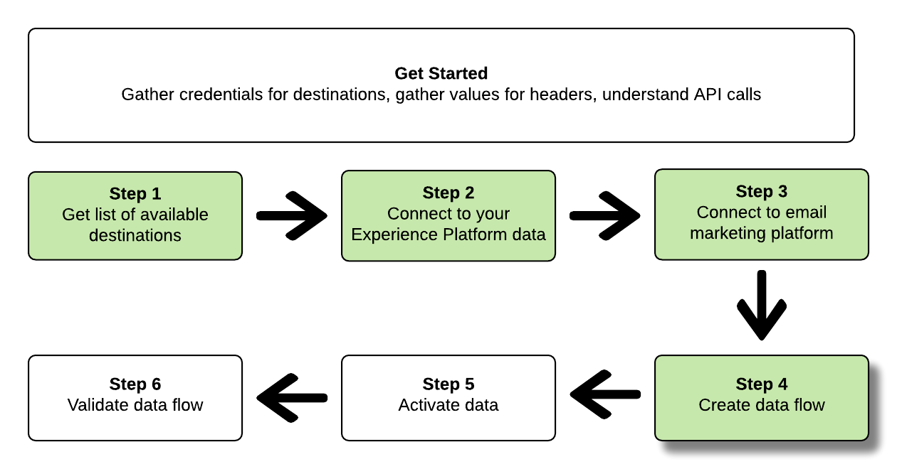

# 使用流量服務API連線至電子郵件行銷目的地並啟用資料

本教學課程示範如何使用API呼叫連線至您的Adobe Experience Platform資料、建立[電子郵件行銷目的地](../catalog/email-marketing/overview.md)、建立資料流至新建立的目的地，以及啟用資料至新建立的目的地。

本教學課程在所有範例中都使用Adobe Campaign目的地，但所有電子郵件行銷目的地的步驟都相同。


如果您偏好使用Platform中的使用者介面來連線目的地並啟用資料，請參閱[連線目的地](../ui/connect-destination.md)和[啟用對象資料至批次設定檔匯出目的地](../ui/activate-batch-profile-destinations.md)教學課程。

## 開始使用

本指南需要妥善了解下列Adobe Experience Platform元件：

* [[!DNL Experience Data Model (XDM) System]](../../xdm/home.md):組織客戶體驗資 [!DNL Experience Platform] 料的標準化架構。
* [[!DNL Catalog Service]](../../catalog/home.md): [!DNL Catalog] 是內用於資料位置和世系的記錄系 [!DNL Experience Platform]統。
* [[!DNL Sandboxes]](../../sandboxes/home.md): [!DNL Experience Platform] 提供可將單一執行個體分割成個 [!DNL Platform] 別虛擬環境的虛擬沙箱，以協助開發及改進數位體驗應用程式。

以下小節提供您需要了解的其他資訊，以便在Platform中啟用資料至電子郵件行銷目的地。

### 收集所需憑據

若要完成本教學課程中的步驟，您應根據您要連線和啟用區段的目的地類型，備妥下列憑證。

* 對於[!DNL Amazon]電子郵件行銷平台的S3連線：`accessId`, `secretKey`
* 若要將SFTP連線連線至電子郵件行銷平台：`domain`、`port`、`username`、`password`或`ssh key`（視連線至FTP位置的方法而定）

### 讀取範例API呼叫

本教學課程提供範例API呼叫，以示範如何設定要求格式。 這些功能包括路徑、必要標題和格式正確的請求裝載。 也提供API回應中傳回的範例JSON。 如需範例API呼叫檔案中所使用慣例的資訊，請參閱[!DNL Experience Platform]疑難排解指南中[如何讀取範例API呼叫](../../landing/troubleshooting.md#how-do-i-format-an-api-request)一節。

### 收集必要和選用標題的值

若要呼叫[!DNL Platform] API，您必須先完成[authentication tutorial](https://www.adobe.com/go/platform-api-authentication-en)。 完成驗證教學課程後，將提供所有[!DNL Experience Platform] API呼叫中每個必要標題的值，如下所示：

* 授權：承載`{ACCESS_TOKEN}`
* x-api-key: `{API_KEY}`
* x-gw-ims-org-id: `{IMS_ORG}`

[!DNL Experience Platform]中的資源可以隔離至特定虛擬沙箱。 在[!DNL Platform] API的請求中，您可以指定要執行操作之沙箱的名稱和ID。 這些是選用參數。

* x-sandbox-name: `{SANDBOX_NAME}`

>[!NOTE]
>
>如需[!DNL Experience Platform]中沙箱的詳細資訊，請參閱[沙箱概觀檔案](../../sandboxes/home.md)。

所有包含裝載(POST、PUT、PATCH)的請求都需要其他媒體類型標題：

* Content-Type: `application/json`

### Swagger檔案

您可以在Swagger中找到本教學課程中所有API呼叫的隨附參考檔案。 請參閱[Adobe I/O](https://www.adobe.io/apis/experienceplatform/home/api-reference.html#!acpdr/swagger-specs/flow-service.yaml)上的流量服務API檔案。 建議您同時使用本教學課程和Swagger檔案頁面。

## 取得可用目的地的清單 {#get-the-list-of-available-destinations}


首先，您應決定要啟用資料的電子郵件行銷目的地。 若要開始使用，請執行呼叫，以要求可供連線及啟用區段的可用目的地清單。 向`connectionSpecs`端點執行以下GET請求以返回可用目的地清單：

**API格式**

```http
GET /connectionSpecs
```

**要求**

<!--

```shell
curl -X GET \
    'http://platform.adobe.io/data/foundation/flowservice/connectionSpecs' \
    -H 'Authorization: Bearer {ACCESS_TOKEN}' \
    -H 'x-api-key: {API_KEY}' \
    -H 'x-gw-ims-org-id: {IMS_ORG}' \
    -H 'x-sandbox-name: {SANDBOX_NAME}' \
    -H 'x-sandbox-id: {SANDBOX_ID}' \    
    -H 'Content-Type: application/json' \
```

-->

```shell
curl --location --request GET 'https://platform.adobe.io/data/foundation/flowservice/connectionSpecs' \
--header 'accept: application/json' \
--header 'x-gw-ims-org-id: {IMS_ORG}' \
--header 'x-api-key: {API_KEY}' \
--header 'x-sandbox-name: {SANDBOX_NAME}' \
--header 'Authorization: Bearer {ACCESS_TOKEN}'
```


**回應**

成功的回應包含可用目的地及其唯一識別碼的清單(`id`)。 儲存您打算使用的目的地值，因為後續步驟將需要它。 例如，如果您想要連線並將區段傳送至Adobe Campaign，請在回應中尋找下列程式碼片段：

```json
{
    "id": "0b23e41a-cb4a-4321-a78f-3b654f5d7d97",
  "name": "Adobe Campaign",
  ...
  ...
}
```

## 連接到[!DNL Experience Platform]資料 {#connect-to-your-experience-platform-data}


接下來，您必須連線至您的[!DNL Experience Platform]資料，以便匯出設定檔資料並在您偏好的目的地啟用它。 這包含兩個子步驟，如下所述。

1. 首先，您必須通過設定基本連接來執行呼叫，以授權[!DNL Experience Platform]中對資料的訪問。
2. 然後，使用基本連接ID，將進行另一個呼叫，在其中建立源連接，該連接將建立與[!DNL Experience Platform]資料的連接。


### 授權[!DNL Experience Platform]中的資料存取權

**API格式**

```http
POST /connections
```

**要求**

<!--

```shell
curl -X POST \
    'http://platform.adobe.io/data/foundation/flowservice/connections' \
    -H 'Authorization: Bearer {ACCESS_TOKEN}' \
    -H 'x-api-key: {API_KEY}' \
    -H 'x-gw-ims-org-id: {IMS_ORG}' \
    -H 'x-sandbox-name: {SANDBOX_NAME}' \
    -H 'x-sandbox-id: {SANDBOX_ID}' \ 
    -H 'Content-Type: application/json' \
    -d  '{
            
            "name": "Base connection to Experience Platform",
            "description": "This call establishes the connection to Experience Platform data",
            "connectionSpec": {
                "id": "{CONNECTION_SPEC}",
                "version": "1.0"
            }
           }'
```

-->

```shell
curl --location --request POST 'https://platform.adobe.io/data/foundation/flowservice/connections' \
--header 'Authorization: Bearer {ACCESS_TOKEN}' \
--header 'x-api-key: {API_KEY}' \
--header 'x-gw-ims-org-id: {IMS_ORG}' \
--header 'x-sandbox-name: {SANDBOX_NAME}' \
--header 'Content-Type: application/json' \
--data-raw '{
            "name": "Base connection to Experience Platform",
            "description": "This call establishes the connection to Experience Platform data",
            "connectionSpec": {
                "id": "{CONNECTION_SPEC_ID}",
                "version": "1.0"
            }
}'
```


* `{CONNECTION_SPEC_ID}`:使用配置檔案服務的連接規範ID  `8a9c3494-9708-43d7-ae3f-cda01e5030e1`。

**回應**

成功的響應包含基本連接的唯一標識符(`id`)。 在下一步建立源連接時，按需要儲存此值。

```json
{
    "id": "1ed86558-59b5-42f7-9865-5859b552f7f4"
}
```

### 連接到[!DNL Experience Platform]資料 {#connect-to-platform-data}

**API格式**

```http
POST /sourceConnections
```

**要求**

<!--

```shell
curl -X POST \
    'http://platform.adobe.io/data/foundation/flowservice/sourceConnections' \
    -H 'Authorization: Bearer {ACCESS_TOKEN}' \
    -H 'x-api-key: {API_KEY}' \
    -H 'x-gw-ims-org-id: {IMS_ORG}' \
    -H 'x-sandbox-id: {SANDBOX_ID}' \ 
    -H 'x-sandbox-name: {SANDBOX_NAME}' \
    -H 'Content-Type: application/json' \
    -d  '{
  "name": "Connecting to Profile Service",
  "description": "Optional",
  "baseConnectionId": "{BASE_CONNECTION_ID}",
  "connectionSpec": {
    "id": "{CONNECTION_SPEC}",
    "version": "1.0"
  },
  "data": {
    "format": "CSV",
    "schema": null
  }
  }
```

-->

```shell
curl --location --request POST 'https://platform.adobe.io/data/foundation/flowservice/sourceConnections' \
--header 'Authorization: Bearer {ACCESS_TOKEN}' \
--header 'x-api-key: {API_KEY}' \
--header 'x-gw-ims-org-id: {IMS_ORG}' \
--header 'x-sandbox-name: {SANDBOX_NAME}' \
--header 'Content-Type: application/json' \
--data-raw '{
            "name": "Connecting to Profile Service",
            "description": "Optional",
            "connectionSpec": {
                "id": "{CONNECTION_SPEC_ID}",
                "version": "1.0"
            },
            "baseConnectionId": "{BASE_CONNECTION_ID}",
            "data": {
                "format": "CSV",
                "schema": null
            },
            "params" : {}
}'
```

* `{BASE_CONNECTION_ID}`:使用您在上一步中取得的ID。
* `{CONNECTION_SPEC_ID}`:將連接規範ID用 [!DNL Profile Service] 於 —  `8a9c3494-9708-43d7-ae3f-cda01e5030e1`。

**回應**

成功的響應返回新建立的源連接到[!DNL Profile Service]的唯一標識符(`id`)。 這可確認您已成功連接[!DNL Experience Platform]資料。 在後續步驟中，視需要儲存此值。

```json
{
    "id": "ed48ae9b-c774-4b6e-88ae-9bc7748b6e97"
}
```


## 連線至電子郵件行銷目的地 {#connect-to-email-marketing-destination}


在此步驟中，您會設定與所需電子郵件行銷目的地的連線。 這包含兩個子步驟，如下所述。

1. 首先，您必須透過設定基本連線，執行呼叫以授權存取電子郵件服務提供者。
2. 然後，使用基本連接ID，您將進行另一個呼叫，在其中建立目標連接，指定儲存帳戶中要傳送匯出資料的位置，以及要匯出的資料格式。

### 授權存取電子郵件行銷目的地

**API格式**

```http
POST /connections
```

**要求**

<!--

```shell
curl -X POST \
    'http://platform.adobe.io/data/foundation/flowservice/connections' \
    -H 'Authorization: Bearer {ACCESS_TOKEN}' \
    -H 'x-api-key: {API_KEY}' \
    -H 'x-gw-ims-org-id: {IMS_ORG}' \
    -H 'x-sandbox-name: {SANDBOX_NAME}' \
    -H 'x-sandbox-id: {SANDBOX_ID}' \ 
    -H 'Content-Type: application/json' \
    -d  '{
            
            "name": "S3 Connection for Adobe Campaign",
            "description": "ACME company holiday campaign",
            "connectionSpec": {
                "id": "{CONNECTION_SPEC}",
                "version": "1.0"
            },
            "auth": {
                "specName": "{S3 or SFTP}",
                "params": {
                    "accessId": "{ACCESS_ID}",
                    "secretKey": "{SECRET_KEY}"
                }
            }
           }'
```

-->

```shell
curl --location --request POST 'https://platform.adobe.io/data/foundation/flowservice/connections' \
--header 'Authorization: Bearer {ACCESS_TOKEN}' \
--header 'x-api-key: {API_KEY}' \
--header 'x-gw-ims-org-id: {IMS_ORG}' \
--header 'x-sandbox-name: {SANDBOX_NAME}' \
--header 'Content-Type: application/json' \
--data-raw '{
    "name": "S3 Connection for Adobe Campaign",
    "description": "summer advertising campaign",
    "connectionSpec": {
        "id": "{_CONNECTION_SPEC_ID}",
        "version": "1.0"
    },
    "auth": {
        "specName": "{S3 or SFTP}",
        "params": {
            "accessId": "{ACCESS_ID}",
            "secretKey": "{SECRET_KEY}"
        }
    }
}'
```

* `{CONNECTION_SPEC_ID}`:使用在獲取可用目的地清單中 [獲得的連接規範ID](#get-the-list-of-available-destinations)。
* `{S3 or SFTP}`:填寫此目的地所需的連線類型。在[目的地目錄](../catalog/overview.md)中，捲動至您偏好的目的地，查看是否支援S3和/或SFTP連線類型。
* `{ACCESS_ID}`:S3儲存位置 [!DNL Amazon] 的存取ID。
* `{SECRET_KEY}`:S3儲存位置的 [!DNL Amazon] 機密金鑰。

**回應**

成功的響應包含基本連接的唯一標識符(`id`)。 在下一步建立目標連線時，視需要儲存此值。

```json
{
    "id": "1ed86558-59b5-42f7-9865-5859b552f7f4"
}
```

### 指定儲存位置和資料格式

[!DNL Adobe Experience Platform] 以檔案形式匯出電子郵件行銷和雲端儲存目的地的 [!DNL CSV] 資料。

>[!IMPORTANT]
> 
>[!DNL Adobe Experience Platform] 會自動分割每個檔案500萬筆記錄（列）的匯出檔案。每一列代表一個設定檔。
>
>拆分檔案名後附加一個數字，表示該檔案是較大導出的一部分，例如：`filename.csv`、`filename_2.csv`、`filename_3.csv`。

**API格式**

```http
POST /targetConnections
```

**要求**

<!--

```shell
curl -X POST \
    'http://platform.adobe.io/data/foundation/flowservice/targetConnections' \
    -H 'Authorization: Bearer {ACCESS_TOKEN}' \
    -H 'x-api-key: {API_KEY}' \
    -H 'x-gw-ims-org-id: {IMS_ORG}' \
    -H 'x-sandbox-name: {SANDBOX_NAME}' \    
    -H 'x-sandbox-id: {SANDBOX_ID}' \ 
    -H 'Content-Type: application/json' \
    -d  '{
   "baseConnectionId": "{BASE_CONNECTION_ID}",
   "name": "TargetConnection for Adobe Campaign",
   "data": {
       "format": "CSV",
       "schema": {
           "id": "1.0",
           "version": "1.0"
       },
    "connectionSpec": {
    "id": "{CONNECTION_SPEC_ID}",
    "version": "1.0"
   },
   "params": {
       "mode": "S3",
       "bucketName": "{BUCKETNAME}",
       "path": "{FILEPATH}"
    }
    }
```

-->

```shell
curl --location --request POST 'https://platform.adobe.io/data/foundation/flowservice/targetConnections' \
--header 'Authorization: Bearer {ACCESS_TOKEN}' \
--header 'x-api-key: {API_KEY}' \
--header 'x-gw-ims-org-id: {IMS_ORG}' \
--header 'Content-Type: application/json' \
--data-raw '{
    "name": "TargetConnection for Adobe Campaign",
    "description": "Connection to Adobe Campaign",
    "baseConnectionId": "{BASE_CONNECTION_ID}",
    "connectionSpec": {
        "id": "{CONNECTION_SPEC_ID}",
        "version": "1.0"
    },
    "data": {
        "format": "json",
        "schema": {
            "id": "1.0",
            "version": "1.0"
        }
    },
    "params": {
        "mode": "S3",
        "bucketName": "{BUCKETNAME}",
        "path": "{FILEPATH}",
        "format": "CSV"
    }
}'
```

* `{BASE_CONNECTION_ID}`:使用您在上述步驟中取得的基本連線ID。
* `{CONNECTION_SPEC_ID}`:使用在獲取可用目的地清單 [中獲得的連接規格](#get-the-list-of-available-destinations)。
* `{BUCKETNAME}`:您 [!DNL Amazon] 的S3貯體，Platform會將資料匯出存放於此處。
* `{FILEPATH}`:Platform將存放 [!DNL Amazon] 資料匯出的S3儲存貯體目錄中的路徑。

**回應**

成功的回應會傳回新建立之目標連線的唯一識別碼(`id`)，以連線至您的電子郵件行銷目的地。 在後續步驟中，視需要儲存此值。

```json
{
    "id": "12ab90c7-519c-4291-bd20-d64186b62da8"
}
```

## 建立資料流



您現在可以使用在前述步驟中取得的ID，在[!DNL Experience Platform]資料和要啟用資料的目標之間建立資料流。 請將此步驟想像為建構管道，資料稍後會透過管道在[!DNL Experience Platform]和您想要的目的地之間流動。

若要建立資料流，請執行POST請求，如下所示，同時在裝載中提供以下提及的值。

執行以下POST請求以建立資料流。

**API格式**

```http
POST /flows
```

**要求**

```shell
curl -X POST \
'https://platform.adobe.io/data/foundation/flowservice/flows' \
-H 'Authorization: Bearer {ACCESS_TOKEN}' \
-H 'x-api-key: {API_KEY}' \
-H 'x-gw-ims-org-id: {IMS_ORG}' \
-H 'x-sandbox-name: {SANDBOX_NAME}' \
-H 'Content-Type: application/json' \
-d  '{
   
        "name": "Activate segments to Adobe Campaign",
        "description": "This operation creates a dataflow which we will later use to activate segments to Adobe Campaign",
        "flowSpec": {
            "id": "{FLOW_SPEC_ID}",
            "version": "1.0"
        },
        "sourceConnectionIds": [
            "{SOURCE_CONNECTION_ID}"
        ],
        "targetConnectionIds": [
            "{TARGET_CONNECTION_ID}"
        ],
        "transformations": [
            {
                "name": "GeneralTransform",
                "params": {
                    "segmentSelectors": {
                        "selectors": []
                    },
                    "profileSelectors": {
                        "selectors": []
                    }
                }
            }
        ]
    }
```

* `{FLOW_SPEC_ID}`:使用您要連線之電子郵件行銷目的地的流程。要獲取流規範，請對`flowspecs`端點執行GET操作。 請參閱以下的Swagger檔案：https://platform.adobe.io/data/foundation/flowservice/swagger#/Flow%20Specs%20API/getFlowSpecs。 在回應中，尋找`upsTo`並複製您要連線之電子郵件行銷目的地的對應ID。 例如，若為Adobe Campaign，請尋找`upsToCampaign`並複製`id`參數。
* `{SOURCE_CONNECTION_ID}`:使用在「連線至您的Experience Platform」步驟中 [取得的來源連線ID](#connect-to-your-experience-platform-data)。
* `{TARGET_CONNECTION_ID}`:使用您在連線至電子郵件行銷目的地 [步驟中取得的目標連線ID](#connect-to-email-marketing-destination)。

**回應**

成功的響應返回新建立的資料流的ID(`id`)和`etag`。 請記下這兩個值。 如同您在下一步中啟動區段時一樣。

```json
{
    "id": "8256cfb4-17e6-432c-a469-6aedafb16cd5",
    "etag": "8256cfb4-17e6-432c-a469-6aedafb16cd5"
}
```


## 將資料啟用到新目的地


建立了所有連線和資料流程後，您就可以將設定檔資料啟用至電子郵件行銷平台。 在此步驟中，您可以選取要傳送至目的地的區段以及設定檔屬性，並可排程及傳送資料至目的地。

若要將區段啟用至新目的地，您必須執行JSONPATCH作業，如下列範例所示。 您可以在一個呼叫中啟用多個區段和設定檔屬性。 若要深入了解JSONPATCH，請參閱[RFC規格](https://tools.ietf.org/html/rfc6902)。

**API格式**

```http
PATCH /flows
```

**要求**

```shell
curl --location --request PATCH 'https://platform.adobe.io/data/foundation/flowservice/flows/{DATAFLOW_ID}' \
--header 'Authorization: Bearer {ACCESS_TOKEN}' \
--header 'x-api-key: {API_KEY}' \
--header 'x-gw-ims-org-id: {IMS_ORG}' \
--header 'Content-Type: application/json' \
--header 'x-sandbox-name: {SANDBOX_NAME}' \
--header 'If-Match: "{ETAG}"' \
--data-raw '[
    {
        "op": "add",
        "path": "/transformations/0/params/segmentSelectors/selectors/-",
        "value": {
            "type": "PLATFORM_SEGMENT",
            "value": {
                "name": "Name of the segment that you are activating",
                "description": "Description of the segment that you are activating",
                "id": "{SEGMENT_ID}"
            }
        }
    },
        {
        "op": "add",
        "path": "/transformations/0/params/segmentSelectors/selectors/-",
        "value": {
            "type": "PLATFORM_SEGMENT",
            "value": {
                "name": "Name of the segment that you are activating",
                "description": "Description of the segment that you are activating",
                "id": "{SEGMENT_ID}"
            }
        }
    },
        {
        "op": "add",
        "path": "/transformations/0/params/profileSelectors/selectors/-",
        "value": {
            "type": "JSON_PATH",
            "value": {
                "operator": "EXISTS",
                "path": "{PROFILE_ATTRIBUTE}"
            }
        }
    }
]
```

* `{DATAFLOW_ID}`:使用您在上一步驟中取得的資料流。
* `{ETAG}`:使用您在上一步驟中取得的標籤。
* `{SEGMENT_ID}`:提供您要匯出至此目的地的區段ID。若要擷取您要啟用之區段的區段ID，請前往&#x200B;**https://www.adobe.io/apis/experienceplatform/home/api-reference.html#/**，在左側導覽功能表中選取&#x200B;**[!UICONTROL 分段服務API]**，然後在&#x200B;**[!UICONTROL 區段定義]**&#x200B;中尋找`GET /segment/definitions`操作。
* `{PROFILE_ATTRIBUTE}`: 例如, `"person.lastName"`

**回應**

尋找202 OK回應。 未傳回回應內文。 若要驗證請求是否正確，請參閱下一步「驗證資料流」。

## 驗證資料流


作為本教學課程的最後一步，您應驗證區段和設定檔屬性確實已正確對應至資料流。

若要驗證，請執行下列GET要求：

**API格式**

```http
GET /flows
```

**要求**

```shell
curl --location --request PATCH 'https://platform.adobe.io/data/foundation/flowservice/flows/{DATAFLOW_ID}' \
--header 'Authorization: Bearer {ACCESS_TOKEN}' \
--header 'x-api-key: {API_KEY}' \
--header 'x-gw-ims-org-id: {IMS_ORG}' \
--header 'Content-Type: application/json' \
--header 'x-sandbox-name: prod' \
--header 'If-Match: "{ETAG}"' 
```

* `{DATAFLOW_ID}`:使用上一步的資料流。
* `{ETAG}`:使用上一步的標籤。

**回應**

傳回的回應應包含在`transformations`參數中，亦即您在上一步驟中提交的區段和設定檔屬性。 回應中的範例`transformations`參數可能如下所示：

```json
"transformations": [
    {
        "name": "GeneralTransform",
        "params": {
            "profileSelectors": {
                "selectors": []
            },
            "segmentSelectors": {
                "selectors": [
                    {
                        "type": "PLATFORM_SEGMENT",
                        "value": {
                            "name": "Men over 50",
                            "description": "",
                            "id": "72ddd79b-6b0a-4e97-a8d2-112ccd81bd02"
                        }
                    }
                ]
            }
        }
    }
],
```

## 後續步驟

依照本教學課程，您已成功將Platform連線至您偏好的其中一個電子郵件行銷目的地，並將資料流設定至個別目的地。 傳出的資料現在可用於電子郵件促銷活動、目標廣告和許多其他使用案例的目的地。 如需詳細資訊，請參閱下列頁面：

* [目的地概觀](../home.md)
* [目的地目錄概觀](../catalog/overview.md)
