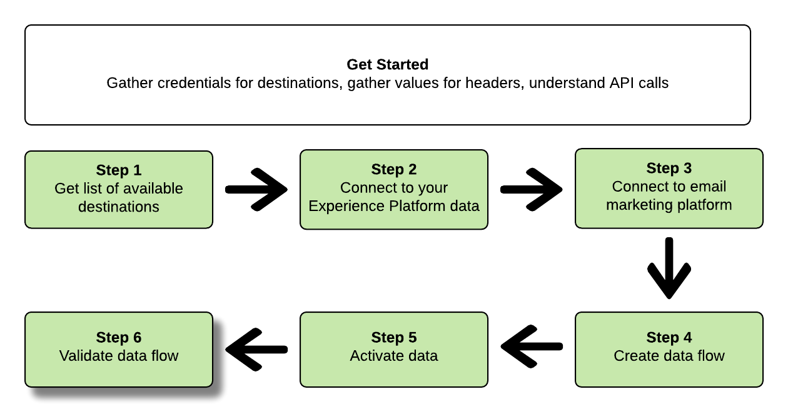

# 使用Flow Service API連線至電子郵件行銷目的地並啟用資料

本教學課程示範如何使用API呼叫來連線至您的Adobe Experience Platform資料、建立[電子郵件行銷目標](../catalog/email-marketing/overview.md)、建立資料流至您新建立的目標，以及啟用資料至您新建立的目標。

本教學課程在所有範例中都使用Adobe Campaign目的地，但所有電子郵件行銷目的地的步驟都相同。


如果您偏好使用平台中的使用者介面來連接目標並啟用資料，請參閱[連接目標](../ui/connect-destination.md)和[啟動描述檔和區段至目標](../ui/activate-destinations.md)教學課程。

## 快速入門

本指南需要對Adobe Experience Platform的下列組成部分有切實的瞭解：

* [[!DNL Experience Data Model (XDM) System]](../../xdm/home.md):組織客戶體驗資 [!DNL Experience Platform] 料的標準化架構。
* [[!DNL Catalog Service]](../../catalog/home.md): [!DNL Catalog] 是資料位置和世系的記錄系統 [!DNL Experience Platform]。
* [[!DNL Sandboxes]](../../sandboxes/home.md): [!DNL Experience Platform] 提供虛擬沙盒，可將單一執行個體分 [!DNL Platform] 割為不同的虛擬環境，以協助開發和發展數位體驗應用程式。

以下各節提供您需要瞭解的其他資訊，以便將資料啟動至平台中的電子郵件行銷目的地。

### 收集必要的認證

要完成本教學課程中的步驟，您應準備好下列憑證，這取決於您要連接和啟用區段的目標類型。

* 對於[!DNL Amazon] S3連線至電子郵件行銷平台：`accessId`, `secretKey`
* 對於電子郵件行銷平台的SFTP連線：`domain`、`port`、`username`、`password`或`ssh key`（視FTP位置的連線方法而定）

### 讀取範例API呼叫

本教學課程提供範例API呼叫，以示範如何設定請求的格式。 這些包括路徑、必要標題和正確格式化的請求負載。 也提供API回應中傳回的範例JSON。 如需範例API呼叫檔案中所用慣例的詳細資訊，請參閱[!DNL Experience Platform]疑難排解指南中[如何讀取範例API呼叫](../../landing/troubleshooting.md#how-do-i-format-an-api-request)一節。

### 收集必要和選用標題的值

若要呼叫[!DNL Platform] API，您必須先完成[驗證教學課程](https://www.adobe.com/go/platform-api-authentication-en)。 完成驗證教學課程後，所有[!DNL Experience Platform] API呼叫中每個所需標題的值都會顯示在下面：

* 授權：載體`{ACCESS_TOKEN}`
* x-api-key:`{API_KEY}`
* x-gw-ims-org-id:`{IMS_ORG}`

[!DNL Experience Platform]中的資源可以隔離到特定的虛擬沙盒。 在對[!DNL Platform] API的請求中，您可以指定要進行操作的沙盒的名稱和ID。 這些是可選參數。

* x-sandbox-name:`{SANDBOX_NAME}`

>[!NOTE]
>
>如需[!DNL Experience Platform]中沙盒的詳細資訊，請參閱[沙盒概述檔案](../../sandboxes/home.md)。

所有包含裝載(POST、PUT、PATCH)的請求都需要附加的媒體類型標題：

* Content-Type: `application/json`

### Swagger檔案

您可在Swagger的本教學課程中，找到所有API呼叫的隨附參考檔案。 請參閱Adobe I/O](https://www.adobe.io/apis/experienceplatform/home/api-reference.html#!acpdr/swagger-specs/flow-service.yaml)上的[Flow Service API文檔。 建議您同時使用本教學課程和Swagger檔案頁面。

## 獲取可用目的地清單{#get-the-list-of-available-destinations}


首先，您應決定要啟動資料的電子郵件行銷目標。 首先，請執行呼叫以請求可連接並啟用區段至的可用目的地清單。 對`connectionSpecs`端點執行以下GET請求以返回可用目標清單：

**API格式**

```http
GET /connectionSpecs
```

**請求**

<!--

```shell
curl -X GET \
    'http://platform.adobe.io/data/foundation/flowservice/connectionSpecs' \
    -H 'Authorization: Bearer {ACCESS_TOKEN}' \
    -H 'x-api-key: {API_KEY}' \
    -H 'x-gw-ims-org-id: {IMS_ORG}' \
    -H 'x-sandbox-name: {SANDBOX_NAME}' \
    -H 'x-sandbox-id: {SANDBOX_ID}' \    
    -H 'Content-Type: application/json' \
```

-->

```shell
curl --location --request GET 'https://platform.adobe.io/data/foundation/flowservice/connectionSpecs' \
--header 'accept: application/json' \
--header 'x-gw-ims-org-id: {IMS_ORG}' \
--header 'x-api-key: {API_KEY}' \
--header 'x-sandbox-name: {SANDBOX_NAME}' \
--header 'Authorization: Bearer {ACCESS_TOKEN}'
```


**回應**

成功的響應包含可用目標及其唯一標識符的清單(`id`)。 儲存您計畫使用之目的地的值，因為後續步驟中將會要求它。 例如，如果您想要連線區段並傳送至Adobe Campaign，請在回應中尋找下列程式碼片段：

```json
{
    "id": "0b23e41a-cb4a-4321-a78f-3b654f5d7d97",
  "name": "Adobe Campaign",
  ...
  ...
}
```

## 連接到[!DNL Experience Platform]資料{#connect-to-your-experience-platform-data}


接著，您必須連線至您的[!DNL Experience Platform]資料，以便匯出描述檔資料並在您偏好的目的地啟用它。 這包括兩個子步驟，如下所述。

1. 首先，您必須通過設定基本連接，執行對[!DNL Experience Platform]中資料的授權訪問調用。
2. 然後，使用基本連接ID，您將進行另一次調用，在其中建立源連接，該連接將建立與[!DNL Experience Platform]資料的連接。


### 授權存取[!DNL Experience Platform]中的資料

**API格式**

```http
POST /connections
```

**請求**

<!--

```shell
curl -X POST \
    'http://platform.adobe.io/data/foundation/flowservice/connections' \
    -H 'Authorization: Bearer {ACCESS_TOKEN}' \
    -H 'x-api-key: {API_KEY}' \
    -H 'x-gw-ims-org-id: {IMS_ORG}' \
    -H 'x-sandbox-name: {SANDBOX_NAME}' \
    -H 'x-sandbox-id: {SANDBOX_ID}' \ 
    -H 'Content-Type: application/json' \
    -d  '{
            
            "name": "Base connection to Experience Platform",
            "description": "This call establishes the connection to Experience Platform data",
            "connectionSpec": {
                "id": "{CONNECTION_SPEC}",
                "version": "1.0"
            }
           }'
```

-->

```shell
curl --location --request POST 'https://platform.adobe.io/data/foundation/flowservice/connections' \
--header 'Authorization: Bearer {ACCESS_TOKEN}' \
--header 'x-api-key: {API_KEY}' \
--header 'x-gw-ims-org-id: {IMS_ORG}' \
--header 'x-sandbox-name: {SANDBOX_NAME}' \
--header 'Content-Type: application/json' \
--data-raw '{
            "name": "Base connection to Experience Platform",
            "description": "This call establishes the connection to Experience Platform data",
            "connectionSpec": {
                "id": "{CONNECTION_SPEC_ID}",
                "version": "1.0"
            }
}'
```


* `{CONNECTION_SPEC_ID}`:使用統一配置式服務的連接規範ID -  `8a9c3494-9708-43d7-ae3f-cda01e5030e1`。

**回應**

成功的響應包含基本連接的唯一標識符(`id`)。 在下一步驟中根據需要儲存此值以建立源連接。

```json
{
    "id": "1ed86558-59b5-42f7-9865-5859b552f7f4"
}
```

### 連接到[!DNL Experience Platform]資料{#connect-to-platform-data}

**API格式**

```http
POST /sourceConnections
```

**請求**

<!--

```shell
curl -X POST \
    'http://platform.adobe.io/data/foundation/flowservice/sourceConnections' \
    -H 'Authorization: Bearer {ACCESS_TOKEN}' \
    -H 'x-api-key: {API_KEY}' \
    -H 'x-gw-ims-org-id: {IMS_ORG}' \
    -H 'x-sandbox-id: {SANDBOX_ID}' \ 
    -H 'x-sandbox-name: {SANDBOX_NAME}' \
    -H 'Content-Type: application/json' \
    -d  '{
  "name": "Connecting to Unified Profile Service",
  "description": "Optional",
  "baseConnectionId": "{BASE_CONNECTION_ID}",
  "connectionSpec": {
    "id": "{CONNECTION_SPEC}",
    "version": "1.0"
  },
  "data": {
    "format": "CSV",
    "schema": null
  }
  }
```

-->

```shell
curl --location --request POST 'https://platform.adobe.io/data/foundation/flowservice/sourceConnections' \
--header 'Authorization: Bearer {ACCESS_TOKEN}' \
--header 'x-api-key: {API_KEY}' \
--header 'x-gw-ims-org-id: {IMS_ORG}' \
--header 'x-sandbox-name: {SANDBOX_NAME}' \
--header 'Content-Type: application/json' \
--data-raw '{
            "name": "Connecting to Unified Profile Service",
            "description": "Optional",
            "connectionSpec": {
                "id": "{CONNECTION_SPEC_ID}",
                "version": "1.0"
            },
            "baseConnectionId": "{BASE_CONNECTION_ID}",
            "data": {
                "format": "CSV",
                "schema": null
            },
            "params" : {}
}'
```

* `{BASE_CONNECTION_ID}`:使用您在上一步驟中取得的ID。
* `{CONNECTION_SPEC_ID}`:使用連接規範ID [!DNL Unified Profile Service] - `8a9c3494-9708-43d7-ae3f-cda01e5030e1`。

**回應**

成功的響應將新建立的源連接的唯一標識符(`id`)返回到[!DNL Unified Profile Service]。 這可確認您已成功連線至[!DNL Experience Platform]資料。 在後續步驟中，視需要儲存此值。

```json
{
    "id": "ed48ae9b-c774-4b6e-88ae-9bc7748b6e97"
}
```


## 連線至電子郵件行銷目標{#connect-to-email-marketing-destination}


在此步驟中，您要設定與所需電子郵件行銷目的地的連線。 這包括兩個子步驟，如下所述。

1. 首先，您必須通過設定基本連接來執行授權訪問電子郵件服務提供商的呼叫。
2. 然後，使用基本連接ID，您將進行另一次調用，在其中建立目標連接，該調用指定將傳送導出資料的儲存帳戶中的位置以及將導出的資料的格式。

### 授權存取電子郵件行銷目的地

**API格式**

```http
POST /connections
```

**請求**

<!--

```shell
curl -X POST \
    'http://platform.adobe.io/data/foundation/flowservice/connections' \
    -H 'Authorization: Bearer {ACCESS_TOKEN}' \
    -H 'x-api-key: {API_KEY}' \
    -H 'x-gw-ims-org-id: {IMS_ORG}' \
    -H 'x-sandbox-name: {SANDBOX_NAME}' \
    -H 'x-sandbox-id: {SANDBOX_ID}' \ 
    -H 'Content-Type: application/json' \
    -d  '{
            
            "name": "S3 Connection for Adobe Campaign",
            "description": "ACME company holiday campaign",
            "connectionSpec": {
                "id": "{CONNECTION_SPEC}",
                "version": "1.0"
            },
            "auth": {
                "specName": "{S3 or SFTP}",
                "params": {
                    "accessId": "{ACCESS_ID}",
                    "secretKey": "{SECRET_KEY}"
                }
            }
           }'
```

-->

```shell
curl --location --request POST 'https://platform.adobe.io/data/foundation/flowservice/connections' \
--header 'Authorization: Bearer {ACCESS_TOKEN}' \
--header 'x-api-key: {API_KEY}' \
--header 'x-gw-ims-org-id: {IMS_ORG}' \
--header 'x-sandbox-name: {SANDBOX_NAME}' \
--header 'Content-Type: application/json' \
--data-raw '{
    "name": "S3 Connection for Adobe Campaign",
    "description": "summer advertising campaign",
    "connectionSpec": {
        "id": "{_CONNECTION_SPEC_ID}",
        "version": "1.0"
    },
    "auth": {
        "specName": "{S3 or SFTP}",
        "params": {
            "accessId": "{ACCESS_ID}",
            "secretKey": "{SECRET_KEY}"
        }
    }
}'
```

* `{CONNECTION_SPEC_ID}`:使用在步驟獲取可用目標清單 [中獲得的連接規範ID](#get-the-list-of-available-destinations)。
* `{S3 or SFTP}`:填寫此目的地的所需連線類型。在[目標目錄](../catalog/overview.md)中，捲動至您偏好的目標，查看是否支援S3和／或SFTP連線類型。
* `{ACCESS_ID}`:您的 [!DNL Amazon] S3儲存位置存取ID。
* `{SECRET_KEY}`:您 [!DNL Amazon] S3儲存位置的機密金鑰。

**回應**

成功的響應包含基本連接的唯一標識符(`id`)。 在下個步驟中，如需儲存此值以建立目標連線。

```json
{
    "id": "1ed86558-59b5-42f7-9865-5859b552f7f4"
}
```

### 指定儲存位置和資料格式

[!DNL Adobe Experience Platform] 以檔案形式匯出電子郵件行銷和雲端儲存目的地的 [!DNL CSV] 資料。

>[!IMPORTANT]
> 
>[!DNL Adobe Experience Platform] 自動將匯出檔案分割為每個檔案500萬個記錄（列）。每一行代表一個描述檔。
>
>分割檔案名稱會附加一個數字，指出檔案是較大匯出的一部分，例如：`filename.csv`、`filename_2.csv`、`filename_3.csv`。

**API格式**

```http
POST /targetConnections
```

**請求**

<!--

```shell
curl -X POST \
    'http://platform.adobe.io/data/foundation/flowservice/targetConnections' \
    -H 'Authorization: Bearer {ACCESS_TOKEN}' \
    -H 'x-api-key: {API_KEY}' \
    -H 'x-gw-ims-org-id: {IMS_ORG}' \
    -H 'x-sandbox-name: {SANDBOX_NAME}' \    
    -H 'x-sandbox-id: {SANDBOX_ID}' \ 
    -H 'Content-Type: application/json' \
    -d  '{
   "baseConnectionId": "{BASE_CONNECTION_ID}",
   "name": "TargetConnection for Adobe Campaign",
   "data": {
       "format": "CSV",
       "schema": {
           "id": "1.0",
           "version": "1.0"
       },
    "connectionSpec": {
    "id": "{CONNECTION_SPEC_ID}",
    "version": "1.0"
   },
   "params": {
       "mode": "S3",
       "bucketName": "{BUCKETNAME}",
       "path": "{FILEPATH}"
    }
    }
```

-->

```shell
curl --location --request POST 'https://platform.adobe.io/data/foundation/flowservice/targetConnections' \
--header 'Authorization: Bearer {ACCESS_TOKEN}' \
--header 'x-api-key: {API_KEY}' \
--header 'x-gw-ims-org-id: {IMS_ORG}' \
--header 'Content-Type: application/json' \
--data-raw '{
    "name": "TargetConnection for Adobe Campaign",
    "description": "Connection to Adobe Campaign",
    "baseConnectionId": "{BASE_CONNECTION_ID}",
    "connectionSpec": {
        "id": "{CONNECTION_SPEC_ID}",
        "version": "1.0"
    },
    "data": {
        "format": "json",
        "schema": {
            "id": "1.0",
            "version": "1.0"
        }
    },
    "params": {
        "mode": "S3",
        "bucketName": "{BUCKETNAME}",
        "path": "{FILEPATH}",
        "format": "CSV"
    }
}'
```

* `{BASE_CONNECTION_ID}`:使用您在上述步驟中取得的基本連線ID。
* `{CONNECTION_SPEC_ID}`:使用在步驟獲取可用目標列 [表中獲得的連接規範](#get-the-list-of-available-destinations)。
* `{BUCKETNAME}`:您的 [!DNL Amazon] S3儲存貯體，平台會將資料匯出存放在此處。
* `{FILEPATH}`:S3儲存貯體目 [!DNL Amazon] 錄中的路徑，Platform將儲存資料匯出。

**回應**

成功的回應會傳回新建立之目標連線至電子郵件行銷目的地的唯一識別碼(`id`)。 在後續步驟中，視需要儲存此值。

```json
{
    "id": "12ab90c7-519c-4291-bd20-d64186b62da8"
}
```

## 建立資料流


使用您在前面的步驟中獲得的ID，您現在可以在[!DNL Experience Platform]資料和要啟用資料的目標之間建立資料流。 將此步驟設想成在[!DNL Experience Platform]和您所要的目的地之間構建資料稍後將通過的管線。

要建立資料流，請執行POST請求，如下所示，同時在裝載中提供以下提及的值。

執行以下POST請求以建立資料流。

**API格式**

```http
POST /flows
```

**請求**

```shell
curl -X POST \
'https://platform.adobe.io/data/foundation/flowservice/flows' \
-H 'Authorization: Bearer {ACCESS_TOKEN}' \
-H 'x-api-key: {API_KEY}' \
-H 'x-gw-ims-org-id: {IMS_ORG}' \
-H 'x-sandbox-name: {SANDBOX_NAME}' \
-H 'Content-Type: application/json' \
-d  '{
   
        "name": "Activate segments to Adobe Campaign",
        "description": "This operation creates a dataflow which we will later use to activate segments to Adobe Campaign",
        "flowSpec": {
            "id": "{FLOW_SPEC_ID}",
            "version": "1.0"
        },
        "sourceConnectionIds": [
            "{SOURCE_CONNECTION_ID}"
        ],
        "targetConnectionIds": [
            "{TARGET_CONNECTION_ID}"
        ],
        "transformations": [
            {
                "name": "GeneralTransform",
                "params": {
                    "segmentSelectors": {
                        "selectors": []
                    },
                    "profileSelectors": {
                        "selectors": []
                    }
                }
            }
        ]
    }
```

* `{FLOW_SPEC_ID}`:使用您要連線至的電子郵件行銷目的地的流程。要獲取流規範，請在`flowspecs`端點上執行GET操作。 請參閱Swagger檔案：https://platform.adobe.io/data/foundation/flowservice/swagger#/Flow%20Specs%20API/getFlowSpecs。 在回應中，尋找`upsTo`並複製您要連線至之電子郵件行銷目的地的對應ID。 例如，對於Adobe Campaign，請查找`upsToCampaign`並複製`id`參數。
* `{SOURCE_CONNECTION_ID}`:使用在步驟「連接至Experience Platform」中 [獲得的源連接ID](#connect-to-your-experience-platform-data)。
* `{TARGET_CONNECTION_ID}`:使用您在「連線至電子郵件行銷目的地」 [步驟中取得的目標連線ID](#connect-to-email-marketing-destination)。

**回應**

成功的響應返回新建立的資料流的ID(`id`)和`etag`。 請記下這兩個值。 如同您在下個步驟中所做的，啟動區段。

```json
{
    "id": "8256cfb4-17e6-432c-a469-6aedafb16cd5",
    "etag": "8256cfb4-17e6-432c-a469-6aedafb16cd5"
}
```


## 將資料啟動至您的新目的地


建立完所有連線和資料流程後，您現在可以將個人檔案資料啟動至電子郵件行銷平台。 在此步驟中，您可以選擇要傳送至目的地的區段和描述檔屬性，並可排程資料並傳送至目的地。

若要將區段啟用至新目的地，您必須執行JSONPATCH作業，類似以下範例。 您可以在一次呼叫中啟用多個區段和描述檔屬性。 若要進一步瞭解JSONPATCH，請參閱[RFC規格](https://tools.ietf.org/html/rfc6902)。

**API格式**

```http
PATCH /flows
```

**請求**

```shell
curl --location --request PATCH 'https://platform.adobe.io/data/foundation/flowservice/flows/{DATAFLOW_ID}' \
--header 'Authorization: Bearer {ACCESS_TOKEN}' \
--header 'x-api-key: {API_KEY}' \
--header 'x-gw-ims-org-id: {IMS_ORG}' \
--header 'Content-Type: application/json' \
--header 'x-sandbox-name: {SANDBOX_NAME}' \
--header 'If-Match: "{ETAG}"' \
--data-raw '[
    {
        "op": "add",
        "path": "/transformations/0/params/segmentSelectors/selectors/-",
        "value": {
            "type": "PLATFORM_SEGMENT",
            "value": {
                "name": "Name of the segment that you are activating",
                "description": "Description of the segment that you are activating",
                "id": "{SEGMENT_ID}"
            }
        }
    },
        {
        "op": "add",
        "path": "/transformations/0/params/segmentSelectors/selectors/-",
        "value": {
            "type": "PLATFORM_SEGMENT",
            "value": {
                "name": "Name of the segment that you are activating",
                "description": "Description of the segment that you are activating",
                "id": "{SEGMENT_ID}"
            }
        }
    },
        {
        "op": "add",
        "path": "/transformations/0/params/profileSelectors/selectors/-",
        "value": {
            "type": "JSON_PATH",
            "value": {
                "operator": "EXISTS",
                "path": "{PROFILE_ATTRIBUTE}"
            }
        }
    }
]
```

* `{DATAFLOW_ID}`:使用您在上一步驟中取得的資料流。
* `{ETAG}`:使用您在上一步驟中取得的標籤。
* `{SEGMENT_ID}`:提供您要匯出至此目的地的區段ID。若要擷取您要啟用之區段的區段ID，請前往&#x200B;**https://www.adobe.io/apis/experienceplatform/home/api-reference.html#/**，在左側導覽功能表中選取&#x200B;**[!UICONTROL 分段服務API]**，並在&#x200B;**[!UICONTROL 區段定義]**&#x200B;中尋找`GET /segment/definitions`操作。
* `{PROFILE_ATTRIBUTE}`: 例如, `"person.lastName"`

**回應**

尋找202 OK回應。 不會傳回任何回應內文。 若要驗證請求是否正確，請參閱下一步「驗證資料流」。

## 驗證資料流



在教學課程的最後一個步驟中，您應驗證區段和描述檔屬性確實已正確對應至資料流。

要驗證此GET，請執行以下請求：

**API格式**

```http
GET /flows
```

**請求**

```shell
curl --location --request PATCH 'https://platform.adobe.io/data/foundation/flowservice/flows/{DATAFLOW_ID}' \
--header 'Authorization: Bearer {ACCESS_TOKEN}' \
--header 'x-api-key: {API_KEY}' \
--header 'x-gw-ims-org-id: {IMS_ORG}' \
--header 'Content-Type: application/json' \
--header 'x-sandbox-name: prod' \
--header 'If-Match: "{ETAG}"' 
```

* `{DATAFLOW_ID}`:使用上一步驟的資料流。
* `{ETAG}`:使用上一步驟的etag。

**回應**

傳回的回應應包含在`transformations`參數中，您在上一步驟中提交的區段和描述檔屬性。 回應中的範例`transformations`參數可能如下所示：

```json
"transformations": [
    {
        "name": "GeneralTransform",
        "params": {
            "profileSelectors": {
                "selectors": []
            },
            "segmentSelectors": {
                "selectors": [
                    {
                        "type": "PLATFORM_SEGMENT",
                        "value": {
                            "name": "Men over 50",
                            "description": "",
                            "id": "72ddd79b-6b0a-4e97-a8d2-112ccd81bd02"
                        }
                    }
                ]
            }
        }
    }
],
```

## 後續步驟

通過本教程，您成功將平台連接到您首選的電子郵件行銷目標之一，並將資料流設定到相應的目標。 傳出資料現在可用於電子郵件促銷活動、目標廣告和許多其他使用案例的目的地。 如需詳細資訊，請參閱下列頁面：

* [目的地概觀](../home.md)
* [目標目錄概觀](../catalog/overview.md)