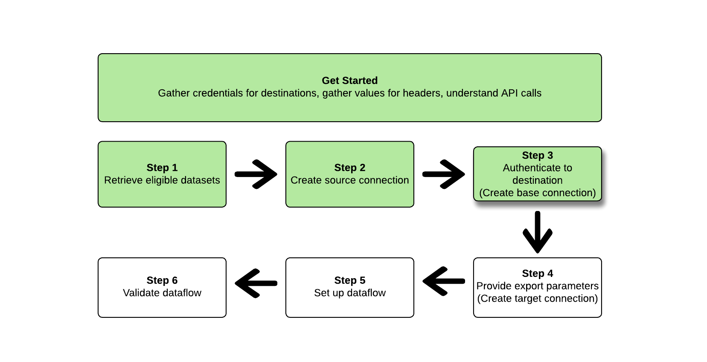
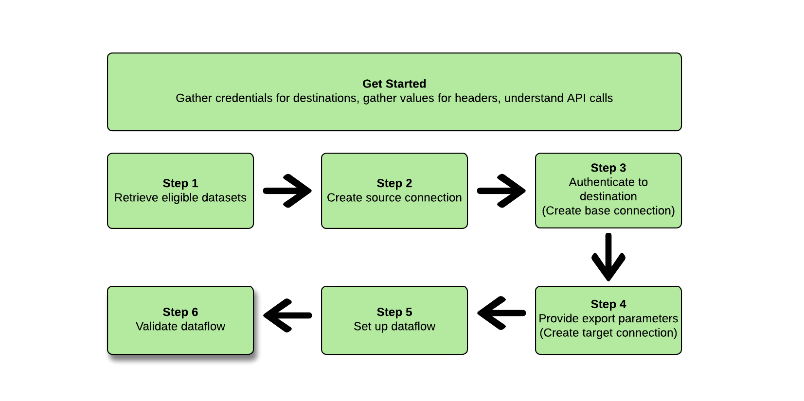

# (Beta)使用 [!DNL Flow Service API]

>[!IMPORTANT]
>
>* 導出資料集的功能當前處於Beta版中，並且不適用於所有用戶。 文件和功能可能會有所變更。
>* 此測試版功能支援第一代資料的導出，如Real-time Customer Data Platform所定義 [產品說明](https://helpx.adobe.com/legal/product-descriptions/real-time-customer-data-platform-b2c-edition-prime-and-ultimate-packages.html)。
>* 此功能可供購買了Real-Time CDPPrime或Ultimate包的客戶使用。 請聯繫您的Adobe代表以瞭解更多資訊。


本文說明了使用 [!DNL Flow Service API] 導出 [資料集](/help/catalog/datasets/overview.md) 從Adobe Experience Platform到您的首選雲儲存位置，如 [!DNL Amazon S3]、 SFTP位置，或 [!DNL Google Cloud Storage]。

>[!TIP]
>
>您還可以使用Experience Platform用戶介面導出資料集。 閱讀 [導出資料集UI教程](/help/destinations/ui/export-datasets.md) 的子菜單。

## 支援的目標 {#supported-destinations}

當前，您可以將資料集導出到螢幕快照中突出顯示並列出的雲儲存目標。


* [[!DNL (Beta) Azure Data Lake Storage Gen2]](../../destinations/catalog/cloud-storage/adls-gen2.md)
* [[!DNL (Beta) Data Landing Zone]](../../destinations/catalog/cloud-storage/data-landing-zone.md)
* [[!DNL (Beta) Google Cloud Storage]](../../destinations/catalog/cloud-storage/google-cloud-storage.md)
* [[!DNL (Beta) Amazon S3]](../../destinations/catalog/cloud-storage/amazon-s3.md#changelog)
* [[!DNL (Beta) Azure Blob]](../../destinations/catalog/cloud-storage/azure-blob.md#changelog)
* [[!DNL (Beta) SFTP]](../../destinations/catalog/cloud-storage/sftp.md#changelog)

## 快速入門 {#get-started}


本指南要求對Adobe Experience Platform的下列組成部分有工作上的理解：

* [[!DNL Experience Platform datasets]](/help/catalog/datasets/overview.md):成功接收到Adobe Experience Platform的所有資料都保留在 [!DNL Data Lake] 作為資料集。 資料集是資料集合的儲存和管理結構，通常是包含方案 (欄) 和欄位 (列) 的表格。 資料集也包含中繼資料，可說明其儲存資料的各個層面。 
* [[!DNL Sandboxes]](../../sandboxes/home.md): [!DNL Experience Platform] 提供虛擬沙箱，將單個沙箱 [!DNL Platform] 實例到獨立的虛擬環境，以幫助開發和發展數字型驗應用程式。

以下各節提供了您需要瞭解的其他資訊，以便將資料集導出到平台中的雲儲存目標。

### 必要權限 {#permissions}

要導出資料集，您需要 **[!UICONTROL 管理目標]**。 **[!UICONTROL 查看目標]**。 **[!UICONTROL 激活目標]**, **[!UICONTROL 管理和激活資料集目標]** [訪問控制權限](/help/access-control/home.md#permissions)。 閱讀 [訪問控制概述](/help/access-control/ui/overview.md) 或聯繫您的產品管理員以獲取所需權限。

要確保您具有導出資料集所需的權限，並且目標支援導出資料集，請瀏覽目標目錄。 如果目標具有 **[!UICONTROL 激活]** 或 **[!UICONTROL 導出資料集]** 控制項，則您具有相應的權限。

### 讀取示例API調用 {#reading-sample-api-calls}

本教程提供了示例API調用，以演示如何格式化請求。 這些包括路徑、必需的標頭和正確格式化的請求負載。 還提供了API響應中返回的示例JSON。 有關示例API調用文檔中使用的約定的資訊，請參見上的 [如何讀取示例API調用](../../landing/troubleshooting.md#how-do-i-format-an-api-request) 的 [!DNL Experience Platform] 疑難解答指南。

### 收集所需和可選標頭的值 {#gather-values-headers}

為了呼叫 [!DNL Platform] API，必須首先完成 [Experience Platform驗證教程](https://www.adobe.com/go/platform-api-authentication-en)。 完成身份驗證教程將提供所有中每個必需標頭的值 [!DNL Experience Platform] API調用，如下所示：

* 授權：持 `{ACCESS_TOKEN}`
* x-api-key: `{API_KEY}`
* x-gw-ims-org-id: `{ORG_ID}`

資源 [!DNL Experience Platform] 可以與特定的虛擬沙箱隔離。 在請求中 [!DNL Platform] API，您可以指定操作將在其中進行的沙盒的名稱和ID。 這些是可選參數。

* x-sandbox-name: `{SANDBOX_NAME}`

>[!NOTE]
>
>有關中的沙箱的詳細資訊 [!DNL Experience Platform]，請參見 [沙盒概述文檔](../../sandboxes/home.md)。

所有包含負載(POST、PUT、PATCH)的請求都需要附加的媒體類型報頭：

* Content-Type: `application/json`

### API參考文檔 {#api-reference-documentation}

您可以在本教程中找到所有API操作的附帶參考文檔。 請參閱 [[!DNL Flow Service] -Adobe Developer網站上的目標API文檔](https://developer.adobe.com/experience-platform-apis/references/destinations/)。 我們建議您並行使用本教程和API參考文檔。

### 字彙 {#glossary}

有關本API教程中將遇到的術語的說明，請閱讀 [術語節](https://developer.adobe.com/experience-platform-apis/references/destinations/#tag/Glossary) 的子文檔。

### 收集所需目標的連接規範和流規範 {#gather-connection-spec-flow-spec}

在啟動工作流以導出資料集之前，請確定要將資料集導出到的目標的連接規範和流規範ID。 請使用下表進行參考。


| 目的地 | 連接規範 | 流規範 |
---------|----------|---------|
| [!DNL Amazon S3] | `4fce964d-3f37-408f-9778-e597338a21ee` | `269ba276-16fc-47db-92b0-c1049a3c131f` |
| [!DNL Azure Blob Storage] | `6d6b59bf-fb58-4107-9064-4d246c0e5bb2` | `95bd8965-fc8a-4119-b9c3-944c2c2df6d2` |
| [!DNL Azure Data Lake Gen 2(ADLS Gen2)] | `be2c3209-53bc-47e7-ab25-145db8b873e1` | `17be2013-2549-41ce-96e7-a70363bec293` |
| [!DNL Data Landing Zone(DLZ)] | `10440537-2a7b-4583-ac39-ed38d4b848e8` | `cd2fc47e-e838-4f38-a581-8fff2f99b63a` |
| [!DNL Google Cloud Storage] | `c5d93acb-ea8b-4b14-8f53-02138444ae99` | `585c15c4-6cbf-4126-8f87-e26bff78b657` |
| SFTP | `36965a81-b1c6-401b-99f8-22508f1e6a26` | `354d6aad-4754-46e4-a576-1b384561c440` |

{style="table-layout:auto"}

你需要這些ID來構造各種 [!DNL Flow Service] 表徵圖。 您還需要參考 [!DNL Connection Spec] 設定特定圖元，以便 [!DNL Connection Spec] 從 [!DNL Flow Service APIs]。 請參閱下表中檢索所有目標的連接規範的示例：

>[!BEGINTABS]

>[!TAB Amazon S3]

**要求**

+++檢索 [!DNL connection spec] 為 [!DNL Amazon S3]

```shell
curl --location --request GET 'https://platform.adobe.io/data/foundation/flowservice/connectionSpecs/4fce964d-3f37-408f-9778-e597338a21ee' \
--header 'accept: application/json' \
--header 'x-api-key: {API_KEY}' \
--header 'x-gw-ims-org-id: {ORG_ID}' \
--header 'x-sandbox-name: {SANDBOX_NAME}' \
--header 'Authorization: Bearer {ACCESS_TOKEN}'
```

+++

**回應**

+++[!DNL Amazon S3]  — 連接規範

```json
{
    "items": [
        {
            "id": "4fce964d-3f37-408f-9778-e597338a21ee",
            "name": "Amazon S3",
            "providerId": "14e34fac-d307-11e9-bb65-2a2ae2dbcce4",
            "version": "1.0",
//...
```

+++

>[!TAB Azure Blob 儲存體]

**要求**

+++檢索 [!DNL connection spec] 為 [!DNL Azure Blob Storage]

```shell
curl --location --request GET 'https://platform.adobe.io/data/foundation/flowservice/connectionSpecs/6d6b59bf-fb58-4107-9064-4d246c0e5bb2' \
--header 'accept: application/json' \
--header 'x-api-key: {API_KEY}' \
--header 'x-gw-ims-org-id: {ORG_ID}' \
--header 'x-sandbox-name: {SANDBOX_NAME}' \
--header 'Authorization: Bearer {ACCESS_TOKEN}'
```

+++

**回應**

+++[!DNL Azure Blob Storage] - [!DNL Connection spec]

```json
{
    "items": [
        {
            "id": "6d6b59bf-fb58-4107-9064-4d246c0e5bb2",
            "name": "Azure Blob Storage",
            "providerId": "14e34fac-d307-11e9-bb65-2a2ae2dbcce4",
            "version": "1.0",
//...
```

+++

>[!TAB Azure資料湖第2代（ADLS第2代）]

**要求**

+++檢索 [!DNL connection spec] 為 [!DNL Azure Data Lake Gen 2(ADLS Gen2])

```shell
curl --location --request GET 'https://platform.adobe.io/data/foundation/flowservice/connectionSpecs/be2c3209-53bc-47e7-ab25-145db8b873e1' \
--header 'accept: application/json' \
--header 'x-api-key: {API_KEY}' \
--header 'x-gw-ims-org-id: {ORG_ID}' \
--header 'x-sandbox-name: {SANDBOX_NAME}' \
--header 'Authorization: Bearer {ACCESS_TOKEN}'
```

+++

**回應**

+++[!DNL Azure Data Lake Gen 2(ADLS Gen2)] - [!DNL Connection spec]

```json
{
    "items": [
        {
            "id": "be2c3209-53bc-47e7-ab25-145db8b873e1",
            "name": "Azure Data Lake Gen2",
            "providerId": "14e34fac-d307-11e9-bb65-2a2ae2dbcce4",
            "version": "1.0",
//...
```

+++

>[!TAB 資料登錄區(DLZ)]

**要求**

+++檢索 [!DNL connection spec] 為 [!DNL Data Landing Zone(DLZ)]

```shell
curl --location --request GET 'https://platform.adobe.io/data/foundation/flowservice/connectionSpecs/10440537-2a7b-4583-ac39-ed38d4b848e8' \
--header 'accept: application/json' \
--header 'x-api-key: {API_KEY}' \
--header 'x-gw-ims-org-id: {ORG_ID}' \
--header 'x-sandbox-name: {SANDBOX_NAME}' \
--header 'Authorization: Bearer {ACCESS_TOKEN}'
```

+++

**回應**

+++[!DNL Data Landing Zone(DLZ)] - [!DNL Connection spec]

```json
{
    "items": [
        {
            "id": "10440537-2a7b-4583-ac39-ed38d4b848e8",
            "name": "Data Landing Zone",
            "providerId": "14e34fac-d307-11e9-bb65-2a2ae2dbcce4",
            "version": "1.0",
//...
```

+++

>[!TAB Google雲儲存]

**要求**

+++檢索 [!DNL connection spec] 為 [!DNL Google Cloud Storage]

```shell
curl --location --request GET 'https://platform.adobe.io/data/foundation/flowservice/connectionSpecs/c5d93acb-ea8b-4b14-8f53-02138444ae99' \
--header 'accept: application/json' \
--header 'x-api-key: {API_KEY}' \
--header 'x-gw-ims-org-id: {ORG_ID}' \
--header 'x-sandbox-name: {SANDBOX_NAME}' \
--header 'Authorization: Bearer {ACCESS_TOKEN}'
```

+++

**回應**

+++[!DNL Google Cloud Storage] - [!DNL Connection spec]

```json
{
    "items": [
        {
            "id": "c5d93acb-ea8b-4b14-8f53-02138444ae99",
            "name": "Google Cloud Storage",
            "providerId": "14e34fac-d307-11e9-bb65-2a2ae2dbcce4",
            "version": "1.0",
//...
```

+++

>[!TAB SFTP]

**要求**

+++檢索 [!DNL connection spec] 用於SFTP

```shell
curl --location --request GET 'https://platform.adobe.io/data/foundation/flowservice/connectionSpecs/36965a81-b1c6-401b-99f8-22508f1e6a26' \
--header 'accept: application/json' \
--header 'x-api-key: {API_KEY}' \
--header 'x-gw-ims-org-id: {ORG_ID}' \
--header 'x-sandbox-name: {SANDBOX_NAME}' \
--header 'Authorization: Bearer {ACCESS_TOKEN}'
```

+++

**回應**

+++SFTP - [!DNL Connection spec]

```json
{
    "items": [
        {
            "id": "36965a81-b1c6-401b-99f8-22508f1e6a26",
            "name": "SFTP",
            "providerId": "14e34fac-d307-11e9-bb65-2a2ae2dbcce4",
            "version": "1.0",
//...
```

+++

>[!ENDTABS]

按照以下步驟將資料集資料流設定為雲儲存目標。 對於某些步驟，不同雲儲存目標之間的請求和響應會有所不同。 在這些情況下，使用頁面上的頁籤檢索特定於要連接和導出資料集的目標的請求和響應。 確保使用正確的 [!DNL connection spec] 和 [!DNL flow spec] 用於您正在配置的目標。

## 檢索資料集清單 {#retrieve-list-of-available-datasets}


要檢索符合激活條件的資料集清單，請首先對以下終結點進行API調用。

>[!BEGINSHADEBOX]

**要求**

+++檢索符合條件的資料集 — 請求

```shell
curl --location --request GET 'https://platform.adobe.io/data/foundation/flowservice/connectionSpecs/23598e46-f560-407b-88d5-ea6207e49db0/configs?outputType=activationDatasets&outputField=datasets&start=0&limit=20&properties=name,state' \
--header 'accept: application/json' \
--header 'x-gw-ims-org-id: {ORG_ID}' \
--header 'x-api-key: {API_KEY}' \
--header 'x-sandbox-name: {SANDBOX_NAME}' \
--header 'Authorization: Bearer {ACCESS_TOKEN}'
```

請注意，要檢索符合條件的資料集， [!DNL connection spec] 請求URL中使用的ID必須是資料湖源連接規範ID, `23598e46-f560-407b-88d5-ea6207e49db0`，以及兩個查詢參數 `outputField=datasets` 和 `outputType=activationDatasets` 必須指定。 所有其他查詢參數均是 [目錄服務API](https://developer.adobe.com/experience-platform-apis/references/catalog/)。

+++

**回應**

+++檢索資料集 — 響應

```json
{
    "items": [
        {
            "id": "5ef3e324052581191aa6a466",
            "name": "AAM Authenticated Profiles Meta Data",
            "description": "Activation profile export dataset",
            "fileDescription": {
                "persisted": true,
                "containerFormat": "parquet",
                "format": "parquet"
            },
            "aspect": "production",
            "state": "DRAFT"
        },
        {
            "id": "5ef3e3259ad2a1191ab7dd7d",
            "name": "AAM Devices Data",
            "description": "Activation profile export dataset",
            "fileDescription": {
                "persisted": true,
                "containerFormat": "parquet",
                "format": "parquet"
            },
            "aspect": "production",
            "state": "DRAFT"
        },
        {
            "id": "5ef3e325582424191b1beb42",
            "name": "AAM Devices Profile Meta Data",
            "description": "Activation profile export dataset",
            "fileDescription": {
                "persisted": true,
                "containerFormat": "parquet",
                "format": "parquet"
            },
            "aspect": "production",
            "state": "DRAFT"
        },
        {
            "id": "5ef3e328582424191b1beb44",
            "name": "AAM Realtime",
            "description": "Activation profile export dataset",
            "fileDescription": {
                "persisted": true,
                "containerFormat": "parquet",
                "format": "parquet"
            },
            "aspect": "production",
            "state": "DRAFT"
        },
        {
            "id": "5ef3e328fe742a191b2b3ea5",
            "name": "AAM Realtime Profile Updates",
            "description": "Activation profile export dataset",
            "fileDescription": {
                "persisted": true,
                "containerFormat": "parquet",
                "format": "parquet"
            },
            "aspect": "production",
            "state": "DRAFT"
        }
    ],
    "pageInfo": {
        "start": 0,
        "end": 4,
        "total": 149,
        "hasNext": true
    }
}
```

+++

>[!ENDSHADEBOX]

成功的響應包含可激活的資料集清單。 在下一步構建源連接時可以使用這些資料集。

有關每個返回的資料集的各種響應參數的資訊，請參閱 [資料集API開發人員文檔](https://developer.adobe.com/experience-platform-apis/references/catalog/#tag/Datasets/operation/listDatasets)。

## 建立源連接 {#create-source-connection}


檢索要導出的資料集清單後，可以使用這些資料集ID建立源連接。

>[!BEGINSHADEBOX]

**要求**

+++建立源連接 — 請求

請在請求實例中注意帶內聯注釋的突出顯示行，這些行提供附加資訊。 將請求複製貼上到所選終端時，刪除請求中的內聯注釋。

```shell {line-numbers="true" start-line="1" highlight="12,16"}
curl --location --request POST 'https://platform.adobe.io/data/foundation/flowservice/sourceConnections' \
--header 'accept: application/json' \
--header 'x-api-key: {API_KEY}' \
--header 'x-gw-ims-org-id: {ORG_ID}' \
--header 'x-sandbox-name: {SANDBOX_NAME}' \
--header 'Content-Type: application/json' \
--header 'Authorization: Bearer {ACCESS_TOKEN}' \
--data-raw '{
  "name": "Connecting to Data Lake",
  "description": "Data Lake source connection to export datasets",
  "connectionSpec": {
    "id": "23598e46-f560-407b-88d5-ea6207e49db0", // this connection spec ID is always the same for Source Connections
    "version": "1.0"
  },
  "params": {
    "datasets": [ // datasets to activate
      {
        "dataSetId": "5ef3e3259ad2a1191ab7dd7d",
        "name": "AAM Devices Data"
      }
    ]
  }
}'
```

+++


**回應**

+++建立源連接 — 響應

```json
{
    "id": "900df191-b983-45cd-90d5-4c7a0326d650",
    "etag": "\"0500ebe1-0000-0200-0000-63e28d060000\""
}
```

+++

>[!ENDSHADEBOX]

成功的響應返回ID(`id`)和 `etag`。 請記下源連接ID，因為以後建立資料流時需要它。

還請記住：

* 在此步驟中建立的源連接需要連結到要激活其資料集到目標的資料流。 查看 [建立資料流](#create-dataflow) 的子菜單。
* 建立後無法修改源連接的資料集ID。 如果需要從源連接中添加或刪除資料集，則必須建立新源連接並將新源連接的ID連結到資料流。

## 建立（目標）基連接 {#create-base-connection}



基本連接將憑據安全地儲存到目標。 根據目標類型，根據該目標進行身份驗證所需的憑據可能會有所不同。 要查找這些驗證參數，請首先檢索 [!DNL connection spec] 按部分所述 [收集連接規範和流規範](#gather-connection-spec-flow-spec) 然後看 `authSpec` 回答。 引用以下頁籤 `authSpec` 所有受支援目標的屬性。

>[!BEGINTABS]

>[!TAB Amazon S3]

+++[!DNL Amazon S3] - [!DNL Connection spec] 顯示 [!DNL auth spec]

請在中注意帶內聯注釋的突出顯示行 [!DNL connection spec] 下面的示例提供了有關在何處查找驗證參數的附加資訊 [!DNL connection spec]。

```json {line-numbers="true" start-line="1" highlight="8"}
{
    "items": [
        {
            "id": "4fce964d-3f37-408f-9778-e597338a21ee",
            "name": "Amazon S3",
            "providerId": "14e34fac-d307-11e9-bb65-2a2ae2dbcce4",
            "version": "1.0",
            "authSpec": [ // describes the authentication parameters
                {
                    "name": "Access Key",
                    "type": "KeyBased",
                    "spec": {
                        "$schema": "http://json-schema.org/draft-07/schema#",
                        "description": "Defines auth params required for connecting to amazon-s3",
                        "type": "object",
                        "properties": {
                            "s3AccessKey": {
                                "description": "Access key id",
                                "type": "string",
                                "pattern": "^[A-Z2-7]{20}$"
                            },
                            "s3SecretKey": {
                                "description": "Secret access key for the user account",
                                "type": "string",
                                "format": "password",
                                "pattern": "^[A-Za-z0-9\/\\+]{40}$"
                            }
                        },
                        "required": [
                            "s3SecretKey",
                            "s3AccessKey"
                        ]
                    }
                }
            ],
//...
```

+++

>[!TAB Azure Blob 儲存體]

+++[!DNL Azure Blob Storage] - [!DNL Connection spec] 顯示 [!DNL auth spec]

請在中注意帶內聯注釋的突出顯示行 [!DNL connection spec] 下面的示例提供了有關在何處查找驗證參數的附加資訊 [!DNL connection spec]。

```json {line-numbers="true" start-line="1" highlight="8"}
{
    "items": [
        {
            "id": "6d6b59bf-fb58-4107-9064-4d246c0e5bb2",
            "name": "Azure Blob Storage",
            "providerId": "14e34fac-d307-11e9-bb65-2a2ae2dbcce4",
            "version": "1.0",
            "authSpec": [ // describes the authentication parameters
                {
                    "name": "ConnectionString",
                    "type": "ConnectionString",
                    "spec": {
                        "$schema": "http://json-schema.org/draft-07/schema#",
                        "description": "Connection String for Azure Blob based destinations",
                        "type": "object",
                        "properties": {
                            "connectionString": {
                                "description": "connection string for login",
                                "type": "string",
                                "format": "password"
                            }
                        },
                        "required": [
                            "connectionString"
                        ]
                    }
                }
            ],
//...
```

+++


>[!TAB Azure資料湖第2代（ADLS第2代）]

+++[!DNL Azure Data Lake Gen 2(ADLS Gen2)] - [!DNL Connection spec] 顯示 [!DNL auth spec]

請在中注意帶內聯注釋的突出顯示行 [!DNL connection spec] 下面的示例提供了有關在何處查找驗證參數的附加資訊 [!DNL connection spec]。

```json {line-numbers="true" start-line="1" highlight="8"}
{
    "items": [
        {
            "id": "be2c3209-53bc-47e7-ab25-145db8b873e1",
            "name": "Azure Data Lake Gen2",
            "providerId": "14e34fac-d307-11e9-bb65-2a2ae2dbcce4",
            "version": "1.0",
            "authSpec": [ // describes the authentication parameters
                {
                    "name": "Azure Service Principal Auth",
                    "type": "AzureServicePrincipal",
                    "spec": {
                        "$schema": "http://json-schema.org/draft-07/schema#",
                        "description": "defines auth params required for connecting to adlsgen2 using service principal",
                        "type": "object",
                        "properties": {
                            "url": {
                                "description": "Endpoint for Azure Data Lake Storage Gen2.",
                                "type": "string"
                            },
                            "servicePrincipalId": {
                                "description": "Service Principal Id to connect to ADLSGen2.",
                                "type": "string"
                            },
                            "servicePrincipalKey": {
                                "description": "Service Principal Key to connect to ADLSGen2.",
                                "type": "string",
                                "format": "password"
                            },
                            "tenant": {
                                "description": "Tenant information(domain name or tenant ID).",
                                "type": "string"
                            }
                        },
                        "required": [
                            "servicePrincipalKey",
                            "url",
                            "tenant",
                            "servicePrincipalId"
                        ]
                    }
                }
            ],
//...
```

+++


>[!TAB 資料登錄區(DLZ)]

+++[!DNL Data Landing Zone(DLZ)] - [!DNL Connection spec] 顯示 [!DNL auth spec]

>[!NOTE]
>
>資料登錄區域目標不需要 [!DNL auth spec]。

```json
{
    "items": [
        {
            "id": "10440537-2a7b-4583-ac39-ed38d4b848e8",
            "name": "Data Landing Zone",
            "providerId": "14e34fac-d307-11e9-bb65-2a2ae2dbcce4",
            "version": "1.0",
            "authSpec": [],
//...
```

+++

>[!TAB Google雲儲存]

+++[!DNL Google Cloud Storage] - [!DNL Connection spec] 顯示 [!DNL auth spec]

請在中注意帶內聯注釋的突出顯示行 [!DNL connection spec] 下面的示例提供了有關在何處查找驗證參數的附加資訊 [!DNL connection spec]。

```json {line-numbers="true" start-line="1" highlight="8"}
{
    "items": [
        {
            "id": "c5d93acb-ea8b-4b14-8f53-02138444ae99",
            "name": "Google Cloud Storage",
            "providerId": "14e34fac-d307-11e9-bb65-2a2ae2dbcce4",
            "version": "1.0",
            "authSpec": [ // describes the authentication parameters
                {
                    "name": "Google Cloud Storage authentication credentials",
                    "type": "GoogleCloudStorageAuth",
                    "spec": {
                        "$schema": "http://json-schema.org/draft-07/schema#",
                        "description": "defines auth params required for connecting to google cloud storage connector.",
                        "type": "object",
                        "properties": {
                            "accessKeyId": {
                                "description": "Access Key Id for the user account",
                                "type": "string"
                            },
                            "secretAccessKey": {
                                "description": "Secret Access Key for the user account",
                                "type": "string",
                                "format": "password"
                            }
                        },
                        "required": [
                            "accessKeyId",
                            "secretAccessKey"
                        ]
                    }
                }
            ],
//...
```

+++

>[!TAB SFTP]

+++SFTP - [!DNL Connection spec] 顯示 [!DNL auth spec]

>[!NOTE]
>
>SFTP目標包含兩個單獨的項 [!DNL auth spec]，因為它同時支援密碼和SSH密鑰驗證。

請在中注意帶內聯注釋的突出顯示行 [!DNL connection spec] 下面的示例提供了有關在何處查找驗證參數的附加資訊 [!DNL connection spec]。

```json {line-numbers="true" start-line="1" highlight="8"}
{
    "items": [
        {
            "id": "36965a81-b1c6-401b-99f8-22508f1e6a26",
            "name": "SFTP",
            "providerId": "14e34fac-d307-11e9-bb65-2a2ae2dbcce4",
            "version": "1.0",
            "authSpec": [ // describes the authentication parameters
                {
                    "name": "SFTP with Password",
                    "type": "SFTP",
                    "spec": {
                        "$schema": "http://json-schema.org/draft-07/schema#",
                        "description": "defines auth params required for connecting to sftp locations with a password",
                        "type": "object",
                        "properties": {
                            "domain": {
                                "description": "Domain of server",
                                "type": "string"
                            },
                            "username": {
                                "description": "Username",
                                "type": "string"
                            },
                            "password": {
                                "description": "Password",
                                "type": "string",
                                "format": "password"
                            }
                        },
                        "required": [
                            "password",
                            "domain",
                            "username"
                        ]
                    }
                },
                {
                    "name": "SFTP with SSH Key",
                    "type": "SFTP",
                    "spec": {
                        "$schema": "http://json-schema.org/draft-07/schema#",
                        "description": "defines auth params required for connecting to sftp locations using SSH Key",
                        "type": "object",
                        "properties": {
                            "domain": {
                                "description": "Domain of server",
                                "type": "string"
                            },
                            "username": {
                                "description": "Username",
                                "type": "string"
                            },
                            "sshKey": {
                                "description": "Base64 string of the private SSH key",
                                "type": "string",
                                "format": "password",
                                "contentEncoding": "base64",
                                "uiAttributes": {
                                    "tooltip": {
                                        "id": "platform_destinations_connect_sftp_ssh",
                                        "fallbackUrl": "http://www.adobe.com/go/destinations-sftp-connection-parameters-en "
                                    }
                                }
                            }
                        },
                        "required": [
                            "sshKey",
                            "domain",
                            "username"
                        ]
                    }
                }
            ],
//...
```

+++

>[!ENDTABS]

使用驗證規範中指定的屬性(即 `authSpec` 根據響應)，您可以建立具有特定於每個目標類型的必需憑據的基本連接，如下例所示：

>[!BEGINTABS]

>[!TAB Amazon S3]

**要求**

+++[!DNL Amazon S3]  — 基本連接請求

>[!TIP]
>
>有關如何獲取所需的身份驗證憑據的資訊，請參閱 [驗證到目標](/help/destinations/catalog/cloud-storage/amazon-s3.md#authenticate) 的下界。

請在請求實例中注意帶內聯注釋的突出顯示行，這些行提供附加資訊。 將請求複製貼上到所選終端時，刪除請求中的內聯注釋。

```shell {line-numbers="true" start-line="1" highlight="18"}
curl --location --request POST 'https://platform.adobe.io/data/foundation/flowservice/connections' \
--header 'accept: application/json' \
--header 'Authorization: Bearer {ACCESS_TOKEN}' \
--header 'x-api-key: <API-KEY>' \
--header 'x-gw-ims-org-id: <IMS-ORG-ID>' \
--header 'x-sandbox-name: <SANDBOX-NAME>' \
--header 'Content-Type: application/json' \
--data-raw '{
  "name": "Amazon S3 Base Connection",
  "auth": {
    "specName": "Access Key",
    "params": {
      "s3SecretKey": "<Add secret key>",
      "s3AccessKey": "<Add access key>"
    }
  },
  "connectionSpec": {
    "id": "4fce964d-3f37-408f-9778-e597338a21ee", // Amazon S3 connection spec
    "version": "1.0"
  }
}'
```

+++

**回應**

+++[!DNL Amazon S3] 基本連接響應

```json
{
    "id": "12401496-2573-4ca7-8137-fef1aeb9dd4c",
    "etag": "\"0000d781-0000-0200-0000-63e29f420000\""
}
```

+++

>[!TAB Azure Blob 儲存體]

**要求**

+++[!DNL Azure Blob Storage]  — 基本連接請求

>[!TIP]
>
>有關如何獲取所需的身份驗證憑據的資訊，請參閱 [驗證到目標](/help/destinations/catalog/cloud-storage/azure-blob.md#authenticate) 「Azure Blob儲存目標文檔」頁中的「Azure Blob儲存」部分。

請在請求實例中注意帶內聯注釋的突出顯示行，這些行提供附加資訊。 將請求複製貼上到所選終端時，刪除請求中的內聯注釋。

```shell {line-numbers="true" start-line="1" highlight="16"}
curl --location --request POST 'https://platform.adobe.io/data/foundation/flowservice/connections' \
--header 'accept: application/json' \
--header 'Authorization: Bearer {ACCESS_TOKEN}' \
--header 'x-api-key: <API-KEY>' \
--header 'x-gw-ims-org-id: <IMS-ORG-ID>' \
--header 'x-sandbox-name: <SANDBOX-NAME>' \
--header 'Content-Type: application/json' \
--data-raw '{
  "name": "Azure Blob Storage Base Connection",
  "auth": {
    "specName": "ConnectionString",
    "params": {
      "connectionString": "<Add Azure Blob connection string>"
    }
  },
  "connectionSpec": {
    "id": "6d6b59bf-fb58-4107-9064-4d246c0e5bb2", // Azure Blob Storage connection spec
    "version": "1.0"
  }
}'
```

+++

**回應**

+++[!DNL Azure Blob Storage]  — 基本連接響應

```json
{
    "id": "12401496-2573-4ca7-8137-fef1aeb9dd4c",
    "etag": "\"0000d781-0000-0200-0000-63e29f420000\""
}
```

+++

>[!TAB Azure資料湖第2代（ADLS第2代）]

**要求**

+++[!DNL Azure Data Lake Gen 2(ADLS Gen2)]  — 基本連接請求

>[!TIP]
>
>有關如何獲取所需的身份驗證憑據的資訊，請參閱 [驗證到目標](/help/destinations/catalog/cloud-storage/adls-gen2.md#authenticate) Azure Data Lake Gen 2(ADLS Gen2)目標文檔頁的「」部分。

請在請求實例中注意帶內聯注釋的突出顯示行，這些行提供附加資訊。 將請求複製貼上到所選終端時，刪除請求中的內聯注釋。

```shell {line-numbers="true" start-line="1" highlight="20"}
curl --location --request POST 'https://platform.adobe.io/data/foundation/flowservice/connections' \
--header 'accept: application/json' \
--header 'Authorization: Bearer {ACCESS_TOKEN}' \
--header 'x-api-key: <API-KEY>' \
--header 'x-gw-ims-org-id: <IMS-ORG-ID>' \
--header 'x-sandbox-name: <SANDBOX-NAME>' \
--header 'Content-Type: application/json' \
--data-raw '{
  "name": "Azure Data Lake Gen 2(ADLS Gen2) Base Connection",
  "auth": {
    "specName": "Azure Service Principal Auth",
    "params": {
      "servicePrincipalKey": "<Add servicePrincipalKey>",
      "url": "<Add url>",
      "tenant": "<Add tenant>",
      "servicePrincipalId": "<Add servicePrincipalId>"
    }
  },
  "connectionSpec": {
    "id": "be2c3209-53bc-47e7-ab25-145db8b873e1", // Azure Data Lake Gen 2(ADLS Gen2) connection spec
    "version": "1.0"
  }
}'
```

+++

**回應**

+++[!DNL Azure Data Lake Gen 2(ADLS Gen2)]  — 基本連接響應

```json
{
    "id": "12401496-2573-4ca7-8137-fef1aeb9dd4c",
    "etag": "\"0000d781-0000-0200-0000-63e29f420000\""
}
```

+++

>[!TAB 資料登錄區(DLZ)]

**要求**

+++[!DNL Data Landing Zone(DLZ)]  — 基本連接請求

>[!TIP]
>
>資料登錄區域目標不需要身份驗證憑據。 有關詳細資訊，請參閱 [驗證到目標](/help/destinations/catalog/cloud-storage/data-landing-zone.md#authenticate) 「資料登錄區域」目標文檔頁面的「資料登錄區域」部分。

```shell
curl --location --request POST 'https://platform.adobe.io/data/foundation/flowservice/connections' \
--header 'accept: application/json' \
--header 'Authorization: Bearer {ACCESS_TOKEN}' \
--header 'x-api-key: <API-KEY>' \
--header 'x-gw-ims-org-id: <IMS-ORG-ID>' \
--header 'x-sandbox-name: <SANDBOX-NAME>' \
--header 'Content-Type: application/json' \
--data-raw '{
  "name": "Data Landing Zone(DLZ) Base Connection"
}'
```

+++

**回應**

+++[!DNL Data Landing Zone]  — 基本連接響應

```json
{
    "id": "12401496-2573-4ca7-8137-fef1aeb9dd4c",
    "etag": "\"0000d781-0000-0200-0000-63e29f420000\""
}
```

+++

>[!TAB Google雲儲存]

**要求**

+++[!DNL Google Cloud Storage]  — 基本連接請求

>[!TIP]
>
>有關如何獲取所需的身份驗證憑據的資訊，請參閱 [驗證到目標](/help/destinations/catalog/cloud-storage/google-cloud-storage.md#authenticate) 「Google雲儲存目標文檔」頁的「CD」部分。

請在請求實例中注意帶內聯注釋的突出顯示行，這些行提供附加資訊。 將請求複製貼上到所選終端時，刪除請求中的內聯注釋。

```shell {line-numbers="true" start-line="1" highlight="18"}
curl --location --request POST 'https://platform.adobe.io/data/foundation/flowservice/connections' \
--header 'accept: application/json' \
--header 'Authorization: Bearer {ACCESS_TOKEN}' \
--header 'x-api-key: <API-KEY>' \
--header 'x-gw-ims-org-id: <IMS-ORG-ID>' \
--header 'x-sandbox-name: <SANDBOX-NAME>' \
--header 'Content-Type: application/json' \
--data-raw '{
  "name": "Google Cloud Storage Base Connection",
  "auth": {
    "specName": "Google Cloud Storage authentication credentials",
    "params": {
      "accessKeyId": "<Add accessKeyId>",
      "secretAccessKey": "<Add secret Access Key>"
    }
  },
  "connectionSpec": {
    "id": "c5d93acb-ea8b-4b14-8f53-02138444ae99", // Google Cloud Storage connection spec
    "version": "1.0"
  }
}'
```

+++

**回應**

+++[!DNL Google Cloud Storage]  — 基本連接響應

```json
{
    "id": "12401496-2573-4ca7-8137-fef1aeb9dd4c",
    "etag": "\"0000d781-0000-0200-0000-63e29f420000\""
}
```

+++

>[!TAB SFTP]

**要求**

+++帶密碼的SFTP — 基本連接請求

>[!TIP]
>
>有關如何獲取所需的身份驗證憑據的資訊，請參閱 [驗證到目標](/help/destinations/catalog/cloud-storage/sftp.md#authentication-information) 的子目錄。

請在請求實例中注意帶內聯注釋的突出顯示行，這些行提供附加資訊。 將請求複製貼上到所選終端時，刪除請求中的內聯注釋。

```shell {line-numbers="true" start-line="1" highlight="19"}
curl --location --request POST 'https://platform.adobe.io/data/foundation/flowservice/connections' \
--header 'accept: application/json' \
--header 'Authorization: Bearer {ACCESS_TOKEN}' \
--header 'x-api-key: <API-KEY>' \
--header 'x-gw-ims-org-id: <IMS-ORG-ID>' \
--header 'x-sandbox-name: <SANDBOX-NAME>' \
--header 'Content-Type: application/json' \
--data-raw '{
  "name": "SFTP with password Base Connection",
  "auth": {
    "specName": "SFTP with Password",
    "params": {
      "domain": "<Add domain>",
      "username": "<Add username>",
      "password": "<Add password>"
    }
  },
  "connectionSpec": {
    "id": "36965a81-b1c6-401b-99f8-22508f1e6a26", // SFTP connection spec
    "version": "1.0"
  }
}'
```

+++

+++帶SSH密鑰的SFTP — 基本連接請求

>[!TIP]
>
>有關如何獲取所需的身份驗證憑據的資訊，請參閱 [驗證到目標](/help/destinations/catalog/cloud-storage/sftp.md#authentication-information) 的子目錄。

請在請求實例中注意帶內聯注釋的突出顯示行，這些行提供附加資訊。 將請求複製貼上到所選終端時，刪除請求中的內聯注釋。

```shell {line-numbers="true" start-line="1" highlight="19"}
curl --location --request POST 'https://platform.adobe.io/data/foundation/flowservice/connections' \
--header 'accept: application/json' \
--header 'Authorization: Bearer {ACCESS_TOKEN}' \
--header 'x-api-key: <API-KEY>' \
--header 'x-gw-ims-org-id: <IMS-ORG-ID>' \
--header 'x-sandbox-name: <SANDBOX-NAME>' \
--header 'Content-Type: application/json' \
--data-raw '{
  "name": "SFTP with SSH key Base Connection",
  "auth": {
    "specName": "SFTP with SSH Key",
    "params": {
      "domain": "<Add domain>",
      "username": "<Add username>",
      "sshKey": "<Add SSH key>"
    }
  },
  "connectionSpec": {
    "id": "36965a81-b1c6-401b-99f8-22508f1e6a26", // SFTP connection spec
    "version": "1.0"
  }
}'
```

+++

**回應**

+++SFTP — 基本連接響應

```json
{
    "id": "12401496-2573-4ca7-8137-fef1aeb9dd4c",
    "etag": "\"0000d781-0000-0200-0000-63e29f420000\""
}
```

+++

>[!ENDTABS]

從響應中記錄連接ID。 建立目標連接時，下一步將需要此ID。

## 建立目標連接 {#create-target-connection}


接下來，您需要建立一個目標連接，該連接儲存資料集的導出參數。 導出參數包括位置、檔案格式、壓縮和其他詳細資訊。 請參閱 `targetSpec` 在目標的連接規範中提供的屬性，以瞭解每個目標類型的支援屬性。 引用以下頁籤 `targetSpec` 所有受支援目標的屬性。

>[!BEGINTABS]

>[!TAB Amazon S3]

+++[!DNL Amazon S3] - [!DNL Connection spec] 顯示目標連接參數

在中使用內聯注釋記錄突出顯示的行 [!DNL connection spec] 下面的示例，提供了有關在何處查找的其他資訊 [!DNL target spec] 連接規範中的參數。 在下面的示例中，您也可以看到目標參數 *不* 適用於資料集導出目標。

```json {line-numbers="true" start-line="1" highlight="10,41,56"}
{
    "items": [
        {
            "id": "4fce964d-3f37-408f-9778-e597338a21ee",
            "name": "Amazon S3",
            "providerId": "14e34fac-d307-11e9-bb65-2a2ae2dbcce4",
            "version": "1.0",
            "authSpec": [...],
            "encryptionSpecs": [...],
            "targetSpec": { // describes the target connection parameters
                "name": "User based target",
                "type": "UserNamespace",
                "spec": {
                    "$schema": "http://json-schema.org/draft-07/schema#",
                    "type": "object",
                    "properties": {
                        "bucketName": {
                            "title": "Bucket name",
                            "description": "Bucket name",
                            "type": "string",
                            "pattern": "(?=^.{3,63}$)(?!^(\\d+\\.)+\\d+$)(^(([a-z0-9]|[a-z0-9][a-z0-9\\-]*[a-z0-9])\\.)*([a-z0-9]|[a-z0-9][a-z0-9\\-]*[a-z0-9])$)",
                            "uiAttributes": {
                                "tooltip": {
                                    "id": "platform_destinations_connect_s3_bucket",
                                    "fallbackUrl": "http://www.adobe.com/go/destinations-amazon-s3-connection-parameters-en"
                                }
                            }
                        },
                        "path": {
                            "title": "Folder path",
                            "description": "Output path for copying files",
                            "type": "string",
                            "pattern": "^[0-9a-zA-Z\/\\!\\-_\\.\\*\\''\\(\\)]*((\\%SEGMENT_(NAME|ID)\\%)?\/?)+$",
                            "uiAttributes": {
                                "tooltip": {
                                    "id": "platform_destinations_connect_s3_folderpath",
                                    "fallbackUrl": "http://www.adobe.com/go/destinations-amazon-s3-connection-parameters-en"
                                }
                            }
                        },
                        "fileType": {...}, // not applicable to dataset destinations
                        "datasetFileType": {
                            "conditional": {
                                "field": "flowSpec.attributes._workflow",
                                "operator": "CONTAINS",
                                "value": "DATASETS"
                            },
                            "title": "File Type",
                            "description": "Select file format",
                            "type": "string",
                            "enum": [
                                "JSON",
                                "PARQUET"
                            ]
                        },
                        "csvOptions": {...}, // not applicable to dataset destinations
                        "compression": {
                            "title": "Compression format",
                            "description": "Select the desired file compression format.",
                            "type": "string",
                            "enum": [
                                "NONE",
                                "GZIP"
                            ]
                        }
                    },
                    "required": [
                        "bucketName",
                        "path",
                        "datasetFileType",
                        "compression",
                        "fileType"
                    ]
                }
//...
```

+++

>[!TAB Azure Blob 儲存體]

+++[!DNL Azure Blob Storage] - [!DNL Connection spec] 顯示目標連接參數

在中使用內聯注釋記錄突出顯示的行 [!DNL connection spec] 下面的示例，提供了有關在何處查找的其他資訊 [!DNL target spec] 連接規範中的參數。 在下面的示例中，您也可以看到目標參數 *不* 適用於資料集導出目標。

```json {line-numbers="true" start-line="1" highlight="10,29,44"}
{
    "items": [
        {
            "id": "6d6b59bf-fb58-4107-9064-4d246c0e5bb2",
            "name": "Azure Blob Storage",
            "providerId": "14e34fac-d307-11e9-bb65-2a2ae2dbcce4",
            "version": "1.0",
            "authSpec": [...],
            "encryptionSpecs": [...],
            "targetSpec": { // describes the target connection parameters
                "name": "User based target",
                "type": "UserNamespace",
                "spec": {
                    "$schema": "http://json-schema.org/draft-07/schema#",
                    "type": "object",
                    "properties": {
                        "path": {
                            "title": "Folder path",
                            "description": "Output path (relative) indicating where to upload the data",
                            "type": "string",
                            "pattern": "^[0-9a-zA-Z\/\\!\\-_\\.\\*\\'\\(\\)]+$"
                        },
                        "container": {
                            "title": "Container",
                            "description": "Container within the storage where to upload the data",
                            "type": "string",
                            "pattern": "^[a-z0-9](?!.*--)[a-z0-9-]{1,61}[a-z0-9]$"
                        },
                        "fileType": {...}, // not applicable to dataset destinations
                        "datasetFileType": {
                            "conditional": {
                                "field": "flowSpec.attributes._workflow",
                                "operator": "CONTAINS",
                                "value": "DATASETS"
                            },
                            "title": "File Type",
                            "description": "Select file format",
                            "type": "string",
                            "enum": [
                                "JSON",
                                "PARQUET"
                            ]
                        },
                        "csvOptions": {...}, // not applicable to dataset destinations
                        "compression": {
                            "title": "Compression format",
                            "description": "Select the desired file compression format.",
                            "type": "string",
                            "enum": [
                                "NONE",
                                "GZIP"
                            ]
                        }
                    },
                    "required": [
                        "container",
                        "path",
                        "datasetFileType",
                        "compression",
                        "fileType"
                    ]
                }
//...
```

+++


>[!TAB Azure資料湖第2代（ADLS第2代）]

+++[!DNL Azure Data Lake Gen 2(ADLS Gen2)] - [!DNL Connection spec] 顯示目標連接參數

在中使用內聯注釋記錄突出顯示的行 [!DNL connection spec] 下面的示例，提供了有關在何處查找的其他資訊 [!DNL target spec] 連接規範中的參數。 在下面的示例中，您也可以看到目標參數 *不* 適用於資料集導出目標。

```json {line-numbers="true" start-line="1" highlight="10,22,37"}
{
    "items": [
        {
            "id": "be2c3209-53bc-47e7-ab25-145db8b873e1",
            "name": "Azure Data Lake Gen2",
            "providerId": "14e34fac-d307-11e9-bb65-2a2ae2dbcce4",
            "version": "1.0",
            "authSpec": [...],
            "encryptionSpecs": [...],
            "targetSpec": { // describes the target connection parameters
                "name": "User based target",
                "type": "UserNamespace",
                "spec": {
                    "$schema": "http://json-schema.org/draft-07/schema#",
                    "type": "object",
                    "properties": {
                        "path": {
                            "title": "Folder path",
                            "description": "Enter the path to your Azure Data Lake Storage folder",
                            "type": "string"
                        },
                        "fileType": {...}, // not applicable to dataset destinations
                        "datasetFileType": {
                            "conditional": {
                                "field": "flowSpec.attributes._workflow",
                                "operator": "CONTAINS",
                                "value": "DATASETS"
                            },
                            "title": "File Type",
                            "description": "Select file format",
                            "type": "string",
                            "enum": [
                                "JSON",
                                "PARQUET"
                            ]
                        },
                        "csvOptions":{...}, // not applicable to dataset destinations
                        "compression": {
                            "title": "Compression format",
                            "description": "Select the desired file compression format.",
                            "type": "string",
                            "enum": [
                                "NONE",
                                "GZIP"
                            ]
                        }
                    },
                    "required": [
                        "path",
                        "datasetFileType",
                        "compression",
                        "fileType"
                    ]
                }
//...
```

+++

>[!TAB 資料登錄區(DLZ)]

+++[!DNL Data Landing Zone(DLZ)] - [!DNL Connection spec] 顯示目標連接參數

在中使用內聯注釋記錄突出顯示的行 [!DNL connection spec] 下面的示例，提供了有關在何處查找的其他資訊 [!DNL target spec] 連接規範中的參數。 在下面的示例中，您也可以看到目標參數 *不* 適用於資料集導出目標。

```json {line-numbers="true" start-line="1" highlight="9,21,36"}
"items": [
    {
        "id": "10440537-2a7b-4583-ac39-ed38d4b848e8",
        "name": "Data Landing Zone",
        "providerId": "14e34fac-d307-11e9-bb65-2a2ae2dbcce4",
        "version": "1.0",
        "authSpec": [],
        "encryptionSpecs": [],
        "targetSpec": { // describes the target connection parameters
            "name": "User based target",
            "type": "UserNamespace",
            "spec": {
                "$schema": "http://json-schema.org/draft-07/schema#",
                "type": "object",
                "properties": {
                    "path": {
                        "title": "Folder path",
                        "description": "Enter the path to your Azure Data Lake Storage folder",
                        "type": "string"
                    },
                    "fileType": {...}, // not applicable to dataset destinations
                    "datasetFileType": {
                        "conditional": {
                            "field": "flowSpec.attributes._workflow",
                            "operator": "CONTAINS",
                            "value": "DATASETS"
                        },
                        "title": "File Type",
                        "description": "Select file format",
                        "type": "string",
                        "enum": [
                            "JSON",
                            "PARQUET"
                        ]
                    },
                    "csvOptions": {...}, // not applicable to dataset destinations
                    "compression": {
                        "title": "Compression format",
                        "description": "Select the desired file compression format.",
                        "type": "string",
                        "enum": [
                            "NONE",
                            "GZIP"
                        ]
                    }
                },
                "required": [
                    "path",
                    "datasetFileType",
                    "compression",
                    "fileType"
                ]
            }
//...
```

+++

>[!TAB Google雲儲存]

+++[!DNL Google Cloud Storage] - [!DNL Connection spec] 顯示目標連接參數

在中使用內聯注釋記錄突出顯示的行 [!DNL connection spec] 下面的示例，提供了有關在何處查找的其他資訊 [!DNL target spec] 連接規範中的參數。 在下面的示例中，您也可以看到目標參數 *不* 適用於資料集導出目標。

```json {line-numbers="true" start-line="1" highlight="10,29,44"}
{
    "items": [
        {
            "id": "c5d93acb-ea8b-4b14-8f53-02138444ae99",
            "name": "Google Cloud Storage",
            "providerId": "14e34fac-d307-11e9-bb65-2a2ae2dbcce4",
            "version": "1.0",
            "authSpec": [...],
            "encryptionSpecs": [...],
            "targetSpec": { // describes the target connection parameters
                "name": "User based target",
                "type": "UserNamespace",
                "spec": {
                    "$schema": "http://json-schema.org/draft-07/schema#",
                    "type": "object",
                    "properties": {
                        "bucketName": {
                            "title": "Bucket name",
                            "description": "Bucket name",
                            "type": "string",
                            "pattern": "(?!^goog.*$)(?!^.*g(o|0)(o|0)gle.*$)(((?=^.{3,63}$)(^([a-z0-9]|[a-z0-9][a-z0-9\\-_]*)[a-z0-9]$))|((?=^.{3,222}$)(?!^(\\d+\\.)+\\d+$)(^(([a-z0-9]{1,63}|[a-z0-9][a-z0-9\\-_]{1,61}[a-z0-9])\\.)*([a-z0-9]{1,63}|[a-z0-9][a-z0-9\\-_]{1,61}[a-z0-9])$)))"
                        },
                        "path": {
                            "title": "Folder path",
                            "description": "Output path for copying files",
                            "type": "string",
                            "pattern": "^[0-9a-zA-Z\/\\!\\-_\\.\\*\\''\\(\\)]*((\\%SEGMENT_(NAME|ID)\\%)?\/?)+$"
                        },
                        "fileType": {...}, // not applicable to dataset destinations
                        "datasetFileType": {
                            "conditional": {
                                "field": "flowSpec.attributes._workflow",
                                "operator": "CONTAINS",
                                "value": "DATASETS"
                            },
                            "title": "File Type",
                            "description": "Select file format",
                            "type": "string",
                            "enum": [
                                "JSON",
                                "PARQUET"
                            ]
                        },
                        "csvOptions": {...}, // not applicable to dataset destinations
                        "compression": {
                            "title": "Compression format",
                            "description": "Select the desired file compression format.",
                            "type": "string",
                            "enum": [
                                "NONE",
                                "GZIP"
                            ]
                        }
                    },
                    "required": [
                        "bucketName",
                        "path",
                        "datasetFileType",
                        "compression",
                        "fileType"
                    ]
                }
//...
```

+++

>[!TAB SFTP]

+++SFTP - [!DNL Connection spec] 顯示目標連接參數

在中使用內聯注釋記錄突出顯示的行 [!DNL connection spec] 下面的示例，提供了有關在何處查找的其他資訊 [!DNL target spec] 連接規範中的參數。 在下面的示例中，您也可以看到目標參數 *不* 適用於資料集導出目標。

```json {line-numbers="true" start-line="1" highlight="10,22,37"}
{
    "items": [
        {
            "id": "36965a81-b1c6-401b-99f8-22508f1e6a26",
            "name": "SFTP",
            "providerId": "14e34fac-d307-11e9-bb65-2a2ae2dbcce4",
            "version": "1.0",
            "authSpec": [...],
            "encryptionSpecs": [...],
            "targetSpec": { // describes the target connection parameters
                "name": "User based target",
                "type": "UserNamespace",
                "spec": {
                    "$schema": "http://json-schema.org/draft-07/schema#",
                    "type": "object",
                    "properties": {
                        "remotePath": {
                            "title": "Folder path",
                            "description": "Enter your folder path",
                            "type": "string"
                        },
                        "fileType": {...}, // not applicable to dataset destinations
                        "datasetFileType": {
                            "conditional": {
                                "field": "flowSpec.attributes._workflow",
                                "operator": "CONTAINS",
                                "value": "DATASETS"
                            },
                            "title": "File Type",
                            "description": "Select file format",
                            "type": "string",
                            "enum": [
                                "JSON",
                                "PARQUET"
                            ]
                        },
                        "csvOptions": {...}, // not applicable to dataset destinations
                        "compression": {
                            "title": "Compression format",
                            "description": "Select the desired file compression format.",
                            "type": "string",
                            "enum": [
                                "GZIP",
                                "NONE"
                            ]
                        }
                    },
                    "required": [
                        "remotePath",
                        "datasetFileType",
                        "compression",
                        "fileType"
                    ]
                },
//...
```

+++

>[!ENDTABS]


通過使用上述規範，您可以構建特定於所需雲儲存目標的目標連接請求，如下面的頁籤所示。

>[!BEGINTABS]

>[!TAB Amazon S3]

**要求**

+++[!DNL Amazon S3]  — 目標連接請求

>[!TIP]
>
>有關如何獲取所需目標參數的資訊，請參閱 [填寫目標詳細資訊](/help/destinations/catalog/cloud-storage/amazon-s3.md#destination-details) 的下界 [!DNL Amazon S3] 目標文檔頁面。
>對於其他支援的值 `datasetFileType`，請參閱API參考文檔。

請在請求實例中注意帶內聯注釋的突出顯示行，這些行提供附加資訊。 將請求複製貼上到所選終端時，刪除請求中的內聯注釋。

```shell {line-numbers="true" start-line="1" highlight="19"}
curl --location --request POST 'https://platform.adobe.io/data/foundation/flowservice/targetConnections' \
--header 'accept: application/json' \
--header 'x-api-key: {API_KEY}' \
--header 'x-gw-ims-org-id: {ORG_ID}' \
--header 'x-sandbox-name: {SANDBOX_NAME}' \
--header 'Content-Type: application/json' \
--header 'Authorization: Bearer {ACCESS_TOKEN}' \
--data-raw '{
    "name": "Amazon S3 Beta Target Connection",
    "baseConnectionId": "<FROM_STEP_CREATE_TARGET_BASE_CONNECTION>",
    "params": {
        "mode": "Server-to-server",
        "bucketName": "your-bucket-name",
        "path": "folder/subfolder",
        "compression": "NONE",
        "datasetFileType": "JSON"
    },
    "connectionSpec": {
        "id": "4fce964d-3f37-408f-9778-e597338a21ee", // Amazon S3 connection spec id
        "version": "1.0"
    }
}'
```

+++

**回應**

+++目標連接 — 響應

```json
{
    "id": "12401496-2573-4ca7-8137-fef1aeb9dd4c",
    "etag": "\"0000d781-0000-0200-0000-63e29f420000\""
}
```

+++

>[!TAB Azure Blob 儲存體]

**要求**

+++[!DNL Azure Blob Storage]  — 目標連接請求

>[!TIP]
>
>有關如何獲取所需目標參數的資訊，請參閱 [填寫目標詳細資訊](/help/destinations/catalog/cloud-storage/azure-blob.md#destination-details) 的下界 [!DNL Azure Blob Storage] 目標文檔頁面。
>對於其他支援的值 `datasetFileType`，請參閱API參考文檔。


請在請求實例中注意帶內聯注釋的突出顯示行，這些行提供附加資訊。 將請求複製貼上到所選終端時，刪除請求中的內聯注釋。

```shell {line-numbers="true" start-line="1" highlight="19"}
curl --location --request POST 'https://platform.adobe.io/data/foundation/flowservice/targetConnections' \
--header 'accept: application/json' \
--header 'x-api-key: {API_KEY}' \
--header 'x-gw-ims-org-id: {ORG_ID}' \
--header 'x-sandbox-name: {SANDBOX_NAME}' \
--header 'Content-Type: application/json' \
--header 'Authorization: Bearer {ACCESS_TOKEN}' \
--data-raw '{
    "name": "Azure Blob Storage Beta Target Connection",
    "baseConnectionId": "<FROM_STEP_CREATE_TARGET_BASE_CONNECTION>",
    "params": {
        "mode": "Server-to-server",
        "container": "your-container-name",
        "path": "folder/subfolder",
        "compression": "NONE",
        "datasetFileType": "JSON"
    },
    "connectionSpec": {
        "id": "6d6b59bf-fb58-4107-9064-4d246c0e5bb2", // Azure Blob Storage connection spec id
        "version": "1.0"
    }
}'
```

+++

**回應**

+++目標連接 — 響應

```json
{
    "id": "12401496-2573-4ca7-8137-fef1aeb9dd4c",
    "etag": "\"0000d781-0000-0200-0000-63e29f420000\""
}
```

+++

>[!TAB Azure資料湖第2代（ADLS第2代）]

**要求**

+++[!DNL Azure Blob Storage]  — 目標連接請求

>[!TIP]
>
>有關如何獲取所需目標參數的資訊，請參閱 [填寫目標詳細資訊](/help/destinations/catalog/cloud-storage/adls-gen2.md#destination-details) Azure的部分 [!DNL Data Lake Gen 2(ADLS Gen2)] 目標文檔頁面。
>對於其他支援的值 `datasetFileType`，請參閱API參考文檔。

請在請求實例中注意帶內聯注釋的突出顯示行，這些行提供附加資訊。 將請求複製貼上到所選終端時，刪除請求中的內聯注釋。

```shell {line-numbers="true" start-line="1" highlight="18"}
curl --location --request POST 'https://platform.adobe.io/data/foundation/flowservice/targetConnections' \
--header 'accept: application/json' \
--header 'x-api-key: {API_KEY}' \
--header 'x-gw-ims-org-id: {ORG_ID}' \
--header 'x-sandbox-name: {SANDBOX_NAME}' \
--header 'Content-Type: application/json' \
--header 'Authorization: Bearer {ACCESS_TOKEN}' \
--data-raw '{
    "name": "Azure Data Lake Gen 2(ADLS Gen2) Target Connection",
    "baseConnectionId": "<FROM_STEP_CREATE_TARGET_BASE_CONNECTION>",
    "params": {
        "mode": "Server-to-server",
        "path": "folder/subfolder",
        "compression": "NONE",
        "datasetFileType": "JSON"
    },
    "connectionSpec": {
        "id": "be2c3209-53bc-47e7-ab25-145db8b873e1", // Azure Data Lake Gen 2(ADLS Gen2) connection spec id
        "version": "1.0"
    }
}'
```

+++

**回應**

+++目標連接 — 響應

```json
{
    "id": "12401496-2573-4ca7-8137-fef1aeb9dd4c",
    "etag": "\"0000d781-0000-0200-0000-63e29f420000\""
}
```

+++

>[!TAB 資料登錄區(DLZ)]

**要求**

+++[!DNL Data Landing Zone]  — 目標連接請求

>[!TIP]
>
>有關如何獲取所需目標參數的資訊，請參閱 [填寫目標詳細資訊](/help/destinations/catalog/cloud-storage/data-landing-zone.md#destination-details) 的下界 [!DNL Data Landing Zone] 目標文檔頁面。
>對於其他支援的值 `datasetFileType`，請參閱API參考文檔。

請在請求實例中注意帶內聯注釋的突出顯示行，這些行提供附加資訊。 將請求複製貼上到所選終端時，刪除請求中的內聯注釋。

```shell {line-numbers="true" start-line="1" highlight="18"}
curl --location --request POST 'https://platform.adobe.io/data/foundation/flowservice/targetConnections' \
--header 'accept: application/json' \
--header 'x-api-key: {API_KEY}' \
--header 'x-gw-ims-org-id: {ORG_ID}' \
--header 'x-sandbox-name: {SANDBOX_NAME}' \
--header 'Content-Type: application/json' \
--header 'Authorization: Bearer {ACCESS_TOKEN}' \
--data-raw '{
    "name": "Data Landing Zone Target Connection",
    "baseConnectionId": "<FROM_STEP_CREATE_TARGET_BASE_CONNECTION>",
    "params": {
        "mode": "Server-to-server",
        "path": "folder/subfolder",
        "compression": "NONE",
        "datasetFileType": "JSON"
    },
    "connectionSpec": {
        "id": "10440537-2a7b-4583-ac39-ed38d4b848e8", // Data Landing Zone connection spec id
        "version": "1.0"
    }
}'
```

+++

**回應**

+++目標連接 — 響應

```json
{
    "id": "12401496-2573-4ca7-8137-fef1aeb9dd4c",
    "etag": "\"0000d781-0000-0200-0000-63e29f420000\""
}
```

+++

>[!TAB Google雲儲存]

**要求**

+++[!DNL Google Cloud Storage]  — 目標連接請求

>[!TIP]
>
>有關如何獲取所需目標參數的資訊，請參閱 [填寫目標詳細資訊](/help/destinations/catalog/cloud-storage/google-cloud-storage.md#destination-details) 的下界 [!DNL Google Cloud Storage] 目標文檔頁面。
>對於其他支援的值 `datasetFileType`，請參閱API參考文檔。


請在請求實例中注意帶內聯注釋的突出顯示行，這些行提供附加資訊。 將請求複製貼上到所選終端時，刪除請求中的內聯注釋。

```shell {line-numbers="true" start-line="1" highlight="19"}
curl --location --request POST 'https://platform.adobe.io/data/foundation/flowservice/targetConnections' \
--header 'accept: application/json' \
--header 'x-api-key: {API_KEY}' \
--header 'x-gw-ims-org-id: {ORG_ID}' \
--header 'x-sandbox-name: {SANDBOX_NAME}' \
--header 'Content-Type: application/json' \
--header 'Authorization: Bearer {ACCESS_TOKEN}' \
--data-raw '{
    "name": "Google Cloud Storage Target Connection",
    "baseConnectionId": "<FROM_STEP_CREATE_TARGET_BASE_CONNECTION>",
    "params": {
        "mode": "Server-to-server",
        "bucketName": "your-bucket-name",
        "path": "folder/subfolder",
        "compression": "NONE",
        "datasetFileType": "JSON"
    },
    "connectionSpec": {
        "id": "c5d93acb-ea8b-4b14-8f53-02138444ae99", // Google Cloud Storage connection spec id
        "version": "1.0"
    }
}'
```

+++

**回應**

+++目標連接 — 響應

```json
{
    "id": "12401496-2573-4ca7-8137-fef1aeb9dd4c",
    "etag": "\"0000d781-0000-0200-0000-63e29f420000\""
}
```

+++

>[!TAB SFTP]

**要求**

+++SFTP — 目標連接請求

>[!TIP]
>
>有關如何獲取所需目標參數的資訊，請參閱 [填寫目標詳細資訊](/help/destinations/catalog/cloud-storage/google-cloud-storage.md#destination-details) 的子目錄。
>對於其他支援的值 `datasetFileType`，請參閱API參考文檔。

請在請求實例中注意帶內聯注釋的突出顯示行，這些行提供附加資訊。 將請求複製貼上到所選終端時，刪除請求中的內聯注釋。

```shell {line-numbers="true" start-line="1" highlight="18"}
curl --location --request POST 'https://platform.adobe.io/data/foundation/flowservice/targetConnections' \
--header 'accept: application/json' \
--header 'x-api-key: {API_KEY}' \
--header 'x-gw-ims-org-id: {ORG_ID}' \
--header 'x-sandbox-name: {SANDBOX_NAME}' \
--header 'Content-Type: application/json' \
--header 'Authorization: Bearer {ACCESS_TOKEN}' \
--data-raw '{
    "name": "SFTP Target Connection",
    "baseConnectionId": "<FROM_STEP_CREATE_TARGET_BASE_CONNECTION>",
    "params": {
        "mode": "Server-to-server",
        "remotePath": "folder/subfolder",
        "compression": "NONE",
        "datasetFileType": "JSON"
    },
    "connectionSpec": {
        "id": "36965a81-b1c6-401b-99f8-22508f1e6a26", // SFTP connection spec id
        "version": "1.0"
    }
}'
```

+++

**回應**

+++目標連接 — 響應

```json
{
    "id": "12401496-2573-4ca7-8137-fef1aeb9dd4c",
    "etag": "\"0000d781-0000-0200-0000-63e29f420000\""
}
```

+++

>[!ENDTABS]

從響應中注意目標連接ID。 建立資料流以導出資料集時，下一步將需要此ID。

## 建立資料流 {#create-dataflow}


目標配置中的最後一步是設定資料流。 資料流將先前建立的實體關聯在一起，還提供了配置資料集導出時間表的選項。 要建立資料流，請根據所需的雲儲存目標使用下面的負載，並替換前面步驟中的實體ID。

>[!BEGINTABS]

>[!TAB Amazon S3]

**要求**

+++將資料集資料流建立到 [!DNL Amazon S3] 目標 — 請求

請在請求實例中注意帶內聯注釋的突出顯示行，這些行提供附加資訊。 將請求複製貼上到所選終端時，刪除請求中的內聯注釋。

```shell {line-numbers="true" start-line="1" highlight="12,22-25"}
curl --location --request POST 'https://platform.adobe.io/data/foundation/flowservice/flows' \
--header 'accept: application/json' \
--header 'x-api-key: {API_KEY}' \
--header 'x-gw-ims-org-id: {ORG_ID}' \
--header 'x-sandbox-name: {SANDBOX_NAME}' \
--header 'Content-Type: application/json' \
--header 'Authorization: Bearer {ACCESS_TOKEN}' \
--data-raw '{
    "name": "Activate datasets to an Amazon S3 cloud storage destination",
    "description": "This operation creates a dataflow to export datasets to an Amazon S3 cloud storage destination",
    "flowSpec": {
        "id": "269ba276-16fc-47db-92b0-c1049a3c131f", // Amazon S3 flow spec ID
        "version": "1.0"
    },
    "sourceConnectionIds": [
        "<FROM_STEP_CREATE_SOURCE_CONNECTION>"
    ],
    "targetConnectionIds": [
        "<FROM_STEP_CREATE_TARGET_CONNECTION>"
    ],
    "transformations": [],
    "scheduleParams": { // specify the scheduling info
        "interval": 3, // also supports 6, 9, 12 hour increments
        "timeUnit": "hour", // also supports "day" for daily increments. Use "interval": 1 when you select "timeUnit": "day"
        "startTime": 1675901210 // UNIX timestamp start time (in seconds)
    }
}'
```

+++

**回應**

+++建立資料流 — 響應

```json
{
    "id": "eb54b3b3-3949-4f12-89c8-64eafaba858f",
    "etag": "\"0000d781-0000-0200-0000-63e29f420000\""
}
```

+++

>[!TAB Azure Blob 儲存體]

**要求**

+++將資料集資料流建立到 [!DNL Azure Blob Storage] 目標 — 請求

請在請求實例中注意帶內聯注釋的突出顯示行，這些行提供附加資訊。 將請求複製貼上到所選終端時，刪除請求中的內聯注釋。

```shell {line-numbers="true" start-line="1" highlight="12,22-25"}
curl --location --request POST 'https://platform.adobe.io/data/foundation/flowservice/flows' \
--header 'accept: application/json' \
--header 'x-api-key: {API_KEY}' \
--header 'x-gw-ims-org-id: {ORG_ID}' \
--header 'x-sandbox-name: {SANDBOX_NAME}' \
--header 'Content-Type: application/json' \
--header 'Authorization: Bearer {ACCESS_TOKEN}' \
--data-raw '{
    "name": "Activate datasets to an Azure Blob Storage cloud storage destination",
    "description": "This operation creates a dataflow to export datasets to an Azure Blob Storage cloud storage destination",
    "flowSpec": {
        "id": "95bd8965-fc8a-4119-b9c3-944c2c2df6d2", // Azure Blob Storage flow spec ID
        "version": "1.0"
    },
    "sourceConnectionIds": [
        "<FROM_STEP_CREATE_SOURCE_CONNECTION>"
    ],
    "targetConnectionIds": [
        "<FROM_STEP_CREATE_TARGET_CONNECTION>"
    ],
    "transformations": [],
    "scheduleParams": { // specify the scheduling info
        "interval": 3, // also supports 6, 9, 12, 24 hour increments
        "timeUnit": "hour",
        "startTime": 1675901210 // UNIX timestamp start time(in seconds)
    }
}'
```

+++

**回應**

+++建立資料流 — 響應

```json
{
    "id": "eb54b3b3-3949-4f12-89c8-64eafaba858f",
    "etag": "\"0000d781-0000-0200-0000-63e29f420000\""
}
```

+++

>[!TAB Azure資料湖第2代（ADLS第2代）]

**要求**

+++將資料集資料流建立到 [!DNL Azure Data Lake Gen 2(ADLS Gen2)] 目標 — 請求

請在請求實例中注意帶內聯注釋的突出顯示行，這些行提供附加資訊。 將請求複製貼上到所選終端時，刪除請求中的內聯注釋。

```shell {line-numbers="true" start-line="1" highlight="12,22-25"}
curl --location --request POST 'https://platform.adobe.io/data/foundation/flowservice/flows' \
--header 'accept: application/json' \
--header 'x-api-key: {API_KEY}' \
--header 'x-gw-ims-org-id: {ORG_ID}' \
--header 'x-sandbox-name: {SANDBOX_NAME}' \
--header 'Content-Type: application/json' \
--header 'Authorization: Bearer {ACCESS_TOKEN}' \
--data-raw '{
    "name": "Activate datasets to an Azure Data Lake Gen 2(ADLS Gen2) cloud storage destination",
    "description": "This operation creates a dataflow to export datasets to an Azure Data Lake Gen 2(ADLS Gen2) cloud storage destination",
    "flowSpec": {
        "id": "17be2013-2549-41ce-96e7-a70363bec293", // Azure Data Lake Gen 2(ADLS Gen2) flow spec ID
        "version": "1.0"
    },
    "sourceConnectionIds": [
        "<FROM_STEP_CREATE_SOURCE_CONNECTION>"
    ],
    "targetConnectionIds": [
        "<FROM_STEP_CREATE_TARGET_CONNECTION>"
    ],
    "transformations": [],
    "scheduleParams": { // specify the scheduling info
        "interval": 3, // also supports 6, 9, 12, 24 hour increments
        "timeUnit": "hour",
        "startTime": 1675901210 // UNIX timestamp start time(in seconds)
    }
}'
```

+++

**回應**

+++建立資料流 — 響應

```json
{
    "id": "eb54b3b3-3949-4f12-89c8-64eafaba858f",
    "etag": "\"0000d781-0000-0200-0000-63e29f420000\""
}
```

+++

>[!TAB 資料登錄區(DLZ)]

**要求**

+++將資料集資料流建立到 [!DNL Data Landing Zone] 目標 — 請求

請在請求實例中注意帶內聯注釋的突出顯示行，這些行提供附加資訊。 將請求複製貼上到所選終端時，刪除請求中的內聯注釋。

```shell {line-numbers="true" start-line="1" highlight="12,22-25"}
curl --location --request POST 'https://platform.adobe.io/data/foundation/flowservice/flows' \
--header 'accept: application/json' \
--header 'x-api-key: {API_KEY}' \
--header 'x-gw-ims-org-id: {ORG_ID}' \
--header 'x-sandbox-name: {SANDBOX_NAME}' \
--header 'Content-Type: application/json' \
--header 'Authorization: Bearer {ACCESS_TOKEN}' \
--data-raw '{
    "name": "Activate datasets to a Data Landing Zone cloud storage destination",
    "description": "This operation creates a dataflow to export datasets to a Data Landing Zone cloud storage destination",
    "flowSpec": {
        "id": "cd2fc47e-e838-4f38-a581-8fff2f99b63a", // Data Landing Zone flow spec ID
        "version": "1.0"
    },
    "sourceConnectionIds": [
        "<FROM_STEP_CREATE_SOURCE_CONNECTION>"
    ],
    "targetConnectionIds": [
        "<FROM_STEP_CREATE_TARGET_CONNECTION>"
    ],
    "transformations": [],
    "scheduleParams": { // specify the scheduling info
        "interval": 3, // also supports 6, 9, 12, 24 hour increments
        "timeUnit": "hour",
        "startTime": 1675901210 // UNIX timestamp start time(in seconds)
    }
}'
```

+++

**回應**

+++建立資料流 — 響應

```json
{
    "id": "eb54b3b3-3949-4f12-89c8-64eafaba858f",
    "etag": "\"0000d781-0000-0200-0000-63e29f420000\""
}
```

+++

>[!TAB Google雲儲存]

**要求**

+++將資料集資料流建立到 [!DNL Google Cloud Storage] 目標 — 請求

請在請求實例中注意帶內聯注釋的突出顯示行，這些行提供附加資訊。 將請求複製貼上到所選終端時，刪除請求中的內聯注釋。

```shell {line-numbers="true" start-line="1" highlight="12,22-25"}
curl --location --request POST 'https://platform.adobe.io/data/foundation/flowservice/flows' \
--header 'accept: application/json' \
--header 'x-api-key: {API_KEY}' \
--header 'x-gw-ims-org-id: {ORG_ID}' \
--header 'x-sandbox-name: {SANDBOX_NAME}' \
--header 'Content-Type: application/json' \
--header 'Authorization: Bearer {ACCESS_TOKEN}' \
--data-raw '{
    "name": "Activate datasets to a Google Cloud Storage cloud storage destination",
    "description": "This operation creates a dataflow to export datasets to a Google Cloud Storage destination",
    "flowSpec": {
        "id": "585c15c4-6cbf-4126-8f87-e26bff78b657", // Google Cloud Storage flow spec ID
        "version": "1.0"
    },
    "sourceConnectionIds": [
        "<FROM_STEP_CREATE_SOURCE_CONNECTION>"
    ],
    "targetConnectionIds": [
        "<FROM_STEP_CREATE_TARGET_CONNECTION>"
    ],
    "transformations": [],
    "scheduleParams": { // specify the scheduling info
        "interval": 3, // also supports 6, 9, 12, 24 hour increments
        "timeUnit": "hour",
        "startTime": 1675901210 // UNIX timestamp start time(in seconds)
    }
}'
```

+++

**回應**

+++建立資料流 — 響應

```json
{
    "id": "eb54b3b3-3949-4f12-89c8-64eafaba858f",
    "etag": "\"0000d781-0000-0200-0000-63e29f420000\""
}
```

+++

>[!TAB SFTP]

**要求**

+++建立資料集資料流到SFTP目標 — 請求

請在請求實例中注意帶內聯注釋的突出顯示行，這些行提供附加資訊。 將請求複製貼上到所選終端時，刪除請求中的內聯注釋。

```shell {line-numbers="true" start-line="1" highlight="12,22-25"}
curl --location --request POST 'https://platform.adobe.io/data/foundation/flowservice/flows' \
--header 'accept: application/json' \
--header 'x-api-key: {API_KEY}' \
--header 'x-gw-ims-org-id: {ORG_ID}' \
--header 'x-sandbox-name: {SANDBOX_NAME}' \
--header 'Content-Type: application/json' \
--header 'Authorization: Bearer {ACCESS_TOKEN}' \
--data-raw '{
    "name": "Activate datasets to an SFTP cloud storage destination",
    "description": "This operation creates a dataflow to export datasets to an SFTP cloud storage destination",
    "flowSpec": {
        "id": "354d6aad-4754-46e4-a576-1b384561c440", // SFTP flow spec ID
        "version": "1.0"
    },
    "sourceConnectionIds": [
        "<FROM_STEP_CREATE_SOURCE_CONNECTION>"
    ],
    "targetConnectionIds": [
        "<FROM_STEP_CREATE_TARGET_CONNECTION>"
    ],
    "transformations": [],
    "scheduleParams": { // specify the scheduling info
        "interval": 3, // also supports 6, 9, 12, 24 hour increments
        "timeUnit": "hour",
        "startTime": 1675901210 // UNIX timestamp start time(in seconds)
    }
}'
```

+++

**回應**

+++建立資料流 — 響應

```json
{
    "id": "eb54b3b3-3949-4f12-89c8-64eafaba858f",
    "etag": "\"0000d781-0000-0200-0000-63e29f420000\""
}
```

+++

>[!ENDTABS]

從響應中注意資料流ID。 檢索資料流運行以驗證成功的日期集導出時，下一步將需要此ID。

## 獲取資料流運行 {#get-dataflow-runs}



要檢查資料流的執行，請使用「資料流運行API」：

>[!BEGINSHADEBOX]

**要求**

+++獲取資料流運行 — 請求

在檢索資料流運行的請求中，在建立資料流時，將在上一步中獲得的資料流ID添加為查詢參數。

```shell
curl --location --request GET 'https://platform.adobe.io/data/foundation/flowservice/runs?property=flowId==eb54b3b3-3949-4f12-89c8-64eafaba858f' \
--header 'accept: application/json' \
--header 'x-api-key: {API_KEY}' \
--header 'x-gw-ims-org-id: {ORG_ID}' \
--header 'x-sandbox-name: {SANDBOX_NAME}' \
--header 'Authorization: Bearer {ACCESS_TOKEN}' \
```

+++

**回應**

+++獲取資料流運行 — 響應

```json
{
    "items": [
        {
            "id": "4b7728dd-83c9-4c38-95a4-24ddab545404",
            "createdAt": 1675807718296,
            "updatedAt": 1675807731834,
            "createdBy": "aep_activation_batch@AdobeID",
            "updatedBy": "acp_foundation_connectors@AdobeID",
            "createdClient": "aep_activation_batch",
            "updatedClient": "acp_foundation_connectors",
            "sandboxId": "7dfdcd30-0a09-11ea-8ea6-7bf93ce86c28",
            "sandboxName": "sand-1",
            "imsOrgId": "5555467B5D8013E50A494220@AdobeOrg",
            "flowId": "aae5ec63-b0ac-4808-9a44-abf2ea67bd5a",
            "flowSpec": {
                "id": "615d3489-36d2-4671-9467-4ae1129facd3",
                "version": "1.0"
            },
            "providerRefId": "ba56f98e0c49b572adb249980c39b1c7",
            "etag": "\"08005e9e-0000-0200-0000-63e2cbf30000\"",
            "metrics": {
                "durationSummary": {
                    "startedAtUTC": 1675807719411,
                    "completedAtUTC": 1675807719416
                },
                "sizeSummary": {
                    "inputBytes": 0
                },
                "recordSummary": {
                    "inputRecordCount": 0,
                    "skippedRecordCount": 0,
                    "sourceSummaries": [
                        {
                            "id": "ea2b1205-4692-49de-b448-ebf75b1d188a",
                            "inputRecordCount": 0,
                            "skippedRecordCount": 0,
                            "entitySummaries": [
                                {
//...
```

+++

>[!ENDSHADEBOX]

您可以找到 [Dataflow返回的各種參數運行API](https://developer.adobe.com/experience-platform-apis/references/destinations/#tag/Dataflow-runs/operation/getFlowRuns) 的FTP伺服器連接設定。

## API錯誤處理 {#api-error-handling}

本教程中的API端點遵循一般Experience PlatformAPI錯誤消息原則。 請參閱 [API狀態代碼](/help/landing/troubleshooting.md#api-status-codes) 和 [請求標頭錯誤](/help/landing/troubleshooting.md#request-header-errors) 有關解釋錯誤響應的詳細資訊，請參閱「Platform troubleshooting guide（平台故障排除指南）」。

## 後續步驟 {#next-steps}

按照本教程，您已成功將平台連接到您首選的批處理雲儲存目標之一，並將資料流設定到相應目標以導出資料集。 有關更多詳細資訊，請參閱以下頁，如如何使用流服務API編輯現有資料流：

* [目的地概觀](../home.md)
* [目標目錄概述](../catalog/overview.md)
* [使用流服務API更新目標資料流](../api/update-destination-dataflows.md)
