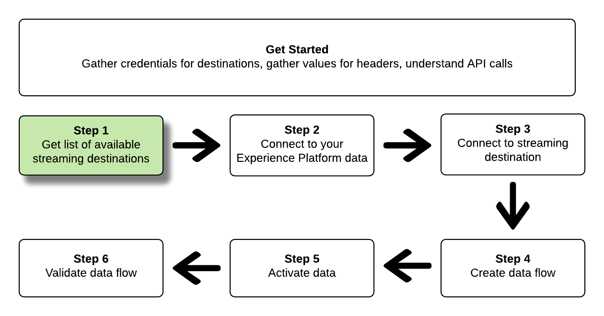
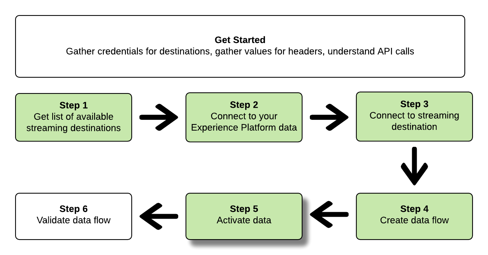

# 使用流量服務API連線到串流目的地並啟用資料

>[!IMPORTANT]
> 
>若要連線到目的地，您需要 **[!UICONTROL 管理目的地]** [存取控制許可權](/help/access-control/home.md#permissions).
>
>若要啟用資料，您需要 **[!UICONTROL 管理目的地]**， **[!UICONTROL 啟用目的地]**， **[!UICONTROL 檢視設定檔]**、和 **[!UICONTROL 檢視區段]** [存取控制許可權](/help/access-control/home.md#permissions).
>
>閱讀 [存取控制總覽](/help/access-control/ui/overview.md) 或聯絡您的產品管理員以取得必要許可權。

本教學課程示範如何使用API呼叫來連線至您的Adobe Experience Platform資料，以及建立與串流雲端儲存空間目的地([Amazon Kinesis](../catalog/cloud-storage/amazon-kinesis.md) 或 [Azure事件中樞](../catalog/cloud-storage/azure-event-hubs.md))、建立資料流至您新建立的目的地，並對您新建立的目的地啟用資料。

本教學課程使用 [!DNL Amazon Kinesis] 所有範例中的destination ，但步驟完全相同 [!DNL Azure Event Hubs].


如果您偏好使用Platform中的使用者介面來連線至目的地並啟用資料，請參閱 [連線目的地](../ui/connect-destination.md) 和 [啟用串流區段匯出目的地的受眾資料](../ui/activate-segment-streaming-destinations.md) 教學課程。

## 快速入門

本指南需要您實際瞭解下列Adobe Experience Platform元件：

* [[!DNL Experience Data Model (XDM) System]](../../xdm/home.md)：Experience Platform用來組織客戶體驗資料的標準化架構。
* [[!DNL Catalog Service]](../../catalog/home.md)： [!DNL Catalog] 是Experience Platform中資料位置和譜系的記錄系統。
* [沙箱](../../sandboxes/home.md)：Experience Platform提供的虛擬沙箱可將單一Platform執行個體分割成個別的虛擬環境，以利開發及改進數位體驗應用程式。

以下章節提供您需要瞭解的其他資訊，才能在Platform中啟用串流目的地的資料。

### 收集必要的認證

若要完成本教學課程中的步驟，您應準備好下列憑證，端視您要連線及啟用區段的目的地型別而定。

* 對象 [!DNL Amazon Kinesis] 連線： `accessKeyId`， `secretKey`， `region` 或 `connectionUrl`
* 對象 [!DNL Azure Event Hubs] 連線： `sasKeyName`， `sasKey`， `namespace`

### 讀取範例API呼叫 {#reading-sample-api-calls}

本教學課程提供範例API呼叫，示範如何格式化您的請求。 這些包括路徑、必要的標頭，以及正確格式化的請求裝載。 此外，也提供API回應中傳回的範例JSON。 如需檔案中用於範例API呼叫的慣例相關資訊，請參閱以下章節： [如何讀取範例API呼叫](../../landing/troubleshooting.md#how-do-i-format-an-api-request) 在Experience Platform疑難排解指南中。

### 收集必要和選用標題的值 {#gather-values}

若要對Platform API發出呼叫，您必須先完成 [驗證教學課程](https://www.adobe.com/go/platform-api-authentication-en). 完成驗證教學課程後，會提供所有Experience PlatformAPI呼叫中每個必要標題的值，如下所示：

* 授權：持有人 `{ACCESS_TOKEN}`
* x-api-key: `{API_KEY}`
* x-gw-ims-org-id: `{ORG_ID}`

Experience Platform中的資源可隔離至特定的虛擬沙箱。 在對Platform API的請求中，您可以指定將在其中執行操作的沙箱的名稱和ID。 這些是選用引數。

* x-sandbox-name: `{SANDBOX_NAME}`

>[!NOTE]
>
>如需Experience Platform中沙箱的詳細資訊，請參閱 [沙箱概述檔案](../../sandboxes/home.md).

包含裝載(POST、PUT、PATCH)的所有請求都需要額外的媒體型別標頭：

* Content-Type: `application/json`

### Swagger檔案 {#swagger-docs}

您可以在Swagger中找到本教學課程中所有API呼叫的隨附參考檔案。 請參閱 [有關Adobe I/O的流程服務API檔案](https://www.adobe.io/experience-platform-apis/references/flow-service/). 建議您同時使用本教學課程和Swagger檔案頁面。

## 取得可用串流目的地的清單 {#get-the-list-of-available-streaming-destinations}



首先，您應決定要將資料啟用的目標串流目的地。 首先，請執行呼叫以請求您可以連線並啟用區段的可用目的地清單。 對執行以下GET要求 `connectionSpecs` 端點以傳回可用目的地的清單：

**API格式**

```http
GET /connectionSpecs
```

**要求**

```shell
curl --location --request GET 'https://platform.adobe.io/data/foundation/flowservice/connectionSpecs' \
--header 'accept: application/json' \
--header 'x-gw-ims-org-id: {ORG_ID}' \
--header 'x-api-key: {API_KEY}' \
--header 'x-sandbox-name: {SANDBOX_NAME}' \
--header 'Authorization: Bearer {ACCESS_TOKEN}'
```


**回應**

成功的回應包含可用目的地的清單及其唯一識別碼(`id`)。 儲存您計畫使用的目的地值，因為後續步驟會需要該值。 例如，如果您想要連線並傳送區段至 [!DNL Amazon Kinesis] 或 [!DNL Azure Event Hubs]，在回應中尋找下列程式碼片段：

```json
{
    "id": "86043421-563b-46ec-8e6c-e23184711bf6",
  "name": "Amazon Kinesis",
  ...
  ...
}

{
    "id": "bf9f5905-92b7-48bf-bf20-455bc6b60a4e",
  "name": "Azure Event Hubs",
  ...
  ...
}
```

## 連線至您的Experience Platform資料 {#connect-to-your-experience-platform-data}


接下來，您必須連線至您的Experience Platform資料，才能匯出設定檔資料，並在您偏好的目的地啟用該資料。 這包含兩個子步驟，如下所述。

1. 首先，您必須透過設定基本連線，執行呼叫以授權存取Experience Platform中的資料。
2. 然後，使用基本連線ID進行另一個呼叫，您會在其中建立來源連線，以建立與您的Experience Platform資料的連線。


### 授權存取Experience Platform中的資料

**API格式**

```http
POST /connections
```

**要求**

```shell
curl --location --request POST 'https://platform.adobe.io/data/foundation/flowservice/connections' \
--header 'Authorization: Bearer {ACCESS_TOKEN}' \
--header 'x-api-key: {API_KEY}' \
--header 'x-gw-ims-org-id: {ORG_ID}' \
--header 'x-sandbox-name: {SANDBOX_NAME}' \
--header 'Content-Type: application/json' \
--data-raw '{
            "name": "Base connection to Experience Platform",
            "description": "This call establishes the connection to Experience Platform data",
            "connectionSpec": {
                "id": "{CONNECTION_SPEC_ID}",
                "version": "1.0"
            }
}'
```


* `{CONNECTION_SPEC_ID}`：使用設定檔服務的連線規格ID - `8a9c3494-9708-43d7-ae3f-cda01e5030e1`.

**回應**

成功的回應包含基本連線的唯一識別碼(`id`)。 將此值儲存為建立來源連線之下一個步驟所需的值。

```json
{
    "id": "1ed86558-59b5-42f7-9865-5859b552f7f4"
}
```

### 連線至您的Experience Platform資料 {#connect-to-platform-data}

**API格式**

```http
POST /sourceConnections
```

**要求**

```shell
curl --location --request POST 'https://platform.adobe.io/data/foundation/flowservice/sourceConnections' \
--header 'Authorization: Bearer {ACCESS_TOKEN}' \
--header 'x-api-key: {API_KEY}' \
--header 'x-gw-ims-org-id: {ORG_ID}' \
--header 'x-sandbox-name: {SANDBOX_NAME}' \
--header 'Content-Type: application/json' \
--data-raw '{
            "name": "Connecting to Profile Service",
            "description": "Optional",
            "connectionSpec": {
                "id": "{CONNECTION_SPEC_ID}",
                "version": "1.0"
            },
            "baseConnectionId": "{BASE_CONNECTION_ID}",
            "data": {
                "format": "json"
            },
            "params": {}
}'
```

* `{BASE_CONNECTION_ID}`：使用您在上一步中取得的ID。
* `{CONNECTION_SPEC_ID}`：使用設定檔服務的連線規格ID - `8a9c3494-9708-43d7-ae3f-cda01e5030e1`.

**回應**

成功的回應會傳回唯一識別碼(`id`)，用於新建立的設定檔服務來源連線。 這可確認您已成功連線至您的Experience Platform資料。 將此值儲存為後續步驟所需的值。

```json
{
    "id": "ed48ae9b-c774-4b6e-88ae-9bc7748b6e97"
}
```


## 連線到串流目的地 {#connect-to-streaming-destination}


在此步驟中，您會設定與所需串流目的地的連線。 這包含兩個子步驟，如下所述。

1. 首先，您必須透過設定基本連線，執行呼叫以授權對串流目的地的存取權。
2. 然後，使用基本連線ID進行另一個呼叫，以建立目標連線，指定儲存體帳戶中要傳送已匯出資料的位置，以及要匯出的資料格式。

### 授權對串流目的地的存取

**API格式**

```http
POST /connections
```

**要求**

>[!IMPORTANT]
>
>以下範例包含前置詞為的程式碼註解 `//`. 這些註解會強調不同串流目的地必須使用不同值的位置。 在使用程式碼片段之前，請先移除註解。

```shell
curl --location --request POST 'https://platform.adobe.io/data/foundation/flowservice/connections' \
--header 'Authorization: Bearer {ACCESS_TOKEN}' \
--header 'x-api-key: {API_KEY}' \
--header 'x-gw-ims-org-id: {ORG_ID}' \
--header 'x-sandbox-name: {SANDBOX_NAME}' \
--header 'Content-Type: application/json' \
--data-raw '{
    "name": "Connection for Amazon Kinesis/ Azure Event Hubs",
    "description": "summer advertising campaign",
    "connectionSpec": {
        "id": "{_CONNECTION_SPEC_ID}",
        "version": "1.0"
    },
    "auth": {
        "specName": "{AUTHENTICATION_CREDENTIALS}",
        "params": { // use these values for Amazon Kinesis connections
            "accessKeyId": "{ACCESS_ID}",
            "secretKey": "{SECRET_KEY}",
            "region": "{REGION}"
        },
        "params": { // use these values for Azure Event Hubs connections
            "sasKeyName": "{SAS_KEY_NAME}",
            "sasKey": "{SAS_KEY}",
            "namespace": "{EVENT_HUB_NAMESPACE}"
        }        
    }
}'
```

* `{CONNECTION_SPEC_ID}`：使用您在步驟中取得的連線規格ID [取得可用目的地的清單](#get-the-list-of-available-destinations).
* `{AUTHENTICATION_CREDENTIALS}`：填寫串流目的地的名稱： `Aws Kinesis authentication credentials` 或 `Azure EventHub authentication credentials`.
* `{ACCESS_ID}`： *對象 [!DNL Amazon Kinesis] 連線。* 您的Amazon Kinesis儲存位置的存取ID。
* `{SECRET_KEY}`： *對象 [!DNL Amazon Kinesis] 連線。* 您的Amazon Kinesis儲存位置的秘密金鑰。
* `{REGION}`： *對象 [!DNL Amazon Kinesis] 連線。* 您所在的地區 [!DNL Amazon Kinesis] Platform將用來串流處理資料的帳戶。
* `{SAS_KEY_NAME}`： *對象 [!DNL Azure Event Hubs] 連線。* 填入您的SAS金鑰名稱。 瞭解如何驗證 [!DNL Azure Event Hubs] 使用SAS金鑰 [Microsoft檔案](https://docs.microsoft.com/en-us/azure/event-hubs/authenticate-shared-access-signature).
* `{SAS_KEY}`： *對象 [!DNL Azure Event Hubs] 連線。* 填入您的SAS金鑰。 瞭解如何驗證 [!DNL Azure Event Hubs] 使用SAS金鑰 [Microsoft檔案](https://docs.microsoft.com/en-us/azure/event-hubs/authenticate-shared-access-signature).
* `{EVENT_HUB_NAMESPACE}`： *對象 [!DNL Azure Event Hubs] 連線。* 填入 [!DNL Azure Event Hubs] Platform將串流您的資料的名稱空間。 如需詳細資訊，請參閱 [建立事件中樞名稱空間](https://docs.microsoft.com/en-us/azure/event-hubs/event-hubs-create#create-an-event-hubs-namespace) 在 [!DNL Microsoft] 說明檔案。

**回應**

成功的回應包含基本連線的唯一識別碼(`id`)。 將此值儲存為下一個步驟建立目標連線所需的值。

```json
{
    "id": "1ed86558-59b5-42f7-9865-5859b552f7f4"
}
```

### 指定儲存位置和資料格式

**API格式**

```http
POST /targetConnections
```

**要求**

>[!IMPORTANT]
>
>以下範例包含前置詞為的程式碼註解 `//`. 這些註解會強調不同串流目的地必須使用不同值的位置。 在使用程式碼片段之前，請先移除註解。

```shell
curl --location --request POST 'https://platform.adobe.io/data/foundation/flowservice/targetConnections' \
--header 'Authorization: Bearer {ACCESS_TOKEN}' \
--header 'x-api-key: {API_KEY}' \
--header 'x-gw-ims-org-id: {ORG_ID}' \
--header 'Content-Type: application/json' \
--data-raw '{
    "name": "Amazon Kinesis/ Azure Event Hubs target connection",
    "description": "Connection to Amazon Kinesis/ Azure Event Hubs",
    "baseConnectionId": "{BASE_CONNECTION_ID}",
    "connectionSpec": {
        "id": "{CONNECTION_SPEC_ID}",
        "version": "1.0"
    },
    "data": {
        "format": "json"
    },
    "params": { // use these values for Amazon Kinesis connections
        "stream": "{NAME_OF_DATA_STREAM}", 
        "region": "{REGION}"
    },
    "params": { // use these values for Azure Event Hubs connections
        "eventHubName": "{EVENT_HUB_NAME}"
    }
}'
```

* `{BASE_CONNECTION_ID}`：使用您在上面步驟中取得的基本連線ID。
* `{CONNECTION_SPEC_ID}`：使用您在步驟中取得的連線規格 [取得可用目的地的清單](#get-the-list-of-available-destinations).
* `{NAME_OF_DATA_STREAM}`： *對象 [!DNL Amazon Kinesis] 連線。* 提供中現有資料串流的名稱 [!DNL Amazon Kinesis] 帳戶。 Platform會將資料匯出至此資料流。
* `{REGION}`： *對象 [!DNL Amazon Kinesis] 連線。* Amazon Kinesis帳戶中Platform將串流您資料的區域。
* `{EVENT_HUB_NAME}`： *對象 [!DNL Azure Event Hubs] 連線。* 填入 [!DNL Azure Event Hub] Platform將串流您資料的位置名稱。 如需詳細資訊，請參閱 [建立事件中樞](https://docs.microsoft.com/en-us/azure/event-hubs/event-hubs-create#create-an-event-hub) 在 [!DNL Microsoft] 說明檔案。

**回應**

成功的回應會傳回唯一識別碼(`id`)，用於新建立的串流目的地目標連線。 將此值儲存為後續步驟中所需的值。

```json
{
    "id": "12ab90c7-519c-4291-bd20-d64186b62da8"
}
```

## 建立資料流程


您現在可以使用在先前步驟中取得的ID，在Experience Platform資料與要啟用資料的目的地之間建立資料流。 將此步驟視為建構管道，稍後資料將透過管道在Experience Platform和您想要的目的地之間流動。

若要建立資料流，請執行POST要求（如下所示），同時在裝載中提供下列值。

執行下列POST要求以建立資料流。

**API格式**

```http
POST /flows
```

**要求**

```shell
curl -X POST \
'https://platform.adobe.io/data/foundation/flowservice/flows' \
-H 'Authorization: Bearer {ACCESS_TOKEN}' \
-H 'x-api-key: {API_KEY}' \
-H 'x-gw-ims-org-id: {ORG_ID}' \
-H 'x-sandbox-name: {SANDBOX_NAME}' \
-H 'Content-Type: application/json' \
-d  '{
  "name": "Azure Event Hubs",
  "description": "Azure Event Hubs",
  "flowSpec": {
    "id": "{FLOW_SPEC_ID}",
    "version": "1.0"
  },
  "sourceConnectionIds": [
    "{SOURCE_CONNECTION_ID}"
  ],
  "targetConnectionIds": [
    "{TARGET_CONNECTION_ID}"
  ],
  "transformations": [
    {
      "name": "GeneralTransform",
      "params": {
        "profileSelectors": {
          "selectors": [
            
          ]
        },
        "segmentSelectors": {
          "selectors": [
            
          ]
        }
      }
    }
  ]
}
```

* `{FLOW_SPEC_ID}`：以設定檔為基礎的目的地的流量規格ID為 `71471eba-b620-49e4-90fd-23f1fa0174d8`. 在呼叫中使用此值。
* `{SOURCE_CONNECTION_ID}`：使用您在步驟中取得的來源連線ID [連線至您的Experience Platform](#connect-to-your-experience-platform-data).
* `{TARGET_CONNECTION_ID}`：使用您在步驟中取得的目標連線ID [連線到串流目的地](#connect-to-streaming-destination).

**回應**

成功的回應會傳回ID (`id`)的資料流和 `etag`. 記下這兩個值。 如同您在下一個步驟中會使用的方式，來啟動區段。

```json
{
    "id": "8256cfb4-17e6-432c-a469-6aedafb16cd5",
    "etag": "8256cfb4-17e6-432c-a469-6aedafb16cd5"
}
```


## 將資料啟用至您的新目的地 {#activate-data}



建立所有連線和資料流程後，您現在可以將設定檔資料啟用至串流平台。 在此步驟中，您可以選取要傳送至目的地的區段和設定檔屬性，並且排程資料並將資料傳送至目的地。

若要啟用新目的地的區段，您必須執行JSONPATCH操作，類似於以下範例。 您可以在一次呼叫中啟用多個區段和設定檔屬性。 若要進一步瞭解JSONPATCH，請參閱 [RFC規格](https://tools.ietf.org/html/rfc6902).

**API格式**

```http
PATCH /flows
```

**要求**

```shell
curl --location --request PATCH 'https://platform.adobe.io/data/foundation/flowservice/flows/{DATAFLOW_ID}' \
--header 'Authorization: Bearer {ACCESS_TOKEN}' \
--header 'x-api-key: {API_KEY}' \
--header 'x-gw-ims-org-id: {ORG_ID}' \
--header 'Content-Type: application/json' \
--header 'x-sandbox-name: {SANDBOX_NAME}' \
--header 'If-Match: "{ETAG}"' \
--data-raw '[
  {
    "op": "add",
    "path": "/transformations/0/params/segmentSelectors/selectors/-",
    "value": {
      "type": "PLATFORM_SEGMENT",
      "value": {
        "name": "Name of the segment that you are activating",
        "description": "Description of the segment that you are activating",
        "id": "{SEGMENT_ID}"
      }
    }
  },
  {
    "op": "add",
    "path": "/transformations/0/params/profileSelectors/selectors/-",
    "value": {
      "type": "JSON_PATH",
      "value": {
        "operator": "EXISTS",
        "path": "{PROFILE_ATTRIBUTE}"
      }
    }
  }
]
```

| 屬性 | 說明 |
| --------- | ----------- |
| `{DATAFLOW_ID}` | 在URL中，使用您在上一步建立的資料流ID。 |
| `{ETAG}` | 取得 `{ETAG}` 根據上一步驟的回應， [建立資料流](#create-dataflow). 上一步中的回應格式有逸出引號。 您必須在請求的標頭中使用未逸出的值。 請參閱下列範例： <br> <ul><li>回應範例： `"etag":""7400453a-0000-1a00-0000-62b1c7a90000""`</li><li>要在您的請求中使用的值： `"etag": "7400453a-0000-1a00-0000-62b1c7a90000"`</li></ul> <br> 每次成功更新資料流時，etag值都會隨之更新。 |
| `{SEGMENT_ID}` | 提供您要匯出至此目的地的區段ID。 若要擷取您要啟用的區段的區段ID，請參閱 [擷取區段定義](https://www.adobe.io/experience-platform-apis/references/segmentation/#operation/retrieveSegmentDefinitionById) (在Experience Platform API參考中)。 |
| `{PROFILE_ATTRIBUTE}` | 例如, `"person.lastName"` |
| `op` | 用於定義更新資料流所需動作的操作呼叫。 作業包括： `add`， `replace`、和 `remove`. 若要將區段新增至資料流，請使用 `add` 作業。 |
| `path` | 定義要更新的流程部分。 將區段新增至資料流時，請使用範例中指定的路徑。 |
| `value` | 您想要用來更新引數的新值。 |
| `id` | 指定您要新增至目的地資料流的區段ID。 |
| `name` | *可選*. 指定您要新增至目的地資料流的區段名稱。 請注意，此欄位並非必填欄位，您可以成功將區段新增至目的地資料流，而不需要提供其名稱。 |

**回應**

尋找202 OK回應。 未傳回任何回應內文。 若要驗證請求是否正確，請參閱下一個步驟：驗證資料流程。

## 驗證資料流程


在教學課程的最後一步，您應驗證區段和設定檔屬性是否確實已正確對應至資料流程。

若要驗證此正確性，請執行下列GET要求：

**API格式**

```http
GET /flows
```

**要求**

```shell
curl --location --request PATCH 'https://platform.adobe.io/data/foundation/flowservice/flows/{DATAFLOW_ID}' \
--header 'Authorization: Bearer {ACCESS_TOKEN}' \
--header 'x-api-key: {API_KEY}' \
--header 'x-gw-ims-org-id: {ORG_ID}' \
--header 'Content-Type: application/json' \
--header 'x-sandbox-name: prod' \
--header 'If-Match: "{ETAG}"' 
```

* `{DATAFLOW_ID}`：使用上一個步驟的資料流程。
* `{ETAG}`：使用上一個步驟的etag。

**回應**

傳回的回應應包含在 `transformations` 引數您在上一步中提交的區段和設定檔屬性。 範例 `transformations` 回應中的引數可能如下所示：

```json
"transformations": [
    {
        "name": "GeneralTransform",
        "params": {
            "profileSelectors": {
                        "selectors": [
                            {
                                "type": "JSON_PATH",
                                "value": {
                                    "path": "personalEmail.address",
                                    "operator": "EXISTS"
                                }
                            },
                            {
                                "type": "JSON_PATH",
                                "value": {
                                    "path": "person.lastname",
                                    "operator": "EXISTS"
                                }
                            }
                        ]
                    },
            "segmentSelectors": {
                "selectors": [
                    {
                        "type": "PLATFORM_SEGMENT",
                        "value": {
                            "name": "Men over 50",
                            "description": "",
                            "id": "72ddd79b-6b0a-4e97-a8d2-112ccd81bd02"
                        }
                    }
                ]
            }
        }
    }
],
```

**匯出的資料**

>[!IMPORTANT]
>
> 除了設定檔屬性和步驟中的區段外 [將資料啟用至您的新目的地](#activate-data)，中匯出的資料 [!DNL AWS Kinesis] 和 [!DNL Azure Event Hubs] 也會包含身分對應的相關資訊。 這表示匯出的設定檔的身分(例如 [ECID](https://experienceleague.adobe.com/docs/id-service/using/intro/id-request.html)、行動ID、Google ID、電子郵件地址等)。 請參閱以下範例。

```json
{
  "person": {
    "email": "yourstruly@adobe.com"
  },
  "segmentMembership": {
    "ups": {
      "72ddd79b-6b0a-4e97-a8d2-112ccd81bd02": {
        "lastQualificationTime": "2020-03-03T21:24:39Z",
        "status": "exited"
      },
      "7841ba61-23c1-4bb3-a495-00d695fe1e93": {
        "lastQualificationTime": "2020-03-04T23:37:33Z",
        "status": "realized"
      }
    }
  },
  "identityMap": {
    "ecid": [
      {
        "id": "14575006536349286404619648085736425115"
      },
      {
        "id": "66478888669296734530114754794777368480"
      }
    ],
    "email_lc_sha256": [
      {
        "id": "655332b5fa2aea4498bf7a290cff017cb4"
      },
      {
        "id": "66baf76ef9de8b42df8903f00e0e3dc0b7"
      }
    ]
  }
}
```

## 使用 [!DNL Postman] 要連線至串流目的地的集合  {#collections}

若要以更簡化的方式連線至本教學課程中所述的串流目的地，您可以使用 [[!DNL Postman]](https://www.postman.com/).

[!DNL Postman] 是一種可用於進行API呼叫和管理預先定義呼叫和環境的程式庫的工具。

針對此特定教學課程，請完成下列步驟 [!DNL Postman] 已附加集合：

* [!DNL AWS Kinesis] [!DNL Postman] 集合
* [!DNL Azure Event Hubs] [!DNL Postman] 集合

按一下 [此處](../assets/api/streaming-destination/DestinationPostmanCollection.zip) 以下載收藏集封存。

每個集合都包含必要的請求和環境變數，適用於 [!DNL AWS Kinesis]、和 [!DNL Azure Event Hub]（分別）。

### 如何使用 [!DNL Postman] 集合 {#how-to-use-postman-collections}

若要使用附加成功連線至目的地 [!DNL Postman] 集合，請遵循下列步驟：

* 下載並安裝 [!DNL Postman]；
* [下載](../assets/api/streaming-destination/DestinationPostmanCollection.zip) 並解壓縮附加的集合；
* 將集合從其對應的資料夾匯入到 [!DNL Postman]；
* 依照本文的指示填寫環境變數；
* 執行 [!DNL API] 請求來源 [!DNL Postman]，根據本文中的指示。

## API錯誤處理 {#api-error-handling}

本教學課程中的API端點遵循一般Experience PlatformAPI錯誤訊息原則。 請參閱 [API狀態代碼](/help/landing/troubleshooting.md#api-status-codes) 和 [請求標頭錯誤](/help/landing/troubleshooting.md#request-header-errors) （位於Platform疑難排解指南中），以取得有關解釋錯誤回應的詳細資訊。

## 後續步驟 {#next-steps}

依照本教學課程所述，您已成功將Platform連線至其中一個慣用的串流目的地，並設定至個別目的地的資料流程。 傳出資料現在可用於客戶分析目的地或您可能想要執行的任何其他資料操作。 如需詳細資訊，請參閱下列頁面：

* [目的地概觀](../home.md)
* [目的地目錄概觀](../catalog/overview.md)
