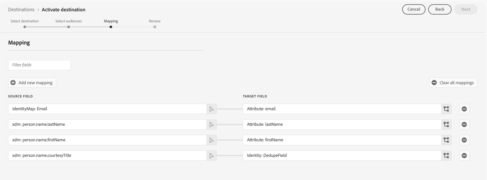

# Marketo Engage連線

## 概觀 {#overview}

[!DNL Marketo Engage]是行銷、廣告、分析和商務的唯一端對端客戶體驗管理(CXM)解決方案。 它可讓您自動化並管理從CRM銷售機會管理和客戶參與到帳戶式行銷和收入歸因的活動。

使用此目的地，在Adobe Experience Platform和Marketo Engage之間即時同步對象資料和設定檔屬性。

## 使用案例 {#use-cases}

為協助您更清楚瞭解您應如何及何時使用[!DNL Marketo Engage]目的地，以下是Adobe Experience Platform客戶可藉由使用此目的地解決的範例使用案例。

### Audience同步使用案例 {#audience-sync-use-cases}

**僅重新與已知潛在客戶互動**

行銷團隊想要執行回饋行銷活動，鎖定尚未參與90天以上但已存在於Marketo中的潛在客戶。

他們可以啟用Marketo Engage的對象並使用&#x200B;**[!UICONTROL 僅對象]**&#x200B;同步型別。

### 對象和設定檔同步使用案例 {#audience-profile-sync-use-cases}

**重新與已知潛在客戶互動並更新潛在客戶**

行銷團隊想要針對根據網站造訪次數顯示感興趣的現有Marketo聯絡人，推出重新參與行銷活動。 他們也要更新銷售機會資訊（例如偏好設定、人口統計資訊），但不想在Marketo中建立任何新的人員。

他們可以啟用Marketo Engage的對象，並使用&#x200B;**[!UICONTROL 對象和設定檔]**&#x200B;同步型別結合&#x200B;**[!UICONTROL 僅更新現有人員]**&#x200B;動作，以確保其僅鎖定已存在於Marketo中的對象。

**透過完整的設定檔同步重新參與及擴大觸及範圍**

行銷團隊想要為新行銷活動啟用產品興趣對象。 雖然許多設定檔已存在於Marketo中，但有些設定檔是新的，僅存在於Real-Time CDP中。 針對現有人員，他們想要確保在Marketo中更新這些人員，同時也建立新設定檔。

他們可以啟用Marketo Engage中的對象，並搭配使用&#x200B;**[!UICONTROL 對象和設定檔]**&#x200B;同步型別與&#x200B;**[!UICONTROL 更新現有和建立新人員]**&#x200B;動作，以確保他們鎖定來自Marketo的現有銷售機會，並為從Real-Time CDP匯出的新對象建立新銷售機會。

## 先決條件 {#prerequisites}

* 設定目的地的使用者必須在其Marketo執行個體和資料分割中擁有[編輯人員](https://experienceleague.adobe.com/zh-hant/docs/marketo/using/product-docs/administration/users-and-roles/descriptions-of-role-permissions#access-database)許可權。
* 設定此目的地時，將只能使用相同Adobe Real-Time CDP組織上的Marketo Engage執行個體。
* 只有在Adobe Admin Console中管理使用者的Marketo Engage執行個體才能使用此目的地。

## 支援的身分 {#supported-identities}

[!DNL Marketo Engage]支援下表所述的身分啟用。 深入瞭解[身分](/help/identity-service/features/namespaces.md)。

| 目標身分 | 說明 | 考量事項 |
|---|---|---|
| `DedupeField` | 用來識別和比對Marketo中現有潛在客戶的欄位。 | 在[對應](#mapping)步驟中，將您要用作重複資料刪除欄位的任何來源欄位（例如`Email`或其他自訂識別碼）對應到這個目標身分。 為了獲得最佳結果，請選擇在所有客戶設定檔中持續可用且唯一的欄位。 不支援`ECID`做為重複資料刪除欄位。 |

{style="table-layout:auto"}

## 支援的對象 {#supported-audiences}

本節說明您可以將哪些型別的對象匯出至此目的地。 以下兩個表格指出此聯結器支援的對象，依&#x200B;_對象來源_&#x200B;和包含在對象&#x200B;_中的_&#x200B;設定檔型別：

| 對象來源 | 支援 | 說明 |
|---------|----------|----------|
| [!DNL Segmentation Service] | ✓ | 透過Experience Platform [細分服務](../../../segmentation/home.md)產生的對象。 |
| 所有其他受眾來源 | ✓ | 此類別包含透過[!DNL Segmentation Service]產生的對象以外的所有對象來源。 閱讀[各種對象來源](/help/segmentation/ui/audience-portal.md#customize)。 部分範例包括： <ul><li> 自訂上傳對象[從CSV檔案匯入](../../../segmentation/ui/audience-portal.md#import-audience)至Experience Platform，</li><li> 相似受眾， </li><li> 同盟對象， </li><li> 在其他Experience Platform應用程式(例如Adobe Journey Optimizer)中產生的對象， </li><li> 及更多內容。 </li></ul>   |

{style="table-layout:auto"}

依受眾資料型別支援的受眾：

| 對象資料型別 | 支援 | 說明 | 使用案例 |
|--------------------|-----------|-------------|-----------|
| [人員對象](/help/segmentation/types/people-audiences.md) | 是 | 根據客戶設定檔，可讓您針對行銷活動的特定人群進行定位。 | 經常購買者、購物車放棄者 |
| [帳戶對象](/help/segmentation/types/account-audiences.md) | 無 | 針對帳戶型行銷策略，鎖定特定組織內的個人。 | B2B行銷 |
| [潛在客戶對象](/help/segmentation/types/prospect-audiences.md) | 無 | 將目標定位為尚未成為客戶但與目標受眾具有相同特性的個人。 | 使用第三方資料進行勘探 |
| [資料集匯出](/help/catalog/datasets/overview.md) | 無 | 儲存在Adobe Experience Platform Data Lake中的結構化資料集合。 | 報告、資料科學工作流程 |

{style="table-layout:auto"}

## 匯出型別和頻率 {#export-type-frequency}

請參閱下表以取得目的地匯出型別和頻率的資訊。

| 項目 | 類型 | 附註 |
---------|----------|---------|
| 匯出類型 | **[!UICONTROL 對象匯出]** | 您正在匯出具有[!DNL Marketo Engage]目的地中所使用識別碼（電子郵件、ECID）之對象的所有成員。 |
| 匯出頻率 | **[!UICONTROL 串流]** | 串流目的地是「一律開啟」的API型連線。 根據對象評估在Experience Platform中更新設定檔後，聯結器會立即將更新傳送至下游的目標平台。 深入瞭解[串流目的地](/help/destinations/destination-types.md#streaming-destinations)。 |

{style="table-layout:auto"}

## 潛在客戶比對行為 {#lead-matching}

瞭解Marketo銷售機會比對的運作方式，可協助您針對使用案例選擇正確的設定。 相符的行為取決於您選取的&#x200B;**[!UICONTROL 同步型別]**&#x200B;和&#x200B;**[!UICONTROL 人員動作]**&#x200B;設定。

Marketo會使用您選取的&#x200B;**[!UICONTROL Marketo重複資料刪除欄位]**，將Experience Platform設定檔與現有的Marketo潛在客戶進行比對。 相符程式會搜尋Marketo執行個體中的所有分割區，以尋找現有的銷售機會。 請參閱下表以瞭解如何根據您選取的設定，在您的Marketo執行個體中建立和更新銷售機會。

| 同步型別 | 個人動作 | 相符行為 |
|-----------|---------------|-------------------|
| **[!UICONTROL 僅設定檔]** | **[!UICONTROL 更新現有人員並建立新人員]** | <ul><li>使用新的設定檔資料更新現有銷售機會</li><li>在不相符的設定檔的選取資料分割中建立新的銷售機會</li></ul> |
| **[!UICONTROL 僅設定檔]** | **[!UICONTROL 僅更新現有人員]** | <ul><li>使用新的設定檔資料更新現有銷售機會</li><li>沒有為不相符的設定檔建立新的銷售機會</li></ul> |
| **[!UICONTROL 僅限對象]** | 不適用 | <ul><li>將現有潛在客戶新增至對象清單</li><li>沒有為不相符的設定檔建立新的銷售機會</li></ul> |
| **[!UICONTROL 對象和設定檔]** | **[!UICONTROL 更新現有人員並建立新人員]** | <ul><li>使用新的設定檔資料更新現有銷售機會</li><li>將現有潛在客戶新增至對象清單</li><li>在不相符的設定檔的選取資料分割中建立新的銷售機會</li><li>將新的潛在客戶新增至對象清單</li></ul> |
| **[!UICONTROL 對象和設定檔]** | **[!UICONTROL 僅更新現有人員]** | <ul><li>使用新的設定檔資料更新現有銷售機會</li><li>將現有潛在客戶新增至對象清單</li><li>沒有為不相符的設定檔建立新的銷售機會</li></ul> |

{style="table-layout:auto"}

### 重要考量

* **重複資料刪除欄位選擇**：選擇在您的客戶設定檔中一致可用且唯一的欄位（例如：電子郵件地址、客戶識別碼）
* **磁碟分割處理**：建立新的潛在客戶時，會將它們放置在選取的磁碟分割中（或者，如果未選取磁碟分割，則將&#x200B;**[!UICONTROL 預設]**&#x200B;磁碟分割）
* **重複處理**：如果多個Marketo銷售機會符合相同的設定檔，則只會更新最近更新的銷售機會
* **跨資料分割比對**：系統會在所有資料分割中進行搜尋，以尋找現有的銷售機會，無論您為新銷售機會選取哪個資料分割

## 連線到目標 {#connect}

>[!IMPORTANT]
> 
>* 若要連線到目的地，您需要&#x200B;**[!UICONTROL 檢視目的地]**&#x200B;和&#x200B;**[!UICONTROL 管理目的地]** [存取控制許可權](/help/access-control/home.md#permissions)。
>
>* 若要啟用資料，您需要&#x200B;**[!UICONTROL 檢視目的地]**、**[!UICONTROL 啟用目的地]**、**[!UICONTROL 檢視設定檔]**&#x200B;和&#x200B;**[!UICONTROL 檢視區段]** [存取控制許可權](/help/access-control/home.md#permissions)。 閱讀[存取控制總覽](/help/access-control/ui/overview.md)或連絡您的產品管理員以取得必要的許可權。

若要連線到此目的地，請依照[目的地組態教學課程](../../ui/connect-destination.md)中所述的步驟進行。 在設定目標工作流程中，填寫以下兩個區段中列出的欄位。

### 驗證目標 {#authenticate}

若要驗證到目的地，請選取&#x200B;**[!UICONTROL 連線到目的地]**。

### 填寫目標詳細資料 {#destination-details}

若要設定目的地的詳細資訊，請填寫下方的必填和選用欄位。 UI中欄位旁的星號表示該欄位為必填欄位。

* **[!UICONTROL 名稱]**：您日後可辨識此目的地的名稱。
* **[!UICONTROL 描述]**：可協助您日後識別此目的地的描述。
* **[!UICONTROL Munchkin ID]**：選取您要用於此目的地的[!DNL Marketo Munchkin ID]。
* **[!UICONTROL Workspace ID]**：選取您的Marketo工作區ID。
* **[!UICONTROL 同步型別]**：選取您要用於此目的地的同步型別：
   * **[!UICONTROL 對象和設定檔]**：當您想要將對象成員新增到Marketo清單，並保持其設定檔資訊為最新狀態時，請選取此選項。
   * **[!UICONTROL 僅設定檔]**：當您想要讓Marketo銷售機會設定檔與Experience Platform的最新資訊保持最新狀態時，請選取此選項。
   * **[!UICONTROL 僅限對象]**：如果您要將對象成員新增至Marketo清單，但不更新其設定檔資訊，請選取此選項。
* **[!UICONTROL 資料分割]**： *資料分割選擇只有在選擇&#x200B;**[!UICONTROL 僅設定檔]**&#x200B;或&#x200B;**[!UICONTROL 對象和設定檔]**&#x200B;同步型別*&#x200B;時才可用。 選取與您所選工作區相關聯的Marketo分割區ID。 這可讓您指定Marketo中的哪個銷售機會分割區會接收匯出的資料。 如果您未選擇特定的資料分割，您的資料將會傳送到Marketo中的&#x200B;**[!UICONTROL 預設]**&#x200B;資料分割。
* **[!UICONTROL Marketo重複資料刪除欄位]**：選取您要在更新現有Marketo銷售機會時使用的Marketo重複資料刪除欄位。 此選取器會顯示您在Marketo中標籤為重複資料刪除欄位的欄位。 如果您希望Marketo的特定欄位顯示為重複資料刪除欄位，您必須在Marketo中將欄位標示為[可搜尋的欄位](https://experienceleague.adobe.com/zh-hant/docs/marketo-developer/marketo/rest/lead-database/lead-database)。

  >[!NOTE]
  >
  >不支援Marketo `Lead ID`與Experience Cloud ID (`ECID`)的重複資料刪除。

* **[!UICONTROL 個人動作]**：選取匯出資料時要執行的Marketo動作。
   * **[!UICONTROL 更新現有並建立新人員]**：選取此選項可更新現有Marketo銷售機會，並為尚未在Marketo中的對象成員建立新銷售機會。 將在您選取的資料分割中建立新的潛在客戶。 如果您未選取資料分割，則會在&#x200B;**[!UICONTROL 預設]**&#x200B;資料分割中建立新的潛在客戶。
   * **[!UICONTROL 僅更新現有人員]**：當您只想更新現有Marketo銷售機會而不想建立新銷售機會時，請選取此選項。 如果有多個銷售機會符合相同的設定檔，則只有最近更新的Marketo銷售機會會以您的Experience Platform資料更新。

### 啟用警示 {#enable-alerts}

您可以啟用警報以接收有關傳送到您目的地的資料流狀態的通知。 從清單中選取警報以訂閱接收有關資料流狀態的通知。 如需警示的詳細資訊，請參閱[使用UI訂閱目的地警示](../../ui/alerts.md)的指南。

當您完成提供目的地連線的詳細資訊後，請選取&#x200B;**[!UICONTROL 下一步]**。

## 啟動此目標的對象 {#activate}

>[!IMPORTANT]
> 
>* 若要啟用資料，您需要&#x200B;**[!UICONTROL 檢視目的地]**、**[!UICONTROL 啟用目的地]**、**[!UICONTROL 檢視設定檔]**&#x200B;和&#x200B;**[!UICONTROL 檢視區段]** [存取控制許可權](/help/access-control/home.md#permissions)。 閱讀[存取控制總覽](/help/access-control/ui/overview.md)或連絡您的產品管理員以取得必要的許可權。
>* 若要匯出&#x200B;*身分*，您需要&#x200B;**[!UICONTROL 檢視身分圖表]** [存取控制許可權](/help/access-control/home.md#permissions)。  {width="100" zoomable="yes"}

閱讀[將設定檔和對象啟用至串流對象匯出目的地](/help/destinations/ui/activate-segment-streaming-destinations.md)，以瞭解啟用此目的地對象的指示。

### 必要的對應 {#required-mappings}

在對應步驟中，將您要做為重複資料刪除欄位的任何來源欄位（例如`email`或其他自訂識別碼）對應到`DedupeField`目標識別碼。 為了獲得最佳結果，請選擇在所有客戶設定檔中持續可用且唯一的欄位。

若要讓Marketo成功建立銷售機會，您也必須對應下列必要的目標屬性：

* `firstName`：潛在客戶的名字
* `lastName`：潛在客戶的姓氏
* `email`：潛在客戶的電子郵件地址

如果您使用`email`做為重複資料刪除欄位，您也必須對應`firstName`和`lastName`屬性，如下圖所示。

如果您使用不同的重複資料刪除欄位，則必須手動對應所有三個必要的屬性(`firstName`、`lastName`、`email`)，如下圖所示。

## 匯出的資料/驗證資料匯出 {#exported-data}

將對象匯出至Marketo Engage後，您應登入您的Marketo帳戶，驗證對象是否已如預期般啟用。 檢查Marketo中的相關銷售機會分割區和工作區，確認對象資料正確顯示，且已執行預期動作（例如更新或建立人員）。

如果您沒有看到預期的資料，請檢閱Adobe Experience Platform中的對應和匯出設定，然後再次嘗試匯出。

## 資料使用與控管 {#data-usage-governance}

處理您的資料時，所有[!DNL Adobe Experience Platform]目的地都符合資料使用原則。 如需[!DNL Adobe Experience Platform]如何強制資料控管的詳細資訊，請閱讀[資料控管概觀](/help/data-governance/home.md)。
