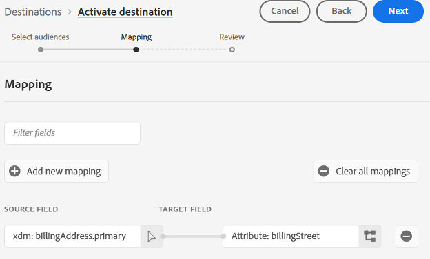

# Marketo Engage人員同步連線 {#marketo-engage-person-sync}

>[!IMPORTANT]
>
>此目的地聯結器為測試版，僅供特定客戶使用。 若要要求存取權，請聯絡您的Adobe代表。

## 概觀 {#overview}

使用Marketo Engage「人員同步」聯結器將個人受眾的更新串流到您Marketo Engage例項中的對應記錄。

>[!IMPORTANT]
> 
>[Marketo V2 Audience Sync Connector](/help/destinations/catalog/adobe/marketo-engage.md)不應在「建立」模式中與設定檔更新同步聯結器搭配使用

## 支援的身分和屬性 {#support-identities-and-attributes}

### 支援的身分 {#supported-identities}

| 目標身分 | 說明 |
| --------------- | ---------------------------------------------------------------------------------------------------------------------------------------------------------------------------------------- |
| 電子郵件 | 代表電子郵件地址的名稱空間。 這種型別的名稱空間通常與單一人員相關聯，因此可用於跨不同管道識別該人員。 |

{style="table-layout:auto"}

### 支援的屬性 {#supported-attributes}

您可以將屬性從「Experience Platform」對應至貴組織在Marketo中可以存取的任何屬性。 在Marketo中，您可以使用[Describe API](https://developer.adobe.com/marketo-apis/api/mapi/#tag/Leads/operation/describeUsingGET_6)要求來擷取貴組織有權存取的屬性欄位。

## 支援的對象 {#supported-audiences}

本節說明您可以將哪些型別的對象匯出至此目的地。

| 對象來源 | 支援 | 說明 |
| -------------------- | :-------: | ------------------------------------------------------------------------------------------------------------------------------------------------------------- |
| 分段服務 | ✓ (A) | 透過Experience Platform[細分服務](https://experienceleague.adobe.com/zh-hant/docs/experience-platform/segmentation/home)產生的對象。 |
| 自訂上傳 | ✓ (A) | 對象已從CSV檔案匯入Experience Platform。 |

## 匯出型別和頻率 {#export-type-and-frequency}

請參閱下表以取得目的地匯出型別和頻率的資訊。

| 項目 | 類型 | 附註 |
| ---------------- | --------- | ----------------------------------------------------------------------------------------------------------------------------------------------------------------------------------------------------------------------------------------------------------------------------------------------------------------------------------------------------------------------------------------- |
| 匯出頻率 | 串流 | 串流目的地是「一律開啟」的API型連線。 一旦根據對象評估在Experience Platform中更新了設定檔，聯結器就會將更新傳送至下游的目的地平台。 深入瞭解[串流目的地](/help/destinations/destination-types.md#streaming-destinations)。 |

{style="table-layout:auto"}

## 設定目的地 {#set-up-destination}

>[!IMPORTANT]
>
>* 若要連線到目的地，您需要&#x200B;**[!UICONTROL 檢視目的地]**&#x200B;和&#x200B;**[!UICONTROL 管理目的地]** [存取控制許可權](/help/access-control/home.md#permissions)。

如果貴公司可存取多個組織，請務必在Marketo Engage和Real-Time CDP(您可在此處設定與Marketo的目的地聯結器)中使用相同的組織。  如果您已設定目的地，您可以選取要搭配新設定使用的現有Marketo帳戶。  如果沒有，請按一下「聯結器至目的地」提示，此提示可讓您設定所要目的地的名稱、說明和Marketo Munchkin ID。  您可以在管理員 — >Munchkin功能表中找到您的Marketo執行個體的Munchkin ID。

>[!IMPORTANT]
>
>設定目的地的使用者必須在Marketo執行個體和資料分割中擁有[編輯人員](https://experienceleague.adobe.com/en/docs/marketo/using/product-docs/administration/users-and-roles/descriptions-of-role-permissions#access-database)許可權。

* **[!UICONTROL 名稱]**：您日後可辨識此目的地的名稱。
* **[!UICONTROL 描述]**：可協助您日後識別此目的地的描述。
* **[!UICONTROL Munchkin ID]**： Munchkin ID是特定Marketo執行個體的唯一識別碼。
* **[!UICONTROL 資料分割]**：Marketo Engage中的概念，用來依業務關係區分潛在客戶記錄
* **[!UICONTROL 第一個可搜尋的欄位]**：要取消重複的欄位。 欄位必須出現在輸入的每個潛在客戶記錄中。 預設為電子郵件
* **[!UICONTROL 第一個可搜尋的欄位]**：要取消重複的次要欄位。 欄位必須出現在輸入的每個潛在客戶記錄中。 選填

選取執行個體後，您還需要選取要與組態整合的Lead Partition。 [潛在客戶分割](https://experienceleague.adobe.com/en/docs/marketo/using/product-docs/administration/workspaces-and-person-partitions/understanding-workspaces-and-person-partitions)是Marketo Engage中的概念，用於依業務考量（例如品牌或銷售區域）來區分潛在客戶記錄。 如果您的Marketo訂閱沒有工作區與分割區功能，或是您的訂閱中尚未建立其他分割區，則只有預設分割區可用。 單一設定只能更新存在於其設定分割中的潛在客戶記錄。

>[!IMPORTANT]
> 
>第一次將對象啟動到Marketo目的地後，在Marketo目的地啟動之前回填對象中已存在的設定檔可能需要&#x200B;*最多24小時*。 此後，每當設定檔新增至對象時，都會立即新增至Marketo。

### 重複資料刪除欄位 {#deduplication-fields}

將更新傳送至Marketo engage時，會根據選取的分割區及一或兩個使用者選取的欄位來選取記錄。 如果您的目的地設定了北美分割區，且電子郵件地址和公司名稱設定為重複資料刪除欄位，則所有三個欄位都必須相符，才能將變更套用至現有記錄。 例如：

* 目的地已設定北美分割區
* Experience Platform中電子郵件為<test@example.com>且公司名稱為Example Inc.的人員符合目的地對象
* 除非Marketo中的北美分割區已存在具有這些值的記錄，否則將會建立新的潛在客戶記錄

如果找不到相符的潛在客戶記錄，則會建立新記錄。

## 啟用對象 {#activate-audiences}

>[!IMPORTANT]
> 
>* 若要啟用資料，您需要&#x200B;**[!UICONTROL 檢視目的地]**、**[!UICONTROL 啟用目的地]**、**[!UICONTROL 檢視設定檔]**&#x200B;和&#x200B;**[!UICONTROL 檢視區段]** [存取控制許可權](/help/access-control/home.md#permissions)。 閱讀[存取控制總覽](/help/access-control/ui/overview.md)或連絡您的產品管理員以取得必要的許可權。

閱讀[啟用串流區段匯出目的地的設定檔和區段](/help/destinations/ui/activate-segment-streaming-destinations.md)，以取得啟用此目的地的對象區段的指示。

在「啟用對象」步驟中，您將能夠選取您可見的任何個人對象。

## 欄位對應 {#field-mapping}

為了將特定人員屬性的變更傳送至Marketo Engage，該欄位必須從Real-Time CDP欄位對應至Marketo欄位。

Experience Platform資料型別和Marketo資料型別可透過下列方式對應：

| Experience Platform資料型別 | Marketo資料型別 |
| ----------------------------- | ------------------------------------ |
| 字串 | 字串、文字區域、Url、電話、電子郵件 |
| 列舉 | 字串 |
| 日期 | 日期 |
| 日期時間 | 日期時間 |
| 整數 | 整數 |
| 短整數 | 整數 |
| 長整數 | 浮點數 |
| 雙精度 | 貨幣，浮點數，% |
| 布林值 | 布林值 |
| 陣列 | 不支援 |
| 物件 | 不支援 |
| 地圖 | 不支援 |
| 位元組 | 不支援 |

{style="table-layout:auto"}

在某些情況下，最好允許整合功能設定欄位值（如果沒有欄位的話），同時防止整合功能更新已經有值的欄位。  如果您需要防止目的地聯結器覆寫Marketo Engage執行個體中的現有值，可以在Marketo執行個體的「管理員 — >欄位管理」區段中設定欄位以封鎖更新，並切換Adobe Experience Platform來源型別。

## 資料使用和管理 {#data-usage-and-governance}

處理您的資料時，所有Adobe Experience Platform目的地都符合資料使用原則。 如需Adobe Experience Platform如何強制資料控管的詳細資訊，請參閱[資料控管概觀](/help/data-governance/home.md)。
