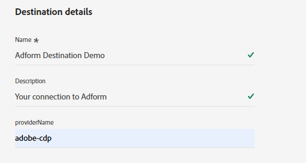

# Adform連線 {#adform}

## 概觀 {#overview}

Adform是程式化媒體購買和銷售解決方案的領先供應商。 將Adform連線至Adobe Experience Platform後，您就可以根據Experience Cloud ID (ECID)，透過Adform啟用第一方對象。

>[!IMPORTANT]
>
>目的地聯結器和檔案頁面是由Adform團隊建立和維護的。 若有任何查詢或更新要求，請直接透過`support@adform.com`聯絡。

## 使用案例 {#use-cases}

為協助您更清楚瞭解您應如何使用Adform目的地，以下是Adobe Experience Platform客戶可使用此目的地解決的範例使用案例。

### Adobe Real-Time CDP對象啟用 {#use-case-1}

使用此目的地將Adobe Real-Time CDP對象傳送至Adform，以根據Experience Cloud ID (ECID)和Adform的ID Fusion進行啟用。 Adform的ID Fusion是Adform的ID解析服務，可讓您根據Experience Cloud ID (ECID)啟用第一方對象。

一個常見案例是根據Experience Cloud ID (ECID)重新鎖定網站或應用程式的網站訪客。 您只需要透過隨時可用的[事件串流](https://exchange.adobe.com/apps/ec/600102/adform-s2s-site-tracking)或[使用者端](https://experienceleague.adobe.com/en/docs/experience-platform/destinations/catalog/analytics/adform) Adform擴充功能，將Experience Cloud ID (ECID)傳送至Adform。 之後您可以透過Adform目的地與Adform共用對象，以進行啟用 — 僅根據Experience Cloud ID (ECID)。

## 先決條件 {#prerequisites}

* 您必須是現有Adform客戶才能使用此目的地。
* 您需要擁有Adform對象基礎資料連線認證。
   * 如果您沒有Adform對象基礎資料連線認證，請聯絡您的Adform代表。
* 若要正確同步，您必須從實體與Adform網站追蹤建立[事件串流](https://exchange.adobe.com/apps/ec/600102/adform-s2s-site-tracking)或[使用者端](https://experienceleague.adobe.com/en/docs/experience-platform/destinations/catalog/analytics/adform)連線。
   * 如果您沒有從實體到Adform網站追蹤的事件串流或使用者端連線，請聯絡您的Adform代表。
   * Adform提供[事件串流](https://exchange.adobe.com/apps/ec/600102/adform-s2s-site-tracking)和[使用者端](https://experienceleague.adobe.com/en/docs/experience-platform/destinations/catalog/analytics/adform)的Adobe Experience Cloud擴充功能。

## 支援的身分 {#supported-identities}

Adform支援下表所述的身分啟用。 深入瞭解[身分](/help/identity-service/features/namespaces.md)。

| 目標身分 | 說明 | 考量事項 |
|---|---|---|
| ECID | Experience Cloud ID | 代表ECID的名稱空間。 此名稱空間也可以以下列别名表示：「Adobe Marketing Cloud ID」、「Adobe Experience Cloud ID」、「Adobe Experience Platform ID」。 如需詳細資訊，請參閱[ECID](/help/identity-service/features/ecid.md)上的下列檔案。 |

{style="table-layout:auto"}

## 支援的對象 {#supported-audiences}

本節說明您可以將哪些型別的對象匯出至此目的地。

| 對象來源 | 支援 | 說明 |
---------|----------|----------|
| [!DNL Segmentation Service] | ✓ | 透過Experience Platform [細分服務](../../../segmentation/home.md)產生的對象。 |
| 自訂上傳 | ✓ | 對象[從CSV檔案匯入](../../../segmentation/ui/overview.md#import-audience)至Experience Platform。 |

{style="table-layout:auto"}

## 匯出型別和頻率 {#export-type-frequency}

請參閱下表以取得目的地匯出型別和頻率的資訊。

| 項目 | 類型 | 附註 |
---------|----------|---------|
| 匯出類型 | **[!UICONTROL 區段匯出]** | 您正在匯出區段（對象）的所有成員，其中包含&#x200B;*YourDestination*&#x200B;目的地中使用的識別碼（名稱、電話號碼或其他）。 |
| 匯出頻率 | **[!UICONTROL 批次]** | 批次目的地會以三、六、八、十二或二十四小時的增量將檔案匯出至下游平台。 深入瞭解[批次檔案型目的地](/help/destinations/destination-types.md#file-based)。 |

{style="table-layout:auto"}

## 連線到目標 {#connect}

>[!IMPORTANT]
> 
>若要連線到目的地，您需要&#x200B;**[!UICONTROL 檢視目的地]**&#x200B;和&#x200B;**[!UICONTROL 管理目的地]** [存取控制許可權](/help/access-control/home.md#permissions)。 閱讀[存取控制總覽](/help/access-control/ui/overview.md)或連絡您的產品管理員以取得必要的許可權。

若要連線到此目的地，請依照[目的地組態教學課程](../../ui/connect-destination.md)中所述的步驟進行。 在設定目標工作流程中，填寫以下兩個區段中列出的欄位。

### 驗證目標 {#authenticate}

若要驗證到目的地，請填入必填欄位，然後選取&#x200B;**[!UICONTROL 連線到目的地]**。

* **[!UICONTROL 帳戶名稱]**：輸入帳戶名稱，以便日後識別此目的地連線。
* **[!UICONTROL S3存取金鑰識別碼]**：填入Adform提供的S3存取金鑰。
* **[!UICONTROL S3秘密存取金鑰]**：填入Adform提供的S3秘密存取金鑰。

### 填寫目標詳細資料 {#destination-details}

若要設定目的地的詳細資訊，請填寫下方的必填和選用欄位。 UI中欄位旁的星號表示該欄位為必填欄位。

* **[!UICONTROL 名稱]**：您日後可辨識此目的地的名稱。
* **[!UICONTROL 描述]**：可協助您日後識別此目的地的描述。
* **[!UICONTROL 提供者名稱]**：您的Adform帳戶名稱，由Adform提供。

### 啟用警示 {#enable-alerts}

您可以啟用警報以接收有關傳送到您目的地的資料流狀態的通知。 從清單中選取警報以訂閱接收有關資料流狀態的通知。 如需警示的詳細資訊，請參閱[使用UI訂閱目的地警示](../../ui/alerts.md)的指南。

當您完成提供目的地連線的詳細資訊後，請選取&#x200B;**[!UICONTROL 下一步]**。

## 啟動此目標的對象 {#activate}

>[!IMPORTANT]
> 
>* 若要啟用資料，您需要&#x200B;**[!UICONTROL 檢視目的地]**、**[!UICONTROL 啟用目的地]**、**[!UICONTROL 檢視設定檔]**&#x200B;和&#x200B;**[!UICONTROL 檢視區段]** [存取控制許可權](/help/access-control/home.md#permissions)。 閱讀[存取控制總覽](/help/access-control/ui/overview.md)或連絡您的產品管理員以取得必要的許可權。
>* 若要匯出&#x200B;*身分*，您需要&#x200B;**[!UICONTROL 檢視身分圖表]** [存取控制許可權](/help/access-control/home.md#permissions)。  {width="100" zoomable="yes"}

讀取[啟用批次設定檔匯出目的地的對象資料](/help/destinations/ui/activate-batch-profile-destinations.md)，以取得啟用此目的地的對象區段的指示。

### 對應屬性和身分 {#map}

* **ECID** (Experience Cloud ID)

在對應步驟期間，僅使用[!DNL ECID]目標識別對應。 請勿包含任何其他身分欄位，因為這會使啟用無法成功完成。

## 匯出的資料/驗證資料匯出 {#exported-data}

目的地聯結器只會將ECID身分匯出至目的地。 不會匯出其他身分。 若要檢查資料匯出是否成功，請登入您的Adform對象基礎帳戶，並檢查對象是否可用。

## 資料使用與控管 {#data-usage-governance}

處理您的資料時，所有[!DNL Adobe Experience Platform]目的地都符合資料使用原則。 如需[!DNL Adobe Experience Platform]如何強制資料控管的詳細資訊，請閱讀[資料控管概觀](/help/data-governance/home.md)。

## 其他資源 {#additional-resources}

如需Adform對象基礎的其他資訊，請參閱[Adform對象基礎檔案](https://www.adformhelp.com/hc/en-us/categories/9738365991697-Data-Management-Platform)。