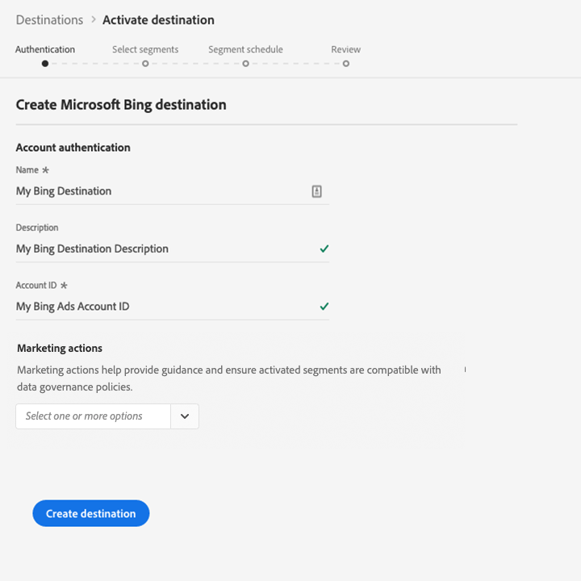

# [!DNL Microsoft Bing] 連接  {#bing-destination}

[!DNL Microsoft Bing]目的地可協助您將描述檔資料傳送至[!DNL Microsoft Display Advertising]。

要向[!DNL Microsoft Bing]發送配置檔案資料，必須首先連接到目標。

## 目標規格{#destination-specs}

請注意以下特定於[!DNL Microsoft Bing]目標的詳細資訊：

* 您可以將下列[identitys](../../../identity-service/namespaces.md)傳送至[!DNL Microsoft Bing]目標：[!DNL Microsoft ID]。

>[!IMPORTANT]
>
>如果您想要使用[!DNL Microsoft Bing]建立您的第一個目標，而過去(使用Adobe Audience Manager或其他應用程式)未啟用Experience CloudID服務中的[ID同步功能](https://experienceleague.adobe.com/docs/id-service/using/id-service-api/methods/idsync.html)，請聯絡Adobe諮詢或客戶服務以啟用ID同步。 如果您先前已在Audience Manager中設定[!DNL Microsoft Bing]整合，您設定的ID同步化會延續至平台。

## 使用案例 {#use-cases}

身為行銷人員，我想要能夠使用以[!DNL Microsoft Advertising IDs]為基礎的區段，透過[!DNL Microsoft Advertising]通道的展示廣告來鎖定使用者。

## 導出類型{#export-type}

**[!DNL Segment Export]** -您正將區段（觀眾）的所有成員匯出至目 [!DNL Microsoft Bing] 標。

## 先決條件 {#prerequisites}

配置目標時，必須提供以下資訊：

* [!UICONTROL 帳戶ID]:這是整數 [!DNL Bing Ads CID]格式的您。

## 連接到目標{#connect-destination}

在&#x200B;**[!UICONTROL 連接]** > **[!UICONTROL 目標]**&#x200B;中，選擇[!DNL Microsoft Bing] ，然後選擇&#x200B;**[!UICONTROL 配置]**。

>[!NOTE]
>
>如果已存在與此目標的連接，您可以在目標卡上看到&#x200B;**[!UICONTROL 激活]**&#x200B;按鈕。 有關&#x200B;**[!UICONTROL Activate]**&#x200B;和&#x200B;**[!UICONTROL Configure]**&#x200B;之間差異的詳細資訊，請參閱目標工作區文檔的[Catalog](../../ui/destinations-workspace.md#catalog)部分。
>
>

在[!UICONTROL Authentication]步驟中，必須輸入目標連接詳細資訊：

* **[!UICONTROL 名稱]**:您將來識別此目的地的名稱。
* **[!UICONTROL 說明]**:將來幫助您識別此目標的說明。
* **[!UICONTROL 帳戶ID]**:您的 [!DNL Bing Ads CID]。
* **[!UICONTROL 行銷動作]**:行銷動作會指出將資料匯出至目的地的方式。您可以從Adobe定義的行銷動作中選擇，也可以建立自己的行銷動作。 如需行銷動作的詳細資訊，請參閱「Adobe Experience Platform的資料治理」頁面。 如需個別Adobe定義之行銷動作的詳細資訊，請參閱[資料使用政策概述](../../../data-governance/policies/overview.md)。

按一下&#x200B;**[!UICONTROL 建立目標]**。 您的目標現在已建立。 如果您想稍後啟動區段，可以按一下[!UICONTROL 儲存並退出]，或按一下[!UICONTROL Next]繼續工作流程並選取要啟動的區段。 在這兩種情況下，請參閱工作流程的下一節[啟動區段](#activate-segments)。

## 啟用區段{#activate-segments}

如需區段啟動工作流程的相關資訊，請參閱[啟用設定檔和區段至目標](../../ui/activate-destinations.md#select-attributes)。

在[區段排程](../../ui/activate-destinations.md#segment-schedule)步驟中，您必須手動將區段對應至目標中的對應ID或好記名稱。

在對應區段時，建議您使用[!DNL Platform]區段名稱或更短的區段名稱，以方便使用。 不過，您目的地中的區段ID或名稱不需要與[!DNL Platform]帳戶中的區段ID或名稱相符。 您在映射欄位中插入的任何值，都會由目標反映。

## 導出資料{#exported-data}

要驗證資料是否已成功導出到[!DNL Microsoft Bing]目標，請檢查[!DNL Microsoft Bing Ads]帳戶。 如果啟動成功，您的帳戶會填入觀眾。