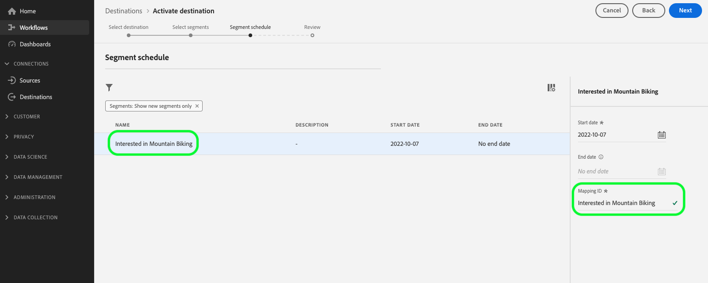

# [!DNL Microsoft Bing] 連線 {#bing-destination}

## 概觀 {#overview}

使用[!DNL Microsoft Bing]目的地將設定檔資料傳送至整個[!DNL Microsoft Advertising Network]，包括[!DNL Display Advertising]、[!DNL Search]和[!DNL Native]。

[!DNL Microsoft Bing]目的地會在Microsoft中建立&#x200B;*[!DNL Custom Audiences]*。 如[!DNL Microsoft Search Network]Microsoft Advertising檔案[!DNL Audience Network]所列，這些在[!DNL Native]和[!DNL Display] ([!DNL Programmatic] /[ /](https://help.ads.microsoft.com/#apex/ads/en/56892/1-500))中均可用。

若要將設定檔資料傳送至[!DNL Microsoft Bing]，您必須先連線至目的地。

## 使用案例 {#use-cases}

身為行銷人員，我想要能夠使用以[!DNL Microsoft Advertising IDs]為基礎建立的對象，透過[!DNL Microsoft Advertising]管道的顯示或搜尋廣告來鎖定使用者。

## 支援的身分 {#supported-identities}

[!DNL Microsoft Bing]支援根據下表所示的身分啟用對象。 深入瞭解[身分](/help/identity-service/features/namespaces.md)。

下表中的所有身分都已預先設定，並在啟用期間自動對應。 您不需要手動設定這些對應。

| 身分識別 | 說明 | 考量事項 |
|---|---|---|
| MAID | MICROSOFT ADVERTISING ID | 當設定檔上存在Microsoft Advertising ID時啟動。 |
| ECID | Experience Cloud ID | **必要。**&#x200B;所有設定檔都必須有ECID，且具有要匯出的對應Microsoft Advertising ID。 |

{style="table-layout:auto"}

## 支援的對象 {#supported-audiences}

本節說明您可以將哪些型別的對象匯出至此目的地。

| 對象來源 | 支援 | 說明 |
|---------|----------|----------|
| [!DNL Segmentation Service] | ✓ | 透過Experience Platform [細分服務](../../../segmentation/home.md)產生的對象。 |
| 自訂上傳 | ✓ | 對象[從CSV檔案匯入](../../../segmentation/ui/audience-portal.md#import-audience)至Experience Platform。 |

{style="table-layout:auto"}

## 匯出型別和頻率 {#export-type-frequency}

**[!DNL Audience Export]** — 您正在將對象的所有成員匯出至[!DNL Microsoft Bing]目的地。

請參閱下表以取得目的地匯出型別和頻率的資訊。

| 項目 | 類型 | 附註 |
|---------|----------|---------|
| 匯出類型 | **[!UICONTROL Audience export]** | 您正在將對象的所有成員匯出至[!DNL Microsoft Bing]目的地。 |
| 匯出頻率 | **[!UICONTROL Streaming]** | 串流目的地是「一律開啟」的API型連線。 根據對象評估在Experience Platform中更新設定檔後，聯結器會立即將更新傳送至下游的目標平台。 深入瞭解[串流目的地](/help/destinations/destination-types.md#streaming-destinations)。 |

{style="table-layout:auto"}

## 先決條件 {#prerequisites}

[!DNL Microsoft Bing]目的地需要下列安裝程式才能正常運作：

1. **啟用ID同步功能**：如果您是第一次設定[!DNL Microsoft Bing]啟用，而且您過去尚未在Experience Cloud ID服務中啟用[ID同步功能](https://experienceleague.adobe.com/docs/id-service/using/id-service-api/methods/idsync.html) (使用Adobe Audience Manager或其他應用程式)，請聯絡Adobe Consulting或客戶服務以啟用ID同步。
   * 如果您先前在Audience Manager中設定[!DNL Microsoft Bing]整合，您現有的ID同步會自動結轉到Experience Platform。

2. **確認設定檔上的ECID**：所有設定檔都必須有ECID，才能成功匯出。 此目的地的ECID為&#x200B;**必要**。

設定目的地時，您必須提供下列資訊：

* [!UICONTROL Account ID]：這是您的[!DNL Bing Ads CID]，以整數格式。

## 連線到目標 {#connect}

>[!IMPORTANT]
> 
>若要連線到目的地，您需要&#x200B;**[!UICONTROL View Destinations]**&#x200B;和&#x200B;**[!UICONTROL Manage Destinations]** [存取控制許可權](/help/access-control/home.md#permissions)。 閱讀[存取控制總覽](/help/access-control/ui/overview.md)或連絡您的產品管理員以取得必要的許可權。

若要連線到此目的地，請依照[目的地組態教學課程](../../ui/connect-destination.md)中所述的步驟進行。

### 填寫目標詳細資訊 {#parameters}

在[設定](../../ui/connect-destination.md)此目的地時，您必須提供下列資訊：

* **[!UICONTROL Name]**：您日後可辨識此目的地的名稱。
* **[!UICONTROL Description]**：可協助您日後識別此目的地的說明。
* **[!UICONTROL Account ID]**：您的[!DNL Bing Ads Customer ID] (CID)。 您的CID是整數，在您登入[!DNL Microsoft Advertising]時可在URL中找到。

### 啟用警示 {#enable-alerts}

您可以啟用警報以接收有關傳送到您目的地的資料流狀態的通知。 從清單中選取警報以訂閱接收有關資料流狀態的通知。 如需警示的詳細資訊，請參閱[使用UI訂閱目的地警示](../../ui/alerts.md)的指南。

當您完成提供目的地連線的詳細資訊時，請選取&#x200B;**[!UICONTROL Next]**。

## 啟動此目標的對象 {#activate}

>[!CONTEXTUALHELP]
>id="platform_destinations_bing_mapping_id"
>title="對應 ID"
>abstract="輸入要對應選取區段的數值 Bing 對象 ID。如果提供的[!UICONTROL Mapping ID]未對應至Bing目的地中的受眾ID，您不會在Bing帳戶中看到預期的受眾資料。"

>[!CONTEXTUALHELP]
>id="platform_destinations_required_mappings_bing"
>title="預先設定的對應集"
>abstract="我們已為您預先設定這兩個對應集。 當您啟用資料至Microsoft Bing時，符合啟用對象資格的設定檔必須至少有一個與其設定檔相關聯的ECID身分識別，才能成功匯出至目的地。"
>additional-url="https://experienceleague.adobe.com/en/docs/experience-platform/destinations/catalog/advertising/bing#preconfigured-mappings" text="深入瞭解預先設定的對應"

>[!IMPORTANT]
> 
>若要啟用資料，您需要&#x200B;**[!UICONTROL View Destinations]**、**[!UICONTROL Activate Destinations]**、**[!UICONTROL View Profiles]**&#x200B;和&#x200B;**[!UICONTROL View Segments]** [存取控制許可權](/help/access-control/home.md#permissions)。 閱讀[存取控制總覽](/help/access-control/ui/overview.md)或連絡您的產品管理員以取得必要的許可權。

如需啟用此目的地的對象的指示，請參閱[啟用串流對象匯出目的地的對象資料](../../ui/activate-segment-streaming-destinations.md)。

在[對象排程](../../ui/activate-segment-streaming-destinations.md#scheduling)步驟中，您必須在[!UICONTROL Mapping ID]欄位中手動對應對象名稱。 這可確保對象中繼資料正確傳遞至[!DNL Bing]。

### 預先設定的對應 {#preconfigured-mappings}

下列身分對應已預先設定&#x200B;**，並在對象啟用工作流程期間自動填入**：

* **MAID** (Microsoft Advertising ID)
* **ECID** (Experience Cloud ID)

這些對應會呈現灰色，而且是唯讀的。 您不需要在此步驟中設定任何專案。 選取&#x200B;**[!UICONTROL Next]**&#x200B;以繼續。

>[!IMPORTANT]
>
>需要&#x200B;**ECID才能成功匯出。**&#x200B;在ECID與Microsoft Advertising ID之間沒有ECID或沒有ID同步對應的設定檔將不會匯出。

### 啟用範例

* **具有ECID與Microsoft Advertising ID對應的設定檔：**&#x200B;已成功匯出和啟動
* **只有ECID的設定檔(沒有Microsoft Advertising ID對應)：**&#x200B;設定檔&#x200B;**未匯出**。 需要ECID與MAID之間的ID同步對應。
* 不含ECID的&#x200B;**設定檔：**&#x200B;設定檔&#x200B;**未匯出**。 此目的地必須有ECID。

## 匯出的資料 {#exported-data}

若要確認資料是否已成功匯出至[!DNL Microsoft Bing]目的地，請檢查您的[!DNL Microsoft Bing Ads]帳戶。 如果成功啟用，系統會將對象填入您的帳戶。
