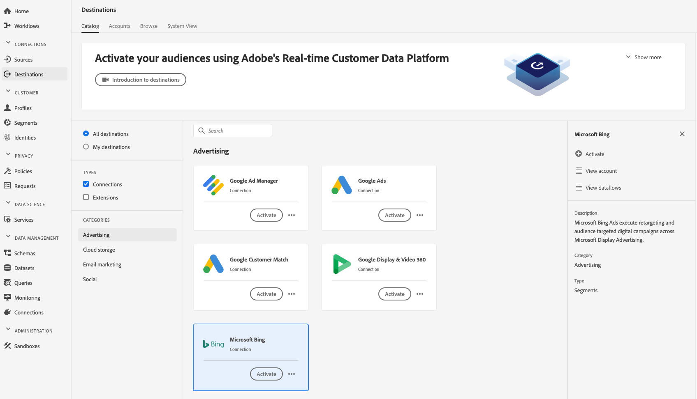

# [!DNL Microsoft Bing] 連接  {#bing-destination}

## 概覽 {#overview}

[!DNL Microsoft Bing]目的地可協助您將設定檔資料傳送至[!DNL Microsoft Display Advertising]。

若要將設定檔資料傳送至[!DNL Microsoft Bing]，您必須先連線至目的地。

## 使用實例 {#use-cases}

身為行銷人員，我想要使用[!DNL Microsoft Advertising IDs]建置的區段，透過[!DNL Microsoft Advertising]管道的顯示廣告來鎖定使用者。

## 支援的身分{#supported-identities}

[!DNL Microsoft Bing] 支援啟用下表所述的身分。深入了解[identities](/help/identity-service/namespaces.md)。

| Target身分 | 說明 |
|---|---|
| 女傭 | Microsoft Advertising ID |

## 導出類型{#export-type}

**[!DNL Segment Export]**  — 您會將區段（對象）的所有成員匯出至目 [!DNL Microsoft Bing] 的地。

## 先決條件 {#prerequisites}

如果您想使用[!DNL Microsoft Bing]建立第一個目的地，而過去(使用Adobe Audience Manager或其他應用程式)未在Experience CloudID服務中啟用[ID同步功能](https://experienceleague.adobe.com/docs/id-service/using/id-service-api/methods/idsync.html)，請洽詢Adobe諮詢或客戶服務以啟用ID同步。 如果您先前已在Audience Manager中設定[!DNL Microsoft Bing]整合，則您設定的ID同步會持續到Platform。

設定目的地時，您必須提供下列資訊：

* [!UICONTROL 帳戶ID]:這是整 [!DNL Bing Ads CID]數格式的。

## 連接到目標{#connect-destination}

在&#x200B;**[!UICONTROL 連接]** > **[!UICONTROL 目標]**&#x200B;中，選擇[!DNL Microsoft Bing]，然後選擇&#x200B;**[!UICONTROL 配置]**。

如果與此目的地的連線已存在，您可以在目標卡上看到&#x200B;**[!UICONTROL 啟動]**&#x200B;按鈕。 有關&#x200B;**[!UICONTROL Activate]**&#x200B;和&#x200B;**[!UICONTROL Configure]**&#x200B;之間差異的詳細資訊，請參閱目標工作區檔案的[Catalog](../../ui/destinations-workspace.md#catalog)區段。

## 驗證步驟 {#authentication}

在&#x200B;**[!UICONTROL Authentication]**&#x200B;步驟中，必須輸入目標連接詳細資訊：

* **[!UICONTROL 名稱]**:日後您將透過此名稱識別此目的地。
* **[!UICONTROL 說明]**:未來可協助您識別此目的地的說明。
* **[!UICONTROL 帳戶ID]**:您的 [!DNL Bing Ads CID]。
* **[!UICONTROL 行銷動作]**:行銷動作會指出要將資料匯出至目的地的目的。您可以從Adobe定義的行銷動作中選取，或者您可以建立自己的行銷動作。 如需行銷動作的詳細資訊，請參閱Adobe Experience Platform](../../../data-governance/policies/overview.md)中的[資料控管頁面。 如需個別Adobe定義行銷動作的相關資訊，請參閱[資料使用原則概述](../../../data-governance/policies/overview.md)。

按一下&#x200B;**[!UICONTROL 建立目標]**。 您的目的地現在已建立。 如果您想稍後啟動區段，可以按一下[!UICONTROL 儲存並退出]，或按一下[!UICONTROL 下一步]以繼續工作流程並選取要啟動的區段。 無論是哪種情況，請參閱工作流程其餘部分的下一節[啟用區段](#activate-segments)。

## 啟動區段{#activate-segments}

如需區段啟動工作流程的相關資訊，請參閱[將設定檔和區段啟用至目的地](../../ui/activate-destinations.md#select-attributes)。

在[區段排程](../../ui/activate-destinations.md#segment-schedule)步驟中，您必須手動將區段對應至目的地中的對應ID或好記名稱。

對應區段時，建議您使用[!DNL Platform]區段名稱或更短的名稱，以方便使用。 不過，您目的地的區段ID或名稱不需要與[!DNL Platform]帳戶中的ID或名稱相符。 您在對應欄位中插入的任何值都會由目的地反映。

## 導出的資料{#exported-data}

要驗證資料是否已成功導出到[!DNL Microsoft Bing]目標，請檢查[!DNL Microsoft Bing Ads]帳戶。 如果啟動成功，則會在您的帳戶中填入對象。
