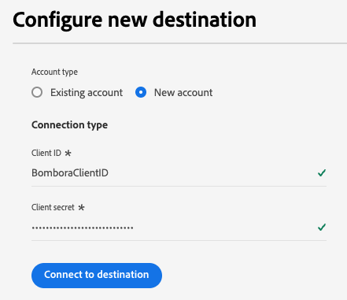

# Bombora連線 {#bombora}

>[!AVAILABILITY]
>
>購買[企業對企業](/help/rtcdp/overview.md#rtcdp-b2b)和[企業對個人](/help/rtcdp/overview.md#rtcdp-b2p)版Real-Time Customer Data Platform的公司可以使用Bombora目的地啟用帳戶對象的功能。

根據[帳戶對象](/help/segmentation/types/account-audiences.md)，為您的Bombora行銷活動啟用設定檔，以用於對象目標定位、個人化和隱藏。

## 使用案例 {#use-case}

為協助您更清楚瞭解應該如何及何時使用Bombora目的地，以下是Adobe Experience Platform客戶可藉由使用此目的地解決的範例使用案例。

### DSP整合 {#dsp-integration}

身為B2B行銷人員，您可以在Real-time CDP中建立帳戶清單，識別對您的產品有很高意圖的公司，然後使用此目的地在Bombora啟用此清單。

透過Bombra與DSP的整合，您可以使用Bombra資料執行目標式廣告行銷活動。 這可確保您的廣告支出聚焦於最有可能轉換的公司。

### Account-Based Marketing {#abm}

身為B2B行銷人員，您可以根據CRM和行銷訊號建立帳戶清單。 然後，您可以使用此目的地在Bombora啟動此清單，其中ABM感知控制項可協助您鎖定這些公司的決策者。

### 多管道帳戶型行銷啟用 {#multi-channel-abm}

身為B2B行銷人員，您可以在Real-time CDP中建立帳戶清單，以識別高意圖的公司。 接著，您可以使用此目的地在Bombora中啟動清單，跨多個管道執行目標式行銷活動。

在付費社群媒體上，您可能會在[!DNL LinkedIn]和[!DNL Facebook]等平台上，在目標帳戶向專業人員提供個人化廣告。 使用原生廣告平台，即可確保內容能傳達給相關的決策者。

您也可以將行銷活動延伸至進階電視，將廣告遞送至重要帳戶。

這種多管道方法可確保跨平台傳送一致的訊息，最大化參與度和轉換率。

## 支援的對象 {#supported-audiences}

本節說明您可以將哪些型別的對象匯出至此目的地。

| 對象來源 | 支援 | 說明 |
---------|----------|----------|
| [!DNL Segmentation Service] | ✓ | 透過Experience Platform [細分服務](../../../segmentation/home.md)產生的對象。 |
| 自訂上傳 | X | 對象[從CSV檔案匯入](../../../segmentation/ui/overview.md#import-audience)至Experience Platform。 |

{style="table-layout:auto"}

## 支援的身分 {#supported-identities}

Bombora需要下表描述的目標識別對應。 深入瞭解[身分](/help/identity-service/features/namespaces.md)。

| 目標身分 | 說明 |
|---|---|
| `primaryId` | Bombora需要此目標身分的對應，才能讓整合正確運作。 您可以將任何來源欄位對應至此身分。 此對應是強制性的，但不會將資料匯出至Bombora。 |

{style="table-layout:auto"}

## 匯出型別和頻率 {#export-type-and-frequency}

請參閱下表以取得目的地匯出型別和頻率的資訊。

| 項目 | 類型 | 附註 |
---------|----------|---------|
| 匯出類型 | **[!UICONTROL 對象匯出]** | 您正在匯出具有[!DNL Bombora]目的地中所使用識別碼（名稱、電話號碼或其他）的對象的所有成員。 |
| 匯出頻率 | **[!UICONTROL 串流]** | 串流目的地是「一律開啟」的API型連線。 根據對象評估在Experience Platform中更新設定檔後，聯結器會立即將更新傳送至下游的目標平台。 深入瞭解[串流目的地](/help/destinations/destination-types.md#streaming-destinations)。 |

{style="table-layout:auto"}

## 先決條件 {#prerequisites}

若要將帳戶對象匯出至Bombra，您需要下列資訊。

1. Bombra帳戶。
2. Bombora **[!UICONTROL 使用者端識別碼]**&#x200B;和&#x200B;**[!UICONTROL 使用者端密碼]**。

## 連線到目標 {#connect}

>[!IMPORTANT]
> 
>若要連線到目的地，您需要&#x200B;**[!UICONTROL 檢視目的地]**&#x200B;和&#x200B;**[!UICONTROL 管理目的地]** [存取控制許可權](/help/access-control/home.md#permissions)。 閱讀[存取控制總覽](/help/access-control/ui/overview.md)或連絡您的產品管理員以取得必要的許可權。

若要連線到此目的地，請依照[目的地組態教學課程](../../ui/connect-destination.md)中所述的步驟進行。 在設定目標工作流程中，填寫以下兩個區段中列出的欄位。

### 驗證目標 {#authenticate}

若要驗證到目的地，請填入必填欄位，然後選取&#x200B;**[!UICONTROL 連線到目的地]**。

* **[!UICONTROL 使用者端識別碼]**：輸入您的[!DNL Bombora]使用者端識別碼。
* **[!UICONTROL 使用者端密碼]**：輸入您的[!DNL Bombora]使用者端密碼。

### 填寫目標詳細資訊 {#destination-details}

若要設定目的地的詳細資訊，請填寫下方的必填和選用欄位。 UI中欄位旁的星號表示該欄位為必填欄位。

* **[!UICONTROL 名稱]**：您日後可辨識此目的地的名稱。
* **[!UICONTROL 描述]**：可協助您日後識別此目的地的描述。

現在您已準備好在Bombora內啟用您的對象。

## 啟動此目標的對象 {#activate}

>[!IMPORTANT]
> 
>* 若要啟用資料，您需要&#x200B;**[!UICONTROL 檢視目的地]**、**[!UICONTROL 啟用目的地]**、**[!UICONTROL 檢視設定檔]**&#x200B;和&#x200B;**[!UICONTROL 檢視區段]** [存取控制許可權](/help/access-control/home.md#permissions)。 閱讀[存取控制總覽](/help/access-control/ui/overview.md)或連絡您的產品管理員以取得必要的許可權。
>* 若要匯出&#x200B;*身分*，您需要&#x200B;**[!UICONTROL 檢視身分圖表]** [存取控制許可權](/help/access-control/home.md#permissions)。  {width="100" zoomable="yes"}

閱讀[啟用帳戶對象](/help/destinations/ui/activate-account-audiences.md)以取得啟用此目的地的帳戶對象的指示。

### 強制對應 {#mapping}

Bombora目的地需要您設定下列對應才能成功啟用資料。

| 來源欄位 | 目標欄位 | 說明 |
|---------|----------|---------|
| 任何值 | `Identity: primaryId` | Experience Platform必須使用此對應來建立與Bombora的連線。 此值不會匯出至Bombora，但目的地組態需要此值。 您可以為來源欄位選取任何屬性。 |
| `xdm: accountOrganization.domain` | `xdm: companyWebsiteDomain` | Bombra使用網站或網域位址來建立帳戶清單。 |

## 其他附註和重要圖說文字 {#additional-notes}

如果先前在Bombora啟用了相同名稱的帳戶對象，而您嘗試透過不同資料流再次將其啟動至Bombora目的地，則會收到錯誤。

