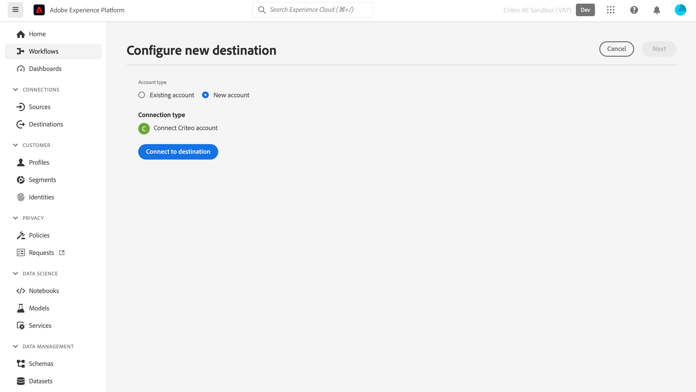

# 標準連線

## 概觀 {#overview}

>[!IMPORTANT]
>
>此目的地聯結器和檔案頁面是由Criteo建立和維護。 若有任何查詢或更新要求，請直接連絡Criteo [這裡](mailto:criteoTechnicalPartnerships@criteo.com)。

Criteo 提供值得信賴且具影響力的廣告，為開放網路上的每位消費者帶來更豐富的體驗。Criteo 擁有全球最大的商務資料集和同級最佳的 AI，能確保購物歷程中的接觸點全面個人化，在合適的時機向客戶推送合適的廣告。

## 先決條件 {#prerequisites}

* 您必須在[Criteo Management Center](https://marketing.criteo.com)擁有系統管理員使用者帳戶。
* 您將需要您的Criteo廣告商ID （如果您沒有此ID，請詢問您的Criteo聯絡人）。
* 您必須提供[!DNL GUM caller ID]，才能使用[!DNL GUM ID]做為識別碼。

## 限制 {#limitations}

* Criteo只接受[!DNL SHA-256]雜湊和純文字電子郵件（在傳送前要轉換為[!DNL SHA-256]）。 請勿傳送任何PII （個人識別資訊，例如個人名稱或電話號碼）。
* 條件至少需要由使用者端提供一個識別碼。 它會將[!DNL GUM ID]優先視為雜湊電子郵件的識別碼，因為它有助於提高符合率。


## 支援的身分 {#supported-identities}

標準支援下表所述的身分啟用。 深入瞭解[身分](https://experienceleague.adobe.com/docs/experience-platform/identity/namespaces.html#getting-started)。

| 目標身分 | 說明 | 考量事項 |
| --- | --- | --- |
| `email_sha256` | 使用SHA-256演演算法雜湊的電子郵件地址 | Adobe Experience Platform同時支援純文字和SHA-256雜湊電子郵件地址。 當您的來源欄位包含未雜湊的屬性時，請核取[!UICONTROL 套用轉換]選項，讓Experience Platform在啟用時自動雜湊資料。 |
| `gum_id` | 條件[!DNL GUM] Cookie識別碼 | [!DNL GUM IDs]允許使用者端維持其使用者識別系統與Criteo的使用者識別碼([!DNL UID])之間的對應關係。 如果識別碼型別為`gum_id`，則還必須包含其他引數[!DNL GUM Caller ID]。 如需適當的[!DNL GUM Caller ID]，請洽詢您的Criteo帳戶團隊，或視需要取得此[!DNL GUM ID]同步處理的詳細資訊。 |

## 匯出型別和頻率 {#export-type-frequency}

請參閱下表以取得目的地匯出型別和頻率的資訊。

| 項目 | 類型 | 附註 |
| --- | --- | --- |
| 匯出類型 | 對象匯出 | 您正在匯出具有[!DNL Criteo]目的地中所使用識別碼（名稱、電話號碼或其他）的對象的所有成員。 |
| 匯出頻率 | 串流 | 串流目的地是「一律開啟」的API型連線。 根據對象評估在Experience Platform中更新設定檔後，聯結器會立即將更新傳送至下游的目標平台。 深入瞭解[串流目的地](../../destination-types.md#streaming-destinations)。 |

## 使用案例 {#use-cases}

為協助您更清楚瞭解如何使用[!DNL Criteo]目的地，以下是Adobe Experience Platform客戶透過[!DNL Criteo]可以達成的一些目標：

### 使用案例1 ：取得流量

利用相關的產品選件和彈性的創意來展示您的企業。 有了智慧型產品推薦，您的廣告會自動加入最有可能觸發造訪和參與的產品。 彈性鎖定目標可讓您從Criteo的商務資料集或您自己的潛在客戶清單和Adobe CDP區隔建立受眾。

### 使用案例2 ：提高網站轉換率

訪客離開您的網站時，重新定位廣告以提醒他們缺少什麼，這些廣告可顯示特殊優惠和高度相關的優惠方案，以增加轉換率，無論他們接下來前往何處。 連線您的Adobe CDP受眾，以重新吸引現有客戶或鎖定與最忠實購物者類似的消費者。

## 連線到標準 {#connect}

>[!IMPORTANT]
> 
>若要連線到目的地，您需要&#x200B;**[!UICONTROL 檢視目的地]**&#x200B;和&#x200B;**[!UICONTROL 管理目的地]** [存取控制許可權](/help/access-control/home.md#permissions)。 閱讀[存取控制總覽](/help/access-control/ui/overview.md)或連絡您的產品管理員以取得必要的許可權。

若要連線到此目的地，請依照[目的地組態教學課程](../../ui/connect-destination.md)中所述的步驟進行。

### 向標準驗證

連線的步驟如下：

1. 登入Adobe Experience Platform並連線至Criteo目的地。

   

1. 系統會將您重新導向至條件以授權連線。 您可能需要先使用Criteo憑證登入：

   

   

   


### 連線參數 {#connection-parameters}

在對目的地進行驗證之後，請填寫以下連線引數。


| 欄位 | 說明 | 必填 |
| --- | --- | --- |
| 名稱 | 可協助您日後辨識此目的地的名稱。 您在此選擇的名稱將是Criteo Management Center中的[!DNL Audience]名稱，且無法在稍後階段修改。 | 是 |
| 說明 | 有助於您日後識別此目的地的說明。 | 無 |
| 廣告商 ID | 貴組織的條件廣告商ID。 請連絡您的Criteo客戶經理，以取得此資訊。 | 是 |
| 條件[!DNL GUM caller ID] | 您組織的[!DNL GUM Caller ID]。 如需適當的[!DNL GUM Caller ID]，請洽詢您的Criteo帳戶團隊，或視需要取得此[!DNL GUM]同步處理的詳細資訊。 | 是，每當[!DNL GUM ID]作為識別碼提供時 |

### 啟用警示 {#enable-alerts}

您可以啟用警報以接收有關傳送到您目的地的資料流狀態的通知。 從清單中選取警報以訂閱接收有關資料流狀態的通知。 如需警示的詳細資訊，請參閱[使用UI訂閱目的地警示](../../ui/alerts.md)的指南。

當您完成提供目的地連線的詳細資訊後，請選取&#x200B;**[!UICONTROL 下一步]**。

## 啟動此目標的對象 {#activate-segments}

>[!IMPORTANT]
> 
>* 若要啟用資料，您需要&#x200B;**[!UICONTROL 檢視目的地]**、**[!UICONTROL 啟用目的地]**、**[!UICONTROL 檢視設定檔]**&#x200B;和&#x200B;**[!UICONTROL 檢視區段]** [存取控制許可權](/help/access-control/home.md#permissions)。 閱讀[存取控制總覽](/help/access-control/ui/overview.md)或連絡您的產品管理員以取得必要的許可權。
>* 若要匯出&#x200B;*身分*，您需要&#x200B;**[!UICONTROL 檢視身分圖表]** [存取控制許可權](/help/access-control/home.md#permissions)。<br> {width="100" zoomable="yes"}

閱讀[將設定檔和對象啟用至串流對象匯出目的地](../../ui/activate-segment-streaming-destinations.md)，以瞭解啟用此目的地對象的指示。

## 匯出的資料 {#exported-data}

您可以在[Criteo管理中心](https://marketing.criteo.com/audience-manager/dashboard)中看到匯出的對象。

新增由[!DNL Criteo]連線接收的使用者設定檔的要求內文看起來類似這樣：

```json
{
  "data": {
    "type": "ContactlistWithUserAttributesAmendment",
    "attributes": {
      "operation": "add",
      "identifierType": "gum",
      "gumCallerId": "123",
      "identifiers": [
        {
          "identifier": "456",
          "attributes": [
            { "key": "ctoid_GumCaller", "value": "123" },
            { "key": "ctoid_Gum", "value": "456" },
            {
              "key": "ctoid_HashedEmail",
              "value": "98833030dc03751f2b2c1a0017078975fdae951aa6908668b3ec422040f2d4be"
            }
          ]
        }
      ]
    }
  }
}
```

移除[!DNL Criteo]連線所接收之使用者設定檔的要求內文看起來類似這樣：

```json
{
  "data": {
    "type": "ContactlistWithUserAttributesAmendment",
    "attributes": {
      "operation": "remove",
      "identifierType": "gum",
      "gumCallerId": "123",
      "identifiers": [
        {
          "identifier": "456",
          "attributes": [
            { "key": "ctoid_GumCaller", "value": "123" },
            { "key": "ctoid_Gum", "value": "456" },
            {
              "key": "ctoid_HashedEmail",
              "value": "98833030dc03751f2b2c1a0017078975fdae951aa6908668b3ec422040f2d4be"
            }
          ]
        }
      ]
    }
  }
}
```

## 資料使用與控管 {#data-usage}

處理您的資料時，所有Adobe Experience Platform目的地都符合資料使用原則。 如需Adobe Experience Platform如何強制資料控管的詳細資訊，請閱讀[資料控管概觀](https://experienceleague.adobe.com/docs/experience-platform/data-governance/home.html?lang=zh-Hant)。

## 其他資源

* [Criteo說明中心](https://help.criteo.com/kb/en)
* [Criteo開發人員入口網站](https://developers.criteo.com)
