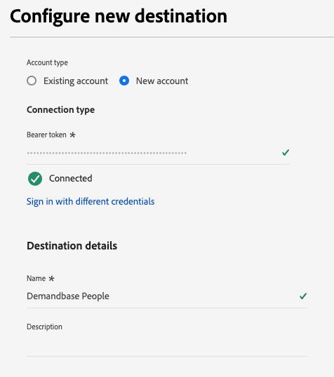

# Demandbase People連線 {#demandbase-people}

為您的Demandbase行銷活動啟用設定檔，以用於對象目標定位、個人化和隱藏。

>[!IMPORTANT]
>
>若您需要[啟用帳戶對象](../../ui/activate-account-audiences.md)的B2B使用案例，請改用[Demandbase](demandbase.md)目的地聯結器。

## 使用實例 {#use-case}

行銷人員可使用Adobe Real-Time CDP建立第一方聯絡人名單並在Demandbase中加以啟用，以便在其需求端平台(DSP)和其他管道（例如LinkedIn）間最佳化和協調參與。

此方法可讓行銷人員優先將行銷活動支出花在從他們自己的CRM或行銷自動化系統取得的已知個人身上，確保行銷工作聚焦於高價值潛在客戶。

Demandbase在啟用後會最佳化廣告傳送，調整目標定位策略以最大化參與度、觸及率和轉換率，最終改善行銷活動效率。

## 支援的身分 {#supported-identities}

[!DNL Demandbase People]連線支援啟用下表所述的身分。 深入瞭解[身分](/help/identity-service/features/namespaces.md)。

| 目標身分 | 說明 | 考量事項 |
|---|---|---|
| 電子郵件 | 純文字電子郵件地址 | [!DNL Demandbase People]連線只支援純文字電子郵件地址。 |

{style="table-layout:auto"}

## 支援的對象 {#supported-audiences}

本節說明您可以將哪些型別的對象匯出至此目的地。

| 對象來源 | 支援 | 說明 |
---------|----------|----------|
| [!DNL Segmentation Service] | ✓ | 透過Experience Platform [細分服務](../../../segmentation/home.md)產生的對象。 |
| 自訂上傳 | X | 對象[從CSV檔案匯入](../../../segmentation/ui/overview.md#import-audience)至Experience Platform。 |

{style="table-layout:auto"}

## 匯出型別和頻率 {#export-type-and-frequency}

請參閱下表以取得目的地匯出型別和頻率的資訊。

| 項目 | 類型 | 附註 |
|--------------|-----------|---------------------------|
| 匯出型別 | 對象匯出 | 您正在匯出具有&#x200B;*Demandbase*&#x200B;目的地中所使用之識別碼（名稱、電話號碼或其他）的對象的所有成員。 |
| 頻率 | 串流 | 串流目的地是「一律開啟」的API型連線。 根據對象評估在Experience Platform中更新設定檔後，聯結器會立即將更新傳送至下游的目標平台。 深入瞭解[串流目的地](/help/destinations/destination-types.md#streaming-destinations)。 |

{style="table-layout:auto"}

## 先決條件 {#prerequisites}

若要將對象匯出至Demandbase，您需要下列專案：

1. Demandbase帳戶。
2. Demandbase API權杖。 您可以在Demandbase中和使用者產生API Token。 若要產生Token，請在登入您的Demandbase帳戶後，導覽至[我的設定檔> API Token](https://web.demandbase.com/o/ad/at)。

## 連線到目標 {#connect}

>[!IMPORTANT]
> 
>若要連線到目的地，您需要&#x200B;**[!UICONTROL 檢視目的地]**&#x200B;和&#x200B;**[!UICONTROL 管理目的地]** [存取控制許可權](/help/access-control/home.md#permissions)。 閱讀[存取控制總覽](/help/access-control/ui/overview.md)或連絡您的產品管理員以取得必要的許可權。

若要連線到此目的地，請依照[目的地組態教學課程](../../ui/connect-destination.md)中所述的步驟進行。 在設定目標工作流程中，填寫以下兩個區段中列出的欄位。

### 驗證目標 {#authenticate}

若要驗證到目的地，請填入必填欄位，然後選取&#x200B;**[!UICONTROL 連線到目的地]**。

* **[!UICONTROL 持有人權杖]**：填入持有人權杖以驗證目的地。 檢視[必要條件](#prerequisites)以取得權杖的相關資訊。

### 填寫目標詳細資訊 {#destination-details}

若要設定目的地的詳細資訊，請填寫下方的必填和選用欄位。 UI中欄位旁的星號表示該欄位為必填欄位。

* **[!UICONTROL 名稱]**：您日後可辨識此目的地的名稱。
* **[!UICONTROL 描述]**：可協助您日後識別此目的地的描述。

現在您已準備好在Demandbase People中啟用您的對象。

## 啟動此目標的對象 {#activate}

>[!IMPORTANT]
> 
>* 若要啟用資料，您需要&#x200B;**[!UICONTROL 檢視目的地]**、**[!UICONTROL 啟用目的地]**、**[!UICONTROL 檢視設定檔]**&#x200B;和&#x200B;**[!UICONTROL 檢視區段]** [存取控制許可權](/help/access-control/home.md#permissions)。 閱讀[存取控制總覽](/help/access-control/ui/overview.md)或連絡您的產品管理員以取得必要的許可權。
>* 若要匯出&#x200B;*身分*，您需要&#x200B;**[!UICONTROL 檢視身分圖表]** [存取控制許可權](/help/access-control/home.md#permissions)。  {width="100" zoomable="yes"}

閱讀[將設定檔和對象啟用至串流對象匯出目的地](/help/destinations/ui/activate-segment-streaming-destinations.md)，以瞭解啟用此目的地對象的指示。

## 其他附註和重要圖說文字 {#additional-notes}

* **Demandbase API護欄**：如果您已將對象匯出至Demandbase，且在Experience Platform中成功匯出，但並非所有資料都會送達Demandbase，則您可能會在Demandbase端遇到API節流。 如需進一步說明，請洽詢他們。
* **清單刪除**：人員清單是唯一的，因此您無法重新建立名稱已在使用中的新清單。 當您從清單中移除人員時，他們將無法再使用，但不會刪除。
* **啟用時間**：在Demandbase中載入的資料必須經過隔夜處理。
* **對象命名**：如果先前在Demandbase中啟用同名的帳戶對象，則無法透過不同資料流在Demandbase目的地再次啟用。
