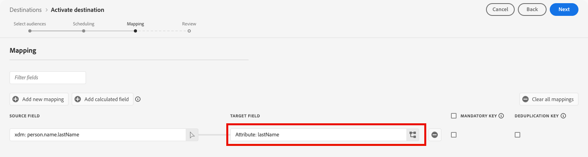

# [!DNL FreeWheel] 連線 {#freewheel}

>[!AVAILABILITY]
>
>[!DNL FreeWheel]目的地目前位在Beta中，僅供特定客戶使用。 如欲請求存取權，請和您的 Adobe 代表聯絡。

## 概觀 {#overview}

[!DNL FreeWheel]是一個全球廣告技術平台，可支援跨連線電視(CTV)、視訊和顯示器庫存的程式化購買和銷售。 [!DNL FreeWheel]提供資料導向的Marketplace，可連線全球廣告商與高階媒體擁有者。

使用此目的地將對象從Adobe Experience Platform傳送至[!DNL FreeWheel]。 對象會以每日批次檔案傳送，並可在[!DNL FreeWheel]個交易和行銷活動中用於鎖定目標。

## 先決條件 {#prerequisites}

在您可以為[!DNL FreeWheel]啟用對象之前，請先檢閱下列需求：

* **FreeWheel網路識別碼**：您必須擁有有效的[!DNL FreeWheel]網路識別碼。 這是由設定帳戶時的[!DNL FreeWheel]所提供。

## 支援的身分 {#supported-identities}

[!DNL FreeWheel]支援下表所述的身分啟用。 除了這些身分識別之外，您還可以使用您[!DNL FreeWheel]帳戶中任何可用的身分識別。 請參閱[對應屬性和身分](#map)，以取得如何對應下表中沒有的身分的相關指示。 深入瞭解[身分](/help/identity-service/features/namespaces.md)。

| 目標身分 | 說明 | 考量事項 |
|---|---|---|
| `idfa` | 廣告商適用的Apple ID | 當您的來源身分是IDFA名稱空間時，請選取此目標身分。 |
| `aaid` | ANDROID ADVERTISING ID | 當您的來源身分是GAID名稱空間時，請選取此目標身分。 |
| `ctv` | 連線電視裝置ID | 目標定位CTV裝置時，請選取此目標身分。 |
| `ip` | IPv4位址 | 選取此目標身分以根據使用者的IP位址來鎖定使用者。 對應包含有效IPv4位址的設定檔屬性，或使用計算欄位衍生值。 |
| `ipv6` | ipv6位址 | 選取此目標身分以根據使用者的IPv6位址來鎖定使用者。 對應包含有效IPv6位址的設定檔屬性，或使用計算欄位衍生值。 |

{style="table-layout:auto"}

## 支援的對象 {#supported-audiences}

本節說明您可以將哪些型別的對象匯出至此目的地。

| 對象來源 | 支援 | 說明 |
|---------|----------|----------|
| [!DNL Segmentation Service] | 是 | 透過Experience Platform [細分服務](../../../segmentation/home.md)產生的對象。 |
| 所有其他受眾來源 | 是 | 此類別包含透過[!DNL Segmentation Service]產生的對象以外的所有對象來源。 閱讀[各種對象來源](/help/segmentation/ui/audience-portal.md#customize)。 部分範例包括： <ul><li>自訂上傳對象[從CSV檔案匯入](../../../segmentation/ui/audience-portal.md#import-audience)至Experience Platform，</li><li>相似受眾，</li><li>同盟對象，</li><li>在其他Experience Platform應用程式（例如Adobe Journey Optimizer）中產生的對象，</li><li>及更多內容。</li></ul> |

{style="table-layout:auto"}

依受眾資料型別支援的受眾：

| 對象資料型別 | 支援 | 說明 | 使用案例 |
|--------------------|-----------|-------------|-----------|
| [人員對象](/help/segmentation/types/people-audiences.md) | 是 | 根據客戶設定檔，可讓您針對行銷活動的特定人群進行定位。 | CTV重新目標定位、觸及率抑制 |
| [帳戶對象](/help/segmentation/types/account-audiences.md) | 無 | 針對帳戶型行銷策略，鎖定特定組織內的個人。 | B2B行銷 |
| [潛在客戶對象](/help/segmentation/types/prospect-audiences.md) | 無 | 將目標定位為尚未成為客戶但與目標受眾具有相同特性的個人。 | 使用第三方資料進行勘探 |
| [資料集匯出](/help/catalog/datasets/overview.md) | 無 | 儲存在Adobe Experience Platform Data Lake中的結構化資料集合。 | 報告、資料科學工作流程 |

{style="table-layout:auto"}

## 匯出型別和頻率 {#export-type-frequency}

請參閱下表以取得目的地匯出型別和頻率的資訊。

| 項目 | 類型 | 附註 |
|---------|----------|---------|
| 匯出類型 | **[!UICONTROL Profile-based]** | 您正在匯出對象的所有成員，以及在[目的地啟用工作流程](/help/destinations/ui/activate-batch-profile-destinations.md#select-attributes)的對應步驟中選擇的所需身分欄位。 |
| 匯出頻率 | **[!UICONTROL Batch]** | 第一次匯出是所有符合啟用對象資格的設定檔的完整快照。 後續匯出是每日增量更新，包括新的對象資格（新增）和對象退出（移除）。 也可使用可設定的完整對象重新整理間隔（4、8或12週），除了每日增量之外，還會觸發定期完整匯出。 完整匯出僅包含目前合格的設定檔。 不包含對象退出，且僅透過每日增量更新傳送。 深入瞭解[批次檔案型目的地](/help/destinations/destination-types.md#file-based)。 |

{style="table-layout:auto"}

## 連線到目標 {#connect}

>[!IMPORTANT]
>
>若要連線到目的地，您需要&#x200B;**[!UICONTROL View Destinations]**&#x200B;和&#x200B;**[!UICONTROL Manage Destinations]** [存取控制許可權](/help/access-control/home.md#permissions)。 閱讀[存取控制總覽](/help/access-control/ui/overview.md)或連絡您的產品管理員以取得必要的許可權。

若要連線到此目的地，請依照[目的地組態教學課程](../../ui/connect-destination.md)中所述的步驟進行。 在設定目標工作流程中，填寫以下兩個區段中列出的欄位。

### 驗證目標 {#authenticate}

對[!DNL FreeWheel]目的地的驗證由Adobe自動處理。 驗證期間不需要來自您的憑證或API金鑰。 Adobe會代表您管理與[!DNL FreeWheel]的安全連線。


選取「**[!UICONTROL Connect to destination]**」以繼續執行目的地詳細資料步驟。

### 填寫目標詳細資訊 {#destination-details}

>[!CONTEXTUALHELP]
>id="platform_destinations_freewheel_backfill"
>title="完整對象重新整理間隔"
>abstract="選取除了每日增量更新之外，將完整受眾匯出傳送到[!DNL FreeWheel]的間隔。 完整的對象匯出功能可防止您的對象成員在[!DNL FreeWheel]後過期，因此當行銷活動執行時，您不會遇到目標成員數量下降的情況。 可用的選項為4週、8週和12週。"

若要設定目的地的詳細資訊，請填寫下方的必填和選用欄位。 UI中欄位旁的星號表示該欄位為必填欄位。


* **[!UICONTROL Name]**：您日後可辨識此目的地的名稱。
* **[!UICONTROL Description]**：可協助您日後識別此目的地的說明。
* **[!UICONTROL Region]**：您的帳戶託管所在的[!DNL FreeWheel]區域。 選取下列其中一個選項：
   * **[!UICONTROL US East]**
   * **[!UICONTROL Europe]**
   * **[!UICONTROL Asia Pacific]**
* **[!UICONTROL FreeWheel network ID]**：您的[!DNL FreeWheel]網路識別碼。 此值由[!DNL FreeWheel]提供，在[!DNL FreeWheel]平台中可唯一識別您的組織。
* **[!UICONTROL Full audience refresh interval]**：除了每日增量更新之外，完整對象匯出傳送至[!DNL FreeWheel]的頻率。 完整的對象匯出功能可防止您的對象成員在[!DNL FreeWheel]後過期，因此當行銷活動執行時，您不會遇到目標成員數量下降的情況。 從下拉式清單中選取間隔。

### 啟用警示 {#enable-alerts}

您可以啟用警報以接收有關傳送到您目的地的資料流狀態的通知。 從清單中選取警報以訂閱接收有關資料流狀態的通知。 如需警示的詳細資訊，請參閱[使用UI訂閱目的地警示](../../ui/alerts.md)的指南。

當您完成提供目的地連線的詳細資訊時，請選取&#x200B;**[!UICONTROL Next]**。

## 啟動此目標的對象 {#activate}

>[!IMPORTANT]
>
>* 若要啟用資料，您需要&#x200B;**[!UICONTROL View Destinations]**、**[!UICONTROL Activate Destinations]**、**[!UICONTROL View Profiles]**&#x200B;和&#x200B;**[!UICONTROL View Segments]** [存取控制許可權](/help/access-control/home.md#permissions)。 閱讀[存取控制總覽](/help/access-control/ui/overview.md)或連絡您的產品管理員以取得必要的許可權。
>* 若要匯出&#x200B;*身分*，您需要&#x200B;**[!UICONTROL View Identity Graph]** [存取控制許可權](/help/access-control/home.md#permissions)。<br> {width="100" zoomable="yes"}

讀取[啟用批次設定檔匯出目的地的對象資料](/help/destinations/ui/activate-batch-profile-destinations.md)，以取得啟用此目的地對象的指示。

### 排程對象匯出 {#schedule}


在&#x200B;**[!UICONTROL Scheduling]**&#x200B;步驟中，為每個對象設定匯出排程。 [!DNL FreeWheel]使用混合匯出模型：每個已啟動對象的第一個匯出是完整快照，然後是每日增量更新。

設定下列欄位：

* **[!UICONTROL File export options]**： **[!UICONTROL Export incremental files]**&#x200B;已預先選取，且是唯一支援的選項。 第一次匯出會自動包含所有合格設定檔的完整快照。 後續匯出只會提供自上次匯出以來的新對象資格和退出點。
* **[!UICONTROL Frequency]**：選取&#x200B;**[!UICONTROL Daily]**。 [!DNL FreeWheel]預期每日增量檔案傳送。
* **[!UICONTROL Scheduled start time]**：輸入UTC格式的每日匯出執行時間。
* **[!UICONTROL Date]**：設定啟用的開始和結束日期。 開始日期決定第一個完整快照匯出的傳送時間。

>[!NOTE]
>
>完整匯出（初始快照和定期完整重新整理）僅包含目前合格的設定檔。 完全匯出內容不包含對象退出，且僅透過每日增量更新傳送。

### 對應屬性和身分 {#map}

在對應步驟中，從您的Experience Platform設定檔中選取來源欄位，並將其對應至[!DNL FreeWheel]支援的身分型別。 至少需要一個對應。

>[!IMPORTANT]
>
>[!DNL FreeWheel]支援的身分型別在對應UI中顯示為&#x200B;**目標屬性**，而不是身分名稱空間。

如果您的[!DNL FreeWheel]帳戶支援未列在[支援的身分](#supported-identities)表格中的身分型別，您可以手動在目標欄位中輸入身分名稱，而不是從預先定義的清單中選取，來對應至這些身分型別。



以下是範例對應。 您實際的對應將取決於您的設定檔結構描述以及[!DNL FreeWheel]帳戶支援的身分型別。

| 來源欄位 | 目標欄位 |
| --- | --- |
| `identityMap.IDFA` | `idfa` |
| `identityMap.GAID` | `aaid` |
| `homeAddress.ipAddress` | `ip` |

{style="table-layout:auto"}

>[!NOTE]
>
>不會強制執行任何強制對應。 不過，至少有一個有效身分對應的設定檔將不會包含在匯出的檔案中。

## 匯出的資料/驗證資料匯出 {#exported-data}

[!DNL FreeWheel]每次匯出都會收到兩種型別的檔案。 這兩種檔案型別都會自動產生和傳送。 您不需要執行任何動作。

**身分（資料）檔案**&#x200B;包含對象成員資格資料。 每一列將使用者識別碼對應至一或多個對象ID。 檔案會以CSV格式傳送至[!DNL FreeWheel]，不含欄標題。 匯出中出現的每個識別型別會產生個別的檔案（例如，`aaid`有一個檔案，`idfa`有一個個別檔案）。

範例資料檔案格式：

```csv
aebc1234-56f7-89ab-cdef-0123456789ab,segment_1,segment_2
f7c9a8b0-4d33-11ec-81d3-0242ac130003,segment_1,segment_3
123e4567-e89b-12d3-a456-426614174000,segment_2
```

**分類檔案**&#x200B;說明匯出中包含的對象。 這些檔案會與資料檔案一併傳送，包括對象ID、名稱和TTL （存留時間） （以天為單位）。 [!DNL FreeWheel]支援的最大TTL為90天。 以下範例中的值僅供說明之用。

範例分類檔案格式：

```csv
Segment ID,Segment Name,TTL
segment_1,my_first_segment,30
segment_2,my_second_segment,30
segment_3,my_third_segment,30
```

## 資料使用與控管 {#data-usage-governance}

處理您的資料時，所有[!DNL Adobe Experience Platform]目的地都符合資料使用原則。 如需[!DNL Adobe Experience Platform]如何強制資料控管的詳細資訊，請參閱[資料控管概觀](/help/data-governance/home.md)。

## 其他資源 {#additional-resources}

如需[!DNL FreeWheel]及其廣告技術平台的詳細資訊，請參閱[FreeWheel網站](https://www.freewheel.com){target="_blank"}。
