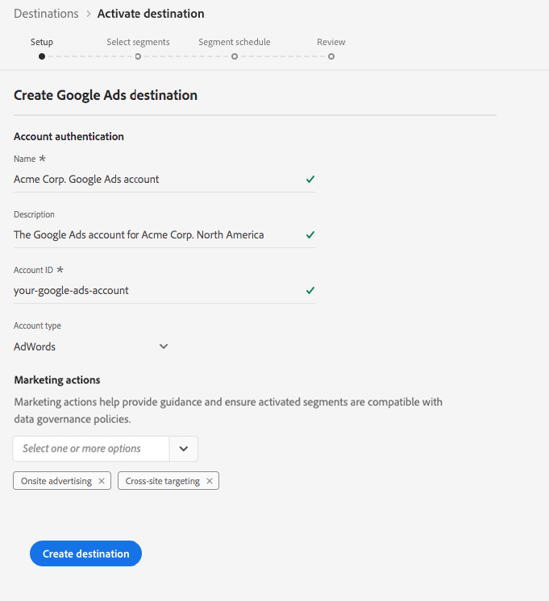

# [!DNL Google Ads] 目標

## 概述

[!DNL Google Ads]線上廣告服 [!DNL Google AdWords]務，可讓企業透過文字搜尋、圖形顯示、視訊和應用程式內行動顯示，以每次點按付費方式 [!DNL YouTube] 進行廣告。

## 目標規格

請注意以下特定於目標的詳細 [!DNL Google Ads] 資訊：

* 您可以傳送下列身 [分](../../../identity-service/namespaces.md) ，到 [!DNL Google Ads] 目的地：Google Cookie ID、IDFA、GAID、Roku ID、Microsoft ID和Amazon Fire TV ID。
* 在平台中以程式設計方式建立啟用的 [!DNL Google] 觀眾。
* 即時CDP目前不包含測量量度，以驗證啟動是否成功。 請參閱Google中的觀眾計數，以驗證整合併瞭解觀眾鎖定規模。

>[!IMPORTANT]
>
>如果您想要建立第一個目標，但 [!DNL Google Ads] Experience Cloud ID服務過去（使用Audience Manager或其他應用程式）未啟用  ID同步功能，請聯絡Adobe諮詢或客戶服務以啟用ID同步。 如果您先前已在Audience Manager中設定Google整合，則您設定的ID同步化會延續至即時CDP。

### 匯出類型 {#export-type}

**區段匯出** -您正將區段（對象）的所有成員匯出至Google目標。

## 先決條件

### 現有帳 [!DNL Google Ads] 戶

>[!IMPORTANT]
>
> [!DNL Google] 已過時與 [!DNL Google Ads] 協力廠商整合的新Cookie。 為了在下一節中執行允許清單步驟，您必須與現有整合 [!DNL Google Ads]。 因此，建議使用的方法 [!DNL Google Ads] 是設定整 [!DNL Google Customer Match] 合。 如需建立整合的詳細 [!DNL Google Customer Match] 資訊，請閱讀建立連線的教 [[!DNL Google Customer Match]](./google-customer-match.md) 學課程。

### 允許清單

>[!NOTE]
>
>在即時CDP中設定第一個目標之前，允 [!DNL Google Ads] 許清單是必需的。 在建立目標之前，請確保已完成下面所述的允 [!DNL Google] 許清單進程。

在即時 [!DNL Google Ads] CDP中建立目標之前，您必須聯絡 [!DNL Google] Adobe，才能將Adobe列入允許的資料提供者清單，並讓您的帳戶新增至允許清單。 請聯 [!DNL Google] 絡並提供下列資訊：

* **帳戶ID** :這是Adobe的帳戶ID [!DNL Google]。 請聯絡Adobe客戶服務或您的Adobe代表以取得此ID。
* **客戶ID** :這是Adobe的客戶帳戶ID [!DNL Google]。 請聯絡Adobe客戶服務或您的Adobe代表以取得此ID。
* 您的帳戶類型： **AdWords**
* **Google AdWords ID** :這是您的ID [!DNL Google]。 ID格式通常為123-456-7890。

## 配置目標

在「連 **[!UICONTROL 接]** >目 **[!UICONTROL 標]**」中，選 [!DNL Google Ads]擇並選 **[!UICONTROL 擇配置]**。

>[!NOTE]
>
>如果此目標已存在連接，您可以在目標卡上看到 **[!UICONTROL 「激活]** 」按鈕。 有關「激活」( **[!UICONTROL Activate]** )和「配置」( **[!UICONTROL Configure]**)之間差異的詳細資訊，請參 [閱目標工作區文檔的「目錄](../../ui/destinations-workspace.md#catalog) 」(Catalog)部分。

在建立 **目標工作流的** 「設定」步驟中，填寫目標的 [!UICONTROL 「基本資訊] 」。

* **[!UICONTROL 名稱]**:填寫此目標的首選名稱。
* **[!UICONTROL 說明]**:可選。 例如，您可以提及您使用此目的地的促銷活動。
* **[!UICONTROL 帳戶類型]**:AdWords是唯一可用的選項。
* **[!UICONTROL 帳戶ID]**:在您的帳戶ID中填入 [!DNL Google Ads]。 ID格式通常為123-456-7890。
* **[!UICONTROL 行銷使用案例]**:行銷使用案例會指出將資料匯出至目的地的方式。 您可以從Adobe定義的行銷使用案例中選擇，也可以建立自己的行銷使用案例。 有關行銷使用案例的詳細資訊，請參 [閱即時CDP中的資料治理頁](../../../rtcdp/privacy/data-governance-overview.md#destinations) 。 如需個別Adobe定義之行銷使用案例的詳細資訊，請參閱「資 [料使用政策」概觀](../../../data-governance/policies/overview.md#core-actions)。

## 啟用區段至 [!DNL Google Ads]

如需如何啟用區段至目的地的指示 [!DNL Google Ads]，請參 [閱啟用資料至目的地](../../ui/activate-destinations.md)。

## 匯出的資料

若要確認資料是否已成功匯出至目 [!DNL Google Ads] 標，請檢查您的 [!DNL Google Ads] 帳戶。 如果啟動成功，您的帳戶會填入觀眾。