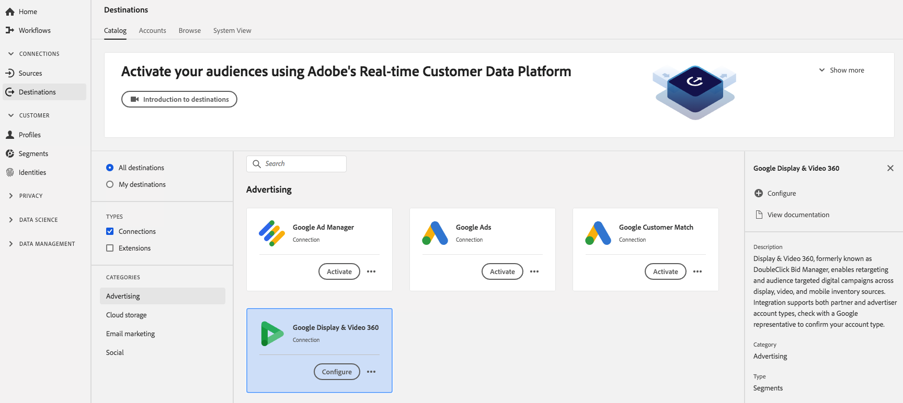

# [!DNL Google Display & Video 360] 連接

[!DNL Display & Video 360](先前稱為 [!DNL DoubleClick Bid Manager])工具，用於在顯示、視訊和行動庫存來源上執行重新定位和受眾鎖定的數位促銷活動。

## 目標規格

請注意以下特定於[!DNL Google Display & Video 360]目標的詳細資訊：

* 在Google平台中以程式設計方式建立已啟用的觀眾。
* 平台目前不包含用於驗證成功啟動的測量量度。 請參閱Google中的觀眾計數，以驗證整合併瞭解觀眾鎖定規模。

>[!IMPORTANT]
>
>如果您想要使用Google Display &amp; Video 360建立您的第一個目的地，而且過去(在Adobe Audience Manager或其他應用程式中)未啟用Experience CloudID服務的[ID同步功能](https://experienceleague.adobe.com/docs/id-service/using/id-service-api/methods/idsync.html)，請聯絡Adobe諮詢或客戶服務以啟用ID同步。 如果您先前在Audience Manager中設定Google整合，您設定的ID會同步至平台。

### 支援的身份{#supported-identities}

[!DNL Google Ad Manager] 支援啟用下表所述的身分。

| 目標識別 | 說明 | 考量事項 |
|---|---|---|
| GAID | [!DNL Google Advertising ID] | 當您的來源識別為GAID命名空間時，請選取此目標識別。 |
| IDFA | [!DNL Apple ID for Advertisers] | 當您的來源識別為IDFA命名空間時，請選取此目標識別。 |
| AAMUUID | [Adobe Audience Manager [!DNL Unique User ID]](https://experienceleague.adobe.com/docs/audience-manager/user-guide/reference/ids-in-aam.html)，也叫做 [!DNL Device ID]。38位數的數位裝置ID，可Audience Manager與其互動的每個裝置相關聯。 | Google使用[AAM UUID](https://experienceleague.adobe.com/docs/audience-manager/user-guide/reference/ids-in-aam.html?lang=en)來定位加州的使用者，並針對所有其他使用者使用Google Cookie ID。 |
| [!DNL Google] Cookie ID | [!DNL Google] Cookie ID | [!DNL Google] 使用此ID來定位加州以外的使用者。 |
| 瑞達 | 廣告的Roku ID。 此ID可唯一識別Roku裝置。 |  |
| 女傭 | Microsoft廣告ID。 此ID可唯一識別執行Windows 10的裝置。 |  |
| Amazon消防電視ID | 此ID可唯一識別Amazon消防電視。 |  |

### 導出類型{#export-type}

**區段匯出** -您正將區段（對象）的所有成員匯出至Google目標。

## 先決條件

### 允許清單

>[!NOTE]
>
>在「平台」中設定您的第一個[!DNL Google Display & Video 360]目標之前，允許清單是必填的。 請確定Google在建立目標之前已完成下列說明的允許清單程式。

在「平台」中建立[!DNL Google Display & Video 360]目標之前，您必須連絡Google，要求將Adobe加入允許的資料提供者清單中，並將您的帳戶新增至允許清單。 聯絡Google並提供下列資訊：

* **帳戶ID** :這是Adobe與Google的帳戶ID。請聯絡Adobe客戶服務或您的Adobe代表以取得此ID。
* **客戶ID** :這是Adobe與Google的客戶帳戶ID。請聯絡Adobe客戶服務或您的Adobe代表以取得此ID。
* **您的帳戶類型**:用 **[!DNL Invite advertiser]** 於允許觀眾僅分享到您Display &amp; Video 360帳戶中的特定品牌，或 **[!DNL Invite partner]** 用於允許觀眾分享到您Display &amp; Video 360帳戶中的所有品牌。

## 配置目標

在&#x200B;**[!UICONTROL Connections]** > **[!UICONTROL Destinations]**&#x200B;中，選擇[!DNL Google Display & Video 360] ，然後選擇&#x200B;**[!UICONTROL Configure]**。

>[!NOTE]
>
>如果已存在與此目標的連接，則可以在目標卡上看到&#x200B;**[!UICONTROL Activate]**&#x200B;按鈕。 有關[!UICONTROL Activate]和[!UICONTROL Configure]之間差異的詳細資訊，請參閱目標工作區文檔的[目錄](../../ui/destinations-workspace.md#catalog)部分。

在建立目標工作流程的&#x200B;**設定**&#x200B;步驟中，填入目標的[!UICONTROL Basic Information]，以及應套用至此目標的行銷動作。

* **[!UICONTROL Name]**:填寫此目標的首選名稱。
* **[!UICONTROL Description]**: 選用. 例如，您可以提及您使用此目的地的促銷活動。
* **[!UICONTROL Account Type]**:根據您使用Google的帳戶，選取一個選項：
   * 使用`Invite Advertiser`可讓觀眾僅共用給您「顯示與視訊360」帳戶中的特定品牌。
   * 使用`Invite Partner`可讓觀眾分享至您「顯示與視訊360」帳戶中的所有品牌。
* **[!UICONTROL Account ID]**:使用Google填 **[!DNL Invite partner]** 寫您 **[!DNL Invite advertiser]** 的或帳戶ID。通常為6或7位數的ID。
* **[!UICONTROL Marketing action]**:行銷動作會指出將資料匯出至目的地的方式。您可以從Adobe定義的行銷動作中選擇，也可以建立自己的行銷動作。 如需行銷動作的詳細資訊，請參閱[資料使用政策概述](../../../data-governance/policies/overview.md)。

>[!NOTE]
>
>設定[!DNL Google Display & Video 360]目標時，請與您的[!DNL Google Account Manager]或Adobe代表合作，以瞭解您擁有的帳戶類型。

## 啟用區段至[!DNL Google Display & Video 360]

如需如何啟用區段至[!DNL Google Display & Video 360]的指示，請參閱[啟用資料至目標](../../ui/activate-destinations.md)。

## 匯出的資料

要驗證資料是否已成功導出到[!DNL Google Display & Video 360]目標，請檢查[!DNL Google Display & Video 360]帳戶。 如果啟動成功，您的帳戶會填入觀眾。