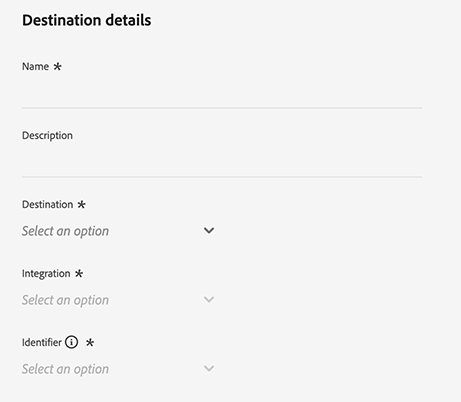
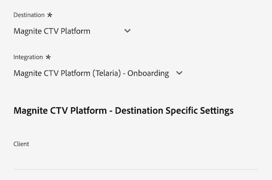
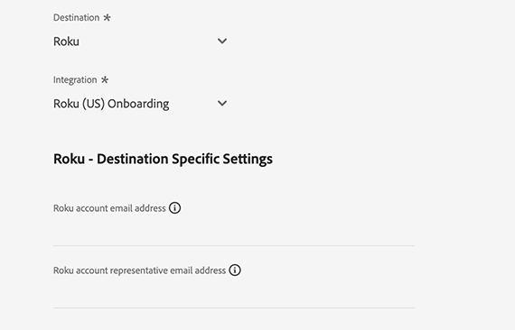

# [!DNL LiveRamp - Distribution] 連線

此 [!DNL LiveRamp - Distribution] 連線可讓您在行動裝置、網路、顯示和連線的電視媒體中，啟用從Experience Platform到高階發佈者的對象。

>[!IMPORTANT]
>
>此目的地聯結器和檔案頁面是由LiveRamp建立和維護。 如有任何查詢或更新要求，請直接連絡LiveRamp [此處](mailto:adobertcdp@liveramp.com).

## 支援的目的地 {#supported-destinations}

[!DNL LiveRamp - Distribution] 目前支援對下列平台進行對象啟用：

* [[!DNL 4C Insights]](#insights)
* [[!DNL Acast]](#acast)
* [[!DNL Nexxen]](#nexxen)
* [[!DNL Ampersand.tv]](#ampersand-tv)
* [[!DNL Captify]](#captify)
* [[!DNL Cardlytics]](#cardlytics)
* [[!DNL Disney (Hulu/ESPN/ABC)]](#disney)
* [[!DNL iHeartMedia]](#iheartmedia)
* [[!DNL Index Exchange]](#index-exchange)
* [[!DNL Magnite CTV Platform]](#magnite)
* [[!DNL Magnite DV+ (Rubicon Project)]](#magnite-dv)
* [[!DNL One Fox]](#fox)
* [[!DNL Pandora]](#pandora)
* [[!DNL Reddit]](#reddit)
* [[!DNL Roku]](#roku)
* [[!DNL Spotify]](#spotify)
* [[!DNL Taboola]](#taboola)
* [[!DNL TargetSpot]](#targetspot)
* [[!DNL Teads]](#teads)
* [[!DNL WB Discovery]](#wb-discovery)

## 使用案例 {#use-cases}

為了協助您更清楚瞭解您應如何及何時使用 [!DNL LiveRamp - Distribution] 目的地，以下是Adobe Experience Platform客戶可以使用此目的地解決的範例使用案例。

運動服裝零售商的行銷團隊使用 [LiveRamp — 入門](liveramp-onboarding.md) 將對象從Experience Platform傳送至其LiveRamp帳戶的連線。

透過 [!DNL LiveRamp - Distribution] 連線他們現在可以觸發啟動已上線對象至 [支援的目的地](#supported-destinations). 接著，他們便可將目標鎖定在行動、開啟網頁、社交和網路上的使用者 [!DNL CTV] 平台。

## 將對象上線到LiveRamp {#onboarding}

在透過啟用對象之前 [!DNL LiveRamp - Distribution] 連線，使用 [LiveRamp — 入門](liveramp-onboarding.md) 將您的Experience Platform對象匯出至LiveRamp的連線。

將對象上線至LiveRamp後，請從繼續啟動工作流程。 [連線到目的地](#connect) 選取並設定資料啟用的目標目的地平台的步驟。

## 連線到目標 {#connect}

>[!CONTEXTUALHELP]
>id="platform_destinations_liveramp_distribution_identifier_settings"
>title="識別碼設定"
>abstract="選取您的目標所支援的識別碼。有關每個目標所支援的識別碼完整清單，請參閱本文件。"

>[!IMPORTANT]
> 
>若要連線到目的地，您需要 **[!UICONTROL 管理目的地]** [存取控制許可權](/help/access-control/home.md#permissions). 閱讀 [存取控制總覽](/help/access-control/ui/overview.md) 或聯絡您的產品管理員以取得必要許可權。

若要連線至此目的地，請遵循以下說明的步驟： [目的地設定教學課程](../../ui/connect-destination.md). 在設定目標工作流程中，填寫以下兩個區段中列出的欄位。

### 驗證LiveRamp {#authenticate}

若要向目的地進行驗證，請填寫必填欄位並選取 **[!UICONTROL 連線到目的地]**.

* **[!UICONTROL LiveRamp組織ID]**：您的LiveRamp帳戶的組織ID (列為 _owner_org_ （以您的LiveRamp提供的憑證表示）。
* **[!UICONTROL 密碼]**：您的LiveRamp帳戶密碼(列為 _secret_key_ （以您的LiveRamp提供的憑證表示）。
* **[!UICONTROL 權杖URL]**：您的LiveRamp權杖URL。
* **[!UICONTROL 使用者名稱]**：您的LiveRamp帳戶使用者名稱(列為 _account_id_ （以您的LiveRamp提供的憑證表示）。

### 設定目的地詳細資料 {#destination-details}

成功連線至您的LiveRamp帳戶後，請輸入連線至您要啟用對象的目標所需的資訊。

* **[!UICONTROL 名稱]**：填寫目的地連線的偏好名稱。

>[!NOTE]
>
>為目的地命名時，Adobe建議遵循此格式： `LiveRamp - Downstream Destination Name`. 此命名模式可協助您快速識別 [瀏覽](../../ui/destinations-workspace.md#browse) 目的地工作區的索引標籤。
> 
>範例：`LiveRamp - Roku`。

* **[!UICONTROL 說明]**：輸入目的地的說明。 使用說明來協助您輕鬆識別此目的地的用途。
* **[!UICONTROL 目的地]**：使用下拉式功能表選取您要啟用對象的目的地。 您在這裡選取的目的地，會直接影響您在 [目的地特定設定](#destination-settings) 畫面。
* **[!UICONTROL 整合]**：選取您要用於目的地的整合帳戶。
* **[!UICONTROL 識別碼]**：選取目的地支援的識別碼。 目前，下拉式功能表中已預先填入所有目的地支援的識別碼。

## 目的地特定設定 {#destination-settings}

每個目的地 [支援](#supported-destinations) 作者： [!DNL LiveRamp - Distribution] 需要您填寫特定的組態選項。

如需如何設定每個目的地的詳細指引，請參閱以下各節。

### [!DNL 4C Insights] {#insights}

>[!CONTEXTUALHELP]
>id="platform_destinations_liveramp_distribution_4cinsights_profile_id"
>title="4C 品牌設定檔 ID"
>abstract="輸入與您的 4C 品牌設定檔相關的數值 ID。如果您沒有此 ID，請聯絡您的 4C 用戶端服務代表。"

若要設定目的地的詳細資料，請填寫下列欄位。

* **[!UICONTROL 4C品牌設定檔ID]**：輸入與您的4C品牌設定檔相關聯的數值ID。 如果您沒有此 ID，請聯絡您的 4C 用戶端服務代表。

### [!DNL Acast] {#acast}

>[!CONTEXTUALHELP]
>id="platform_destinations_liveramp_distribution_acast_client"
>title="用戶端名稱"
>abstract="依您希望對目標合作夥伴顯示的廣告商帳戶名稱。使用您的公司名稱。請勿使用空格或特殊字元。"

若要設定目的地的詳細資料，請填寫下列欄位。

* **[!UICONTROL 使用者端名稱]**：您的廣告商帳戶名稱，您希望向目的地合作夥伴顯示的名稱。 使用您的公司名稱。請勿使用空格或特殊字元。

### [!DNL Ampersand.tv] {#ampersand-tv}

>[!CONTEXTUALHELP]
>id="platform_destinations_liveramp_distribution_ampersand_company_name"
>title="您的公司名稱"
>abstract="依您希望對目標合作夥伴顯示的公司名稱。請勿使用空格或特殊字元。"

若要設定目的地的詳細資料，請填寫下列欄位。

* **[!UICONTROL 您的公司名稱]**：您的公司名稱，您希望向目的地合作夥伴顯示的名稱。 請勿使用空格或特殊字元。

### [!DNL Captify] {#captify}

>[!CONTEXTUALHELP]
>id="platform_destinations_liveramp_distribution_captify_client"
>title="用戶端名稱"
>abstract="依您希望對目標合作夥伴顯示的廣告商帳戶名稱。使用您的公司名稱。請勿使用空格或特殊字元。"

若要設定目的地的詳細資料，請填寫下列欄位。

* **[!UICONTROL 使用者端名稱]**：您的廣告商帳戶名稱，您希望向目的地合作夥伴顯示的名稱。 使用您的公司名稱。請勿使用空格或特殊字元。

### [!DNL Cardlytics] {#cardlytics}

>[!CONTEXTUALHELP]
>id="platform_destinations_liveramp_distribution_cardlytics_client"
>title="用戶端名稱"
>abstract="依您希望對目標合作夥伴顯示的廣告商帳戶名稱。使用您的公司名稱。請勿使用空格或特殊字元。"

若要設定目的地的詳細資料，請填寫下列欄位。

* **[!UICONTROL 使用者端名稱]**：您的廣告商帳戶名稱，您希望向目的地合作夥伴顯示的名稱。 使用您的公司名稱。請勿使用空格或特殊字元。

### [!DNL Disney (Hulu/ESPN/ABC)] {#disney}

>[!CONTEXTUALHELP]
>id="platform_destinations_liveramp_distribution_agreement"
>title="廣告商資料目標條款合約"
>abstract="輸入 `I AGREE` 確認 Disney 廣告商資料條款的認可與合約。"

<!-- >additional-url="<https://www.disneyadvertising.com/ADVERTISER-DATA-DESTINATION-TERMS/>" text="Read the agreement" -->

>[!CONTEXTUALHELP]
>id="platform_destinations_liveramp_distribution_disney_client"
>title="用戶端名稱"
>abstract="依您希望對目標合作夥伴顯示的廣告商帳戶名稱。使用您的公司名稱。請勿使用空格或特殊字元。"

>[!CONTEXTUALHELP]
>id="platform_destinations_liveramp_distribution_disney_email"
>title="您的電子郵件地址"
>abstract="輸入與個人相連結的電子郵件地址。該電子郵件地址做為廣告商資料條款合約的簽名。必要時，也會使用該電子郵件地址與您聯絡。"

若要設定目的地的詳細資料，請填寫下列欄位。

* **[!UICONTROL 廣告商資料目的地條款合約]**：輸入 `I AGREE` 確認迪士尼廣告商資料條款的認可與同意。
* **[!UICONTROL 使用者端名稱]**：輸入您要向目的地合作夥伴顯示的公司名稱。
* **[!UICONTROL 電子郵件地址]**：輸入繫結至個人的電子郵件地址。 該電子郵件地址做為廣告商資料條款合約的簽名。

### [!DNL iHeartMedia] {#iheartmedia}

>[!CONTEXTUALHELP]
>id="platform_destinations_liveramp_distribution_iheartmedia_client"
>title="用戶端名稱"
>abstract="依您希望對目標合作夥伴顯示的廣告商帳戶名稱。使用您的公司名稱。請勿使用空格或特殊字元。"

若要設定目的地的詳細資料，請填寫下列欄位。

* **[!UICONTROL 使用者端名稱]**：您的廣告商帳戶名稱，您希望向目的地合作夥伴顯示的名稱。 使用您的公司名稱。請勿使用空格或特殊字元。

### [!DNL Index Exchange] {#index-exchange}

>[!CONTEXTUALHELP]
>id="platform_destinations_liveramp_distribution_index_advertiseraccountname"
>title="帳戶名稱"
>abstract="您的索引 Exchange 用戶端帳戶名稱。請勿使用空格或特殊字元。"

若要設定目的地的詳細資料，請填寫下列欄位。

* **[!UICONTROL 帳戶名稱]**：您的Index Exchange使用者端帳戶名稱。 請勿使用空格或特殊字元。

### [!DNL Magnite CTV Platform] {#magnite}

>[!CONTEXTUALHELP]
>id="platform_destinations_liveramp_distribution_magnitectv_client"
>title="用戶端"
>abstract="依您希望對目標合作夥伴顯示的用戶端名稱。使用您的公司名稱。請勿使用空格或特殊字元。"

若要設定目的地的詳細資料，請填寫下列欄位。

* **[!UICONTROL 使用者端]**：您的使用者端名稱，您希望向目的地合作夥伴顯示的名稱。 使用您的公司名稱。請勿使用空格或特殊字元。

### [!DNL Magnite DV+ (Rubicon Project)] {#magnite-dv}

>[!CONTEXTUALHELP]
>id="platform_destinations_liveramp_distribution_magnitedv+_partnerid"
>title="合作夥伴 ID"
>abstract="與擁有區段/資料的發佈者關聯的 Rubicon Project 合作夥伴 ID。如果不確定您應該使用的值，請聯絡您的 Rubicon Project 帳戶代表。"

>[!CONTEXTUALHELP]
>id="platform_destinations_liveramp_distribution_magnitedv+_seatid"
>title="座位 ID"
>abstract="由您的 Magnite 帳戶經理提供的 Magnite DV+ 席位 ID"

若要設定目的地的詳細資料，請填寫下列欄位。

* **[!UICONTROL 合作夥伴ID]**：與擁有區段/資料的發佈者相關聯的Rubicon專案合作夥伴ID。 如果不確定您應該使用的值，請聯絡您的 Rubicon Project 帳戶代表。
* **[!UICONTROL 名額ID]**：菱形DV+座位ID，由您的菱形客戶經理提供

### [!DNL Nexxen (formerly known as [!DNL Amobee])] {#nexxen}

>[!CONTEXTUALHELP]
>id="platform_destinations_liveramp_distribution_nexxen_ratetype"
>title="費率類型"
>abstract="費率類型表示資料使用量的計費方式。所有 $0.00 的費率應為固定費用。如果您不確定要使用哪種費率類型，請與您的 Nexxen 代表確認。"

>[!CONTEXTUALHELP]
>id="platform_destinations_liveramp_distribution_nexxen_marketid"
>title="市場 ID"
>abstract="輸入市場 ID 數值，其為 Nexxen 資料合約建立所在。如果您在 Nexxen 平台的每個市場上進行「AlwaysOn」整合，請輸入 -1。"

>[!CONTEXTUALHELP]
>id="platform_destinations_liveramp_distribution_nexxen_advertiserid"
>title="廣告商 ID"
>abstract="如果您要向 Nexxen 平台中的單一廣告商傳送資料，請輸入 Amobee 廣告商 ID 數值。如果您希望市場中的所有廣告商都可以使用這些資料，或者這些區段為「AlwaysOn」，請輸入 -1。"

>[!CONTEXTUALHELP]
>id="platform_destinations_liveramp_distribution_nexxen_contactemail"
>title="連絡人電子郵件"
>abstract="輸入 Nexxen 用於傳送資料合約詳細資訊的電子郵件地址。這很可能是您自己的電子郵件地址，但也可以是電子郵件別名。如果是多個收件者，請使用逗號 (`email1@domain.com`, `email2@domain.com`, 等等)。"

若要設定目的地的詳細資料，請填寫下列欄位。

* **[!UICONTROL 費率型別]**：費率型別代表資料使用應計費的方式。 所有 $0.00 的費率應為固定費用。如果您不確定要使用哪種費率類型，請與您的 Nexxen 代表確認。
* **[!UICONTROL 市場ID]**：輸入應在其中建立Nexen資料合約的數值市場ID。 如果您在 Nexxen 平台的每個市場上進行「AlwaysOn」整合，請輸入 -1。
* **[!UICONTROL 廣告商ID]**：如果您要傳送資料至Nexen平台的單一廣告商，請輸入數值Nexen廣告商ID。 如果您想要讓資料可供市場中的所有廣告商使用，或如果這些區段是「一律開啟」，請輸入–1。
* **[!UICONTROL 連絡人電子郵件]**：輸入Nexen用來傳送資料合約詳細資料的電子郵件地址。 這很可能是您自己的電子郵件地址，但也可以是電子郵件別名。如果有多個收件者，請使用逗號( `email1@domain.com`， `email2@domain.com`)。

### [!DNL One Fox] {#fox}

>[!CONTEXTUALHELP]
>id="platform_destinations_liveramp_distribution_fox_client"
>title="用戶端"
>abstract="您想要向合作夥伴顯示的您公司/經銷帳戶名稱。如果不確定要使用什麼名稱，請聯絡您的合作夥伴帳戶代表。請勿使用空格或特殊字元。"

若要設定目的地的詳細資料，請填寫下列欄位。

* **[!UICONTROL 使用者端]**：您希望向合作夥伴顯示的公司/分送帳戶名稱。 預設使用您的公司名稱。 如果不確定要使用什麼名稱，請聯絡您的合作夥伴帳戶代表。請勿使用空格或特殊字元。

### [!DNL Pandora] {#pandora}

>[!CONTEXTUALHELP]
>id="platform_destinations_liveramp_distribution_pandora_account_name"
>title="帳戶名稱"
>abstract="您的 Pandora 帳戶名稱。如果不確定您的帳戶名稱是什麼，請聯絡您的 Pandora 客戶代表。請勿使用空格或特殊字元。"

若要設定目的地的詳細資料，請填寫下列欄位。

* **[!UICONTROL 帳戶名稱]**：您的Pandora帳戶名稱。 如果不確定您的帳戶名稱是什麼，請聯絡您的 Pandora 客戶代表。請勿使用空格或特殊字元。

### [!DNL Reddit] {#reddit}

>[!CONTEXTUALHELP]
>id="platform_destinations_liveramp_distribution_reddit_advertiser_id"
>title="Reddit 廣告商 ID"
>abstract="您的 Reddit 廣告商 ID。必須以「t2_」或「a2_」開頭。如果您不知道自己的廣告商 ID，請聯絡您的 Reddit 代表。"

>[!CONTEXTUALHELP]
>id="platform_destinations_liveramp_distribution_reddit_advertiser_name"
>title="Reddit 廣告商名稱"
>abstract="您的 Reddit 廣告商名稱。請勿使用空格或特殊字元。"

若要設定目的地的詳細資料，請填寫下列欄位。

* **[!UICONTROL Reddit廣告商ID]**：您的Reddit廣告商ID。 必須以「t2_」或「a2_」開頭。如果您不知道自己的廣告商 ID，請聯絡您的 Reddit 代表。
* **[!UICONTROL Reddit廣告商名稱]**：您的Reddit廣告商名稱。 請勿使用空格或特殊字元。

### [!DNL Roku] {#roku}

>[!CONTEXTUALHELP]
>id="platform_destinations_liveramp_distribution_roku_email"
>title="Roku 帳戶電子郵件地址"
>abstract="輸入與您的 Roku 帳戶相連結的電子郵件地址。"

>[!CONTEXTUALHELP]
>id="platform_destinations_liveramp_distribution_roku_representative_email"
>title="Roku 客戶代表電子郵件地址"
>abstract="輸入您的 Roku 客戶代表的電子郵件地址。該地址用於傳送類型更新。若要輸入多個地址，請用逗號分隔。"

若要設定目的地的詳細資料，請填寫下列欄位。

* **[!UICONTROL Roku帳戶電子郵件地址]**：輸入與您的Roku帳戶相關聯的電子郵件地址。
* **[!UICONTROL Roku客戶代表電子郵件地址]**：輸入您Roku客戶代表的電子郵件地址。 若要輸入多個地址，請用逗號分隔。

### [!DNL Spotify] {#spotify}

>[!CONTEXTUALHELP]
>id="platform_destinations_liveramp_distribution_spotify_client"
>title="用戶端名稱"
>abstract="依您希望對目標合作夥伴顯示的廣告商帳戶名稱。使用您的公司名稱。請勿使用空格或特殊字元。"

若要設定目的地的詳細資料，請填寫下列欄位。

* **[!UICONTROL 使用者端名稱]**：您的廣告商帳戶名稱，您希望向目的地合作夥伴顯示的名稱。 使用您的公司名稱。請勿使用空格或特殊字元。

### [!DNL Taboola] {#taboola}

>[!CONTEXTUALHELP]
>id="platform_destinations_liveramp_distribution_taboola_rep_email"
>title="客戶經理電子郵件地址"
>abstract="您的 Taboola 客戶經理的電子郵件地址。"

>[!CONTEXTUALHELP]
>id="platform_destinations_liveramp_distribution_taboola_seg_type"
>title="區段類型"
>abstract="區段類型。目前僅支援第一方區段。"

若要設定目的地的詳細資料，請填寫下列欄位。

* **[!UICONTROL 客戶經理電子郵件地址]**：您的Taboola客戶經理的電子郵件地址。
* **[!UICONTROL 區段型別]**：區段型別。 目前僅支援第一方區段。

### [!DNL TargetSpot] {#targetspot}

>[!CONTEXTUALHELP]
>id="platform_destinations_liveramp_distribution_targetspot_client"
>title="用戶端名稱"
>abstract="依您希望對目標合作夥伴顯示的廣告商帳戶名稱。使用您的公司名稱。請勿使用空格或特殊字元。"

若要設定目的地的詳細資料，請填寫下列欄位。

* **[!UICONTROL 使用者端名稱]**：您的廣告商帳戶名稱，您希望向目的地合作夥伴顯示的名稱。 使用您的公司名稱。請勿使用空格或特殊字元。

### [!DNL Teads] {#teads}

>[!CONTEXTUALHELP]
>id="platform_destinations_liveramp_distribution_teads_teadsid"
>title="Teads ID"
>abstract="您的 Teads ID"

若要設定目的地的詳細資料，請填寫下列欄位。

* **[!UICONTROL 團隊ID]**：您的團隊ID

### [!DNL WB Discovery] {#wb-discovery}

>[!CONTEXTUALHELP]
>id="platform_destinations_liveramp_distribution_wb_client"
>title="用戶端名稱"
>abstract="依您希望對目標合作夥伴顯示的廣告商帳戶名稱。使用您的公司名稱。請勿使用空格或特殊字元。"

若要設定目的地的詳細資料，請填寫下列欄位。

* **[!UICONTROL 使用者端名稱]**：您的廣告商帳戶名稱，您希望向目的地合作夥伴顯示的名稱。 使用您的公司名稱。請勿使用空格或特殊字元。

### 啟用警示 {#enable-alerts}

您可以啟用警報以接收有關傳送到您目的地的資料流狀態的通知。 若要接收有關資料流狀態的通知，請從清單中選取警報。 如需有關警示的詳細資訊，請閱讀以下指南： [使用UI訂閱目的地警報](../../ui/alerts.md).

當您完成提供目的地連線的詳細資訊時，請選取「 」 **[!UICONTROL 下一個]**.

## 啟動此目標的對象 {#activate}

>[!IMPORTANT]
> 
>若要啟用資料，您需要 **[!UICONTROL 管理目的地]**， **[!UICONTROL 啟用目的地]**， **[!UICONTROL 檢視設定檔]**、和 **[!UICONTROL 檢視區段]** [存取控制許可權](/help/access-control/home.md#permissions). 閱讀 [存取控制總覽](/help/access-control/ui/overview.md) 或聯絡您的產品管理員以取得必要許可權。

此 [!DNL LiveRamp - Distribution] 連線會啟用已透過上線至您LiveRamp帳戶的對象。 [LiveRamp — 入門](liveramp-onboarding.md) 連線。

若要成功啟用您的對象，您必須選取 **相同對象** 您擁有 [先前已上線](liveramp-onboarding.md) 到LiveRamp。

>[!IMPORTANT]
>
>選取先前未透過上線的對象 [LiveRamp — 入門](liveramp-onboarding.md) 連線不會觸發新對象的上線。

## 匯出的資料/驗證資料匯出 {#exported-data}

若要驗證及監控對象的啟用情況，請登入您的LiveRamp帳戶並檢查啟用量度。

如果您對受眾啟用有任何疑問，請聯絡您的LiveRamp客戶代表。

## 資料使用與控管 {#data-usage-governance}

全部 [!DNL Adobe Experience Platform] 處理您的資料時，目的地符合資料使用原則。 如需如何操作的詳細資訊 [!DNL Adobe Experience Platform] 強制執行資料控管，讀取 [資料控管概觀](/help/data-governance/home.md).

## 其他資源 {#additional-resources}

如需如何設定 [!DNL LiveRamp - Onboarding] 目的地，請參閱 [LiveRamp — 入門檔案](liveramp-onboarding.md).
