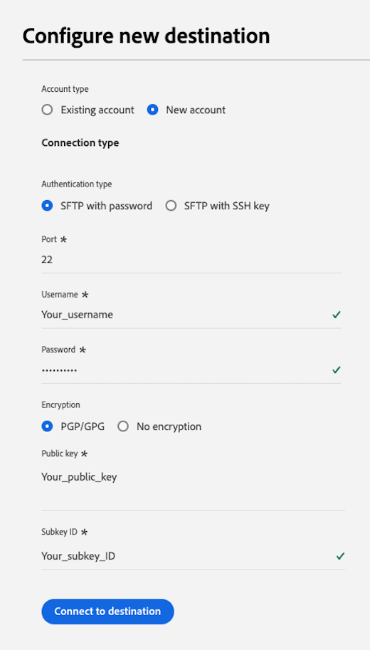
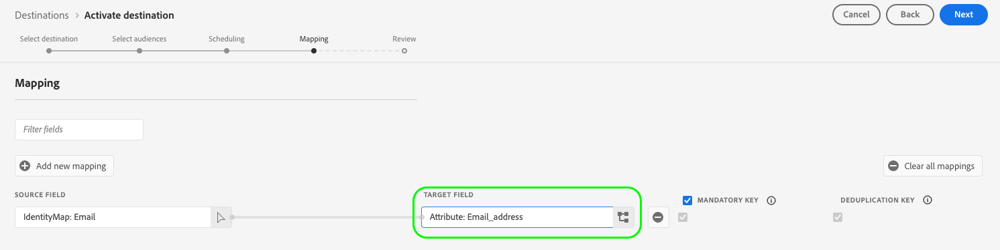

# [!DNL LiveRamp - Onboarding] 連線 {#liveramp-onboarding}

使用 [!DNL LiveRamp - Onboarding] 從Adobe Real-time Customer Data Platform到將受眾上線到的連線 [!DNL LiveRamp Connect].

## 使用案例 {#use-cases}

為了協助您更清楚瞭解您應如何及何時使用 [!DNL LiveRamp - Onboarding] 目的地，以下是Adobe Experience Platform客戶可以使用此目的地解決的範例使用案例。

身為行銷人員，我想從Adobe Experience Platform傳送受眾以將身分帶入 [!DNL LiveRamp Connect] 以便我可以鎖定行動裝置、開放式網頁、社交及 [!DNL CTV] 平台，使用 [!DNL Ramp ID] 識別碼。

## 先決條件 {#prerequisites}

此 [!DNL LiveRamp - Onboarding] 連線匯出檔案，使用 [LiveRamp的SFTP](https://docs.liveramp.com/connect/en/upload-a-file-via-liveramp-s-sftp.html) 儲存。

在您可以從Experience Platform將資料傳送至之前 [!DNL LiveRamp - Onboarding]，您需要您的 [!DNL LiveRamp] 認證。 請聯絡您的 [!DNL LiveRamp] 代表取得您的認證（若尚未取得）。

## 支援的身分 {#supported-identities}

[!DNL LiveRamp - Onboarding] 支援身分啟用，例如PII型識別碼、已知識別碼和自訂ID，如官方檔案所述 [LiveRamp檔案](https://docs.liveramp.com/connect/en/identity-and-identifier-terms-and-concepts.html#known-identifiers).

在 [對應步驟](#map) 啟動工作流程中，您必須將目標對應定義為自訂屬性。

## 支援的對象 {#supported-audiences}

本節說明您可以匯出至此目的地的所有對象。

所有目的地都支援啟用透過Experience Platform產生的對象 [分段服務](../../../segmentation/home.md).

此外，此目的地也支援下表所述的對象啟用。

| 對象型別 | 說明 |
---------|----------|
| 自訂上傳 | 受眾 [已匯入](../../../segmentation/ui/overview.md#importing-an-audience) 從CSV檔案Experience Platform為。 |

{style="table-layout:auto"}

## 匯出型別和頻率 {#export-type-frequency}

請參閱下表以取得目的地匯出型別和頻率的資訊。

| 項目 | 類型 | 附註 |
---------|----------|---------|
| 匯出型別 | **[!UICONTROL 對象匯出]** | 您正在匯出某個對象的所有成員，而這些成員中都有用於的識別碼（名稱、電話號碼或其他）。 [!DNL LiveRamp - Onboarding] 目的地。 |
| 匯出頻率 | **[!UICONTROL 每日批次]** | 由於設定檔會根據對象評估在Experience Platform中更新，因此設定檔（身分）會每天更新一次，從下游到目的地平台。 深入瞭解 [批次檔案型目的地](/help/destinations/destination-types.md#file-based). |

{style="table-layout:auto"}

## 連線到目的地 {#connect}

>[!IMPORTANT]
> 
>若要連線到目的地，您需要 **[!UICONTROL 管理目的地]** [存取控制許可權](/help/access-control/home.md#permissions). 閱讀 [存取控制總覽](/help/access-control/ui/overview.md) 或聯絡您的產品管理員以取得必要許可權。

若要連線至此目的地，請遵循以下說明的步驟： [目的地設定教學課程](../../ui/connect-destination.md). 在設定目標工作流程中，填寫以下兩個區段中列出的欄位。

### 驗證到目的地 {#authenticate}

若要向目的地進行驗證，請填寫必填欄位並選取 **[!UICONTROL 連線到目的地]**.

**使用密碼的SFTP驗證** {#sftp-password}



* **[!UICONTROL 使用者名稱]**：您的使用者名稱 [!DNL LiveRamp - Onboarding] 儲存位置。
* **[!UICONTROL 密碼]**：您的密碼 [!DNL LiveRamp - Onboarding] 儲存位置。
* **[!UICONTROL pgp/GPG加密金鑰]**：您可以選擇附加RSA格式的公開金鑰，為匯出的檔案新增加密。 在下圖中檢視格式正確的加密金鑰範例。 如果您提供加密金鑰，您也必須提供 **[!UICONTROL 加密子金鑰ID]** 在 [目的地詳細資料](#destination-details) 區段。

  

**使用SSH金鑰驗證的SFTP** {#sftp-ssh}


* **[!UICONTROL 使用者名稱]**：您的使用者名稱 [!DNL LiveRamp - Onboarding] 儲存位置。
* **[!UICONTROL ssh金鑰]**：私人 [!DNL SSH] 用來登入您的 [!DNL LiveRamp - Onboarding] 儲存位置。 私密金鑰必須格式化為 [!DNL Base64]-encoded字串，且不得受密碼保護。

   * 連線您的 [!DNL SSH] 索引鍵 [!DNL LiveRamp - Onboarding] 伺服器，您必須透過提交票證 [!DNL LiveRamp]的技術支援入口網站，並提供您的公開金鑰。 如需詳細資訊，請參閱 [LiveRamp檔案](https://docs.liveramp.com/connect/en/upload-a-file-via-liveramp-s-sftp.html#upload-with-an-sftp-client).

* **[!UICONTROL pgp/GPG加密金鑰]**：您可以選擇附加RSA格式的公開金鑰，為匯出的檔案新增加密。 如果您提供加密金鑰，您也必須提供 **[!UICONTROL 加密子金鑰ID]** 在 [目的地詳細資料](#destination-details) 區段。 在下圖中檢視格式正確的加密金鑰範例。

  

### 填寫目的地詳細資料 {#destination-details}

>[!CONTEXTUALHELP]
>id="platform_destinations_liveramp_subkey"
>title="加密子機碼 ID"
>abstract="用於加密的子機碼 ID，是根據 LiveRamp 公開加密金鑰。如果您在驗證步驟中提供了加密金鑰，則需要此欄位。"
>additional-url="https://docs.liveramp.com/connect/en/encrypting-files-for-uploading.html#downloading-the-current-encryption-key" text="了解如何取得子機碼 ID"

若要設定目的地的詳細資訊，請填寫下方的必填和選用欄位。 UI中欄位旁的星號表示該欄位為必填欄位。


* **[!UICONTROL 名稱]**：您日後可辨識此目的地的名稱。
* **[!UICONTROL 說明]**：可協助您日後識別此目的地的說明。
* **[!UICONTROL 資料夾路徑]**：的路徑 [!DNL LiveRamp] `uploads` 將託管匯出檔案的子資料夾。 此 `uploads` 字首會自動新增至資料夾路徑。 [!DNL LiveRamp] 建議您為Adobe Real-Time CDP的傳送建立專用的子資料夾，以便將這些檔案與其他任何現有的摘要分開，並確保所有自動化作業順暢執行。
   * 例如，如果要將檔案匯出至 `uploads/my_export_folder`，輸入 `my_export_folder` 在 **[!UICONTROL 資料夾路徑]** 欄位。
* **[!UICONTROL 壓縮格式]**：選取Experience Platform應用於匯出檔案的壓縮型別。 可用的選項包括 **[!UICONTROL GZIP]** 或 **[!UICONTROL 無]**.
* **[!UICONTROL 加密子金鑰ID]**：用於加密的子金鑰，根據 [!DNL LiveRamp] 公開加密金鑰。 如果您在「 」中提供加密金鑰， [authentication](#authenticate) 步驟。 請參閱 [!DNL LiveRamp] [加密檔案](https://docs.liveramp.com/connect/en/encrypting-files-for-uploading.html#downloading-the-current-encryption-key) 以瞭解如何取得子索引鍵ID。

### 啟用警示 {#enable-alerts}

您可以啟用警報以接收有關傳送到您目的地的資料流狀態的通知。 從清單中選取警報以訂閱接收有關資料流狀態的通知。 如需有關警示的詳細資訊，請閱讀以下指南： [使用UI訂閱目的地警報](../../ui/alerts.md).

當您完成提供目的地連線的詳細資訊時，請選取「 」 **[!UICONTROL 下一個]**.

## 啟用此目的地的對象 {#activate}

>[!IMPORTANT]
> 
>若要啟用資料，您需要 **[!UICONTROL 管理目的地]**， **[!UICONTROL 啟用目的地]**， **[!UICONTROL 檢視設定檔]**、和 **[!UICONTROL 檢視區段]** [存取控制許可權](/help/access-control/home.md#permissions). 閱讀 [存取控制總覽](/help/access-control/ui/overview.md) 或聯絡您的產品管理員以取得必要許可權。

讀取 [啟用對象資料至批次設定檔匯出目的地](/help/destinations/ui/activate-batch-profile-destinations.md) 以取得啟用此目的地對象的指示。

### 正在排程 {#scheduling}

在 [!UICONTROL 正在排程] 步驟，使用下列設定，為每個對象建立匯出排程。

>[!IMPORTANT]
>
>所有啟用至此目的地的對象都必須使用完全相同的排程進行設定，如下所示。

* **[!UICONTROL 檔案匯出選項]**： [!UICONTROL 匯出完整檔案]. [增量檔案匯出](../../ui/activate-batch-profile-destinations.md#export-incremental-files) 目前不支援 [!DNL LiveRamp] 目的地。
* **[!UICONTROL 頻率]**： [!UICONTROL 每日]
* 將匯出時間設為 **[!UICONTROL 區段評估後]**. 已排程的對象匯出和 [隨選檔案匯出](../../ui/export-file-now.md) 目前不支援 [!DNL LiveRamp] 目的地。
* **[!UICONTROL 日期]**：視需要選取匯出開始和結束時間。


匯出的檔案名稱目前無法由使用者設定。 所有匯出至 [!DNL LiveRamp - Onboarding] 目的地會根據下列範本自動命名：

`%ORGANIZATION_NAME%_%DESTINATION%_%DESTINATION_INSTANCE_ID%_%DATETIME%`


例如，為名為的組織匯出的檔案名稱 [!DNL Luma] 可能會如下所示：

```json
Luma_LiveRamp_52137231-4a99-442d-804c-39a09ddd005d_20230330_153857.csv
```

### 對應屬性和身分 {#map}

在 **[!UICONTROL 對應]** 步驟，您可以選取要為設定檔匯出的屬性和身分。

>[!IMPORTANT]
>
>此目的地支援為每個啟用流程啟用一個來源身分名稱空間。 如果您需要匯出多個身分識別名稱空間，例如 `Email` 和 `Phone`，您必須 [建立單獨的啟用流程](../../ui/activate-batch-profile-destinations.md) 每個身分識別。

在 **[!UICONTROL 對應]** 步驟， **[!UICONTROL 目標欄位]** 對應會定義匯出的CSV檔案中欄標題的名稱。 您可以為提供自訂名稱，將匯出檔案中的CSV欄標題變更為任何您想要的易記名稱 **[!UICONTROL 目標欄位]**.

>[!IMPORTANT]
>
>針對您的初始檔案傳遞至後對目標欄位所做的任何變更 [!DNL LiveRamp]，請通知您的 [!DNL LiveRamp] 客戶團隊或 [向LiveRamp支援提交票證](https://docs.liveramp.com/connect/en/considerations-when-uploading-the-first-file-to-an-audience.html#creating-a-support-case) 以確保變更反映在自動化程式中。

1. 在 **[!UICONTROL 對應]** 步驟，選取 **[!UICONTROL 新增對應]**. 您會在畫面上看到新的對應列。

   

2. 在 **[!UICONTROL 選取來源欄位]** 視窗，選擇 **[!UICONTROL 選取屬性]** 類別並選取您要對應的XDM屬性，或選擇 **[!UICONTROL 選取身分名稱空間]** 類別並選取身分以對應至您的目的地。

   

3. 在 **[!UICONTROL 選取目標欄位]** 視窗中，輸入您要將選取的來源欄位對映到的屬性名稱。 此處定義的屬性名稱將在匯出的CSV檔案中反映為欄標題。

   

   您也可以直接在「 」中輸入屬性名稱 **[!UICONTROL 目標欄位]**.

   

新增所有需要的對應後，選取 **[!UICONTROL 下一個]** 並完成啟動工作流程。

## 匯出的資料/驗證資料匯出 {#exported-data}

您的資料會匯出至 [!DNL LiveRamp - Onboarding] 您設定的儲存位置，如CSV檔案。

將檔案匯出至 [!DNL LiveRamp - Onboarding] 目的地，Platform會為每個目的地產生一個CSV檔案 [合併原則ID](../../../profile/merge-policies/overview.md).

例如，我們考慮以下對象：

* 對象A （合併原則1）
* 對象B （合併原則2）
* 對象C （合併原則1）
* 對象D （合併原則1）

Platform會將兩個CSV檔案匯出至 [!DNL LiveRamp - Onboarding]：

* 一個CSV檔案，包含對象A、C和D；
* 一個CSV檔案包含對象B。

匯出的CSV檔案包含具有所選屬性的設定檔和相應的對象狀態，並位於獨立的欄中，具有屬性名稱，以及 `audience_namespace:audience_ID` 做為欄標題配對，如下列範例所示：

`ATTRIBUTE_NAME, AUDIENCE_NAMESPACE_1:AUDIENCE_ID_1, AUDIENCE_NAMESPACE_2:AUDIENCE_ID_2,..., AUDIENCE_NAMESPACE_X:AUDIENCE_ID_X`

匯出檔案中包含的設定檔可符合下列其中一個對象資格狀態：

* `Active`：設定檔目前符合對象資格。
* `Expired`：設定檔不再符合對象的資格，但過去已符合資格。
* `""`（空字串）：設定檔從未符合對象的資格。

例如，轉存的CSV檔案包含一個 `email` 屬性，源自Experience Platform的兩個對象 [分段服務](../../../segmentation/home.md)，和一個 [已匯入](../../../segmentation/ui/overview.md#importing-an-audience) 外部對象，看起來可能像這樣：

```csv
email,ups:aa2e3d98-974b-4f8b-9507-59f65b6442df,ups:45d4e762-6e57-4f2f-a3e0-2d1893bcdd7f,CustomerAudienceUpload:7729e537-4e42-418e-be3b-dce5e47aaa1e
abc117@testemailabc.com,active,,
abc111@testemailabc.com,,,active
abc102@testemailabc.com,,,active
abc116@testemailabc.com,active,,
abc107@testemailabc.com,active,expired,active
abc101@testemailabc.com,active,active,
```

在上述範例中， `ups:aa2e3d98-974b-4f8b-9507-59f65b6442df` 和 `ups:45d4e762-6e57-4f2f-a3e0-2d1893bcdd7f` 區段會說明源自細分服務的對象，而 `CustomerAudienceUpload:7729e537-4e42-418e-be3b-dce5e47aaa1e` 說明匯入Platform的對象為 [自訂上傳](../../../segmentation/ui/overview.md#importing-an-audience).

因為Platform會為每個產生一個CSV檔案 [合併原則ID](../../../profile/merge-policies/overview.md)，也會為每個合併原則ID產生個別的資料流執行。

這表示 **[!UICONTROL 身分已啟用]** 和 **[!UICONTROL 已接收的設定檔]** 中的量度 [資料流執行](../../../dataflows/ui/monitor-destinations.md#dataflow-runs-for-batch-destinations) 系統會針對使用相同合併原則的每組受眾彙總頁面，而非針對每個受眾顯示。

由於針對使用相同合併原則的一組對象產生了資料流執行，因此對象名稱不會顯示在 [監視儀表板](../../../dataflows/ui/monitor-destinations.md#dataflow-runs-for-batch-destinations).


## 將匯出的資料上傳至LiveRamp {#upload-to-liveramp}

在您的資料成功匯出至 [!DNL LiveRamp - Onboarding] 儲存，您必須將資料上傳到 [!DNL LiveRamp] 平台。

如需如何上傳檔案的詳細資訊，請參閱 [!DNL LiveRamp - Onboarding] 儲存至 [!DNL LiveRamp] 對象，請參閱下列檔案： [上傳第一個檔案至對象時的注意事項](https://docs.liveramp.com/connect/en/considerations-when-uploading-the-first-file-to-an-audience.html#considerations-when-uploading-the-first-file-to-an-audience).

## 資料使用與控管 {#data-usage-governance}

全部 [!DNL Adobe Experience Platform] 處理您的資料時，目的地符合資料使用原則。 如需如何操作的詳細資訊 [!DNL Adobe Experience Platform] 強制執行資料控管，讀取 [資料控管概觀](/help/data-governance/home.md).

## 其他資源 {#additional-resources}

如需如何設定 [!DNL LiveRamp - Onboarding] 儲存，請參閱 [正式檔案](https://docs.liveramp.com/connect/en/upload-a-file-via-liveramp-s-sftp.html).
