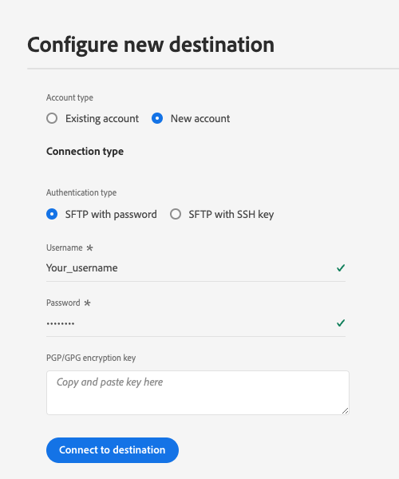

# (Alpha) [!DNL LiveRamp - SFTP] 連接 {#liveramp-destination}

將LiveRamp連接用於從Adobe Real-time Customer Data Platform到 [!DNL LiveRamp Connect]。

>[!IMPORTANT]
>
><p>此目標連接當前處於Alpha階段，僅對有限的客戶可用。 功能和文檔可能會更改。</p>
&gt;<p>此目標連接的最終版本可能需要客戶遷移。</p>


## 使用案例 {#use-cases}

幫助您更好地瞭解您應如何以及何時使用 [!DNL LiveRamp SFTP] 目的地，這裡是Adobe Experience Platform客戶可通過使用此目的地解決的示例使用案例。

作為營銷人員，我想把觀眾從Adobe Experience Platform發送到 [!DNL LiveRamp Connect] 這樣我就能瞄準用戶 [!DNL CTV] 平台，使用 [!DNL Ramp ID] 標識符。

## 先決條件 {#prerequisites}

的 [!DNL LiveRamp - SFTP] 連接導出檔案使用 [LiveRamp的SFTP](https://docs.liveramp.com/connect/en/upload-a-file-via-liveramp-s-sftp.html) 儲存。

在將資料從Experience Platform發送到 [!DNL LiveRamp SFTP]你需要 [!DNL LiveRamp] 憑據。 請聯繫您 [!DNL LiveRamp] 代表獲取您的憑據（如果您尚未擁有）。

## 支援的身份 {#supported-identities}

LiveRamp SFTP支援激活標識，如官方中描述的基於PII的標識符、已知標識符和自定義ID [LiveRamp文檔](https://docs.liveramp.com/connect/en/identity-and-identifier-terms-and-concepts.html#known-identifiers)。

在 [映射步驟](#map) 在激活工作流中，必須將目標映射定義為自定義屬性。

## 導出類型和頻率 {#export-type-frequency}

有關目標導出類型和頻率的資訊，請參閱下表。

| 項目 | 類型 | 附註 |
---------|----------|---------|
| 導出類型 | **[!UICONTROL 區段匯出]** | 您正在導出段（受眾）的所有成員，其中使用的標識符（名稱、電話號碼或其他） [!DNL LiveRamp SFTP] 目標。 |
| 導出頻率 | **[!UICONTROL 每日批]** | 當基於段評估在Experience Platform中更新概要檔案時，將概要檔案（標識）每天更新一次到目標平台下游。 閱讀有關 [基於批檔案的目標](/help/destinations/destination-types.md#file-based)。 |

{style="table-layout:auto"}

## 連接到目標 {#connect}

>[!IMPORTANT]
> 
>要連接到目標，您需要 **[!UICONTROL 管理目標]** [訪問控制權限](/help/access-control/home.md#permissions)。 閱讀 [訪問控制概述](/help/access-control/ui/overview.md) 或聯繫您的產品管理員以獲取所需權限。

要連接到此目標，請按照 [目標配置教程](../../ui/connect-destination.md)。 在配置目標工作流中，填寫下面兩節中列出的欄位。

### 驗證到目標 {#authenticate}

要驗證到目標，請填寫必填欄位並選擇 **[!UICONTROL 連接到目標]**。

**使用密碼進行SFTP驗證** {#sftp-password}



* **[!UICONTROL 用戶名]**:您的用戶名 [!DNL LiveRamp SFTP] 儲存位置。
* **[!UICONTROL 密碼]**:您的密碼 [!DNL LiveRamp SFTP] 儲存位置。
* **[!UICONTROL PGP/GPG加密密鑰]**:或者，您可以附加RSA格式的公鑰，以將加密添加到導出的檔案中。 查看下圖中格式正確的加密密鑰示例。 如果提供加密密鑰，則還必須提供 **[!UICONTROL 加密子密鑰ID]** 的 [目標詳細資訊](#destination-details) 的子菜單。

   

**SFTP與SSH密鑰驗證** {#sftp-ssh}


* **[!UICONTROL 用戶名]**:您的用戶名 [!DNL LiveRamp SFTP] 儲存位置。
* **[!UICONTROL SSH密鑰]**:私人 [!DNL SSH] 用於登錄到 [!DNL LiveRamp SFTP] 儲存位置。 私鑰必須格式化為 [!DNL Base64]-encoded字串，不得受密碼保護。

   * 連接 [!DNL SSH] 鍵 [!DNL LiveRamp SFTP] 伺服器，您必須通過 [!DNL LiveRamp]提供技術支援門戶，並提供您的公鑰。 請參閱 [LiveRamp文檔](https://docs.liveramp.com/connect/en/upload-a-file-via-liveramp-s-sftp.html#upload-with-an-sftp-client)。

* **[!UICONTROL PGP/GPG加密密鑰]**:或者，您可以附加RSA格式的公鑰，以將加密添加到導出的檔案中。 如果提供加密密鑰，則還必須提供 **[!UICONTROL 加密子密鑰ID]** 的 [目標詳細資訊](#destination-details) 的子菜單。 查看下圖中格式正確的加密密鑰示例。

   

### 填寫目標詳細資訊 {#destination-details}

>[!CONTEXTUALHELP]
>id="platform_destinations_liveramp_subkey"
>title="加密子機碼 ID"
>abstract="用於加密的子機碼 ID，是根據 LiveRamp 公開加密金鑰。如果您在驗證步驟中提供了加密金鑰，則需要此欄位。"
>additional-url="https://docs.liveramp.com/connect/en/encrypting-files-for-uploading.html#downloading-the-current-encryption-key" text="了解如何取得子機碼 ID"

要配置目標的詳細資訊，請填寫以下必需欄位和可選欄位。 UI中某個欄位旁邊的星號表示該欄位是必需的。


* **[!UICONTROL 名稱]**:您將來識別此目標的名稱。
* **[!UICONTROL 說明]**:將幫助您在將來確定此目標的說明。
* **[!UICONTROL 資料夾路徑]**:到 [!DNL LiveRamp] `uploads` 承載導出檔案的子資料夾。 的 `uploads` 前置詞會自動添加到資料夾路徑。
   * 例如，如果要將檔案導出到 `uploads/my_export_folder`，鍵入 `my_export_folder` 的 **[!UICONTROL 資料夾路徑]** 的子菜單。
* **[!UICONTROL 壓縮格式]**:選擇Experience Platform應用於導出檔案的壓縮類型。 可用選項包括 **[!UICONTROL GZIP]** 或 **[!UICONTROL 無]**。
* **[!UICONTROL 加密子密鑰ID]**:用於加密的子密鑰，基於 [!DNL LiveRamp] 公共加密密鑰。 如果在 [認證](#authenticate) 的子菜單。 查看 [!DNL LiveRamp] [加密文檔](https://docs.liveramp.com/connect/en/encrypting-files-for-uploading.html#downloading-the-current-encryption-key) 瞭解如何獲取子項ID。

### 啟用警報 {#enable-alerts}

您可以啟用警報來接收有關目標資料流狀態的通知。 從清單中選擇要訂閱的警報以接收有關資料流狀態的通知。 有關警報的詳細資訊，請閱讀上的指南 [使用UI訂閱目標警報](../../ui/alerts.md)。

完成提供目標連接的詳細資訊後，選擇 **[!UICONTROL 下一個]**。

## 將段激活到此目標 {#activate}

>[!IMPORTANT]
> 
>要激活資料，您需要 **[!UICONTROL 管理目標]**。 **[!UICONTROL 激活目標]**。 **[!UICONTROL 查看配置檔案]**, **[!UICONTROL 查看段]** [訪問控制權限](/help/access-control/home.md#permissions)。 閱讀 [訪問控制概述](/help/access-control/ui/overview.md) 或聯繫您的產品管理員以獲取所需權限。

閱讀 [將受眾資料激活到批配置檔案導出目標](/help/destinations/ui/activate-batch-profile-destinations.md) 有關激活此目標受眾段的說明。

### 計畫 {#scheduling}

在 [!UICONTROL 計畫] 步驟，建立每個段的導出計畫，其中的設定如下所示。

>[!IMPORTANT]
>
>所有激活到此目標的段必須配置完全相同的計畫，如下所示。

* **[!UICONTROL 檔案導出選項]**: [!UICONTROL 導出完整檔案]。 [增量檔案導出](../../ui/activate-batch-profile-destinations.md#export-incremental-files) 當前不支援 [!DNL LiveRamp] 目標。
* **[!UICONTROL 頻率]**: [!UICONTROL 每日]
* 將導出時間設定為 **[!UICONTROL 段評估後]**。 計畫段導出和 [按需檔案導出](../../ui/export-file-now.md) 當前不支援 [!DNL LiveRamp] 目標。
* **[!UICONTROL 日期]**:根據需要選擇導出開始和結束時間。


導出的檔案名當前不可由用戶配置。 導出到 [!DNL LiveRamp SFTP] 目標將根據以下模板自動命名：

`%ORGANIZATION_NAME%_%DESTINATION%_%DESTINATION_INSTANCE_ID%_%DATETIME%`


例如，為名為 [!DNL Luma] 可能看起來類似：

```json
Luma_LiveRamp_52137231-4a99-442d-804c-39a09ddd005d_20230330_153857.csv
```

### 映射屬性和標識 {#map}

在 **[!UICONTROL 映射]** 步驟，您可以選擇要為配置檔案導出的屬性和標識。

>[!IMPORTANT]
>
>此目標支援每個激活流激活一個源標識命名空間。 如果需要導出多個標識命名空間，例如 `Email` 和 `Phone`，必須 [建立單獨的激活流](../../ui/activate-batch-profile-destinations.md) 每個身份。

在 **[!UICONTROL 映射]** 的 **[!UICONTROL 目標欄位]** 映射定義導出的CSV檔案中列標題的名稱。 通過為導出檔案提供自定義名稱，可以將導出檔案中的CSV列標題更改為任何需要的友好名稱 **[!UICONTROL 目標欄位]**。

1. 在 **[!UICONTROL 映射]** 步驟，選擇 **[!UICONTROL 添加新映射]**。 螢幕上將顯示新的映射行。

   

2. 在 **[!UICONTROL 選擇源欄位]** ，選擇 **[!UICONTROL 選擇屬性]** 選擇要映射的XDM屬性，或選擇 **[!UICONTROL 選擇標識命名空間]** 選擇要映射到目標的標識。

   

3. 在 **[!UICONTROL 選擇目標欄位]** 窗口，輸入要將選定源欄位映射到的屬性名稱。 此處定義的屬性名稱將作為列標題在導出的CSV檔案中反映。

   

   也可以通過直接在 **[!UICONTROL 目標欄位]**。

   

添加所有所需映射後，選擇 **[!UICONTROL 下一個]** 並完成激活工作流。

## 導出的資料/驗證資料導出 {#exported-data}

您的資料將導出到 [!DNL LiveRamp SFTP] 儲存位置，作為CSV檔案。

將檔案導出到 [!DNL LiveRamp SFTP] 目標，平台為每個檔案生成一個CSV檔案 [合併策略ID](../../../profile/merge-policies/overview.md)。

例如，讓我們考慮以下幾個部分：

* 段A（合併策略1）
* 段B（合併策略2）
* 段C（合併策略1）
* 段D（合併策略1）

平台將兩個CSV檔案導出到 [!DNL LiveRamp SFTP]:

* 一個包含段A、C和D的CSV檔案；
* 一個包含段B的CSV檔案。

導出的CSV檔案包含具有選定屬性和相應段狀態的配置檔案，這些配置檔案位於單獨的列上，屬性名和段ID作為列標題。

導出檔案中包含的配置檔案可以匹配以下段資格狀態之一：

* `Active`:配置檔案當前符合段條件。
* `Expired`:配置檔案不再符合段的條件，但過去已符合條件。
* `""`（空字串）:截面梁從未為段限定。


例如，導出的CSV檔案 `email` attribute和3個段可能如下所示：

```csv
email,aa2e3d98-974b-4f8b-9507-59f65b6442df,45d4e762-6e57-4f2f-a3e0-2d1893bcdd7f,7729e537-4e42-418e-be3b-dce5e47aaa1e
abc117@testemailabc.com,active,,
abc111@testemailabc.com,,,active
abc102@testemailabc.com,,,active
abc116@testemailabc.com,active,,
abc107@testemailabc.com,active,expired,active
abc101@testemailabc.com,active,active,
```

由於平台為每個平台生成一個CSV檔案 [合併策略ID](../../../profile/merge-policies/overview.md)，它還為每個合併策略ID生成單獨的資料流運行。

這意味著 **[!UICONTROL 已激活身份]** 和 **[!UICONTROL 收到的配置檔案]** 度量 [資料流運行](../../../dataflows/ui/monitor-destinations.md#dataflow-runs-for-batch-destinations) 頁將針對使用相同合併策略的每組段進行聚合，而不是針對每個段顯示。

由於為使用相同合併策略的一組段生成了資料流運行，因此不會在 [監控儀表板](../../../dataflows/ui/monitor-destinations.md#dataflow-runs-for-batch-destinations)。


## 將導出的資料上載到LiveRamp {#upload-to-liveramp}

資料成功導出到 [!DNL LiveRamp - SFTP] 儲存，您必須將資料上載到 [!DNL LiveRamp] 平台。

有關如何從中上載檔案的詳細資訊 [!DNL LiveRamp - SFTP] 儲存到 [!DNL LiveRamp] 觀眾，請參閱以下文檔： [將第一個檔案上載到受眾時的注意事項](https://docs.liveramp.com/connect/en/considerations-when-uploading-the-first-file-to-an-audience.html#considerations-when-uploading-the-first-file-to-an-audience)。

## 資料使用和治理 {#data-usage-governance}

全部 [!DNL Adobe Experience Platform] 目標在處理資料時符合資料使用策略。 有關如何 [!DNL Adobe Experience Platform] 強制實施資料治理，讀取 [資料治理概述](/help/data-governance/home.md)。

## 其他資源 {#additional-resources}

有關如何配置LiveRamp SFTP儲存的詳細資訊，請參見 [正式檔案](https://docs.liveramp.com/connect/en/upload-a-file-via-liveramp-s-sftp.html)。
