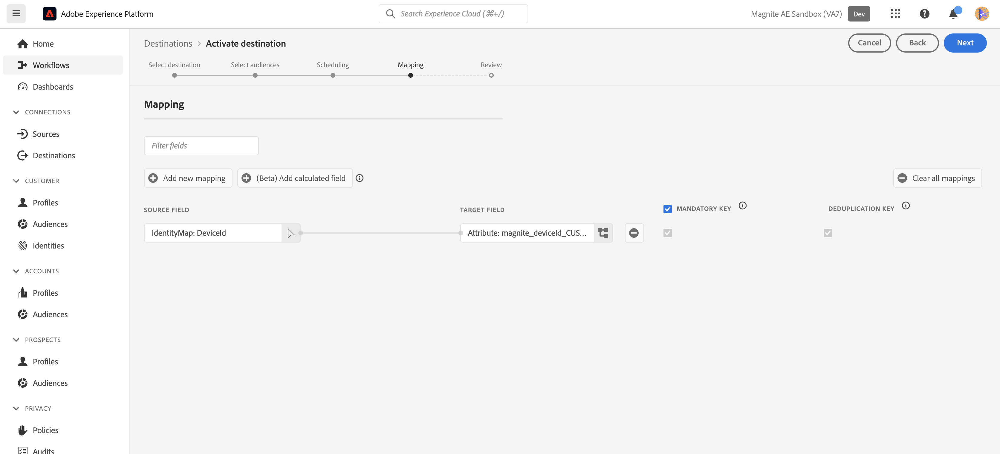

# 菱形：批次連線 {#magnite-streaming-batch}

## 概觀 {#overview}

本檔案說明Magnite：批次目的地，並提供使用案例範例，協助您更瞭解如何啟用和匯出受眾至該目的地。

Adobe Real-Time CDP受眾有兩種傳送至Magnite串流平台的方式 — 可以每天傳送一次，或是即時傳送：

1. 如果您每天只需要和/或需要傳送一次對象，可以使用Magnite：批次目的地，透過每日S3批次檔案傳送將對象傳送到Magnite串流。 這些批次對象會在Magnite平台中無限期儲存，不像即時對象只會儲存幾天。

2. 不過，如果您想要或需要更頻繁地傳送對象，則需要使用[Magnite即時](/help/destinations/catalog/advertising/magnite-streaming.md)目的地。 使用即時目的地時，Magnite串流將會即時接收對象，但Magnite只能暫時將即時對象儲存在其平台中，並且這些對象將在幾天內從系統中移除。 因此，如果您想要使用Magnite Real-Time目的地，您&#x200B;*也*&#x200B;需要使用Magnite：批次目的地 — 您對Real-Time目的地啟用的每個對象，也需要對Batch目的地啟用。

回顧：如果您每天只想傳送Adobe Real-Time CDP對象一次，只需使用Magnite：批次目的地，對象將會每天傳送一次。 如果您想要即時傳送Adobe Real-Time CDP對象，您將會使用&#x200B;*both*&#x200B;菱形：批次目的地和菱形即時目的地。 如需詳細資訊，請造訪Magnite：串流。

繼續閱讀下方，深入瞭解Magnite：批次目的地、如何連線至該目的地，以及如何為其啟用Adobe Real-Time CDP對象。
如需即時目的地的詳細資訊，請參閱[此檔案頁面](magnite-streaming.md)。

>[!IMPORTANT]
>
>此目的地聯結器為測試版，僅供特定客戶使用。 若要要求存取權，請聯絡您的Adobe代表。
>
>目的地聯結器和檔案頁面是由[!DNL Magnite]團隊建立和維護的。 若有任何查詢或更新要求，請直接透過`adobe-tech@magnite.com`聯絡。

## 使用案例 {#use-cases}

為協助您更清楚瞭解應如何及何時使用Magnite：批次目的地，以下是Adobe Experience Platform客戶可使用此目的地解決的範例使用案例。

### 使用案例#1 {#use-case-1}

您已在Magnite即時目的地上啟用對象。

任何透過Magnite即時目的地啟用的對象也必須使用Magnite：批次目的地，因為批次傳送的資料旨在取代/保留Magnite串流平台中的即時傳送資料。

### 使用案例#2 {#use-case-2}

您只想在Magnite串流平台中以批次/每日步調啟用對象。

透過Magnite：批次目的地啟用的任何受眾，都將以批次/每日順序傳送，並可在Magnite串流平台中用於鎖定目標。

## 先決條件 {#prerequisites}

若要在Adobe Experience Platform中使用[!DNL Magnite]目的地，您必須先擁有Magnite串流帳戶。 如果您有[!DNL Magnite Streaming]帳戶，請洽詢您的[!DNL Magnite]帳戶管理員，以取得存取[!DNL Magnite's]目的地的認證。 如果您沒有[!DNL Magnite Streaming]帳戶，請連絡adobe-tech@magnite.com

## 支援的身分 {#supported-identities}

Magnite：批次目的地可以接收來自AdobeCDP的&#x200B;*任何*&#x200B;身分來源。 目前，此目的地有三個目標身分欄位可供您對應。

>[!NOTE]
>
>*任何*&#x200B;身分識別來源可以對應到任何`magnite_deviceId`目標身分。

| 目標身分 | 說明 | 考量事項 |
|:--------------------------- |:------------------------------------------------------------------------------------------------ |:------------------------------------------------------------------------------------- |
| magnite_deviceId_GAID | GOOGLE ADVERTISING ID | 當您的來源身分是GAID時，選取此Target身分 |
| magnite_deviceId_IDFA | 廣告商適用的Apple ID | 當您的來源身分識別是IDFA時，選取此目標身分 |
| magnite_deviceId_CUSTOM | 自訂/使用者定義的ID | 如果您的來源身分不是GAID或IDFA，或是自訂或使用者定義的ID，請選取此目標身分 |

{style="table-layout:auto"}

## 支援的對象 {#supported-audiences}

| 對象來源 | 支援 | 說明 |
|-----------------------------|----------|----------|
| [!DNL Segmentation Service] | ✓ (A) | 透過Experience Platform[細分服務](../../../segmentation/home.md)產生的對象。 |
| 自訂上傳 | ✓ (A) | 對象[從CSV檔案匯入](../../../segmentation/ui/audience-portal.md#import-audience)至Experience Platform。 |

{style="table-layout:auto"}

## 匯出型別和頻率 {#export-type-frequency}

| 項目 | 類型 | 附註 |
|-----------------------------|----------|----------|
| 匯出類型 | 對象匯出 | 您正在匯出某個對象的所有成員，其中包含在Magnite：批次目的地中使用的識別碼（名稱、電話號碼或其他）。 |
| 匯出頻率 | 批次 | 批次目的地會以三、六、八、十二或二十四小時的增量將檔案匯出至下游平台。 深入瞭解批次[以檔案為基礎的目的地](/help/destinations/destination-types.md)。 |

{style="table-layout:auto"}

## 連線到目標 {#connect}

一旦您的目的地使用獲得核准，且Magnite串流已共用您的認證，請遵循以下步驟驗證、對應和共用資料。

### 驗證目標 {#authenticate}

在Adobe體驗目錄中找到Magnite：批次目的地。 按一下其他選項按鈕(\...)，然後設定目的地連線/執行個體。

如果您已經有現有的帳戶，您可以將「帳戶型別」選項變更為「現有帳戶」來尋找該帳戶。 否則，您將在下方建立帳戶：

若要建立新帳戶並首次驗證至目的地，請填寫必要的「S3存取金鑰」和「S3秘密金鑰」欄位（透過帳戶管理員提供給您），然後選取&#x200B;**[!UICONTROL 連線至目的地]**

>[!NOTE]
>
>Magnite串流的安全性原則需要定期輪換S3金鑰。 您未來應該會使用新的S3存取權和S3秘密金鑰來更新帳戶。 您只需要更新帳戶本身 — 使用該帳戶的目的地會自動使用更新的金鑰。 若無法上傳新金鑰，會導致資料無法傳送至此目的地。

### 填寫目標詳細資訊 {#destination-details}

若要設定目的地的詳細資訊，請填寫下方的必填和選用欄位。 UI中欄位旁的星號表示該欄位為必填欄位。

* **[!UICONTROL 名稱]**：您用來辨識此目的地連線/執行個體的名稱
未來。
* **[!UICONTROL 描述]**：可協助您識別此內容的描述
未來的目的地連線/執行個體。
* **[!UICONTROL 您的來源合作夥伴名稱]**：您要在Magnite Streaming的平台上做為來源的名稱

>[!NOTE]
>
>如果您打算傳送多個ID型別（GAID、IDFA等） 使用「批次」目的地時，每個都需要新的目的地連線/執行個體。 如需詳細資訊，請聯絡您的Magnite客戶代表。

接著，您可以選取&#x200B;**[!UICONTROL 下一步]**&#x200B;以繼續進行

在下一個標題為「治理原則與執行動作（選用）」的畫面上，您可以選擇選取任何相關的資料治理原則。 一般會針對Magnite：批次目的地選取「資料匯出」。

選取之後，或如果您要略過此選擇性畫面，請選取&#x200B;**[!UICONTROL 建立]**

### 啟用警示 {#enable-alerts}

您可以啟用警報以接收有關傳送到您目的地的資料流狀態的通知。 從清單中選取警報以訂閱接收有關資料流狀態的通知。 如需警示的詳細資訊，請參閱[使用UI訂閱目的地警示](../../ui/alerts.md)的指南。

當您完成提供目的地連線的詳細資訊後，請選取&#x200B;**[!UICONTROL 下一步]**。

### 啟用此目的地的區段 {#activate}

>[!IMPORTANT]
> 
>* 若要啟用資料，您需要&#x200B;**[!UICONTROL 檢視目的地]**、**[!UICONTROL 啟用目的地]**、**[!UICONTROL 檢視設定檔]**&#x200B;和&#x200B;**[!UICONTROL 檢視區段]** [存取控制許可權](/help/access-control/home.md#permissions)。 閱讀[存取控制總覽](/help/access-control/ui/overview.md)或連絡您的產品管理員以取得必要的許可權。
>* 若要匯出&#x200B;*身分*，您需要&#x200B;**[!UICONTROL 檢視身分圖表]** [存取控制許可權](/help/access-control/home.md#permissions)。  {width="100" zoomable="yes"}

讀取[啟用批次設定檔匯出目的地的對象資料](/help/destinations/ui/activate-batch-profile-destinations.md)，以取得啟用此目的地的對象區段的指示。

### 對應屬性和身分 {#map}

在&#x200B;**[!UICONTROL Source欄位]**中，您可以為裝置選取任何屬性或身分。 在此範例中，我們已選取名為「DeviceId」的自訂IdentityMap

在&#x200B;**[!UICONTROL 目標欄位]**中：
如需詳細資訊，請參閱[支援的身分](#supported-identities)。
在此範例中，我們已選取**[!UICONTROL 目標欄位]**： magnite_deviceId_CUSTOM，因為我們的&#x200B;**[!UICONTROL Source欄位]**&#x200B;已定義為自訂IdentityMap： DeviceID。

>[!NOTE]
>
>如果您打算傳送/對應多個ID型別（GAID、IDFA等） 使用「批次」目的地時，每個都需要新的目的地連線/執行個體。 如需詳細資訊，請聯絡您的Magnite客戶代表。

在「設定每個對象的檔案名稱和匯出排程」畫面上，您現在必須設定每個對象的開始日期（必要）、結束日期（選用）和對應ID （必要）。

>[!IMPORTANT]
>
> 此目的地需要對應ID或「無」。
>
> 當對象具有Magnite串流先前已知的預先存在區段ID時，應提供對應ID。 否則，「NONE」應作為對應ID。
>
> 設定每個對象的檔案名稱時，請透過「自訂文字」欄位包含對應ID以新增。 對應ID將附加為： `{previous_filename}\_\[MAPPING_ID\].`如果此對象是Magnite Streaming的新使用者，並且您不提供對應ID，則應在「自訂文字」欄位中輸入「NONE」。 此案例中的新檔案名稱應為： `{previous_filename}\_\[NONE\]`。

## 匯出的資料/驗證資料匯出 {#exported-data}

上傳受眾後，您可以驗證受眾是否已正確建立和上傳。

* The Magnite：批次目的地以每日順序將S3檔案傳送至Magnite串流。 傳送和內嵌後，對象/區段預計會顯示在Magnite串流中，並可套用至交易。 您可以查詢Adobe Experience Platform中在啟動步驟期間共用的區段ID或區段名稱，以確認這一點。

>[!NOTE]
>
>已啟用/傳送至菱鎂礦的受眾：批次目的地將&#x200B;*取代*&#x200B;透過Magnite即時目的地啟用/傳送的相同受眾。 如果您使用區段名稱來查詢區段，可能直到該批次已由Magnite串流平台攝取和處理後，才能即時找到區段。

## 資料使用與控管 {#data-usage-governance}

處理您的資料時，所有[!DNL Adobe Experience Platform]目的地都符合資料使用原則。 如需[!DNL Adobe Experience Platform]如何強制資料控管的詳細資訊，請閱讀[資料控管概觀](/help/data-governance/home.md)。

## 其他資源 {#additional-resources}

如需其他說明檔案，請造訪[Magnite說明中心](https://help.magnite.com/help)。
