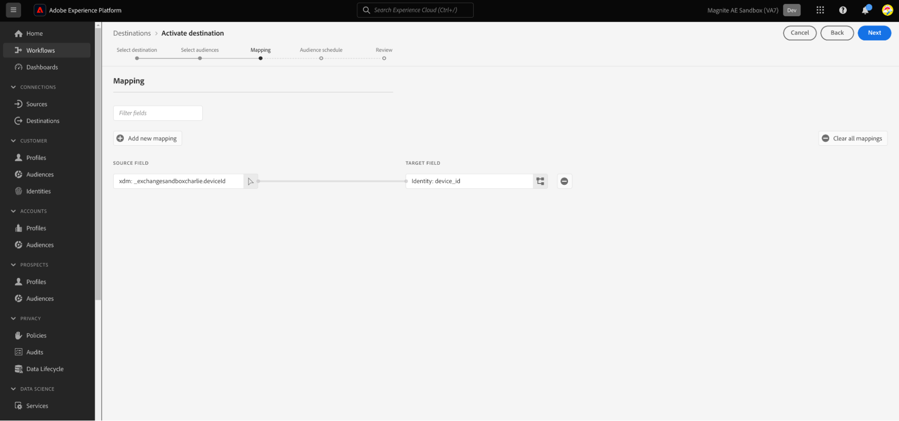

# (Beta) Magnite：即時目的地連線

## 概觀 {#overview}

Adobe Experience Platform中的[!DNL Magnite: Real-Time]和[Magnite：批次](/help/destinations/catalog/advertising/magnite-batch.md)目的地可協助您對應及匯出對象，以便在Magnite串流平台上鎖定和啟動。

啟用對象至[!DNL Magnite Streaming]平台是兩個步驟的程式，需要您同時使用Magnite： Real-Time和Magnite： Batch目的地。

若要將您的對象啟動至[!DNL Magnite Streaming]，您必須：

* 啟用[!DNL Magnite: Real-Time]目的地上的對象，如本頁所示。
* 在Magnite：批次目的地上啟用相同的對象。 [!DNL Magnite: Batch]目的地是必要元件。 若無法在[!DNL Magnite Streaming]批次目的地上啟用對象，將會導致整合失敗，且您的對象將不會啟用。

注意：使用即時目的地時，[!DNL Magnite Streaming]將會即時接收對象，但Magnite只能暫時將即時對象儲存在其平台中，並且這些對象將在幾天內從系統中移除。 因此，如果您想要使用Magnite： Real-Time目的地，您&#x200B;*也*&#x200B;需要使用Magnite： Batch目的地 — 您對Real-Time目的地啟用的每個對象，也需要對Batch目的地啟用。

>[!IMPORTANT]
>
>此目的地聯結器為測試版，僅供特定客戶使用。 若要要求存取權，請聯絡您的Adobe代表。
>
>目的地聯結器和檔案頁面是由[!DNL Magnite]團隊建立和維護的。 若有任何查詢或更新要求，請直接透過`adobe-tech@magnite.com`聯絡。

## 使用案例 {#use-cases}

為協助您更清楚瞭解您應如何及何時使用[!DNL Magnite: Real-Time]目的地，以下是Adobe Experience Platform客戶可藉由使用此目的地解決的範例使用案例。

### 啟用與定位 {#activation-and-targeting}

這項與Magnite的整合可讓客戶將其CDP受眾從Adobe Experience Platform傳遞到Magnite，以用於廣告目標定位。 您可以在Magnite中選取受眾以用於正面目標定位和負面目標定位（隱藏）。

## 先決條件 {#prerequisites}

若要在Adobe Experience Platform中使用[!DNL Magnite]目的地，您必須先擁有[!DNL Magnite Streaming]帳戶。 如果您有[!DNL Magnite Streaming]帳戶，請洽詢您的[!DNL Magnite]帳戶管理員，以取得存取[!DNL Magnite's]目的地的認證。
如果您沒有[!DNL Magnite Streaming]帳戶，請連絡adobe-tech@magnite.com

## 支援的身分 {#supported-identities}

[!DNL Magnite: Real-Time]目的地支援下表所述的身分啟用。 深入瞭解[身分](/help/identity-service/features/namespaces.md)。

| 目標身分 | 說明 | 考量事項 |
|-------------------|--------------------------------------------------------------------------------------------------|--------------------------------------------------------------------------------------|
| device_id | 裝置或身分的唯一識別碼。 我們接受任何裝置ID和第一方ID，無論型別為何。 | Magnite支援的身分型別包括但不限於PPUID、GAID、IDFA和電視裝置ID。 |

{style="table-layout:auto"}

## 支援的對象 {#supported-audiences}

本節說明您可以將哪些型別的對象匯出至此目的地。

| 對象來源 | 支援 | 說明 |
|-----------------------------|----------|----------|
| [!DNL Segmentation Service] | ✓ (A) | 透過Experience Platform[細分服務](../../../segmentation/home.md)產生的對象。 |
| 自訂上傳 | ✓ (A) | 對象[從CSV檔案匯入](../../../segmentation/ui/audience-portal.md#import-audience)至Experience Platform。 |

{style="table-layout:auto"}

## 匯出型別和頻率 {#export-type-frequency}

請參閱下表以取得目的地匯出型別和頻率的資訊。

| 項目 | 類型 | 附註 |
|------------------|---------------------------------|------------------------------------------------------------------------------------------------------------------------------------------------------------------------------------------------------------------------------------------------------------------------------------------------------------------------------------|
| 匯出類型 | **[!UICONTROL 區段匯出]** | 您正在匯出區段（對象）的所有成員，其中包含[!DNL Magnite: Real-Time]目的地中使用的識別碼（名稱、電話號碼或其他）。 |
| 匯出頻率 | **[!UICONTROL 串流]** | 串流目的地是「一律開啟」的API型連線。 一旦根據區段評估在Experience Platform中更新了設定檔，聯結器就會將更新傳送至下游的目標平台。 深入瞭解[串流目的地](/help/destinations/destination-types.md#streaming-destinations)。 |

{style="table-layout:auto"}

## 連線到目標 {#connect}

>[!IMPORTANT]
>
>若要連線到目的地，您需要&#x200B;**[!UICONTROL 檢視目的地]**&#x200B;和&#x200B;**[!UICONTROL 管理目的地]** [存取控制許可權](/help/access-control/home.md#permissions)。 閱讀[存取控制總覽](/help/access-control/ui/overview.md)或連絡您的產品管理員以取得必要的許可權。

若要連線到此目的地，請依照[目的地組態教學課程](../../ui/connect-destination.md)中所述的步驟進行。 在設定目標工作流程中，填寫以下兩個區段中列出的欄位。

### 驗證目標 {#authenticate}

若要驗證到目的地，請填入必填欄位，然後選取&#x200B;**[!UICONTROL 連線到目的地]**。

* **[!UICONTROL 使用者名稱]**： [!DNL Magnite]提供給您的使用者名稱。
* **[!UICONTROL 密碼]**： [!DNL Magnite]提供給您的密碼。

### 填寫目標詳細資訊 {#destination-details}

若要設定目的地的詳細資訊，請填寫下方的必填和選用欄位。 UI中欄位旁的星號表示該欄位為必填欄位。

* **[!UICONTROL 名稱]**：您日後可辨識此目的地的名稱。
* **[!UICONTROL 描述]**：可協助您日後識別此目的地的描述。
* **[!UICONTROL 您的來源合作夥伴名稱]**：您的客戶/公司名稱。 只有支援的[!DNL Magnite Streaming]使用者端可供選擇。

完成後，選取&#x200B;**[!UICONTROL 建立]**&#x200B;按鈕。

### 啟用警示 {#enable-alerts}

您可以啟用警報以接收有關傳送到您目的地的資料流狀態的通知。 從清單中選取警報以訂閱接收有關資料流狀態的通知。 如需警示的詳細資訊，請參閱[使用UI訂閱目的地警示](../../ui/alerts.md)的指南。

當您完成提供目的地連線的詳細資訊後，請選取&#x200B;**[!UICONTROL 下一步]**。

## 啟用此目的地的區段 {#activate}

>[!IMPORTANT]
>
>* 若要啟用資料，您需要&#x200B;**[!UICONTROL 檢視目的地]**、**[!UICONTROL 啟用目的地]**、**[!UICONTROL 檢視設定檔]**&#x200B;和&#x200B;**[!UICONTROL 檢視區段]** [存取控制許可權](/help/access-control/home.md#permissions)。 閱讀[存取控制總覽](/help/access-control/ui/overview.md)或連絡您的產品管理員以取得必要的許可權。
>* 若要匯出&#x200B;*身分*，您需要&#x200B;**[!UICONTROL 檢視身分圖表]** [存取控制許可權](/help/access-control/home.md#permissions)。  {width="100" zoomable="yes"}

閱讀[啟用串流區段匯出目的地的設定檔和區段](/help/destinations/ui/activate-segment-streaming-destinations.md)，以取得啟用此目的地的對象區段的指示。

建立目的地連線後，您可以繼續前往對象啟用流程。 下節會逐步說明如何使用即時目的地來啟用對象。

### 對應屬性和身分 {#map}

下一步是將來源識別碼對應到Magnite device_id識別碼。

* 您可以選取&#x200B;**[!UICONTROL 新增對應]**，視需要新增對應。

此使用即時目的地的範例顯示包含對應至Magnite device_id目標欄位的一般deviceId來源識別碼的列。 當您使用對應時，請選取[!UICONTROL 下一步]。

請務必將對映ID設定為所有已啟用的對象，如果沒有對映ID存在，則設為「無」。

您現在必須為每個對象設定開始日期（必要）、結束日期（選用）和對應ID。

**對應ID**

* 當對象具有Magnite先前已知的預先存在區段ID時，使用&#x200B;**[!UICONTROL 對應ID]**&#x200B;欄位。

* 若要將&#x200B;**[!UICONTROL 對應ID]**&#x200B;新增至對象，請個別選取每個對象列，然後在右側欄中輸入資料（請參閱上圖）。 如果您不想要新增對應ID，請在「對應ID」欄位中輸入NONE 。

選取&#x200B;**[!UICONTROL 下一步]**&#x200B;並完成啟動流程。

![選取[下一步]並完成啟動流程。](../../assets/catalog/advertising/magnite/destination-realtime-active-audience-review.png)

## 匯出的資料/驗證資料匯出 {#exported-data}

上傳對象後，您可使用以下步驟驗證對象是否已正確建立和上傳：

<!--

* In 95% of cases, audiences will be delivered to Magnite Streaming in under 10 minutes. The actual receipt and processing of the events within Magnite Streaming depends on the shared data volume.

-->

* 擷取後，對象預計會在幾分鐘內出現在[!DNL Magnite Streaming]中，並可套用至交易。 您可以查詢Adobe Experience Platform中在啟動步驟期間共用的區段ID來確認此專案。

## 透過[!DNL Magnite: Batch]目的地啟用相同的對象

使用「即時」目的地與[!DNL Magnite Streaming]共用的對象也需要使用Magnite：批次目的地來共用。 正確設定後，[!DNL Magnite Streaming] UI中的區段名稱會更新，以反映Adobe Experience Platform每日更新後所使用的名稱。

最後，如果尚未針對整合設定批次目的地，請透過Magnite：批次目的地檔案立即進行設定。

## 資料使用與控管 {#data-usage-governance}

處理您的資料時，所有[!DNL Adobe Experience Platform]目的地都符合資料使用原則。 如需[!DNL Adobe Experience Platform]如何強制資料控管的詳細資訊，請閱讀[資料控管概觀](/help/data-governance/home.md)。

## 其他資源 {#additional-resources}

如需其他說明檔案，請造訪[Magnite說明中心](https://help.magnite.com/help)。
