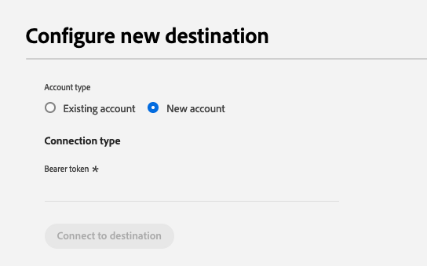

# PubMatic Connect目的地 {#pubmatic-connect}

## 概觀 {#overview}

使用 [!DNL PubMatic Connect] 提供未來程式化的數位行銷供應鏈，為客戶創造最大價值。 [!DNL PubMatic Connect] 結合平台技術與專屬服務，強化存貨與資料的封裝與異動方式。

使用此目的地可將受眾資料傳送至 [!DNL PubMatic Connect] 平台。

>[!IMPORTANT]
>
>目的地聯結器和檔案頁面是由 [!DNL PubMatic] 團隊。 如有任何查詢或更新要求，請直接聯絡他們： `support@pubmatic.com`.

## 使用案例 {#use-cases}

為了協助您更清楚瞭解您應如何及何時使用 [!DNL PubMatic Connect] 目的地，以下是Adobe Experience Platform客戶可以使用此目的地解決的範例使用案例。

### 在行動、網頁和CTV平台上鎖定使用者 {#targeting}

發佈者或資料提供者想要從Adobe Experience Platform將受眾傳送至 [!DNL PubMatic Connect] 使用大量識別碼來鎖定行動、網頁和CTV平台上的使用者。

## 先決條件 {#prerequisites}

與您的 [!DNL PubMatic] 客戶經理，以確定您的帳戶已正確設定，並支援上線對象區段。 他們也會確保您擁有使用此目的地的所有相關詳細資料，並在設定期間為您提供支援。

## 支援的身分 {#supported-identities}

[!DNL PubMatic Connect] 支援下表所述的身分啟用。 進一步瞭解 [身分](/help/identity-service/namespaces.md).

| 目標身分 | 說明 | 考量事項 |
| --------------- | ------ | --- |
| GAID | Google廣告ID | 當您的來源身分是GAID名稱空間時，請選取GAID目標身分。 |
| IDFA | 廣告商適用的Apple ID | 當您的來源身分是IDFA名稱空間時，請選取IDFA目標身分。 |
| extern_id | 自訂使用者ID | 當您的來源身分是自訂名稱空間時，請選取此目標身分。 |

{style="table-layout:auto"}

## 支援的對象 {#supported-audiences}

本節說明您可以將哪些型別的對象匯出至此目的地。

| 對象來源 | 支援 | 說明 |
| --- | --------- | ------ |
| [!DNL Segmentation Service] | ✓ (A) | 透過Experience Platform產生的對象 [分段服務](../../../segmentation/home.md). |
| 自訂上傳 | ✓ | 受眾 [已匯入](../../../segmentation/ui/overview.md#import-audience) 從CSV檔案Experience Platform為。 |

{style="table-layout:auto"}

## 匯出型別和頻率 {#export-type-frequency}

請參閱下表以取得目的地匯出型別和頻率的資訊。

| 項目 | 類型 | 附註 |
| --- | --- | --- |
| 匯出型別 | **[!UICONTROL 區段匯出]** | 您正在匯出區段（對象）的所有成員，而這些區段具有PubMatic Connect目的地所使用的識別碼（名稱、電話號碼或其他）。 |
| 匯出頻率 | **[!UICONTROL 串流]** | 串流目的地是「一律開啟」的API型連線。 當根據區段評估在Experience Platform中更新設定檔時，聯結器會將更新傳送至下游的目標平台。 深入瞭解 [串流目的地](/help/destinations/destination-types.md#streaming-destinations). |

{style="table-layout:auto"}

## 連線到目標 {#connect}

>[!IMPORTANT]
>
> 若要連線到目的地，您需要 **[!UICONTROL 管理目的地]** [存取控制許可權](/help/access-control/home.md#permissions). 閱讀 [存取控制總覽](/help/access-control/ui/overview.md) 或聯絡您的產品管理員以取得必要許可權。

若要連線至此目的地，請遵循以下說明的步驟： [目的地設定教學課程](../../ui/connect-destination.md). 在目標設定工作流程中，填寫以下兩個區段中列出的欄位。

### 驗證目標 {#authenticate}

若要向目的地進行驗證，請填寫必填欄位並選取 **[!UICONTROL 連線到目的地]**.

- **[!UICONTROL 持有人權杖]**：填寫持有人權杖以對目的地進行驗證。

### 填寫目標詳細資訊 {#destination-details}

若要設定目的地的詳細資訊，請填寫下方的必填和選用欄位。 UI中欄位旁的星號表示該欄位為必填欄位。

- **[!UICONTROL 名稱]**：您日後可辨識此目的地的名稱。
- **[!UICONTROL 說明]**：可協助您日後識別此目的地的說明。
- **[!UICONTROL 資料合作夥伴ID]**：在中設定的資料合作夥伴ID [!DNL PubMatic] 此整合的帳戶。
- **[!UICONTROL 預設國家/地區代碼]**：如果設定檔中未提供預設國家/地區代碼，則應套用至所有身分。
- **[!UICONTROL 帳戶ID]**：您的 [!DNL PubMatic Connect] 帳戶ID。
- **[!UICONTROL 帳戶型別]**：您的帳戶型別 [!DNL PubMatic] 平台帳戶。 與您的 [!DNL PubMatic] 若您有任何問題需要選擇，請諮詢客戶經理。 可使用的選項包括：
   - [!UICONTROL 發佈者]
   - [!UICONTROL DEMAND_PARTNER]
   - [!UICONTROL 購買者]

### 啟用警示 {#enable-alerts}

您可以啟用警報以接收有關傳送到您目的地的資料流狀態的通知。 從清單中選取警報以訂閱接收有關資料流狀態的通知。 如需警示的詳細資訊，請參閱以下指南： [使用UI訂閱目的地警報](../../ui/alerts.md).

當您完成提供目的地連線的詳細資訊時，請選取「 」 **[!UICONTROL 下一個]**.

## 啟用此目的地的區段 {#activate}

>[!IMPORTANT]
>
> - 若要啟用資料，您需要 **[!UICONTROL 檢視目的地]**， **[!UICONTROL 啟用目的地]**， **[!UICONTROL 檢視設定檔]**、和 **[!UICONTROL 檢視區段]** [存取控制許可權](/help/access-control/home.md#permissions). 閱讀 [存取控制總覽](/help/access-control/ui/overview.md) 或聯絡您的產品管理員以取得必要許可權。
>
> - 要匯出 _身分_，您需要 **[!UICONTROL 檢視身分圖表]** [存取控制許可權](/help/access-control/home.md#permissions).   {width="100" zoomable="yes"}

讀取 [對串流區段匯出目的地啟用設定檔和區段](/help/destinations/ui/activate-segment-streaming-destinations.md) 以取得啟用此目的地的受眾區段的指示。

### 對應屬性和身分 {#map}

選取來源欄位：

- 選取識別碼（通常是IDFA或自訂ID名稱空間等名稱空間）。

選取目標欄位：

- 與您的 [!DNL PubMatic] 帳戶管理員，以取得在此步驟中哪種UID型別將正確的資訊。
- 選取 [!DNL PubMatic UID] 輸入與您在第一個步驟中選取的識別碼相符的數字。

## 匯出的資料/驗證資料匯出 {#exported-data}

此 [!DNL PubMatic] UI可讓您檢查資料是否已正確推送，以及區段是否可供使用。 推送的資料最多可能需要24小時的時間。 [!DNL PubMatic] 要更新的UI。

## 資料使用與控管 {#data-usage-governance}

全部 [!DNL Adobe Experience Platform] 處理您的資料時，目的地符合資料使用原則。 如需如何操作的詳細資訊 [!DNL Adobe Experience Platform] 強制執行資料控管，讀取 [資料控管概觀](/help/data-governance/home.md).
