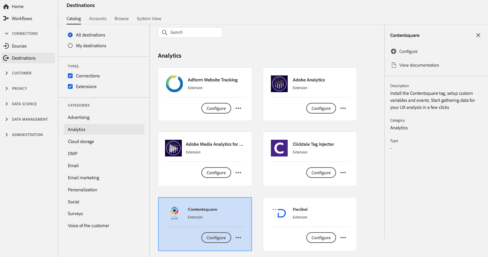

# [!DNL Contentsquare] 擴充功能 {#contentsquare-extension}

## 概觀 {#overview}

將頁面內行為視覺化，瞭解客戶為何放棄以及您可以如何改進。 將收入歸因於每個Analytics受眾和Target測試的UX和內容元素。 安裝 [!DNL Contentsquare] 標籤、設定自訂變數和事件。 只要按幾下，即可開始收集UX分析的資料。

[!DNL Contentsquare] 是Adobe Experience Platform中的analytics擴充功能。 如需擴充功能功能的詳細資訊，請參閱擴充功能頁面，位於 [Adobe交換](https://exchange.adobe.com/experiencecloud.details.100364.html).

此目的地是標籤延伸模組。 如需有關標籤擴充功能在Platform中如何運作的詳細資訊，請參閱 [標籤擴充功能概觀](../launch-extensions/overview.md).

## 先決條件 {#prerequisites}

此擴充功能適用於 [!DNL Destinations] 已購買Platform之所有客戶的目錄。

若要使用此擴充功能，您需要存取Adobe Experience Platform中的標籤。 標籤以隨附加值功能的形式提供給Adobe Experience Cloud客戶。 請聯絡您的組織管理員以取得標籤的存取權，並要求他們授予您 **[!UICONTROL manage_properties]** 許可權，讓您能夠安裝擴充功能。

## 安裝擴充功能 {#install-extension}

若要安裝 [!DNL Contentsquare] 副檔名：

在 [平台介面](https://platform.adobe.com/)，前往 **[!UICONTROL 目的地]** > **[!UICONTROL 目錄]**.

從目錄中選取擴充功能或使用搜尋列。

按一下目的地以反白顯示，然後選取 **[!UICONTROL 設定]** 在右側邊欄中。 如果 **[!UICONTROL 設定]** 控制項呈現灰色，您缺少 **[!UICONTROL manage_properties]** 許可權。 另請參閱 [必要條件](#prerequisites).

選取您要安裝擴充功能的屬性。 您也可以選擇建立新屬性。 屬性是規則、資料元素、設定的擴充功能、環境和程式庫的集合。瞭解中的屬性 [「屬性」頁面段落](../../../tags/ui/administration/companies-and-properties.md#properties-page) 標籤檔案中的。

工作流程會逐步引導您完成安裝作業。

如需擴充功能組態選項的相關資訊，請參閱 [Contentsquare擴充功能頁面](https://exchange.adobe.com/experiencecloud.details.100364.html) 在Adobe交換上。

您也可以直接在中安裝擴充功能 [資料收集UI](https://experience.adobe.com/#/data-collection/). 如需詳細資訊，請參閱以下章節： [新增擴充功能](../../../tags/ui/managing-resources/extensions/overview.md#add-a-new-extension) 標籤檔案中。

## 如何使用擴充功能 {#how-to-use}

安裝擴充功能後，您就可以開始設定規則。

您可以為已安裝的擴充功能設定規則，使其僅在特定情況下將事件資料傳送至擴充功能目的地。 如需為擴充功能設定規則的詳細資訊，請參閱 [標籤檔案](../../../tags/ui/managing-resources/rules.md).

## 設定、升級和刪除擴充功能 {#configure-upgrade-delete}

您可以在資料收集UI中設定、升級和刪除擴充功能。

>[!TIP]
>
>如果擴充功能已安裝在其中一個屬性上，Platform UI仍會顯示 **[!UICONTROL 安裝]** 用於擴充功能。 依照中的說明開始安裝工作流程 [安裝擴充功能](#install-extension) 以設定或刪除您的擴充功能。

若要升級您的擴充功能，請參閱 [擴充功能升級程式](../../../tags/ui/managing-resources/extensions/extension-upgrade.md) 標籤檔案中。
