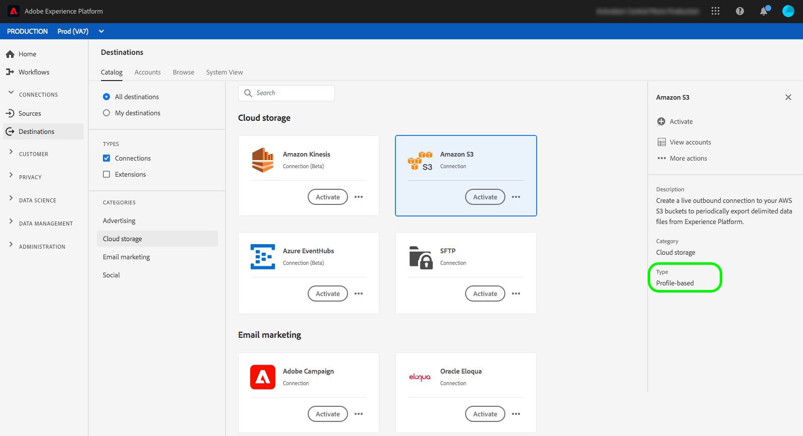

# [!DNL Amazon S3]個連線 {#s3-connection}

## 目的地變更記錄檔 {#changelog}

+++ 檢視變更記錄檔


| 發行月份 | 更新型別 | 說明 |
|---|---|---|
| 2024 年 1 月 | 功能和檔案更新 | Amazon S3目的地聯結器現在支援新的假定角色驗證型別。 請在[驗證區段](#assumed-role-authentication)中閱讀更多相關資訊。 |
| 2023 年 7 月 | 功能和檔案更新 | 在2023年7月Experience Platform發行中，[!DNL Amazon S3]目的地提供新功能，如下所示： <br><ul><li>[資料集匯出支援](/help/destinations/ui/export-datasets.md)</li><li>其他[檔案命名選項](/help/destinations/ui/activate-batch-profile-destinations.md#scheduling)。</li><li>能夠透過[改善的對應步驟](/help/destinations/ui/activate-batch-profile-destinations.md#mapping)，在您匯出的檔案內設定自訂檔案標頭。</li><li>[能夠自訂轉存的CSV資料檔案的格式](/help/destinations/ui/batch-destinations-file-formatting-options.md)。</li></ul> |

{style="table-layout:auto"}

+++

## 透過API或UI連線至您的[!DNL Amazon S3]儲存空間 {#connect-api-or-ui}

* 若要使用Platform使用者介面連線到您的[!DNL Amazon S3]儲存位置，請閱讀以下章節： [連線到目的地](#connect)以及[啟用對象到此目的地](#activate)。
* 若要以程式設計方式連線至您的[!DNL Amazon S3]儲存位置，請閱讀如何使用「流程服務API」教學課程](../../api/activate-segments-file-based-destinations.md)，將對象[啟用至檔案型目的地的指南。

## 支援的對象 {#supported-audiences}

本節說明您可以將哪些型別的對象匯出至此目的地。

| 對象來源 | 支援 | 說明 |
|---------|----------|----------|
| [!DNL Segmentation Service] | ✓ (A) | 透過Experience Platform[細分服務](../../../segmentation/home.md)產生的對象。 |
| 自訂上傳 | ✓ (A) | 對象[從CSV檔案匯入](../../../segmentation/ui/audience-portal.md#import-audience)至Experience Platform。 |

{style="table-layout:auto"}

## 匯出型別和頻率 {#export-type-frequency}

請參閱下表以取得目的地匯出型別和頻率的資訊。

| 項目 | 類型 | 附註 |
---------|----------|---------|
| 匯出類型 | **[!UICONTROL 以設定檔為基礎]** | 您正在匯出區段的所有成員，以及所需的結構描述欄位（例如：電子郵件地址、電話號碼、姓氏），如[目的地啟用工作流程](../../ui/activate-batch-profile-destinations.md#select-attributes)的選取設定檔屬性畫面中所選。 |
| 匯出頻率 | **[!UICONTROL 批次]** | 批次目的地會以三、六、八、十二或二十四小時的增量將檔案匯出至下游平台。 深入瞭解[批次檔案型目的地](/help/destinations/destination-types.md#file-based)。 |

{style="table-layout:auto"}



## 匯出資料集 {#export-datasets}

此目的地支援資料集匯出。 如需如何設定資料集匯出的完整資訊，請閱讀教學課程：

* 如何使用Platform使用者介面](/help/destinations/ui/export-datasets.md)匯出資料集[。
* 如何使用流程服務API](/help/destinations/api/export-datasets.md)以程式設計方式[匯出資料集。

## 匯出資料的檔案格式 {#file-format}

匯出&#x200B;*對象資料*&#x200B;時，Platform會在您提供的儲存位置中建立`.csv`、`parquet`或`.json`檔案。 如需檔案的詳細資訊，請參閱對象啟動教學課程中的[匯出支援的檔案格式](../../ui/activate-batch-profile-destinations.md#supported-file-formats-export)一節。

匯出&#x200B;*資料集*&#x200B;時，Platform會在您提供的儲存位置中建立`.parquet`或`.json`檔案。 如需檔案的詳細資訊，請參閱匯出資料集教學課程中的[驗證資料集匯出成功](../../ui/export-datasets.md#verify)區段。

## 連線到目標 {#connect}

>[!IMPORTANT]
> 
>若要連線到目的地，您需要&#x200B;**[!UICONTROL 檢視目的地]**&#x200B;和&#x200B;**[!UICONTROL 管理目的地]** [存取控制許可權](/help/access-control/home.md#permissions)。 閱讀[存取控制總覽](/help/access-control/ui/overview.md)或連絡您的產品管理員以取得必要的許可權。

若要連線到此目的地，請依照[目的地組態教學課程](../../ui/connect-destination.md)中所述的步驟進行。 在目標設定工作流程中，填寫以下兩個區段中列出的欄位。

### 驗證目標 {#authenticate}

>[!CONTEXTUALHELP]
>id="platform_destinations_connect_s3_rsa"
>title="RSA 公開金鑰"
>abstract="或者，您可以附加 RSA 格式的公開金鑰以對匯出的檔案進行加密。透過下面的文件連結檢視格式正確的金鑰範例。"

若要驗證到目的地，請填入必填欄位，然後選取&#x200B;**[!UICONTROL 連線到目的地]**。 Amazon S3目的地支援兩種驗證方法：

* 存取金鑰和機密金鑰驗證
* 假定角色驗證

#### 存取金鑰和機密金鑰驗證

當您想要輸入Amazon S3存取金鑰和秘密金鑰，以允許Experience Platform將資料匯出至Amazon S3屬性時，請使用此驗證方法。


* **[!DNL Amazon S3]存取金鑰**&#x200B;與&#x200B;**[!DNL Amazon S3]秘密金鑰**：在[!DNL Amazon S3]中，產生`access key - secret access key`配對以授與您[!DNL Amazon S3]帳戶的Platform存取權。 在[Amazon Web Services檔案](https://docs.aws.amazon.com/IAM/latest/UserGuide/id_credentials_access-keys.html)中進一步瞭解。
* **[!UICONTROL 加密金鑰]**：您可以選擇附加RSA格式的公開金鑰，將加密新增至匯出的檔案。 在下圖中檢視格式正確的加密金鑰範例。

  

#### 假定角色 {#assumed-role-authentication}

>[!CONTEXTUALHELP]
>id="platform_destinations_connect_s3_assumed_role"
>title="假定角色驗證"
>abstract="如果您不想與 Adobe 共用帳戶金鑰和祕密金鑰，請使用此驗證類型。否則，Experience Platform 會使用基於角色的存取連線到您的 Amazon S3 位置。貼上您在 AWS 中為 Adobe 使用者建立之角色的 ARN。該模式類似於 `arn:aws:iam::800873819705:role/destinations-role-customer` "


如果您不想與 Adobe 共用帳戶金鑰和祕密金鑰，請使用此驗證類型。Experience Platform會改用角色型存取來連線至您的Amazon S3位置。

若要這麼做，您需要在AWS主控台中建立具有[寫入您的Amazon S3儲存貯體的正確必要許可權](#minimum-permissions-iam-user)的Adobe假設使用者。 在AWS中建立具有Adobe帳戶&#x200B;**[!UICONTROL 670664943635]**&#x200B;的&#x200B;**[!UICONTROL 信任實體]**。 如需詳細資訊，請參閱有關建立角色的[AWS檔案](https://docs.aws.amazon.com/IAM/latest/UserGuide/id_roles_create_for-user.html)。

* **[!DNL Role]**：貼上您在AWS中為Adobe使用者建立之角色的ARN。 模式類似於`arn:aws:iam::800873819705:role/destinations-role-customer`。
* **[!UICONTROL 加密金鑰]**：您可以選擇附加RSA格式的公開金鑰，將加密新增至匯出的檔案。 在下圖中檢視格式正確的加密金鑰範例。

### 填寫目標詳細資訊 {#destination-details}

>[!CONTEXTUALHELP]
>id="platform_destinations_connect_s3_bucket"
>title="貯體名稱"
>abstract="長度必須介於 3 到 63 個字元之間。開頭和結尾必須是字母或數字。必須僅包含小寫字母、數字或連字號 (-)。不得格式化為 IP 位址 (例如，192.100.1.1)。"

>[!CONTEXTUALHELP]
>id="platform_destinations_connect_s3_folderpath"
>title="檔案夾路徑"
>abstract="必須僅包含字元 A-Z、a-z、0-9，並且可以包含以下特殊字元：`/!-_.'()"^[]+$%.*"`。若要為每個客群檔案建立一個檔案夾，請將巨集 `/%SEGMENT_NAME%` 或 `/%SEGMENT_ID%` 或 `/%SEGMENT_NAME%/%SEGMENT_ID%` 插入文字欄位。只能將巨集插入檔案夾路徑的末尾。檢視文件中的巨集範例。"
>additional-url="https://experienceleague.adobe.com/docs/experience-platform/destinations/catalog/cloud-storage/overview.html#use-macros" text="使用巨集在您的儲存位置建立檔案夾"

若要設定目的地的詳細資訊，請填寫下方的必填和選用欄位。 UI中欄位旁的星號表示該欄位為必填欄位。

* **[!UICONTROL 名稱]**：輸入可協助您識別此目的地的名稱。
* **[!UICONTROL 描述]**：輸入此目的地的描述。
* **[!UICONTROL Bucket名稱]**：輸入要由此目的地使用的[!DNL Amazon S3]儲存貯體的名稱。
* **[!UICONTROL 資料夾路徑]**：輸入目的地資料夾的路徑，此資料夾將裝載匯出的檔案。
* **[!UICONTROL 檔案型別]**：選取匯出檔案應使用的格式Experience Platform。 選取[!UICONTROL CSV]選項時，您也可以[設定檔案格式選項](../../ui/batch-destinations-file-formatting-options.md)。
* **[!UICONTROL 壓縮格式]**：選取Experience Platform應用於匯出檔案的壓縮型別。
* **[!UICONTROL 包含資訊清單檔案]**：如果您想要匯出包含資訊清單JSON檔案，其中包含有關匯出位置、匯出大小等資訊，請開啟此選項。 資訊清單的命名格式為`manifest-<<destinationId>>-<<dataflowRunId>>.json`。 檢視[範例資訊清單檔案](/help/destinations/assets/common/manifest-d0420d72-756c-4159-9e7f-7d3e2f8b501e-0ac8f3c0-29bd-40aa-82c1-f1b7e0657b19.json)。 資訊清單檔案包含下列欄位：
   * `flowRunId`：產生匯出檔案的[資料流執行](/help/dataflows/ui/monitor-destinations.md#dataflow-runs-for-batch-destinations)。
   * `scheduledTime`：檔案匯出的時間(UTC)。
   * `exportResults.sinkPath`：存放匯出檔案之存放位置中的路徑。
   * `exportResults.name`：匯出的檔案名稱。
   * `size`：匯出的檔案大小（位元組）。

>[!TIP]
>
>在連線目標工作流程中，您可以根據匯出的受眾檔案，在Amazon S3儲存空間中建立自訂資料夾。 閱讀[使用巨集在您的儲存位置](overview.md#use-macros)中建立資料夾以取得指示。

### 啟用警示 {#enable-alerts}

您可以啟用警報以接收有關傳送到您目的地的資料流狀態的通知。 從清單中選取警報以訂閱接收有關資料流狀態的通知。 如需警示的詳細資訊，請參閱[使用UI訂閱目的地警示](../../ui/alerts.md)的指南。

當您完成提供目的地連線的詳細資訊後，請選取&#x200B;**[!UICONTROL 下一步]**。

### 必要的[!DNL Amazon S3]許可權 {#required-s3-permission}

若要成功連線並匯出資料至您的[!DNL Amazon S3]儲存位置，請在[!DNL Amazon S3]中為[!DNL Platform]建立識別與存取管理(IAM)使用者，並為下列動作指派許可權：

* `s3:DeleteObject`
* `s3:GetBucketLocation`
* `s3:GetObject`
* `s3:ListBucket`
* `s3:PutObject`
* `s3:ListMultipartUploadParts`

#### IAM角色驗證所需的最低許可權 {#minimum-permissions-iam-user}

將IAM角色設定為客戶時，請確定與角色關聯的許可權原則包含儲存貯體中目標資料夾的必要動作，以及儲存貯體根目錄的`s3:ListBucket`動作。 檢視以下此驗證型別的最低許可權原則範例：

```json
{
    "Version": "2012-10-17",
    "Statement": [
        {
            "Sid": "VisualEditor0",
            "Effect": "Allow",
            "Action": [
                "s3:PutObject",
                "s3:GetObject",
                "s3:DeleteObject",
                "s3:GetBucketLocation",
                "s3:ListMultipartUploadParts"
            ],
            "Resource": "arn:aws:s3:::bucket/folder/*"
        },
        {
            "Sid": "VisualEditor1",
            "Effect": "Allow",
            "Action": [
                "s3:ListBucket"
            ],
            "Resource": "arn:aws:s3:::bucket"
        }
    ]
}  
```

<!--

Commenting out this note, as write permissions are assigned through the s3:PutObject permission.

>[!IMPORTANT]
>
>Platform needs `write` permissions on the bucket object where the export files will be delivered.

-->

## 啟動此目標的客群 {#activate}

>[!IMPORTANT]
> 
>* 若要啟用資料，您需要&#x200B;**[!UICONTROL 檢視目的地]**、**[!UICONTROL 啟用目的地]**、**[!UICONTROL 檢視設定檔]**&#x200B;和&#x200B;**[!UICONTROL 檢視區段]** [存取控制許可權](/help/access-control/home.md#permissions)。 閱讀[存取控制總覽](/help/access-control/ui/overview.md)或連絡您的產品管理員以取得必要的許可權。
>* 若要匯出&#x200B;*身分*，您需要&#x200B;**[!UICONTROL 檢視身分圖表]** [存取控制許可權](/help/access-control/home.md#permissions)。<br> {width="100" zoomable="yes"}

請參閱[啟用對象資料至批次設定檔匯出目的地](../../ui/activate-batch-profile-destinations.md)，以取得啟用對象至此目的地的指示。

## 驗證資料匯出成功 {#exported-data}

若要驗證是否已成功匯出資料，請檢查您的[!DNL Amazon S3]儲存空間，並確定匯出的檔案包含預期的設定檔母體。

## IP位址允許清單 {#ip-address-allow-list}

如果您需要將AdobeIP新增至允許清單，請參閱[IP位址允許清單](ip-address-allow-list.md)文章。