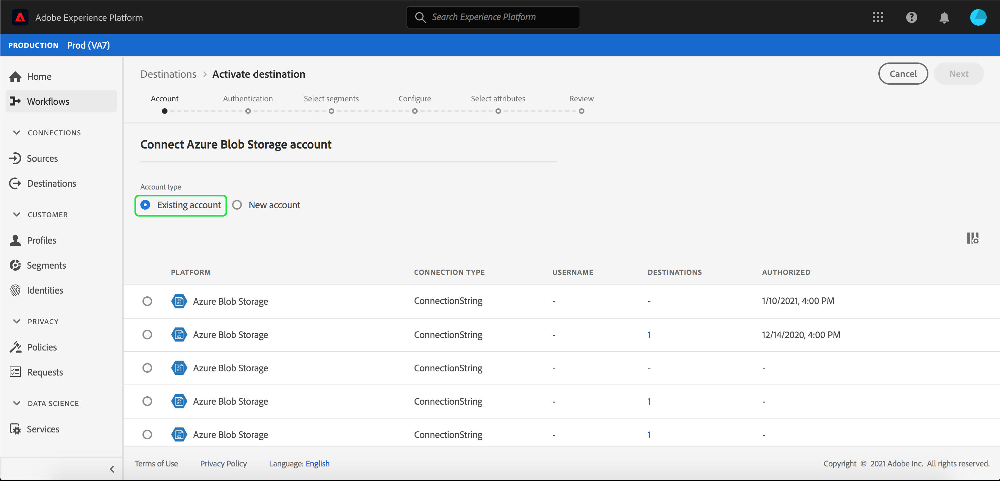

# [!DNL Azure Blob] 連接

## 概述 {#overview}

[!DNL Azure Blob] (以下簡稱「[!DNL Blob]」)是Microsoft的雲端物件儲存解決方案。本教程提供使用[!DNL Platform]用戶介面建立[!DNL Blob]目標的步驟。

## 快速入門

本教學課程需要對Adobe Experience Platform的下列部分有正確的理解：

- [[!DNL Experience Data Model (XDM)] 系統](../../../xdm/home.md):Experience Platform組織客戶體驗資料的標準化架構。
   - [架構構成基礎](../../../xdm/schema/composition.md):瞭解XDM架構的基本建置區塊，包括架構組合的主要原則和最佳實務。
   - [架構編輯器教程](../../../xdm/tutorials/create-schema-ui.md):瞭解如何使用架構編輯器UI建立自訂架構。
- [[!DNL Real-time Customer Profile]](../../../profile/home.md):根據來自多個來源的匯整資料，提供統一、即時的消費者個人檔案。

如果您已經擁有有效的Blob目標，則可跳過本文檔的其餘部分，並繼續[激活目標](../../ui/activate-destinations.md)段的教程。

## 支援的檔案格式 {#file-formats}

[!DNL Experience Platform] 支援以下要導出到的檔案格式 [!DNL Blob]:

- 分隔字元分隔值(DSV):目前，對DSV格式化資料檔案的支援僅限於逗號分隔值。 將來將提供對一般DSV檔案的支援。 有關受支援檔案的詳細資訊，請閱讀[激活目標](../../ui/activate-destinations.md#esp-and-cloud-storage)教程中的雲儲存部分。

## 連接您的Blob帳戶{#connect-destination}

登入[Adobe Experience Platform](https://platform.adobe.com)，然後從左側導覽列選擇&#x200B;**[!UICONTROL Destinations]**&#x200B;以存取&#x200B;**[!UICONTROL Destinations]**&#x200B;工作區。 **[!UICONTROL Catalog]**&#x200B;畫面會顯示您可以為其建立帳戶的各種目的地。

您可以從畫面左側的目錄中選取適當的類別。 或者，您也可以使用搜尋選項，找到您要使用的特定目的地。

在&#x200B;**[!UICONTROL Cloud Storage]**&#x200B;類別下，選擇&#x200B;**[!UICONTROL Azure Blob Storage]**，然後選擇&#x200B;**[!UICONTROL Configure]**。

>[!NOTE]
>
>如果已存在與此目標的連接，則可以在目標卡上看到&#x200B;**[!UICONTROL Activate]**&#x200B;按鈕。 有關&#x200B;**[!UICONTROL Activate]**&#x200B;和&#x200B;**[!UICONTROL Configure]**&#x200B;之間差異的詳細資訊，請參閱目標工作區文檔的[目錄](../../ui/destinations-workspace.md#catalog)部分。

此時將顯示&#x200B;**[!UICONTROL Connect to Azure Blob Storage]**&#x200B;頁。 在此頁上，您可以使用新認證或現有認證。

## 新帳戶{#new-account}

如果使用新憑據，請選擇&#x200B;**[!UICONTROL New account]**。 在出現的輸入表單上，提供連線字串。 訪問Blob儲存中的資料時需要連接字串。 [!DNL Blob]連接字串模式以：`DefaultEndpointsProtocol=https;AccountName={ACCOUNT_NAME};AccountKey={ACCOUNT_KEY}`。

有關配置[!DNL Blob]連接字串的詳細資訊，請參閱Microsoft文檔中的[配置Azure儲存帳戶的連接字串。](https://docs.microsoft.com/en-us/azure/storage/common/storage-configure-connection-string#configure-a-connection-string-for-an-azure-storage-account)

或者，您可以附加RSA格式的公鑰，以便將加密添加到導出的檔案。 請注意，此公共密鑰&#x200B;**必須**&#x200B;寫入為Base64編碼字串。

## 現有帳戶{#existing-account}

要連接現有帳戶，請選擇要連接的[!DNL Blob]帳戶，然後選擇&#x200B;**Next**&#x200B;繼續。

## 驗證{#authentication}

此時將顯示&#x200B;**Authentication**&#x200B;頁。 在出現的輸入表單上，提供檔案的名稱、選用說明、檔案夾路徑和容器。

在此步驟中，您也可以選取任何應套用至此目的地的&#x200B;**[!UICONTROL Marketing actions]**。 行銷動作會指出將資料匯出至目的地的方式。 您可以從Adobe定義的行銷動作中選擇，也可以建立自己的行銷動作。 如需行銷動作的詳細資訊，請參閱[資料使用政策概述](../../../data-governance/policies/overview.md)。

完成後，選擇&#x200B;**[!UICONTROL Create destination]**。

## 下一步 {#activate-segments}

在本教學課程之後，您已建立與[!DNL Blob]帳戶的連線。 您現在可以繼續下一個教學課程，並[啟用區段至您的目的地](../../ui/activate-destinations.md)。
