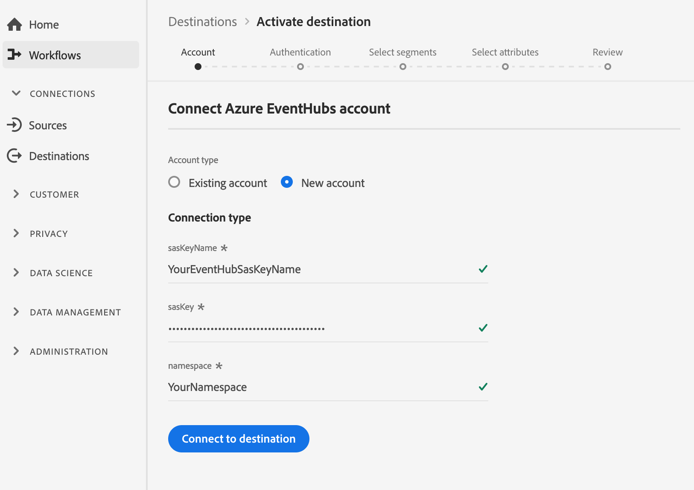

# （測試版）[!DNL Azure Event Hubs]連線

## 概述 {#overview}

>[!IMPORTANT]
>
>平台中的[!DNL Azure Event Hubs]目標當前處於測試階段。 文件和功能可能會有所變更。

[!DNL Azure Event Hubs] 是大型資料串流平台和事件擷取服務。它每秒可接收和處理數百萬個事件。 可使用任何即時分析提供者或批次處理／儲存適配器來轉換和儲存傳送至事件中樞的資料。

您可以建立與[!DNL Azure Event Hubs]儲存空間的即時出站連線，以串流來自Adobe Experience Platform的資料。

* 有關[!DNL Azure Event Hubs]的詳細資訊，請參閱[Microsoft文檔](https://docs.microsoft.com/en-us/azure/event-hubs/event-hubs-about)。
* 若要以程式設計方式連線至[!DNL Azure Event Hubs]，請參閱[串流目標API教學課程](../../api/streaming-destinations.md)。
* 要使用平台用戶介面連接到[!DNL Azure Event Hubs]，請參見以下各節。


## 使用案例 {#use-cases}

透過使用串流目標（例如[!DNL Azure Event Hubs]），您可以輕鬆將高價值區段事件和相關的描述檔屬性饋送到您選擇的系統中。

例如，潛在客戶下載了白皮書，使其符合「高轉換傾向」區段的資格。 通過將潛在客戶所屬的段映射到[!DNL Azure Event Hubs]目標，您將在[!DNL Azure Event Hubs]中收到此事件。 在這裡，您可以採用自行動手的方法，並在活動之上描述業務邏輯，因為您認為最適合企業IT系統。

## 導出類型{#export-type}

**基於描述檔** -您要匯出區段的所有成員，以及所要的架構欄位(例如：電子郵件地址、電話號碼、姓氏)，這是從目標啟動工作流程的「選取屬性」畫面 [中選擇的](../../ui/activate-destinations.md#select-attributes)。

## 連接目標{#connect-destination}

如需如何連線至雲端儲存目的地（包括[!DNL Azure Event Hubs]）的指示，請參閱[雲端儲存目的地工作流程](./workflow.md)。

對於[!DNL Azure Event Hubs]目標，請在建立目標工作流中輸入以下資訊：

## 帳戶步驟{#account-step}

* **[!UICONTROL SAS密鑰]** 名稱 **[!UICONTROL 和SAS密鑰]**:填寫您的SAS密鑰名稱和密鑰。瞭解如何在[Microsoft文檔](https://docs.microsoft.com/en-us/azure/event-hubs/authenticate-shared-access-signature)中使用SAS密鑰驗證[!DNL Azure Event Hubs]。
* **[!UICONTROL 命名空間]**:填寫您的命名 [!DNL Azure Event Hubs] 空間。瞭解[Microsoft文檔](https://docs.microsoft.com/en-us/azure/event-hubs/event-hubs-create#create-an-event-hubs-namespace)中的[!DNL Azure Event Hubs]名稱空間。



## 驗證步驟{#authentication-step}

* **[!UICONTROL 名稱]**:填寫連接的名稱 [!DNL Azure Event Hubs]。
* **[!UICONTROL 說明]**:提供連接的說明。範例：「Premium tier customers」、「Males intered to kitesurfing」。
* **[!UICONTROL eventHubName]**:提供串流至您目的地的名 [!DNL Azure Event Hubs] 稱。
* **[!UICONTROL 行銷動作]**:行銷動作會指出將資料匯出至目的地的方式。您可以從Adobe定義的行銷動作中選擇，也可以建立自己的行銷動作。 如需行銷動作的詳細資訊，請參閱「Adobe Experience Platform的資料治理」頁面。 [](../../../data-governance/policies/overview.md)如需個別Adobe定義之行銷動作的詳細資訊，請參閱[資料使用政策概述](../../../data-governance/policies/overview.md)。


## 啟用區段{#activate-segments}

如需區段啟動工作流程的相關資訊，請參閱[啟用設定檔和區段至目標](../../ui/activate-destinations.md)。

## 導出資料{#exported-data}

您匯出的[!DNL Experience Platform]資料會以JSON格式登入[!DNL Azure Event Hubs]。 例如，以下事件包含符合特定區段資格並退出其他區段之對象的電子郵件地址設定檔屬性。 此潛在客戶的身分是ECID和電子郵件。

```json
{
  "person": {
    "email": "yourstruly@adobe.con"
  },
  "segmentMembership": {
    "ups": {
      "7841ba61-23c1-4bb3-a495-00d3g5fe1e93": {
        "lastQualificationTime": "2020-05-25T21:24:39Z",
        "status": "exited"
      },
      "59bd2fkd-3c48-4b18-bf56-4f5c5e6967ae": {
        "lastQualificationTime": "2020-05-25T23:37:33Z",
        "status": "existing"
      }
    }
  },
  "identityMap": {
    "ecid": [
      {
        "id": "14575006536349286404619648085736425115"
      },
      {
        "id": "66478888669296734530114754794777368480"
      }
    ],
    "email_lc_sha256": [
      {
        "id": "655332b5fa2aea4498bf7a290cff017cb4"
      },
      {
        "id": "66baf76ef9de8b42df8903f00e0e3dc0b7"
      }
    ]
  }
}
```


>[!MORELIKETHIS]
>
>* [連線至Azure事件中樞，並使用Flow Service API啟用資料](../../api/streaming-destinations.md)
* [AWSKinesis目標](./amazon-kinesis.md)
* [目標類型和類別](../../destination-types.md)

