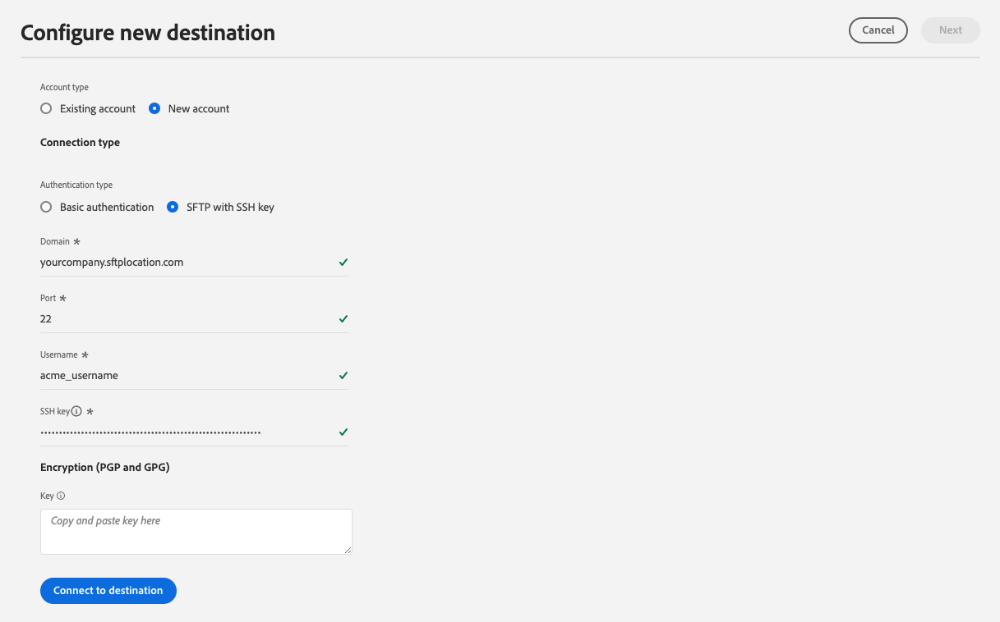

# sftp連線

## 目的地變更記錄檔 {#changelog}

2023年7月Experience Platform發行版本中，SFTP目的地會提供新功能，如下所示：

* [!BADGE Beta]{type=Informative}[資料集匯出支援](/help/destinations/ui/export-datasets.md).
* 其他 [檔案命名選項](/help/destinations/ui/activate-batch-profile-destinations.md#scheduling).
* 可透過以下方式設定匯出檔案中的自訂檔案標題： [改善對應步驟](/help/destinations/ui/activate-batch-profile-destinations.md#mapping).
* [能夠自訂匯出的CSV資料檔案的格式](/help/destinations/ui/batch-destinations-file-formatting-options.md).

## 概觀 {#overview}

建立與您的SFTP伺服器的即時輸出連線，以定期從Adobe Experience Platform匯出限定資料檔案。

>[!IMPORTANT]
>
> 雖然Experience Platform支援將資料匯出至SFTP伺服器，但建議匯出資料的雲端儲存位置為 [!DNL Amazon S3] 和 [!DNL SFTP].

## 透過API或UI連線至SFTP {#connect-api-or-ui}

* 若要使用Platform使用者介面連線至您的SFTP儲存位置，請閱讀章節 [連線到目的地](#connect) 和 [啟用此目的地的對象](#activate) 底下。
* 若要以程式設計方式連線至您的SFTP儲存位置，請閱讀 [使用流量服務API教學課程，將對象啟用至檔案型目的地](../../api/activate-segments-file-based-destinations.md).

## 支援的對象 {#supported-audiences}

本節說明您可以匯出至此目的地的所有對象。

此目的地支援啟用透過Experience Platform產生的所有對象 [分段服務](../../../segmentation/home.md).

*此外*，此目的地也支援下表所述的對象啟用。

| 對象型別 | 說明 |
---------|----------|
| 自訂上傳 | 受眾 [已匯入](../../../segmentation/ui/overview.md#import-audience) 從CSV檔案Experience Platform為。 |

{style="table-layout:auto"}

## 匯出型別和頻率 {#export-type-frequency}

請參閱下表以取得目的地匯出型別和頻率的資訊。

| 項目 | 類型 | 附註 |
---------|----------|---------|
| 匯出型別 | **[!UICONTROL 以設定檔為基礎]** | 您正在匯出區段的所有成員，以及所需的結構描述欄位（例如：電子郵件地址、電話號碼、姓氏），如 [目的地啟用工作流程](../../ui/activate-batch-profile-destinations.md#select-attributes). |
| 匯出頻率 | **[!UICONTROL 批次]** | 批次目的地會以三、六、八、十二或二十四小時的增量將檔案匯出至下游平台。 深入瞭解 [批次檔案型目的地](/help/destinations/destination-types.md#file-based). |

{style="table-layout:auto"}

## 連線到目的地 {#connect}

>[!IMPORTANT]
> 
>若要連線到目的地，您需要 **[!UICONTROL 管理目的地]** [存取控制許可權](/help/access-control/home.md#permissions). 閱讀 [存取控制總覽](/help/access-control/ui/overview.md) 或聯絡您的產品管理員以取得必要許可權。

若要連線至此目的地，請遵循以下說明的步驟： [目的地設定教學課程](../../ui/connect-destination.md). 在設定目標工作流程中，填寫以下兩個區段中列出的欄位。

### 驗證資訊 {#authentication-information}

>[!CONTEXTUALHELP]
>id="platform_destinations_connect_sftp_rsa"
>title="RSA 公開金鑰"
>abstract="或者，您可以附加 RSA 格式的公開金鑰以對匯出的檔案進行加密。透過下面的文件連結檢視格式正確的金鑰範例。"

>[!CONTEXTUALHELP]
>id="platform_destinations_connect_sftp_ssh"
>title="私密 SSH 金鑰"
>abstract="私密 SSH 金鑰必須為 RSA 格式、Base64 編碼的字串，並且不得受密碼保護。"

如果您選取 **[!UICONTROL 使用密碼的SFTP]** 驗證型別以連線至您的SFTP位置：

* **[!UICONTROL 網域]**：您的SFTP儲存位置位址；
* **[!UICONTROL 使用者名稱]**：登入您的SFTP儲存位置的使用者名稱；
* **[!UICONTROL 連線埠]**：您的SFTP儲存位置使用的連線埠；
* **[!UICONTROL 密碼]**：登入SFTP儲存位置的密碼。
* **[!UICONTROL 加密金鑰]**：您可以選擇附加RSA格式的公開金鑰，為匯出的檔案新增加密。 在下圖中檢視格式正確的加密金鑰範例。

  

如果您選取 **[!UICONTROL 使用SSH金鑰的SFTP]** 驗證型別以連線至您的SFTP位置：

* **[!UICONTROL 網域]**：填寫SFTP帳戶的IP位址或網域名稱
* **[!UICONTROL 連線埠]**：您的SFTP儲存位置使用的連線埠；
* **[!UICONTROL 使用者名稱]**：登入您的SFTP儲存位置的使用者名稱；
* **[!UICONTROL ssh金鑰]**：用來登入SFTP儲存位置的私人SSH金鑰。 私密 金鑰必須為 RSA 格式、Base64 編碼的字串，並且不得受密碼保護。
* **[!UICONTROL 加密金鑰]**：您可以選擇附加RSA格式的公開金鑰，為匯出的檔案新增加密。 在下圖中檢視格式正確的加密金鑰範例。

  

### 目的地詳細資料 {#destination-details}

在建立與SFTP位置的驗證連線後，請提供目標的下列資訊：

* **[!UICONTROL 名稱]**：輸入可協助您在Experience Platform使用者介面中識別此目的地的名稱；
* **[!UICONTROL 說明]**：輸入此目的地的說明；
* **[!UICONTROL 資料夾路徑]**：輸入要匯出檔案之SFTP位置中的資料夾路徑。
* **[!UICONTROL 檔案型別]**：選取用於匯出檔案的Experience Platform格式。 選取 [!UICONTROL CSV] 選項，您也可以 [設定檔案格式選項](../../ui/batch-destinations-file-formatting-options.md).
* **[!UICONTROL 壓縮格式]**：選取Experience Platform應用於匯出檔案的壓縮型別。
* **[!UICONTROL 包含資訊清單檔案]**：如果您希望匯出專案包含資訊清單JSON檔案，且檔案中包含有關匯出位置、匯出大小等資訊，請開啟此選項。

## 啟用此目的地的對象 {#activate}

>[!IMPORTANT]
> 
>若要啟用資料，您需要 **[!UICONTROL 管理目的地]**， **[!UICONTROL 啟用目的地]**， **[!UICONTROL 檢視設定檔]**、和 **[!UICONTROL 檢視區段]** [存取控制許可權](/help/access-control/home.md#permissions). 閱讀 [存取控制總覽](/help/access-control/ui/overview.md) 或聯絡您的產品管理員以取得必要許可權。

另請參閱 [啟用對象資料至批次設定檔匯出目的地](../../ui/activate-batch-profile-destinations.md) 以取得啟用此目的地對象的指示。

## (Beta)匯出資料集 {#export-datasets}

此目的地支援資料集匯出。 如需如何設定資料集匯出的完整資訊，請閱讀教學課程：

* 操作說明 [使用Platform使用者介面匯出資料集](/help/destinations/ui/export-datasets.md).
* 操作說明 [使用流量服務API以程式設計方式匯出資料集](/help/destinations/api/export-datasets.md).

## 匯出的資料 {#exported-data}

的 [!DNL SFTP] 目的地，平台會建立 `.csv` 檔案中所指定的儲存位置。 如需檔案的詳細資訊，請參閱 [啟用對象資料至批次設定檔匯出目的地](../../ui/activate-batch-profile-destinations.md) （在audience activation教學課程中）。

## IP位址允許清單 {#ip-address-allow-list}

請參閱 [SFTP目的地的IP位址允許清單](ip-address-allow-list.md) 如果您需要將AdobeIP新增至允許清單。
