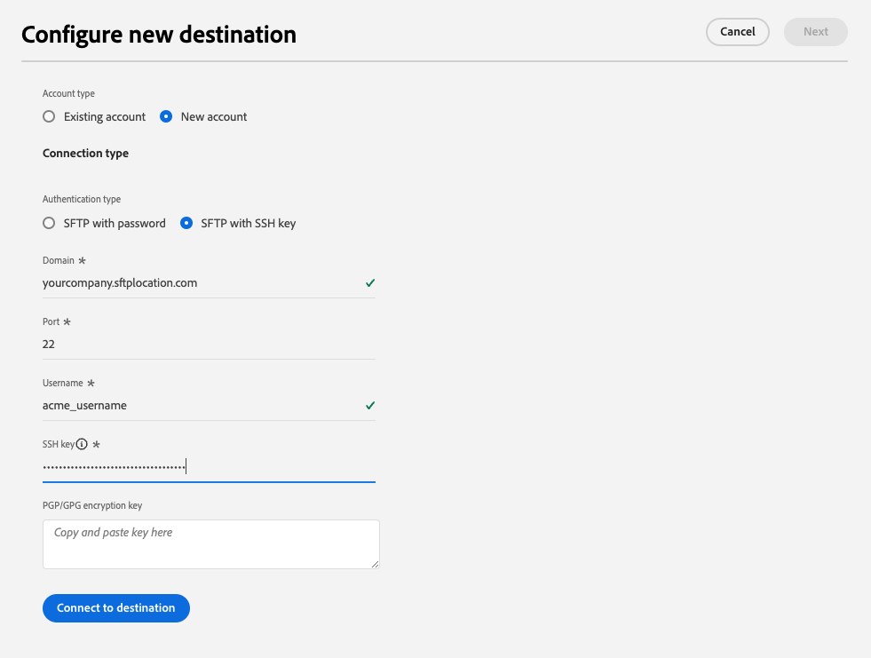

# sftp連線

## 目的地變更記錄檔 {#changelog}

在2023年7月發行的Experience Platform中，SFTP目的地會提供新功能，如下所示：

* [資料集匯出支援](/help/destinations/ui/export-datasets.md)。
* 其他[檔案命名選項](/help/destinations/ui/activate-batch-profile-destinations.md#scheduling)。
* 能夠透過[改善的對應步驟](/help/destinations/ui/activate-batch-profile-destinations.md#mapping)，在您匯出的檔案內設定自訂檔案標頭。
* [能夠自訂轉存的CSV資料檔案的格式](/help/destinations/ui/batch-destinations-file-formatting-options.md)。

## 概觀 {#overview}

建立與您的SFTP伺服器的即時輸出連線，以定期從Adobe Experience Platform匯出限定資料檔案。

>[!IMPORTANT]
>
> 雖然Experience Platform支援將資料匯出至SFTP伺服器，但建議匯出資料的雲端儲存位置為[!DNL Amazon S3]和[!DNL Azure Blob]。

## 透過API或UI連線至SFTP {#connect-api-or-ui}

* 若要使用Experience Platform使用者介面連線至您的SFTP儲存位置，請閱讀以下章節： [連線至目的地](#connect)和[啟用對象至此目的地](#activate)。
* 若要以程式設計方式連線至您的SFTP儲存位置，請使用「流程服務API」教學課程](../../api/activate-segments-file-based-destinations.md)，讀取[將對象啟用至檔案型目的地。

## 支援的對象 {#supported-audiences}

本節說明您可以將哪些型別的對象匯出至此目的地。

| 對象來源 | 支援 | 說明 |
|---------|----------|----------|
| [!DNL Segmentation Service] | ✓ | 透過Experience Platform [細分服務](../../../segmentation/home.md)產生的對象。 |
| 自訂上傳 | ✓ | 對象[從CSV檔案匯入](../../../segmentation/ui/audience-portal.md#import-audience)至Experience Platform。 |

{style="table-layout:auto"}

## 匯出型別和頻率 {#export-type-frequency}

請參閱下表以取得目的地匯出型別和頻率的資訊。

| 項目 | 類型 | 附註 |
---------|----------|---------|
| 匯出類型 | **[!UICONTROL 以設定檔為基礎]** | 您正在匯出區段的所有成員，以及所需的結構描述欄位（例如：電子郵件地址、電話號碼、姓氏），如[目的地啟用工作流程](../../ui/activate-batch-profile-destinations.md#select-attributes)的選取設定檔屬性畫面中所選。 |
| 匯出頻率 | **[!UICONTROL 批次]** | 批次目的地會以三、六、八、十二或二十四小時的增量將檔案匯出至下游平台。 深入瞭解[批次檔案型目的地](/help/destinations/destination-types.md#file-based)。 |

{style="table-layout:auto"}

## 匯出資料集 {#export-datasets}

此目的地支援資料集匯出。 如需如何設定資料集匯出的完整資訊，請閱讀教學課程：

* 如何使用Experience Platform使用者介面](/help/destinations/ui/export-datasets.md)匯出資料集[。
* 如何使用流程服務API](/help/destinations/api/export-datasets.md)以程式設計方式[匯出資料集。

## 匯出資料的檔案格式 {#file-format}

匯出&#x200B;*對象資料*&#x200B;時，Experience Platform會在您提供的儲存位置中建立`.csv`、`parquet`或`.json`檔案。 如需檔案的詳細資訊，請參閱對象啟動教學課程中的[匯出支援的檔案格式](../../ui/activate-batch-profile-destinations.md#supported-file-formats-export)一節。

匯出&#x200B;*資料集*&#x200B;時，Experience Platform會在您提供的儲存位置中建立`.parquet`或`.json`檔案。 如需檔案的詳細資訊，請參閱匯出資料集教學課程中的[驗證資料集匯出成功](../../ui/export-datasets.md#verify)區段。

## 連線到目標 {#connect}

>[!IMPORTANT]
> 
>若要連線到目的地，您需要&#x200B;**[!UICONTROL 檢視目的地]**&#x200B;和&#x200B;**[!UICONTROL 管理目的地]** [存取控制許可權](/help/access-control/home.md#permissions)。 閱讀[存取控制總覽](/help/access-control/ui/overview.md)或連絡您的產品管理員以取得必要的許可權。

若要連線到此目的地，請依照[目的地組態教學課程](../../ui/connect-destination.md)中所述的步驟進行。 在設定目標工作流程中，填寫以下兩個區段中列出的欄位。

### 驗證資訊 {#authentication-information}

>[!CONTEXTUALHELP]
>id="platform_destinations_connect_sftp_rsa"
>title="RSA 公開金鑰"
>abstract="或者，您可以附加 RSA 格式的公開金鑰以對匯出的檔案進行加密。透過下面的文件連結檢視格式正確的金鑰範例。"

>[!CONTEXTUALHELP]
>id="platform_destinations_connect_sftp_ssh"
>title="私密 SSH 金鑰"
>abstract="私密 SSH 金鑰必須為 RSA 格式、Base64 編碼的字串，並且不得受密碼保護。"

如果您選取使用密碼&#x200B;]**驗證型別的**[!UICONTROL  SFTP來連線至您的SFTP位置：

* **[!UICONTROL 網域]**：您的SFTP儲存位置位址；
* **[!UICONTROL 使用者名稱]**：要登入SFTP儲存位置的使用者名稱；
* **[!UICONTROL 連線埠]**：您的SFTP儲存位置所使用的連線埠；
* **[!UICONTROL 密碼]**：登入SFTP儲存位置的密碼。
* **[!UICONTROL 加密金鑰]**：您可以選擇附加RSA格式的公開金鑰，將加密新增至匯出的檔案。 在下圖中檢視格式正確的加密金鑰範例。

  

如果您選取&#x200B;**[!UICONTROL 使用SSH金鑰的SFTP]**&#x200B;驗證型別，以連線至您的SFTP位置：

* **[!UICONTROL 網域]**：填入SFTP帳戶的IP位址或網域名稱
* **[!UICONTROL 連線埠]**：您的SFTP儲存位置所使用的連線埠；
* **[!UICONTROL 使用者名稱]**：要登入SFTP儲存位置的使用者名稱；
* **[!UICONTROL SSH金鑰]**：用來登入SFTP儲存位置的私人SSH金鑰。 私密金鑰必須是RSA格式的Base64編碼字串，且不得受密碼保護。
* **[!UICONTROL 加密金鑰]**：您可以選擇附加RSA格式的公開金鑰，將加密新增至匯出的檔案。 在下圖中檢視格式正確的加密金鑰範例。

  

### 目的地詳細資料 {#destination-details}

在建立與SFTP位置的驗證連線後，請提供目標的下列資訊：

* **[!UICONTROL 名稱]**：輸入有助於您在Experience Platform使用者介面中識別此目的地的名稱；
* **[!UICONTROL 描述]**：輸入此目的地的描述；
* **[!UICONTROL 資料夾路徑]**：輸入要匯出檔案之SFTP位置中的資料夾路徑。
* **[!UICONTROL 檔案型別]**：選取Experience Platform用於匯出檔案的格式。 選取[!UICONTROL CSV]選項時，您也可以[設定檔案格式選項](../../ui/batch-destinations-file-formatting-options.md)。
* **[!UICONTROL 壓縮格式]**：選取Experience Platform應該用於匯出檔案的壓縮型別。
* **[!UICONTROL 包含資訊清單檔案]**：如果您想要匯出包含資訊清單JSON檔案，其中包含有關匯出位置、匯出大小等資訊，請開啟此選項。 資訊清單的命名格式為`manifest-<<destinationId>>-<<dataflowRunId>>.json`。 檢視[範例資訊清單檔案](/help/destinations/assets/common/manifest-d0420d72-756c-4159-9e7f-7d3e2f8b501e-0ac8f3c0-29bd-40aa-82c1-f1b7e0657b19.json)。 資訊清單檔案包含下列欄位：
   * `flowRunId`：產生匯出檔案的[資料流執行](/help/dataflows/ui/monitor-destinations.md#dataflow-runs-for-batch-destinations)。
   * `scheduledTime`：檔案匯出的時間(UTC)。
   * `exportResults.sinkPath`：存放匯出檔案之存放位置中的路徑。
   * `exportResults.name`：匯出的檔案名稱。
   * `size`：匯出的檔案大小（位元組）。

## 啟動此目標的對象 {#activate}

>[!IMPORTANT]
> 
>* 若要啟用資料，您需要&#x200B;**[!UICONTROL 檢視目的地]**、**[!UICONTROL 啟用目的地]**、**[!UICONTROL 檢視設定檔]**&#x200B;和&#x200B;**[!UICONTROL 檢視區段]** [存取控制許可權](/help/access-control/home.md#permissions)。 閱讀[存取控制總覽](/help/access-control/ui/overview.md)或連絡您的產品管理員以取得必要的許可權。
>* 若要匯出&#x200B;*身分*，您需要&#x200B;**[!UICONTROL 檢視身分圖表]** [存取控制許可權](/help/access-control/home.md#permissions)。  {width="100" zoomable="yes"}

請參閱[啟用對象資料至批次設定檔匯出目的地](../../ui/activate-batch-profile-destinations.md)，以取得啟用對象至此目的地的指示。

## 驗證資料匯出成功 {#exported-data}

若要確認資料是否已成功匯出，請檢查您的SFTP儲存空間，並確定匯出的檔案包含預期的設定檔母體。

## IP位址允許清單 {#ip-address-allow-list}

如果您需要將Adobe IP新增至允許清單，請參閱[IP位址允許清單](ip-address-allow-list.md)文章。
