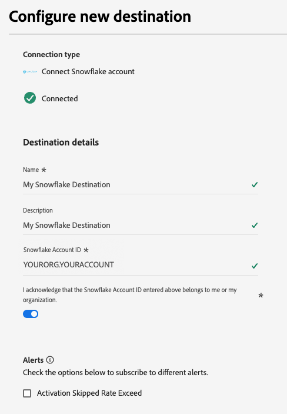

# Snowflake連線 {#snowflake-destination}

>[!IMPORTANT]
>
>此目標連接器為測試版，僅供精選客戶使用。如欲請求存取權，請和您的 Adobe 代表聯絡。

## 概觀 {#overview}

使用Snowflake目的地聯結器將資料匯出至Adobe的Snowflake執行個體，然後透過[私人清單](https://other-docs.snowflake.com/en/collaboration/collaboration-listings-about)與您的執行個體共用。

請閱讀下列章節，瞭解Snowflake目的地的運作方式，以及資料在Adobe和Snowflake之間的傳輸方式。

### Snowflake資料共用如何運作 {#data-sharing}

此目的地使用[!DNL Snowflake]資料共用，這表示不會將任何資料實際匯出或傳輸至您自己的Snowflake執行個體。 Adobe會改為授予您在Adobe的Snowflake環境中託管之即時表格的唯讀存取權。 您可以直接從Snowflake帳戶查詢此共用表格，但您不是該表格的擁有者，且無法在指定的保留期間之後修改或保留該表格。 Adobe可完全管理共用表格的生命週期和結構。

第一次從Adobe的Snowflake執行個體將資料分享給您的執行個體時，系統會提示您接受Adobe的私人清單。

### 資料保留和存留時間(TTL) {#ttl}

透過這項整合共用的所有資料都具有七天的固定存留時間(TTL)。 上次匯出七天後，無論資料流是否仍在作用中，共用表格都會自動過期且無法存取。 如果您需要保留資料超過7天，則必須在TTL到期之前，將內容複製到您自己的Snowflake執行個體中擁有的表格中。

### 對象更新行為 {#audience-update-behavior}

如果您的對象是以[批次模式](../../../segmentation/methods/batch-segmentation.md)評估，則共用表格中的資料每24小時會重新整理一次。 這表示對象會籍的變更與這些變更反映在共用表格中之間，最多可能延遲24小時。

### 增量匯出邏輯 {#incremental-export}

當資料流首次針對對象執行時，會執行回填並共用所有目前符合資格的設定檔。 初次回填之後，共用表格只會反映漸進式更新。 這表示在對象中新增或移除的設定檔。 此方法可確保有效率的更新，並持續讓共用表格保持最新狀態。

## 先決條件 {#prerequisites}

設定Snowflake連線之前，請確定您符合下列先決條件：

* 您有權存取[!DNL Snowflake]帳戶。
* 您的Snowflake帳戶已訂閱私人清單。 您或您公司中擁有Snowflake帳戶管理員許可權的人員可以設定此專案。

## 支援的對象 {#supported-audiences}

本節說明您可以將哪些型別的對象匯出至此目的地。

| 對象來源 | 支援 | 說明 |
|---------|----------|----------|
| [!DNL Segmentation Service] | ✓ | 透過Experience Platform [細分服務](../../../segmentation/home.md)產生的對象。 |
| 自訂上傳 | ✓ | 對象[從CSV檔案匯入](../../../segmentation/ui/audience-portal.md#import-audience)至Experience Platform。 |

{style="table-layout:auto"}

## 匯出型別和頻率 {#export-type-frequency}

請參閱下表以取得目的地匯出型別和頻率的資訊。

| 項目 | 類型 | 附註 |
---------|----------|---------|
| 匯出類型 | **[!UICONTROL 對象匯出]** | 您正在匯出具有[!DNL Snowflake]目的地中所使用識別碼（名稱、電話號碼或其他）的對象的所有成員。 |
| 匯出頻率 | **[!UICONTROL 串流]** | 串流目的地是「一律開啟」的API型連線。 根據對象評估在Experience Platform中更新設定檔後，聯結器會立即將更新傳送至下游的目標平台。 深入瞭解[串流目的地](/help/destinations/destination-types.md#streaming-destinations)。 |

{style="table-layout:auto"}

## 連線到目標 {#connect}

>[!IMPORTANT]
> 
>若要連線到目的地，您需要&#x200B;**[!UICONTROL 檢視目的地]**&#x200B;和&#x200B;**[!UICONTROL 管理目的地]** [存取控制許可權](/help/access-control/home.md#permissions)。 閱讀[存取控制總覽](/help/access-control/ui/overview.md)或連絡您的產品管理員以取得必要的許可權。

若要連線到此目的地，請依照[目的地組態教學課程](../../ui/connect-destination.md)中所述的步驟進行。 在設定目標工作流程中，填寫以下兩個區段中列出的欄位。

### 驗證目標 {#authenticate}

若要驗證到目的地，請選取&#x200B;**[!UICONTROL 連線到目的地]**。

的範例熒幕擷圖

### 填寫目標詳細資訊 {#destination-details}

>[!CONTEXTUALHELP]
>id="platform_destinations_snowflake_accountID"
>title="輸入您的Snowflake帳戶ID"
>abstract="如果您的帳戶已連結至組織，請使用此格式： `OrganizationName.AccountName`  如果您的帳戶未連結至組織，請使用此格式： `AccountName`"

若要設定目的地的詳細資訊，請填寫下方的必填和選用欄位。 UI中欄位旁的星號表示該欄位為必填欄位。

* **[!UICONTROL 名稱]**：您日後可辨識此目的地的名稱。
* **[!UICONTROL 描述]**：可協助您日後識別此目的地的描述。
* **[!UICONTROL Snowflake帳戶識別碼]**：您的Snowflake帳戶識別碼。 根據您的帳戶是否連結至組織，使用下列帳戶ID格式：
   * 如果您的帳戶連結至組織： `OrganizationName.AccountName`。
   * 如果您的帳戶未連結至組織： `AccountName`。
* **[!UICONTROL 帳戶確認]**：開啟Snowflake帳戶ID確認，確認您的帳戶ID正確且屬於您。

>[!IMPORTANT]
>
> 目的地名稱和Experience Platform沙箱名稱中使用的特殊字元會自動在Snowflake中轉換為底線(`_`)。 為避免混淆，請勿在您的目的地和沙箱名稱中使用任何特殊字元。

### 啟用警示 {#enable-alerts}

您可以啟用警報以接收有關傳送到您目的地的資料流狀態的通知。 從清單中選取警報以訂閱接收有關資料流狀態的通知。 如需警示的詳細資訊，請參閱[使用UI訂閱目的地警示](../../ui/alerts.md)的指南。

當您完成提供目的地連線的詳細資訊後，請選取&#x200B;**[!UICONTROL 下一步]**。

## 啟動此目標的對象 {#activate}

>[!IMPORTANT]
> 
>* 若要啟用資料，您需要&#x200B;**[!UICONTROL 檢視目的地]**、**[!UICONTROL 啟用目的地]**、**[!UICONTROL 檢視設定檔]**&#x200B;和&#x200B;**[!UICONTROL 檢視區段]** [存取控制許可權](/help/access-control/home.md#permissions)。 閱讀[存取控制總覽](/help/access-control/ui/overview.md)或連絡您的產品管理員以取得必要的許可權。
>* 若要匯出&#x200B;*身分*，您需要&#x200B;**[!UICONTROL 檢視身分圖表]** [存取控制許可權](/help/access-control/home.md#permissions)。  {width="100" zoomable="yes"}

閱讀[將設定檔和對象啟用至串流對象匯出目的地](/help/destinations/ui/activate-segment-streaming-destinations.md)，以瞭解啟用此目的地對象的指示。

### 對應屬性 {#map}

Snowflake目的地支援將設定檔屬性對應至自訂屬性。

系統會自動使用您在&#x200B;**[!UICONTROL 屬性名稱]**&#x200B;欄位中提供的屬性名稱，在Snowflake中建立目標屬性。

## 匯出的資料/驗證資料匯出 {#exported-data}

請檢查您的Snowflake帳戶，確認資料已正確匯出。

## 資料使用與控管 {#data-usage-governance}

處理您的資料時，所有[!DNL Adobe Experience Platform]目的地都符合資料使用原則。 如需[!DNL Adobe Experience Platform]如何強制資料控管的詳細資訊，請閱讀[資料控管概觀](/help/data-governance/home.md)。
