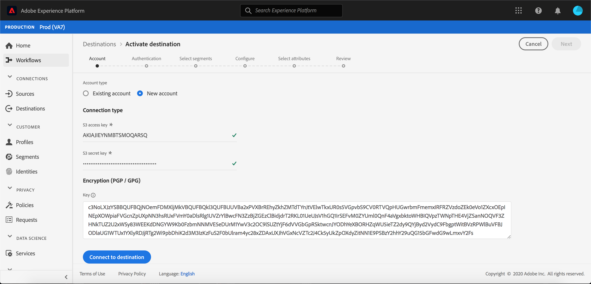
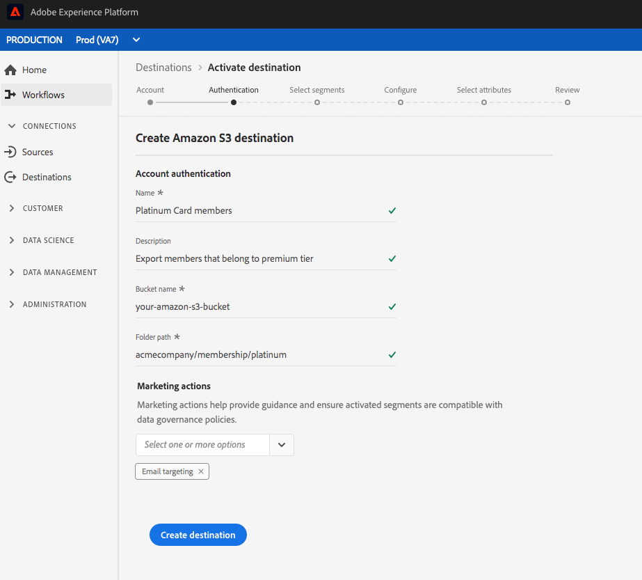

# 建立雲端儲存空間目標

## 概述 {#overview}

本頁說明如何連接到Adobe Experience Platform的雲儲存位置。

在&#x200B;**[!UICONTROL Connections]** > **[!UICONTROL Destinations]**&#x200B;中，選擇您偏好的雲端儲存空間目標，然後選擇&#x200B;**[!UICONTROL Configure]**。

>[!NOTE]
>
>如果已存在與此目標的連接，則可以在目標卡上看到&#x200B;**[!UICONTROL Activate]**&#x200B;按鈕。 有關&#x200B;**[!UICONTROL Activate]**&#x200B;和&#x200B;**[!UICONTROL Configure]**&#x200B;之間差異的詳細資訊，請參閱目標工作區文檔的[目錄](../../ui/destinations-workspace.md#catalog)部分。

## 驗證步驟{#authentication}

在&#x200B;**[!UICONTROL Authentication]**&#x200B;步驟中，如果您先前已設定到雲儲存目標的連接，請選擇&#x200B;**[!UICONTROL Existing Account]**&#x200B;並選擇現有連接。 或者，您可以選擇&#x200B;**[!UICONTROL New Account]**&#x200B;來設定到雲儲存目標的新連接。 填寫您的帳戶驗證憑證，然後選取&#x200B;**[!UICONTROL Connect to destination]**。 或者，您可以附加RSA格式的公鑰，以便將加密添加到導出的檔案。 您的公開金鑰必須寫入為[!DNL Base64]編碼字串。

有關&#x200B;**驗證**&#x200B;步驟中輸入憑據的詳細資訊，請參閱[AmazonS3](./amazon-s3.md)目標、[[!DNL Amazon Kinesis]](./amazon-kinesis.md)目標、[[!DNL Azure Event Hubs]](./azure-event-hubs.md)目標和[SFTP](./sftp.md)目標。

>[!NOTE]
>
>平台支援驗證程式中的認證驗證，如果您在雲端儲存位置輸入錯誤的認證，則會顯示錯誤訊息。 這可確保您不會以不正確的憑證完成工作流程。

## 設定步驟{#setup}

在&#x200B;**[!UICONTROL Setup]**&#x200B;步驟中，輸入&#x200B;**[!UICONTROL Name]**&#x200B;和&#x200B;**[!UICONTROL Description]**&#x200B;作為啟動流程。

在此步驟中，您也可以選取任何應套用至此目的地的&#x200B;**[!UICONTROL Marketing action]**。 行銷動作會指出將資料匯出至目的地的方式。 您可以從Adobe定義的行銷動作中選擇，也可以建立自己的行銷動作。 如需行銷動作的詳細資訊，請參閱[資料使用政策概述](../../../data-governance/policies/overview.md)。

對於AmazonS3目標，請將&#x200B;**[!UICONTROL Bucket name]**&#x200B;和&#x200B;**[!UICONTROL Folder path]**&#x200B;插入雲端儲存空間目標，以便傳送檔案。 在填入上述欄位後，請選取&#x200B;**[!UICONTROL Create Destination]**。

對於SFTP目標，請插入要傳送檔案的&#x200B;**[!UICONTROL Folder path]**。 在填入上述欄位後，請選取&#x200B;**[!UICONTROL Create Destination]**。

對於[!DNL Amazon Kinesis]目標，請在[!DNL Amazon Kinesis]帳戶中提供您現有資料流的名稱。 平台會將資料匯出至此串流。 在填入上述欄位後，請選取&#x200B;**[!UICONTROL Create Destination]**。

對於[!DNL Azure Event Hubs]目標，請在[!DNL Amazon Event Hubs]帳戶中提供您現有資料流的名稱。 平台會將資料匯出至此串流。 在填入上述欄位後，請選取&#x200B;**[!UICONTROL Create Destination]**。

您的目標現在已建立。 如果您想稍後啟動區段，可以選取&#x200B;**[!UICONTROL Save & Exit]**，或選取&#x200B;**[!UICONTROL Next]**&#x200B;以繼續工作流程，並選取要啟動的區段。 在這兩種情況下，請參閱下一節[啟用區段](#activate-segments)，以便在工作流程的其餘部分匯出資料。

## 啟用區段{#activate-segments}

如需區段啟動工作流程的相關資訊，請參閱[啟用設定檔和區段至目標](../../ui/activate-destinations.md)。