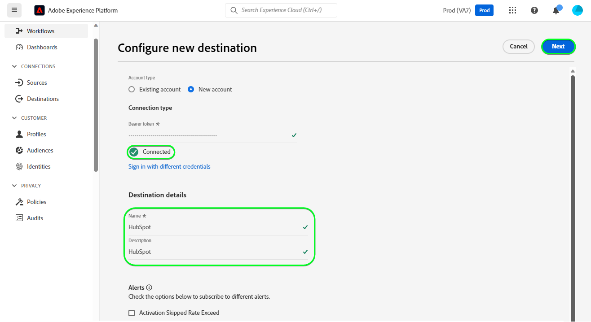
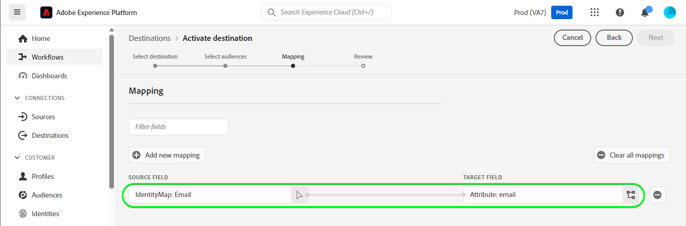
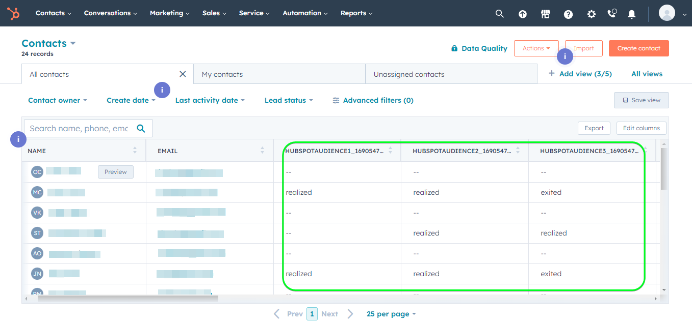

# [!DNL HubSpot]個連線

[[!DNL HubSpot]](https://www.hubspot.com)是CRM平台，包含您連線行銷、銷售、內容管理及客戶服務所需的所有軟體、整合及資源。 它可讓您在一個CRM平台上連線您的資料、團隊和客戶。

此[!DNL Adobe Experience Platform] [目的地](/help/destinations/home.md)利用[[!DNL HubSpot] 連絡人API](https://developers.hubspot.com/docs/api/crm/contacts)，在啟用後從現有的Experience Platform對象更新[!DNL HubSpot]內的連絡人。

[向目的地驗證](#authenticate)區段中進一步說明如何向您的[!DNL HubSpot]執行個體進行驗證。

## 使用案例 {#use-cases}

為協助您更清楚瞭解您應如何及何時使用[!DNL HubSpot]目的地，以下是Adobe Experience Platform客戶可藉由使用此目的地解決的範例使用案例。

[!DNL HubSpot]個連絡人儲存與您業務互動之個人的相關資訊。 您的團隊使用[!DNL HubSpot]中存在的連絡人來建立Experience Platform對象。 將這些對象傳送至[!DNL HubSpot]後，其資訊會更新，並且會為每個連絡人指派屬性，其值做為對象名稱，指出該連絡人屬於哪個對象。

## 先決條件 {#prerequisites}

請參閱以下各節，瞭解您需要在Experience Platform和[!DNL HubSpot]中設定的任何先決條件，以及使用[!DNL HubSpot]目的地之前必須收集的資訊。

### Experience Platform必要條件 {#prerequisites-in-experience-platform}

在啟用資料至[!DNL HubSpot]目的地之前，您必須在[!DNL Experience Platform]中建立[結構描述](/help/xdm/schema/composition.md)、[資料集](https://experienceleague.adobe.com/docs/platform-learn/tutorials/data-ingestion/create-datasets-and-ingest-data.html)和[對象](https://experienceleague.adobe.com/docs/platform-learn/tutorials/audiences/create-audiences.html)。

如果您需要對象狀態的指引，請參閱[對象成員資格詳細資料結構描述欄位群組](/help/xdm/field-groups/profile/segmentation.md)的Experience Platform檔案。

### [!DNL HubSpot]目的地的先決條件 {#prerequisites-destination}

若要將資料從Experience Platform匯出至您的[!DNL HubSpot]帳戶，請注意下列必要條件：

#### 您必須擁有[!DNL HubSpot]帳戶 {#prerequisites-account}

若要將資料從Experience Platform匯出至您的[!DNL Hubspot]帳戶，您需要有[!DNL HubSpot]帳戶。 如果您還沒有帳戶，請造訪[設定HubSpot帳戶](https://knowledge.hubspot.com/get-started/set-up-your-account)頁面，並依照指引註冊及建立帳戶。

#### 收集[!DNL HubSpot]私人應用程式存取權杖 {#gather-credentials}

您需要您的[!DNL HubSpot] `Access token`允許[!DNL HubSpot]目的地透過[!DNL HubSpot]帳戶內的[!DNL HubSpot]私人應用程式進行API呼叫。 當您[驗證目的地](#authenticate)時，`Access token`將用作`Bearer token`。

如果您沒有私人應用程式，請依照檔案操作，在 [!DNL HubSpot][&#128279;](https://developers.hubspot.com/docs/api/private-apps)中建立私人應用程式。

>[!IMPORTANT]
>
> 私人應用程式應獲指派以下範圍：
> `crm.objects.contacts.write`，`crm.objects.contacts.read`
> `crm.schemas.contacts.write`，`crm.schemas.contacts.read`

| 認證 | 說明 | 範例 |
| --- | --- | --- |
| `Bearer token` | [!DNL HubSpot]私人應用程式的`Access token`。  若要取得您的[!DNL HubSpot] `Access token`，請依照[!DNL HubSpot]檔案操作，以使用您應用程式的存取權杖進行[API呼叫](https://developers.hubspot.com/docs/api/private-apps#make-api-calls-with-your-app-s-access-token)。 | `pat-na1-11223344-abcde-12345-9876-1234a1b23456` |

## 護欄 {#guardrails}

[!DNL HubSpot]個私人應用程式受限於[速率限制](https://developers.hubspot.com/docs/api/usage-details)。 您的私人應用程式可撥打的次數取決於您的[!DNL HubSpot]帳戶訂閱，以及您是否購買了API附加元件。 另外也請參閱[其他限制](https://developers.hubspot.com/docs/api/usage-details#other-limits)。

## 支援的身分 {#supported-identities}

[!DNL HubSpot]支援下表中描述的身分更新。 深入瞭解[身分](/help/identity-service/features/namespaces.md)。

| 目標身分 | 範例 | 說明 | 考量事項 |
|---|---|---|---|
| `email` | `test@test.com` | 連絡人的電子郵件地址。 | 強制 |

## 支援的對象 {#supported-audiences}

本節說明您可以匯出至此目的地的所有對象。

此目的地支援啟用所有透過Experience Platform [細分服務](../../../segmentation/home.md)產生的對象。

此目的地也支援下表所述的對象啟用。

| 客群類型 | 說明 |
|---------|----------|
| 自訂上傳 | 對象[從CSV檔案匯入](../../../segmentation/ui/audience-portal.md#import-audience)至Experience Platform。 |

{style="table-layout:auto"}

## 匯出型別和頻率 {#export-type-frequency}

請參閱下表以取得目的地匯出型別和頻率的資訊。

| 項目 | 類型 | 附註 |
---------|----------|---------|
| 匯出類型 | **[!UICONTROL 以設定檔為基礎]** | <ul><li>您正在匯出對象的所有成員，以及所需的結構描述欄位&#x200B;*（例如：電子郵件地址、電話號碼、姓氏）* （根據您的欄位對應）。</li><li> 此外，已在[!DNL HubSpot]中使用對象名稱建立新屬性，而且其值會與每個所選對象來自Experience Platform的對應對象狀態一致。</li></ul> |
| 匯出頻率 | **[!UICONTROL 串流]** | <ul><li>串流目的地是「一律開啟」的API型連線。 根據對象評估在Experience Platform中更新設定檔後，聯結器會立即將更新傳送至下游的目標平台。 深入瞭解[串流目的地](/help/destinations/destination-types.md#streaming-destinations)。</li></ul> |

{style="table-layout:auto"}

## 連線到目標 {#connect}

>[!IMPORTANT]
>
>若要連線到目的地，您需要&#x200B;**[!UICONTROL 檢視目的地]**&#x200B;和&#x200B;**[!UICONTROL 管理目的地]** [存取控制許可權](/help/access-control/home.md#permissions)。 閱讀[存取控制總覽](/help/access-control/ui/overview.md)或連絡您的產品管理員以取得必要的許可權。

若要連線到此目的地，請依照[目的地組態教學課程](../../ui/connect-destination.md)中所述的步驟進行。 在設定目標工作流程中，填寫以下兩個區段中列出的欄位。

在&#x200B;**[!UICONTROL 目的地]** > **[!UICONTROL 目錄]**&#x200B;內，搜尋[!DNL HubSpot]。 或者，您可以在&#x200B;**[!UICONTROL CRM]**&#x200B;類別下找到它。

### 驗證目標 {#authenticate}

填寫以下必填欄位。 如需任何指引，請參閱[收集 [!DNL HubSpot] 私人應用程式存取權杖](#gather-credentials)區段。
* **[!UICONTROL 持有人權杖]**：您[!DNL HubSpot]私人應用程式的存取權杖。

若要驗證到目的地，請選取&#x200B;**[!UICONTROL 連線到目的地]**。

如果提供的詳細資料有效，UI會顯示帶有綠色勾號的&#x200B;**[!UICONTROL 已連線]**&#x200B;狀態。 然後您可以繼續下一步驟。

### 填寫目標詳細資訊 {#destination-details}

若要設定目的地的詳細資訊，請填寫下方的必填和選用欄位。 UI中欄位旁的星號表示該欄位為必填欄位。

* **[!UICONTROL 名稱]**：您日後可辨識此目的地的名稱。
* **[!UICONTROL 描述]**：可協助您日後識別此目的地的描述。

### 啟用警示 {#enable-alerts}

您可以啟用警報以接收有關傳送到您目的地的資料流狀態的通知。 從清單中選取警報以訂閱接收有關資料流狀態的通知。 如需警示的詳細資訊，請參閱[使用UI訂閱目的地警示](../../ui/alerts.md)的指南。

當您完成提供目的地連線的詳細資訊後，請選取&#x200B;**[!UICONTROL 下一步]**。

## 啟動此目標的對象 {#activate}

>[!IMPORTANT]
>
>若要啟用資料，您需要&#x200B;**[!UICONTROL 檢視目的地]**、**[!UICONTROL 啟用目的地]**、**[!UICONTROL 檢視設定檔]**&#x200B;和&#x200B;**[!UICONTROL 檢視區段]** [存取控制許可權](/help/access-control/home.md#permissions)。 閱讀[存取控制總覽](/help/access-control/ui/overview.md)或連絡您的產品管理員以取得必要的許可權。

閱讀[將設定檔和對象啟用至串流對象匯出目的地](/help/destinations/ui/activate-segment-streaming-destinations.md)，以瞭解啟用此目的地對象的指示。

### 對應屬性和身分 {#map}

若要將對象資料從Adobe Experience Platform正確傳送至[!DNL HubSpot]目的地，您必須完成欄位對應步驟。 對應包括在Experience Platform帳戶中的Experience Data Model (XDM)結構描述欄位與來自目標目的地的對應對應專案之間建立連結。

若要將您的XDM欄位正確對應到[!DNL HubSpot]目的地欄位，請遵循下列步驟：

#### 對應`Email`身分

`Email`識別是這個目的地的必要對應。 請依照下列步驟進行對應：
1. 在&#x200B;**[!UICONTROL 對應]**&#x200B;步驟中，選取&#x200B;**[!UICONTROL 新增對應]**。 您現在可以在畫面上看到新的對應列。
   
1. 在&#x200B;**[!UICONTROL 選取來源欄位]**&#x200B;視窗中，選擇&#x200B;**[!UICONTROL 選取身分名稱空間]**&#x200B;並選取身分。
   
1. 在&#x200B;**[!UICONTROL 選取目標欄位]**&#x200B;視窗中，選擇&#x200B;**[!UICONTROL 選取屬性]**&#x200B;並選取`email`。
   

| 來源欄位 | 目標欄位 | 強制 |
| --- | --- | --- |
| `IdentityMap: Email` | `Identity: email` | 是 |

具有身分對應的範例如下所示：

#### 對應&#x200B;**選用的**&#x200B;屬性

若要在XDM設定檔結構描述與[!DNL HubSpot]帳戶之間新增任何其他要更新的屬性，請重複下列步驟：
1. 在&#x200B;**[!UICONTROL 對應]**&#x200B;步驟中，選取&#x200B;**[!UICONTROL 新增對應]**。 您現在可以在畫面上看到新的對應列。
   
1. 在&#x200B;**[!UICONTROL 選取來源欄位]**&#x200B;視窗中，選擇&#x200B;**[!UICONTROL 選取屬性]**&#x200B;類別並選取XDM屬性。
   
1. 在&#x200B;**[!UICONTROL 選取目標欄位]**&#x200B;視窗中，選擇&#x200B;**[!UICONTROL 選取屬性]**&#x200B;類別，並從自動從您的[!DNL HubSpot]帳戶填入的屬性清單中選取。 目的地使用[[!DNL HubSpot] 屬性](https://developers.hubspot.com/docs/api/crm/properties) API來擷取此資訊。 已擷取[!DNL HubSpot] [預設屬性](https://knowledge.hubspot.com/contacts/hubspots-default-contact-properties)及任何自訂屬性，以選取為目標欄位。
   

以下是您的XDM設定檔結構描述與[!DNL Hubspot]之間的一些可用對應：

| 來源欄位 | 目標欄位 |
| --- | --- |
| `xdm: person.name.firstName` | `Attribute: firstname` |
| `xdm: person.name.lastName` | `Attribute: lastname` |
| `xdm: workAddress.street1` | `Attribute: address` |
| `xdm: workAddress.city` | `Attribute: city` |
| `xdm: workAddress.country` | `Attribute: country` |

以下顯示使用這些屬性對應的範例：

當您完成提供目的地連線的對應時，請選取&#x200B;**[!UICONTROL 下一步]**。

## 驗證資料匯出 {#exported-data}

若要驗證您是否已正確設定目的地，請遵循下列步驟：

1. 登入[!DNL HubSpot]網站，然後導覽至&#x200B;**[!UICONTROL 連絡人]**&#x200B;頁面以檢查對象狀態。 此清單可設定為顯示以對象名稱建立之自訂屬性的欄，其值為對象狀態。
   

1. 或者，您可以向下鑽研至個別&#x200B;**[!UICONTROL 人員]**&#x200B;頁面，並導覽至顯示對象名稱和對象狀態的屬性。
   

## 資料使用與控管 {#data-usage-governance}

處理您的資料時，所有[!DNL Adobe Experience Platform]目的地都符合資料使用原則。 如需[!DNL Adobe Experience Platform]如何強制資料控管的詳細資訊，請參閱[資料控管概觀](/help/data-governance/home.md)。

## 其他資源 {#additional-resources}

[!DNL HubSpot]檔案中的其他實用資訊如下：
* HubSpot [&#128279;](https://developers.hubspot.com/docs/api/intro-to-auth)上的驗證方法
* [連絡人](https://developers.hubspot.com/docs/api/crm/contacts)和[屬性](https://developers.hubspot.com/docs/api/crm/properties) API的[!DNL HubSpot]個API參考。

### Changelog

本節擷取此目的地聯結器的功能和重要檔案更新。

+++ 檢視變更記錄檔

| 發行月份 | 更新型別 | 說明 |
|---|---|---|
| 2023 年 9 月 | 首次發行 | 初始目的地版本和檔案發佈。 |

{style="table-layout:auto"}

+++
