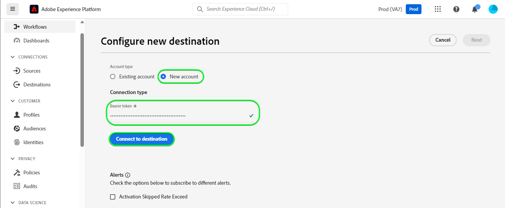

# [!DNL HubSpot] 連線

[[!DNL HubSpot]](https://www.hubspot.com) 是一種CRM平台，其中包含您連線行銷、銷售、內容管理及客戶服務所需的所有軟體、整合和資源。 它可讓您在一個CRM平台上連線您的資料、團隊和客戶。

這個 [!DNL Adobe Experience Platform] [目的地](/help/destinations/home.md) 可運用 [[!DNL HubSpot] 連絡人API](https://developers.hubspot.com/docs/api/crm/contacts)，以更新中的連絡人 [!DNL HubSpot] 從現有Experience Platform對象中移除專案。

向您的驗證指示 [!DNL HubSpot] 執行個體的詳細資訊如下： [驗證到目的地](#authenticate) 區段。

## 使用案例 {#use-cases}

為了協助您更清楚瞭解您應如何及何時使用 [!DNL HubSpot] 目的地，以下是Adobe Experience Platform客戶可以使用此目的地解決的範例使用案例。

[!DNL HubSpot] 連絡人會儲存與您業務互動之個人的相關資訊。 您的團隊使用中存在的連絡人 [!DNL HubSpot] 以建置Experience Platform對象。 將這些對象傳送至後 [!DNL HubSpot]，會更新其資訊，並為每個聯絡人指派屬性，其值會作為指出該聯絡人屬於哪個聯絡人的對象名稱。

## 先決條件 {#prerequisites}

請參閱以下章節，以瞭解在Experience Platform中設定所需的任何先決條件，並 [!DNL HubSpot] ，以瞭解在使用之前必須收集的資訊 [!DNL HubSpot] 目的地。

### Experience Platform必要條件 {#prerequisites-in-experience-platform}

在將資料啟用至 [!DNL HubSpot] 目的地，您必須擁有 [綱要](/help/xdm/schema/composition.md)， a [資料集](https://experienceleague.adobe.com/docs/platform-learn/tutorials/data-ingestion/create-datasets-and-ingest-data.html)、和 [對象](https://experienceleague.adobe.com/docs/platform-learn/tutorials/audiences/create-audiences.html) 建立於 [!DNL Experience Platform].

請參閱Experience Platform檔案，以瞭解 [對象成員資格詳細資料結構欄位群組](/help/xdm/field-groups/profile/segmentation.md) 如果您需要對象狀態的指引。

### 的先決條件 [!DNL HubSpot] 目的地 {#prerequisites-destination}

若要將資料從Platform匯出至您的 [!DNL HubSpot] 帳戶：

#### 您必須擁有 [!DNL HubSpot] 帳戶 {#prerequisites-account}

為了將資料從Platform匯出至 [!DNL Hubspot] 您需要擁有 [!DNL HubSpot] 帳戶。 如果您還沒有這類網站，請前往 [設定您的HubSpot帳戶](https://knowledge.hubspot.com/get-started/set-up-your-account) 並依照指引註冊及建立您的帳戶。

#### 收集 [!DNL HubSpot] 私人應用程式存取權杖 {#gather-credentials}

您需要您的 [!DNL HubSpot] `Access token` 以允許 [!DNL HubSpot] 透過進行API呼叫的目標 [!DNL HubSpot] 您的私人應用程式 [!DNL HubSpot] 帳戶。 此 `Access token` 用作 `Bearer token` 當您 [驗證目的地](#authenticate).

如果您沒有私人應用程式，請依照檔案至 [在中建立私人應用程式 [!DNL HubSpot]](https://developers.hubspot.com/docs/api/private-apps).

>[!IMPORTANT]
>
> 私人應用程式應獲指派以下範圍：
> `crm.objects.contacts.write`， `crm.objects.contacts.read`
> `crm.schemas.contacts.write`, `crm.schemas.contacts.read`

| 認證 | 說明 | 範例 |
| --- | --- | --- |
| `Bearer token` | 此 `Access token` 的 [!DNL HubSpot] 私人應用程式。  若要取得 [!DNL HubSpot] `Access token` 請遵循 [!DNL HubSpot] 檔案至 [使用應用程式的存取Token進行API呼叫](https://developers.hubspot.com/docs/api/private-apps#make-api-calls-with-your-app-s-access-token). | `pat-na1-11223344-abcde-12345-9876-1234a1b23456` |

## 護欄 {#guardrails}

[!DNL HubSpot] 私人應用程式受限於 [速率限制](https://developers.hubspot.com/docs/api/usage-details). 您的私人應用程式可撥打的次數取決於您的 [!DNL HubSpot] 帳戶訂閱，以及您是否購買API附加元件。 此外，也請參閱 [其他限制](https://developers.hubspot.com/docs/api/usage-details#other-limits).

## 支援的身分 {#supported-identities}

[!DNL HubSpot] 支援下表中描述的身分更新。 進一步瞭解 [身分](/help/identity-service/namespaces.md).

| 目標身分 | 範例 | 說明 | 考量事項 |
|---|---|---|---|
| `email` | `test@test.com` | 連絡人的電子郵件地址。 | 必要 |

## 支援的對象 {#supported-audiences}

本節說明您可以匯出至此目的地的所有對象。

此目的地支援啟用透過Experience Platform產生的所有對象 [分段服務](../../../segmentation/home.md).

此目的地也支援下表所述的對象啟用。

| 對象型別 | 說明 |
---------|----------|
| 自訂上傳 | 受眾 [已匯入](../../../segmentation/ui/overview.md#import-audience) 從CSV檔案Experience Platform為。 |

{style="table-layout:auto"}

## 匯出型別和頻率 {#export-type-frequency}

請參閱下表以取得目的地匯出型別和頻率的資訊。

| 項目 | 類型 | 附註 |
---------|----------|---------|
| 匯出型別 | **[!UICONTROL 以設定檔為基礎]** | <ul><li>您正在匯出對象的所有成員，以及所需的結構欄位 *（例如：電子郵件地址、電話號碼、姓氏）*，根據您的欄位對應。</li><li> 此外，也會在中建立新屬性 [!DNL HubSpot] 若使用對象名稱，其值會與每個所選對象來自Platform的對應對象狀態一併顯示。</li></ul> |
| 匯出頻率 | **[!UICONTROL 串流]** | <ul><li>串流目的地是「一律開啟」的API型連線。 一旦根據對象評估在Experience Platform中更新了設定檔，聯結器就會將更新傳送至下游的目的地平台。 深入瞭解 [串流目的地](/help/destinations/destination-types.md#streaming-destinations).</li></ul> |

{style="table-layout:auto"}

## 連線到目的地 {#connect}

>[!IMPORTANT]
>
>若要連線到目的地，您需要 **[!UICONTROL 管理目的地]** [存取控制許可權](/help/access-control/home.md#permissions). 閱讀 [存取控制總覽](/help/access-control/ui/overview.md) 或聯絡您的產品管理員以取得必要許可權。

若要連線至此目的地，請遵循以下說明的步驟： [目的地設定教學課程](../../ui/connect-destination.md). 在設定目標工作流程中，填寫以下兩個區段中列出的欄位。

範圍 **[!UICONTROL 目的地]** > **[!UICONTROL 目錄]** 搜尋 [!DNL HubSpot]. 或者，您可以在 **[!UICONTROL CRM]** 類別。

### 驗證到目的地 {#authenticate}

填寫以下必填欄位。 請參閱 [收集 [!DNL HubSpot] 私人應用程式存取權杖](#gather-credentials) 區段以取得任何指引。
* **[!UICONTROL 持有人權杖]**：您的存取權杖 [!DNL HubSpot] 私人應用程式。

若要驗證目的地，請選取 **[!UICONTROL 連線到目的地]**.

如果提供的詳細資料有效，UI會顯示 **[!UICONTROL 已連線]** 帶有綠色勾號的狀態。 然後您可以繼續下一步驟。

### 填寫目的地詳細資料 {#destination-details}

若要設定目的地的詳細資訊，請填寫下方的必填和選用欄位。 UI中欄位旁的星號表示該欄位為必填欄位。

* **[!UICONTROL 名稱]**：您日後可辨識此目的地的名稱。
* **[!UICONTROL 說明]**：可協助您日後識別此目的地的說明。

### 啟用警示 {#enable-alerts}

您可以啟用警報以接收有關傳送到您目的地的資料流狀態的通知。 從清單中選取警報以訂閱接收有關資料流狀態的通知。 如需警示的詳細資訊，請參閱以下指南： [使用UI訂閱目的地警報](../../ui/alerts.md).

當您完成提供目的地連線的詳細資訊時，請選取「 」 **[!UICONTROL 下一個]**.

## 啟用此目的地的對象 {#activate}

>[!IMPORTANT]
>
>若要啟用資料，您需要 **[!UICONTROL 管理目的地]**， **[!UICONTROL 啟用目的地]**， **[!UICONTROL 檢視設定檔]**、和 **[!UICONTROL 檢視區段]** [存取控制許可權](/help/access-control/home.md#permissions). 閱讀 [存取控制總覽](/help/access-control/ui/overview.md) 或聯絡您的產品管理員以取得必要許可權。

讀取 [將設定檔和受眾啟用至串流受眾匯出目標](/help/destinations/ui/activate-segment-streaming-destinations.md) 以取得啟用此目的地對象的指示。

### 對應屬性和身分 {#map}

若要正確將對象資料從Adobe Experience Platform傳送至 [!DNL HubSpot] 目的地，您必須完成欄位對應步驟。 對應包括在Platform帳戶中的Experience Data Model (XDM)結構描述欄位與來自目標目的地的對應對應專案之間建立連結。

若要正確將XDM欄位對應至 [!DNL HubSpot] 目的地欄位，請遵循下列步驟：

#### 對應 `Email` 身分

此 `Email` 身分是此目的地的必要對應。 請依照下列步驟進行對應：
1. 在 **[!UICONTROL 對應]** 步驟，選取 **[!UICONTROL 新增對應]**. 您現在可以在畫面上看到新的對應列。
   
1. 在 **[!UICONTROL 選取來源欄位]** 視窗，選擇 **[!UICONTROL 選取身分名稱空間]** 並選取身分。
   
1. 在 **[!UICONTROL 選取目標欄位]** 視窗，選擇 **[!UICONTROL 選取屬性]** 並選取 `email`.
   

| 來源欄位 | 目標欄位 | 必要 |
| --- | --- | --- |
| `IdentityMap: Email` | `Identity: email` | 是 |

具有身分對應的範例如下所示：

#### 對應 **可選** 屬性

新增任何其他要在XDM設定檔結構描述與 [!DNL HubSpot] 帳戶重複下列步驟：
1. 在 **[!UICONTROL 對應]** 步驟，選取 **[!UICONTROL 新增對應]**. 您現在可以在畫面上看到新的對應列。
   
1. 在 **[!UICONTROL 選取來源欄位]** 視窗，選擇 **[!UICONTROL 選取屬性]** 類別並選取XDM屬性。
   
1. 在 **[!UICONTROL 選取目標欄位]** 視窗，選擇 **[!UICONTROL 選取屬性]** 類別並從屬性清單中選取，這些屬性會自動從 [!DNL HubSpot] 帳戶。 目的地使用 [[!DNL HubSpot] 屬性](https://developers.hubspot.com/docs/api/crm/properties) 用於擷取此資訊的API。 兩者 [!DNL HubSpot] [預設屬性](https://knowledge.hubspot.com/contacts/hubspots-default-contact-properties) 和任何自訂屬性都會擷取，以便作為目標欄位選擇。
   

您的XDM設定檔結構描述與之間的一些可用對應 [!DNL Hubspot] 如下所示：

| 來源欄位 | 目標欄位 |
| --- | --- |
| `xdm: person.name.firstName` | `Attribute: firstname` |
| `xdm: person.name.lastName` | `Attribute: lastname` |
| `xdm: workAddress.street1` | `Attribute: address` |
| `xdm: workAddress.city` | `Attribute: city` |
| `xdm: workAddress.country` | `Attribute: country` |

以下顯示使用這些屬性對應的範例：

完成提供目的地連線的對應後，選取 **[!UICONTROL 下一個]**.

## 驗證資料匯出 {#exported-data}

若要驗證您是否已正確設定目的地，請遵循下列步驟：

1. 登入 [!DNL HubSpot] 網站，然後導覽至 **[!UICONTROL 連絡人]** 頁面以檢查對象狀態。 此清單可設定為顯示以對象名稱建立之自訂屬性的欄，其值為對象狀態。
   

1. 或者，您可以向下展開至個人 **[!UICONTROL 個人]** 頁面，並導覽至顯示對象名稱和對象狀態的屬性。
   

## 資料使用與控管 {#data-usage-governance}

全部 [!DNL Adobe Experience Platform] 處理您的資料時，目的地符合資料使用原則。 如需如何操作的詳細資訊 [!DNL Adobe Experience Platform] 強制執行資料控管，請參閱 [資料控管概觀](/help/data-governance/home.md).

## 其他資源 {#additional-resources}

其他實用資訊來自 [!DNL HubSpot] 檔案如下：
* [HubSpot上的驗證方法](https://developers.hubspot.com/docs/api/intro-to-auth)
* [!DNL HubSpot] 的API參考 [連絡人](https://developers.hubspot.com/docs/api/crm/contacts) 和 [屬性](https://developers.hubspot.com/docs/api/crm/properties) API。

### Changelog

本節擷取此目的地聯結器的功能和重要檔案更新。

+++ 檢視變更記錄檔

| 發行月份 | 更新型別 | 說明 |
|---|---|---|
| 2023 年 9 月 | 首次發行 | 初始目的地版本和檔案發佈。 |

{style="table-layout:auto"}

+++
