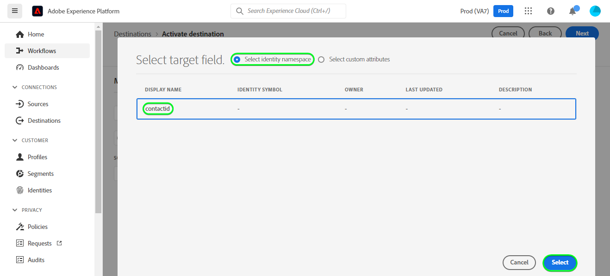
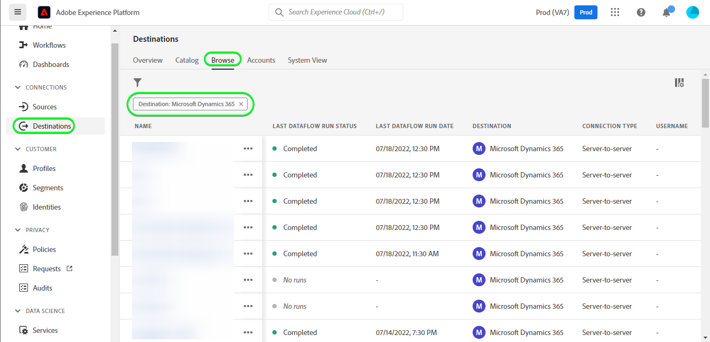

# [!DNL Microsoft Dynamics 365] 連線

## 概觀 {#overview}

[[!DNL Microsoft Dynamics 365]](https://dynamics.microsoft.com/en-us/) 是一個以雲端為基礎的業務應用程式平台，結合企業資源規劃(ERP)、客戶關係管理(CRM)以及生產力應用程式和AI工具，以實現端對端更順暢、更可控的營運、更佳的增長潛力以及更低的成本。

這個 [!DNL Adobe Experience Platform] [目的地](/help/destinations/home.md) 可運用 [[!DNL Contact Entity Reference API]](https://docs.microsoft.com/en-us/dynamics365/customerengagement/on-premises/developer/entities/contact?view=op-9-1)，可讓您將對象中的身分更新為 [!DNL Dynamics 365].

[!DNL Dynamics 365] 使用具有授權的OAuth 2作為驗證機制，與 [!DNL Contact Entity Reference API]. 向您的驗證指示 [!DNL Dynamics 365] 執行個體的詳細資訊如下： [驗證到目的地](#authenticate) 區段。

## 使用案例 {#use-cases}

行銷人員可以根據使用者Adobe Experience Platform設定檔中的屬性，將個人化體驗提供給使用者。 您可以從您的離線資料建立對象，並將這些對象傳送至 [!DNL Dynamics 365]，會在Adobe Experience Platform中更新受眾和設定檔時立即顯示在使用者的摘要中。

## 先決條件 {#prerequisites}

### Experience Platform必要條件 {#prerequisites-in-experience-platform}

在將資料啟用至 [!DNL Dynamics 365] 目的地，您必須擁有 [綱要](/help/xdm/schema/composition.md)， a [資料集](https://experienceleague.adobe.com/docs/platform-learn/tutorials/data-ingestion/create-datasets-and-ingest-data.html)、和 [對象](https://experienceleague.adobe.com/docs/platform-learn/tutorials/audiences/create-audiences.html) 建立於 [!DNL Experience Platform].

請參閱Adobe的檔案以瞭解 [對象成員資格詳細資料結構欄位群組](/help/xdm/field-groups/profile/segmentation.md) 如果您需要對象狀態的指引。

### [!DNL Microsoft Dynamics 365] 必備條件 {#prerequisites-destination}

請注意中的下列必要條件 [!DNL Dynamics 365]，以將資料從Platform匯出至 [!DNL Dynamics 365] 帳戶：

#### 您需要擁有 [!DNL Microsoft Dynamics 365] 帳戶 {#prerequisites-account}

前往 [!DNL Dynamics 365] [試用版](https://dynamics.microsoft.com/en-us/dynamics-365-free-trial/) 頁面來註冊及建立帳戶（如果尚未建立）。

#### 在中建立欄位 [!DNL Dynamics 365] {#prerequisites-custom-field}

建立型別的自訂欄位 `Simple` 欄位資料型別為 `Single Line of Text` 將使用哪個Experience Platform來更新中的對象狀態 [!DNL Dynamics 365].

請參閱 [!DNL Dynamics 365] [建立或編輯欄位（屬性）](https://docs.microsoft.com/en-us/dynamics365/customerengagement/on-premises/customize/create-edit-fields?view=op-9-1) 說明檔案（若您需要其他指引）。

寫下 **[!UICONTROL 自訂前置詞]** 中建立的自訂欄位的 [!DNL Dynamics 365]. 在「 」期間您將需要此首碼 [填寫目的地詳細資料](#destination-details) 步驟。 請參閱 [建立和編輯欄位](https://learn.microsoft.com/en-us/dynamics365/customerengagement/on-premises/customize/create-edit-fields?view=op-9-1#create-and-edit-fields) 的區段 [!DNL Dynamics 365] 檔案以取得更多詳細資料。

中的設定範例 [!DNL Dynamics 365] 如下所示：

#### 在Azure Active Directory中註冊應用程式和應用程式使用者 {#prerequisites-app-user}

若要啟用 [!DNL Dynamics 365] 若要存取資源，您必須使用 [!DNL Azure Account] 至 [[!DNL Azure Active Directory]](https://docs.microsoft.com/en-us/azure/active-directory/develop/howto-create-service-principal-portal#register-an-application-with-azure-ad-and-create-a-service-principal) 並建立下列專案：
* 一個 [!DNL Azure Active Directory] 應用計畫
* 服務主體
* 應用程式密碼

您還需要 [建立應用程式使用者](https://docs.microsoft.com/en-us/power-platform/admin/manage-application-users#create-an-application-user) 在 [!DNL Azure Active Directory] 並將其與新建立的應用程式建立關聯。

#### 彙總 [!DNL Dynamics 365] 認證 {#gather-credentials}

在驗證之前，請記下以下專案 [!DNL Dynamics 365] CRM目的地：

| 認證 | 說明 | 範例 |
| --- | --- | --- |
| `Client ID` | 此 [!DNL Dynamics 365] 您的使用者端識別碼 [!DNL Azure Active Directory] 應用程式。 請參閱 [[!DNL Dynamics 365] 檔案](https://docs.microsoft.com/en-us/azure/active-directory/develop/howto-create-service-principal-portal#get-tenant-and-app-id-values-for-signing-in) 以取得指引。 | `ababbaba-abab-baba-acac-acacacacacac` |
| `Client Secret` | 此 [!DNL Dynamics 365] 您的使用者端密碼 [!DNL Azure Active Directory] 應用程式。 您會使用「 」中的「 」選項#2 [[!DNL Dynamics 365] 檔案](https://docs.microsoft.com/en-us/azure/active-directory/develop/howto-create-service-principal-portal#authentication-two-options). | `abcde~abcdefghijklmnopqrstuvwxyz12345678` 以取得指引。 |
| `Tenant ID` | 此 [!DNL Dynamics 365] 您的租使用者ID [!DNL Azure Active Directory] 應用程式。 請參閱 [[!DNL Dynamics 365] 檔案](https://docs.microsoft.com/en-us/azure/active-directory/develop/howto-create-service-principal-portal#get-tenant-and-app-id-values-for-signing-in) 以取得指引。 | `1234567-aaaa-12ab-ba21-1234567890` |
| `Region` | 與環境URL相關聯的Microsoft區域。  請參閱 [[!DNL Dynamics 365] 檔案](https://learn.microsoft.com/en-us/power-platform/admin/new-datacenter-regions) 以取得指引。 | 如果您的網域如下所示，在對進行驗證時，您需要在下拉式選擇器中為CRM欄位提供醒目提示的值 [目的地](#authenticate).  *org57771b33。`crm`.dynamics.com*   例如：如果您的公司布建在北美(NAM)區域，則您的URL會是 `crm.dynamics.com` 您需要選取 `crm`. 如果您的公司布建在加拿大(CAN)地區，則您的URL會是 `crm3.dynamics.com` 您需要選取 `crm3`. |
| `Environment URL` | 請參閱 [[!DNL Dynamics 365] 檔案](https://docs.microsoft.com/en-us/dynamics365/customerengagement/on-premises/developer/org-service/discover-url-organization-organization-service?view=op-9-1) 以取得指引。 | 若您的 [!DNL Dynamics 365] 網域如下所示，您需要反白顯示的值。  *`org57771b33`.crm.dynamics.com* |

{style="table-layout:auto"}

## 護欄 {#guardrails}

此 [請求限制和配置](https://docs.microsoft.com/en-us/power-platform/admin/api-request-limits-allocations) 頁面詳細資訊 [!DNL Dynamics 365] 與您的 [!DNL Dynamics 365] 授權。 您必須確保資料與承載皆符合這些限制。

## 支援的身分 {#supported-identities}

[!DNL Dynamics 365] 支援下表中描述的身分更新。 進一步瞭解 [身分](/help/identity-service/namespaces.md).

| 目標身分 | 範例 | 說明 | 考量事項 |
|---|---|---|---|
| `contactId` | 7eb682f1-ca75-e511-80d4-00155d2a68d1 | 連絡人的唯一識別碼。 | **必要**. 請參閱 [[!DNL Dynamics 365] 檔案](https://docs.microsoft.com/en-us/dynamics365/customerengagement/on-premises/developer/entities/contact?view=op-9-1) 以取得更多詳細資料。 |

{style="table-layout:auto"}

## 支援的對象 {#supported-audiences}

本節說明您可以匯出至此目的地的所有對象。

此目的地支援啟用透過Experience Platform產生的所有對象 [分段服務](../../../segmentation/home.md).

## 匯出型別和頻率 {#export-type-frequency}

請參閱下表以取得目的地匯出型別和頻率的資訊。

| 項目 | 類型 | 附註 |
---------|----------|---------|
| 匯出型別 | **[!UICONTROL 以設定檔為基礎]** | <ul><li>您正在匯出對象的所有成員，以及所需的結構欄位 *（例如：電子郵件地址、電話號碼、姓氏）*，根據您的欄位對應。</li><li> 中的每個對象狀態 [!DNL Dynamics 365] 會根據 **[!UICONTROL 對應ID]** 值期間提供 [對象排程](#schedule-audience-export-example) 步驟。</li></ul> |
| 匯出頻率 | **[!UICONTROL 串流]** | <ul><li>串流目的地是「一律開啟」的API型連線。 一旦根據對象評估在Experience Platform中更新了設定檔，聯結器就會將更新傳送至下游的目的地平台。 深入瞭解 [串流目的地](/help/destinations/destination-types.md#streaming-destinations).</li></ul> |

{style="table-layout:auto"}

## 連線到目標 {#connect}

>[!IMPORTANT]
>
>若要連線到目的地，您需要 **[!UICONTROL 管理目的地]** [存取控制許可權](/help/access-control/home.md#permissions). 閱讀 [存取控制總覽](/help/access-control/ui/overview.md) 或聯絡您的產品管理員以取得必要許可權。

若要連線至此目的地，請遵循以下說明的步驟： [目的地設定教學課程](../../ui/connect-destination.md). 在設定目標工作流程中，填寫以下兩個區段中列出的欄位。

範圍 **[!UICONTROL 目的地]** > **[!UICONTROL 目錄]** 搜尋 [!DNL Dynamics 365]. 或者，您可以在 **[!UICONTROL CRM]** 類別。

### 驗證目標 {#authenticate}

若要驗證目的地，請選取 **[!UICONTROL 連線到目的地]**.

填寫以下必填欄位。 請參閱 [收集Dynamics 365認證](#gather-credentials) 區段以取得任何指引。
* **[!UICONTROL 使用者端ID]**：此 [!DNL Dynamics 365] 您的使用者端識別碼 [!DNL Azure Active Directory] 應用程式。
* **[!UICONTROL 租使用者ID]**：此 [!DNL Dynamics 365] 您的租使用者ID [!DNL Azure Active Directory] 應用程式。
* **[!UICONTROL 使用者端密碼]**：此 [!DNL Dynamics 365] 您的使用者端密碼 [!DNL Azure Active Directory] 應用程式。
* **[!UICONTROL 地區]**：您的 [[!DNL Dynamics 365]](https://learn.microsoft.com/en-us/power-platform/admin/new-datacenter-regions) 地區。 例如：如果您的公司布建在北美(NAM)區域，則您的URL會是 `crm.dynamics.com` 您需要選取 `crm`. 如果您的公司布建在加拿大(CAN)地區，則您的URL會是 `crm3.dynamics.com` 您需要選取 `crm3`.
* **[!UICONTROL 環境URL]**：您的 [!DNL Dynamics 365] 環境URL

如果提供的詳細資料有效，UI會顯示 **[!UICONTROL 已連線]** 帶有綠色勾號的狀態。 然後您可以繼續下一步驟。

### 填寫目標詳細資訊 {#destination-details}

若要設定目的地的詳細資訊，請填寫下方的必填和選用欄位。 UI中欄位旁的星號表示該欄位為必填欄位。

* **[!UICONTROL 名稱]**：您日後可辨識此目的地的名稱。
* **[!UICONTROL 說明]**：可協助您日後識別此目的地的說明。
* **[!UICONTROL 自訂前置詞]**：此 `Customization prefix` 中建立的自訂欄位的 [!DNL Dynamics 365]. 請參閱 [建立和編輯欄位](https://learn.microsoft.com/en-us/dynamics365/customerengagement/on-premises/customize/create-edit-fields?view=op-9-1#create-and-edit-fields) 的區段 [!DNL Dynamics 365] 檔案以取得更多詳細資料。

### 啟用警示 {#enable-alerts}

您可以啟用警報以接收有關傳送到您目的地的資料流狀態的通知。 從清單中選取警報以訂閱接收有關資料流狀態的通知。 如需警示的詳細資訊，請參閱以下指南： [使用UI訂閱目的地警報](../../ui/alerts.md).

當您完成提供目的地連線的詳細資訊時，請選取「 」 **[!UICONTROL 下一個]**.

## 啟動此目標的對象 {#activate}

>[!IMPORTANT]
> 
>* 若要啟用資料，您需要 **[!UICONTROL 管理目的地]**， **[!UICONTROL 啟用目的地]**， **[!UICONTROL 檢視設定檔]**、和 **[!UICONTROL 檢視區段]** [存取控制許可權](/help/access-control/home.md#permissions). 閱讀 [存取控制總覽](/help/access-control/ui/overview.md) 或聯絡您的產品管理員以取得必要許可權。
>* 要匯出 *身分*，您需要 **[!UICONTROL 檢視身分圖表]** [存取控制許可權](/help/access-control/home.md#permissions).   {width="100" zoomable="yes"}

讀取 [將設定檔和受眾啟用至串流受眾匯出目標](/help/destinations/ui/activate-segment-streaming-destinations.md) 以取得啟用此目的地對象的指示。

### 對應考量事項和範例 {#mapping-considerations-example}

若要正確將對象資料從Adobe Experience Platform傳送至 [!DNL Dynamics 365] 目的地，您必須進行欄位對應步驟。 對應包括在Platform帳戶中的Experience Data Model (XDM)結構描述欄位與來自目標目的地的對應對應專案之間建立連結。 若要正確將XDM欄位對應至 [!DNL Dynamics 365] 目的地欄位，請遵循下列步驟：

1. 在 **[!UICONTROL 對應]** 步驟，選取 **[!UICONTROL 新增對應]**. 您會在畫面上看到新的對應列。
   

1. 在 **[!UICONTROL 選取來源欄位]** 視窗，選擇 **[!UICONTROL 選取身分名稱空間]** 類別並選取 `contactId`.
   

1. 在 **[!UICONTROL 選取目標欄位]** 視窗中，選取您要將來源欄位對應到的目標欄位型別。
   * **[!UICONTROL 選取身分名稱空間]**：選取此選項，從清單中將來源欄位對應到身分名稱空間。
     

   * 在您的XDM設定檔結構描述與您的 [!DNL Dynamics 365] 例項： |XDM設定檔結構描述|[!DNL Dynamics 365] 執行個體|必要| |—|—|—| |`contactId`|`contactId`|是 |

   * **[!UICONTROL 選取自訂屬性]**：選取此選項，將您的來源欄位對應到您在 **[!UICONTROL 屬性名稱]** 欄位。 請參閱 [[!DNL Dynamics 365] 檔案](https://docs.microsoft.com/en-us/dynamics365/customerengagement/on-premises/developer/entities/contact?view=op-9-1#entity-properties) 以取得支援屬性的完整清單。
     

     >[!IMPORTANT]
     >
     >如果您有已對應至的日期或時間戳記來源欄位 [!DNL Dynamics 365] [日期或時間戳記](https://docs.microsoft.com/en-us/power-apps/developer/data-platform/webapi/reference/timestampdatemapping?view=dataverse-latest) 目標欄位，請確定對應的值不是空的。 如果傳遞的值是空的，您將會遇到 *`Bad request reported while pushing events to the destination. Please contact the administrator and try again.`* 錯誤訊息和資料將不會更新。 這是 [!DNL Dynamics 365] 限制。

   * 例如，根據您要更新的值，在您的XDM設定檔結構描述與您的 [!DNL Dynamics 365] 例項： |XDM設定檔結構描述|[!DNL Dynamics 365] 執行個體| |—|—| |`person.name.firstName`|`FirstName`| |`person.name.lastName`|`LastName`| |`personalEmail.address`|`Email`|

   * 以下顯示使用這些對應的範例：
     

### 排程對象匯出和範例 {#schedule-audience-export-example}

在 [[!UICONTROL 排程對象匯出]](/help/destinations/ui/activate-segment-streaming-destinations.md#scheduling) 啟動工作流程的步驟，您必須手動將Platform對象對應至中的自訂欄位屬性 [!DNL Dynamics 365].

要執行此操作，請選取每個對象，然後輸入中對應的自訂欄位屬性 [!DNL Dynamics 365] 在 **[!UICONTROL 對應ID]** 欄位。

>[!IMPORTANT]
>
>用於 **[!UICONTROL 對應ID]** 應完全符合內建立的自訂欄位屬性名稱 [!DNL Dynamics 365]. 另請參閱 [[!DNL Dynamics 365] 檔案](https://docs.microsoft.com/en-us/dynamics365/customerengagement/on-premises/customize/create-edit-fields?view=op-9-1) 如果您需要有關尋找自訂欄位屬性的指引。

範例如下：

## 驗證資料匯出 {#exported-data}

若要驗證您是否已正確設定目的地，請遵循下列步驟：

1. 選取 **[!UICONTROL 目的地]** > **[!UICONTROL 瀏覽]** 以導覽至目的地清單。
   

1. 選取目的地並驗證狀態是否為 **[!UICONTROL 已啟用]**.
   

1. 切換至 **[!DNL Activation data]** 標籤，然後選取對象名稱。
   

1. 監控對象摘要，並確保設定檔計數對應於在對象內建立的計數。
   

1. 登入 [!DNL Dynamics 365] 網站，然後導覽至 [!DNL Customers] > [!DNL Contacts] 頁面，並檢查是否已新增對象中的設定檔。 您可以在中看到每個對象狀態 [!DNL Dynamics 365] 已根據「 」更新Platform中的對應對象狀態 **[!UICONTROL 對應ID]** 值期間提供 [對象排程](#schedule-audience-export-example) 步驟。
   

## 資料使用與控管 {#data-usage-governance}

全部 [!DNL Adobe Experience Platform] 處理您的資料時，目的地符合資料使用原則。 如需如何操作的詳細資訊 [!DNL Adobe Experience Platform] 強制執行資料控管，請參閱 [資料控管概觀](/help/data-governance/home.md).

## 錯誤與疑難排解 {#errors-and-troubleshooting}

### 將事件推播到目的地時遇到未知錯誤 {#unknown-errors}

檢查資料流執行時，如果收到下列錯誤訊息： `Bad request reported while pushing events to the destination. Please contact the administrator and try again.`

若要修正此錯誤，請確認 **[!UICONTROL 對應ID]** 您已在以下位置提供： [!DNL Dynamics 365] 對象的有效性並存在於中 [!DNL Dynamics 365].

## 其他資源 {#additional-resources}

其他實用資訊來自 [[!DNL Dynamics 365] 檔案](https://docs.microsoft.com/en-us/dynamics365/) 如下：
* [IOrganizationService.Update(Entity)方法](https://docs.microsoft.com/en-us/dotnet/api/microsoft.xrm.sdk.iorganizationservice.update?view=dataverse-sdk-latest)
* [使用網頁API更新和刪除表格列](https://docs.microsoft.com/en-us/power-apps/developer/data-platform/webapi/update-delete-entities-using-web-api#basic-update)

### Changelog

本節擷取此目的地聯結器的功能和重要檔案更新。

+++ 檢視變更記錄檔

| 發行月份 | 更新型別 | 說明 |
|---|---|---|
| 2023 年 8 月 | 功能和檔案更新 | 新增的支援 [!DNL Dynamics 365] 自訂欄位的自訂欄位字首，這些字首並非是在中的預設解決方案中建立 [!DNL Dynamics 365]. 新的輸入欄位， **[!UICONTROL 自訂前置詞]**，已新增至 [填寫目的地詳細資料](#destination-details) 步驟。 (PLATIR-31602)。 |
| 2022年11 | 首次發行 | 初始目的地版本和檔案發佈。 |

{style="table-layout:auto"}

+++