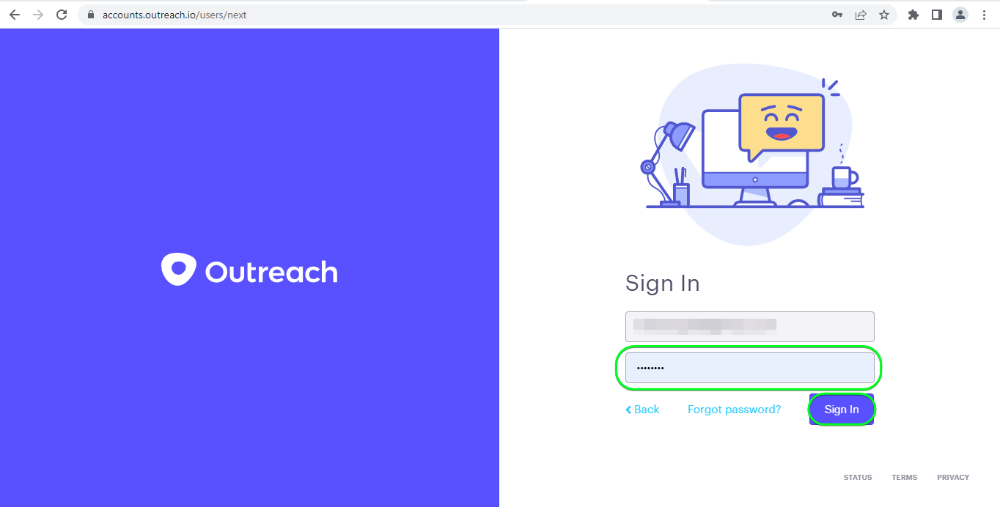
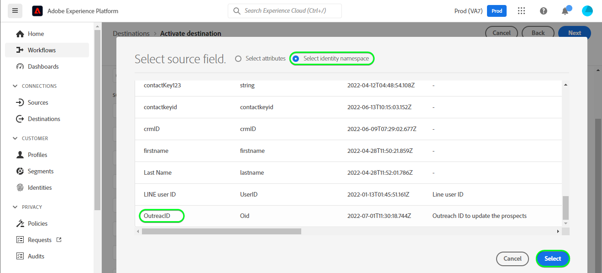
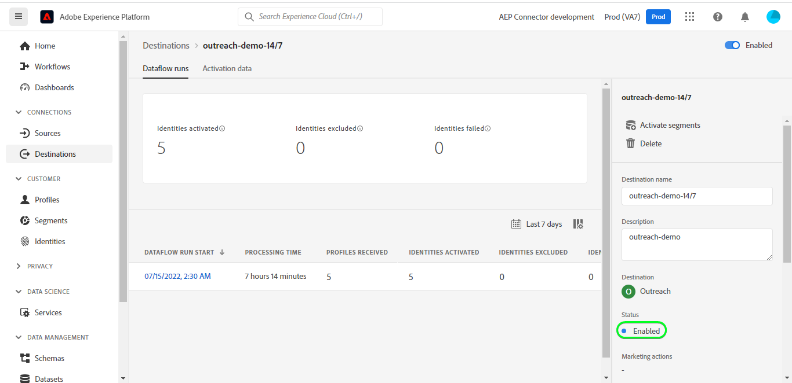

# [!DNL Outreach] 連接

## 總覽 {#overview}

[[!DNL Outreach]](https://www.outreach.io/) 是一個銷售執行平台，擁有世界上最多的B2B買方 — 賣方交互資料，並對專有AI技術進行大量投資，以將銷售資料轉換為智慧。 [!DNL Outreach] 幫助企業實現銷售參與的自動化，並採取收入智慧措施，以提高效率、可預測性和增長。

此 [!DNL Adobe Experience Platform] [目標](/help/destinations/home.md) 利用 [外聯更新資源API](https://api.outreach.io/api/v2/docs#update-an-existing-resource)，允許您在與中的潛在客戶對應的段中更新標識 [!DNL Outreach]。

[!DNL Outreach] 使用OAuth 2和授權授權作為與 [!DNL Outreach] [!DNL Update Resource API]。 驗證到您 [!DNL Outreach] 下面是實例， [驗證到目標](#authenticate) 的子菜單。

## 使用案例 {#use-cases}

作為營銷人員，您可以根據客戶的Adobe Experience Platform配置檔案的屬性將個性化體驗交付給潛在客戶。 您可以從離線資料構建段，並將這些段發送到 [!DNL Outreach]，以在Adobe Experience Platform更新段和配置檔案後立即在潛在客戶源中顯示。

## 先決條件 {#prerequisites}

### Experience Platform先決條件 {#prerequisites-in-experience-platform}

在將資料激活到 [!DNL Outreach] 目標，您必須 [架構](/help/xdm/schema/composition.md)的 [資料集](https://experienceleague.adobe.com/docs/platform-learn/tutorials/data-ingestion/create-datasets-and-ingest-data.html?lang=en), [段](https://experienceleague.adobe.com/docs/platform-learn/tutorials/segments/create-segments.html?lang=en) 建立 [!DNL Experience Platform]。

請參閱Adobe的文檔，瞭解 [段成員身份詳細資訊架構欄位組](/help/xdm/field-groups/profile/segmentation.md) 如果需要有關段狀態的指導。

### 外聯先決條件 {#prerequisites-destination}

請注意以下先決條件 [!DNL Outreach]，以便將資料從平台導出到 [!DNL Outreach] 帳戶：

#### 您需要有外聯帳戶 {#prerequisites-account}

轉到 [!DNL Outreach] [登錄](https://accounts.outreach.io/users/sign_in) 頁，以註冊和建立帳戶。 另請參見 [!DNL Outreach] 支援 [頁](https://support.outreach.io/hc/en-us/articles/207238607-Claim-Your-Outreach-Account) 的子菜單。

在驗證到 [!DNL Outreach] CRM目標：

| 憑據 | 說明 |
|---|---|
| 電子郵件 | 您 [!DNL Outreach] 帳戶電子郵件 |
| 密碼 | 您 [!DNL Outreach] 帳戶密碼 |

#### 設定自定義欄位標籤 {#prerequisites-custom-fields}

[!DNL Outreach] 支援自定義域 [前景](https://support.outreach.io/hc/en-us/articles/360001557554-Outreach-Prospect-Profile-Overview)。 請參閱 [如何在外聯中添加自定義欄位](https://support.outreach.io/hc/en-us/articles/219124908-How-To-Add-a-Custom-Field-in-Outreach) 的下界。 為便於識別，建議手動將標籤更新為相應的段名稱，而不是保留預設值。 例如：

[!DNL Outreach] 「設定」頁，用於顯示自定義欄位的潛在客戶。

[!DNL Outreach] 「設定」頁面潛在客戶顯示自定義欄位 *用戶友好* 與段名稱匹配的標籤。 您可以根據這些標籤在目標客戶頁上查看段狀態。

>[!NOTE]
>
> 標籤名稱僅用於便於識別。 在更新潛在客戶時不使用它們。

## 護欄

的 [!DNL Outreach] API的速率限制為每用戶每小時10,000個請求。 如果達到此限制，您將收到 `429` 響應時顯示以下消息： `You have exceeded your permitted rate limit of 10,000; please try again at 2017-01-01T00:00:00.`。

如果收到此消息，則必須更新段導出計畫以符合速率閾值。

請參閱 [[!DNL Outreach] 文檔](https://api.outreach.io/api/v2/docs#rate-limiting) 的雙曲餘切值。

## 支援的身份 {#supported-identities}

[!DNL Outreach] 支援更新下表中描述的身份。 瞭解有關 [身份](/help/identity-service/namespaces.md)。

| 目標標識 | 說明 | 考量事項 |
|---|---|---|
| `OutreachId` | <ul><li>[!DNL Outreach] 標識符。 這是與目標客戶配置檔案對應的數值。</li><li>ID必須與 [!DNL Outreach] 要更新的目標客戶的URL。</li><li>請參閱 [[!DNL Outreach] 文檔](https://api.outreach.io/api/v2/docs#update-an-existing-resource) 的上界。</li></ul> | 必要 |

## 導出類型和頻率 {#export-type-frequency}

有關目標導出類型和頻率的資訊，請參閱下表。

| 項目 | 類型 | 附註 |
---------|----------|---------|
| 導出類型 | **[!UICONTROL 基於配置檔案]** | <ul><li> 您正在導出段的所有成員以及所需的架構欄位 *(例如：電子郵件地址、電話號碼、姓氏)*，根據您的欄位映射。</li><li> 中的每個段狀態 [!DNL Outreach] 將根據 [!UICONTROL 映射ID] 值 [段調度](#schedule-segment-export-example) 的子菜單。</li></ul> |
| 導出頻率 | **[!UICONTROL 流]** | <ul><li> 流目標是基於API的「始終開啟」連接。 一旦基於段評估在Experience Platform中更新配置檔案，連接器就將更新下游發送到目標平台。 閱讀有關 [流目標](/help/destinations/destination-types.md#streaming-destinations)。</li></ul> |

{style=&quot;table-layout:auto&quot;}

## 連接到目標 {#connect}

>[!IMPORTANT]
> 
> 要連接到目標，您需要 **[!UICONTROL 管理目標]** [訪問控制權限](/help/access-control/home.md#permissions)。 閱讀 [訪問控制概述](/help/access-control/ui/overview.md) 或聯繫您的產品管理員以獲取所需權限。

要連接到此目標，請按照 [目標配置教程](../../ui/connect-destination.md)。 在配置目標工作流中，填寫下面兩節中列出的欄位。

在 **[!UICONTROL 目標]** > **[!UICONTROL 目錄]** 搜索 [!DNL Outreach]。 或者，可以在CRM類別下找到它。

### 驗證到目標 {#authenticate}

要驗證到目標，請選擇 **[!UICONTROL 連接到目標]**。

將顯示 [!DNL Outreach] 登錄頁。 提供您的電子郵件。

下一步提供密碼。

* **[!UICONTROL 用戶名]**:您 [!DNL Outreach] 帳戶電子郵件。
* **[!UICONTROL 密碼]**:您 [!DNL Outreach] 帳戶密碼。

如果提供的詳細資訊有效，UI將顯示 **已連接** 狀態為綠色複選標籤。 然後，可以繼續下一步。

### 填寫目標詳細資訊 {#destination-details}

要配置目標的詳細資訊，請填寫以下必需欄位和可選欄位。 UI中某個欄位旁邊的星號表示該欄位是必需的。

* **[!UICONTROL 名稱]**:您將來識別此目標的名稱。
* **[!UICONTROL 說明]**:將幫助您在將來確定此目標的說明。

### 啟用警報 {#enable-alerts}

您可以啟用警報來接收有關目標資料流狀態的通知。 從清單中選擇要訂閱的警報以接收有關資料流狀態的通知。 有關警報的詳細資訊，請參閱上的指南 [使用UI訂閱目標警報](../../ui/alerts.md)。

完成提供目標連接的詳細資訊後，選擇 **[!UICONTROL 下一個]**。

## 將段激活到此目標 {#activate}

>[!IMPORTANT]
> 
> 要激活資料，您需要 **[!UICONTROL 管理目標]**。 **[!UICONTROL 激活目標]**。 **[!UICONTROL 查看配置檔案]**, **[!UICONTROL 查看段]** [訪問控制權限](/help/access-control/home.md#permissions)。 閱讀 [訪問控制概述](/help/access-control/ui/overview.md) 或聯繫您的產品管理員以獲取所需權限。

閱讀 [激活配置檔案和段以流式處理段導出目標](../../ui/activate-segment-streaming-destinations.md) 有關激活此目標受眾段的說明。

### 映射注意事項和示例 {#mapping-considerations-example}

正確將您的受眾資料從Adobe Experience Platform發送到 [!DNL Outreach] 目標，您需要完成欄位映射步驟。 映射包括在您的平台帳戶中的「體驗資料模型」(XDM)架構欄位與目標目標中對應的欄位之間建立連結。 正確將XDM欄位映射到 [!DNL Outreach] 目標欄位，請執行以下步驟：

1. 在 [!UICONTROL 映射] 按一下 **[!UICONTROL 添加新映射]**。 螢幕上將顯示新的映射行。
   

1. 在 [!UICONTROL 選擇源欄位] ，選擇 **[!UICONTROL 選擇標識命名空間]** 類別並添加所需的映射。
   

1. 在 [!UICONTROL 選擇目標欄位] 窗口，選擇要將源欄位映射到的目標欄位的類型。
   * **[!UICONTROL 選擇標識命名空間]**:選擇此選項可將源欄位從清單中映射到標識命名空間。
      

   * 在XDM配置檔案架構和 [!DNL Outreach] 實例： |XDM配置檔案架構|[!DNL Outreach] 實例|強制| |—|—| |`Oid`|`OutreachId`|是 |

   * **[!UICONTROL 選擇自定義屬性]**:選擇此選項可將源欄位映射到您在中定義的自定義屬性 [!UICONTROL 屬性名稱] 的子菜單。 請參閱 [[!DNL Outreach] prospect文檔](https://api.outreach.io/api/v2/docs#prospect) 的子菜單。
      

   * 例如，根據要更新的值，在XDM配置檔案架構和XDM配置檔案架構之間添加以下映射 [!DNL Outreach] 實例： |XDM配置檔案架構|[!DNL Outreach] 實例| |—| |`person.name.firstName`|`firstName`| |`person.name.lastName`|`lastName`|

   * 下面顯示了使用這些映射的示例：
      

### 計畫段導出和示例 {#schedule-segment-export-example}

* 執行 [計畫段導出](../../ui/activate-segment-streaming-destinations.md) 步驟必須手動將平台段映射到中的自定義欄位屬性 [!DNL Outreach]。

* 為此，請選擇每個段，然後輸入與 *自定義欄位 `N` 標籤* 欄位 [!DNL Outreach] 的 **[!UICONTROL 映射ID]** 的子菜單。

   >[!IMPORTANT]
   >
   > * 數值 *(`N`)* 在 [!UICONTROL 映射ID] 應將尾碼為數字值的自定義屬性鍵與 [!DNL Outreach]。 示例： *自定義欄位 `N` 標籤*。
   > * 您只需指定數字值，而不需要指定整個自定義欄位標籤。
   > * [!DNL Outreach] 最多支援150個自定義標籤欄位。
   > * 請參閱 [[!DNL Outreach] prospect文檔](https://api.outreach.io/api/v2/docs#prospect) 的雙曲餘切值。

   * 例如：

      | [!DNL Outreach] 欄位 | 平台映射ID |
      |---|---|
      | 自定義欄位 `4` 標籤 | `4` |

      

## 驗證資料導出 {#exported-data}

要驗證您是否正確設定了目標，請執行以下步驟：

1. 選擇 **[!UICONTROL 目標]** > **[!UICONTROL 瀏覽]** 導航至目標清單。
   

1. 選擇目標並驗證狀態是否為 **[!UICONTROL 啟用]**。
   

1. 切換到 **[!DNL Activation data]** ，然後選擇段名稱。
   

1. 監視段摘要並確保配置檔案計數與段內建立的計數相對應。
   

1. 登錄到 [!DNL Outreach] ，然後導航到 [!DNL Apps] > [!DNL Contacts] 並檢查是否已添加該段中的配置檔案。 您可以看到 [!DNL Outreach] 已根據 [!UICONTROL 映射ID] 值 [段調度](#schedule-segment-export-example) 的子菜單。

## 資料使用和治理 {#data-usage-governance}

全部 [!DNL Adobe Experience Platform] 目標在處理資料時符合資料使用策略。 有關如何 [!DNL Adobe Experience Platform] 強制實施資料治理，請參見 [資料治理概述](/help/data-governance/home.md)。

## 錯誤和故障排除 {#errors-and-troubleshooting}

檢查資料流運行時，可能會看到以下錯誤消息： `Bad request reported while pushing events to the destination. Please contact the administrator and try again.`

要修復此錯誤，請驗證 [!UICONTROL 映射ID] 您在平台中為 [!DNL Outreach] 段有效且存在於 [!DNL Outreach]。

## 其他資源 {#additional-resources}

的 [[!DNL Outreach] 文檔](https://api.outreach.io/api/v2/docs/) 有關 [錯誤響應](https://api.outreach.io/api/v2/docs#error-responses) 可用於調試任何問題。
