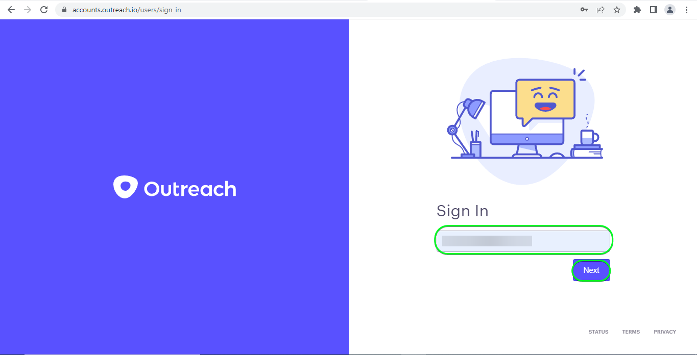

# [!DNL Outreach] 連線

## 概觀 {#overview}

[[!DNL Outreach]](https://www.outreach.io/) 是一個銷售執行平台，擁有世界上最多的B2B買賣雙方互動資料，並在專有AI技術方面投入巨資，以將銷售資料轉換為情報。 [!DNL Outreach] 協助組織自動化銷售參與度，並根據收入情報採取行動，以改善其效率、可預測性及成長。

這個 [!DNL Adobe Experience Platform] [目的地](/help/destinations/home.md) 可運用 [外展更新資源API](https://api.outreach.io/api/v2/docs#update-an-existing-resource)，可讓您更新對象中對應至中潛在客戶的身分 [!DNL Outreach].

[!DNL Outreach] 使用具有授權的OAuth 2作為驗證機制，與 [!DNL Outreach] [!DNL Update Resource API]. 向您的驗證指示 [!DNL Outreach] 執行個體顯示於以下更深入的 [驗證到目的地](#authenticate) 區段。

## 使用案例 {#use-cases}

作為行銷人員，您可以根據潛在客戶的Adobe Experience Platform設定檔屬性，為他們提供個人化體驗。 您可以從您的離線資料建立對象，並將這些對象傳送至 [!DNL Outreach]，以便在Adobe Experience Platform中更新對象和設定檔時立即顯示在潛在客戶摘要中。

## 先決條件 {#prerequisites}

### Experience Platform必要條件 {#prerequisites-in-experience-platform}

在將資料啟用至 [!DNL Outreach] 目的地，您必須擁有 [綱要](/help/xdm/schema/composition.md)， a [資料集](https://experienceleague.adobe.com/docs/platform-learn/tutorials/data-ingestion/create-datasets-and-ingest-data.html?lang=en)、和 [區段](https://experienceleague.adobe.com/docs/platform-learn/tutorials/segments/create-segments.html?lang=en) 建立於 [!DNL Experience Platform].

請參閱Adobe的檔案以瞭解 [對象成員資格詳細資料結構欄位群組](/help/xdm/field-groups/profile/segmentation.md) 如果您需要對象狀態的指引。

### 外展必要條件 {#prerequisites-destination}

請注意中的下列必要條件 [!DNL Outreach]，以將資料從Platform匯出至 [!DNL Outreach] 帳戶：

#### 您必須擁有外展帳戶 {#prerequisites-account}

前往 [!DNL Outreach] [登入](https://accounts.outreach.io/users/sign_in) 頁面來註冊及建立帳戶（如果尚未建立）。 另請參閱 [!DNL Outreach] 支援 [頁面](https://support.outreach.io/hc/en-us/articles/207238607-Claim-Your-Outreach-Account) 以取得更多詳細資料。

在驗證之前，請記下以下專案 [!DNL Outreach] CRM目的地：

| 認證 | 說明 |
|---|---|
| 電子郵件 | 您的 [!DNL Outreach] 帳戶電子郵件 |
| 密碼 | 您的 [!DNL Outreach] 帳戶密碼 |

#### 設定自訂欄位標籤 {#prerequisites-custom-fields}

[!DNL Outreach] 支援的自訂欄位 [潛在客戶](https://support.outreach.io/hc/en-us/articles/360001557554-Outreach-Prospect-Profile-Overview). 請參閱 [如何在宣傳中新增自訂欄位](https://support.outreach.io/hc/en-us/articles/219124908-How-To-Add-a-Custom-Field-in-Outreach) 以取得其他指引。 為方便識別，建議手動將標籤更新至其對應的對象名稱，而非保留預設值。 例如：

[!DNL Outreach] 潛在客戶顯示自訂欄位的設定頁面。

[!DNL Outreach] 顯示自訂欄位的潛在客戶設定頁面 *使用者易記* 和對象名稱相符的標籤。 您可以對照這些標籤在潛在客戶頁面上檢視對象狀態。

>[!NOTE]
>
> 標簽名稱僅供識別之用。 更新潛在客戶時不會使用它們。

## 護欄

此 [!DNL Outreach] API的速率限製為每位使用者每小時10,000個請求。 如果您達到此限制，您將收到 `429` 回應下列訊息： `You have exceeded your permitted rate limit of 10,000; please try again at 2017-01-01T00:00:00.`.

如果您收到此訊息，您必須更新對象匯出排程以符合速率臨界值。

請參閱 [[!DNL Outreach] 檔案](https://api.outreach.io/api/v2/docs#rate-limiting) 以取得其他詳細資訊。

## 支援的身分 {#supported-identities}

[!DNL Outreach] 支援下表中描述的身分更新。 進一步瞭解 [身分](/help/identity-service/namespaces.md).

| 目標身分 | 說明 | 考量事項 |
|---|---|---|
| `OutreachId` | <ul><li>[!DNL Outreach] 識別碼。 這是對應至潛在客戶設定檔的數值。</li><li>ID必須與 [!DNL Outreach] 正在更新的潛在客戶URL。</li><li>請參閱 [[!DNL Outreach] 檔案](https://api.outreach.io/api/v2/docs#update-an-existing-resource) 以取得更多詳細資料。</li></ul> | 必要 |

## 匯出型別和頻率 {#export-type-frequency}

請參閱下表以取得目的地匯出型別和頻率的資訊。

| 項目 | 類型 | 附註 |
---------|----------|---------|
| 匯出型別 | **[!UICONTROL 以設定檔為基礎]** | <ul><li> 您正在匯出區段的所有成員，以及所需的結構欄位 *（例如：電子郵件地址、電話號碼、姓氏）*，根據您的欄位對應。</li><li> 中的每個區段狀態 [!DNL Outreach] 會根據 [!UICONTROL 對應ID] 值期間提供 [對象排程](#schedule-segment-export-example) 步驟。</li></ul> |
| 匯出頻率 | **[!UICONTROL 串流]** | <ul><li> 串流目的地是「一律開啟」的API型連線。 一旦根據對象評估在Experience Platform中更新了設定檔，聯結器就會將更新傳送至下游的目的地平台。 深入瞭解 [串流目的地](/help/destinations/destination-types.md#streaming-destinations).</li></ul> |

{style="table-layout:auto"}

## 連線到目的地 {#connect}

>[!IMPORTANT]
> 
> 若要連線到目的地，您需要 **[!UICONTROL 管理目的地]** [存取控制許可權](/help/access-control/home.md#permissions). 閱讀 [存取控制總覽](/help/access-control/ui/overview.md) 或聯絡您的產品管理員以取得必要許可權。

若要連線至此目的地，請遵循以下說明的步驟： [目的地設定教學課程](../../ui/connect-destination.md). 在設定目標工作流程中，填寫以下兩個區段中列出的欄位。

範圍 **[!UICONTROL 目的地]** > **[!UICONTROL 目錄]** 搜尋 [!DNL Outreach]. 或者，您可以在CRM類別下找到它。

### 驗證到目的地 {#authenticate}

若要驗證目的地，請選取 **[!UICONTROL 連線到目的地]**.

您將會看到 [!DNL Outreach] 登入頁面。 提供您的電子郵件。

接下來，提供您的密碼。

* **[!UICONTROL 使用者名稱]**：您的 [!DNL Outreach] 帳戶電子郵件。
* **[!UICONTROL 密碼]**：您的 [!DNL Outreach] 帳戶密碼。

如果提供的詳細資料有效，UI會顯示 **已連線** 帶有綠色勾號的狀態。 然後您可以繼續下一步驟。

### 填寫目的地詳細資料 {#destination-details}

若要設定目的地的詳細資訊，請填寫下方的必填和選用欄位。 UI中欄位旁的星號表示該欄位為必填欄位。

* **[!UICONTROL 名稱]**：您日後可辨識此目的地的名稱。
* **[!UICONTROL 說明]**：可協助您日後識別此目的地的說明。

### 啟用警示 {#enable-alerts}

您可以啟用警報以接收有關傳送到您目的地的資料流狀態的通知。 從清單中選取警報以訂閱接收有關資料流狀態的通知。 如需警示的詳細資訊，請參閱以下指南： [使用UI訂閱目的地警報](../../ui/alerts.md).

當您完成提供目的地連線的詳細資訊時，請選取「 」 **[!UICONTROL 下一個]**.

## 啟用此目的地的對象 {#activate}

>[!IMPORTANT]
> 
>* 若要啟用資料，您需要 **[!UICONTROL 管理目的地]**， **[!UICONTROL 啟用目的地]**， **[!UICONTROL 檢視設定檔]**、和 **[!UICONTROL 檢視區段]** [存取控制許可權](/help/access-control/home.md#permissions). 閱讀 [存取控制總覽](/help/access-control/ui/overview.md) 或聯絡您的產品管理員以取得必要許可權。
>* 要匯出 *身分*，您需要 **[!UICONTROL 檢視身分圖表]** [存取控制許可權](/help/access-control/home.md#permissions).   {width="100" zoomable="yes"}

讀取 [將設定檔和受眾啟用至串流受眾匯出目標](../../ui/activate-segment-streaming-destinations.md) 以取得啟用此目的地對象的指示。

### 對應考量事項和範例 {#mapping-considerations-example}

若要正確將對象資料從Adobe Experience Platform傳送至 [!DNL Outreach] 目的地，您必須進行欄位對應步驟。 對應包括在Platform帳戶中的Experience Data Model (XDM)結構描述欄位與來自目標目的地的對應對應專案之間建立連結。 若要正確將XDM欄位對應至 [!DNL Outreach] 目的地欄位，請遵循下列步驟：

1. 在 [!UICONTROL 對應] 步驟，按一下 **[!UICONTROL 新增對應]**. 您會在畫面上看到新的對應列。
   

1. 在 [!UICONTROL 選取來源欄位] 視窗，選擇 **[!UICONTROL 選取身分名稱空間]** 類別並新增所需的對應。
   

1. 在 [!UICONTROL 選取目標欄位] 視窗中，選取您要將來源欄位對應到的目標欄位型別。
   * **[!UICONTROL 選取身分名稱空間]**：選取此選項，從清單中將來源欄位對應到身分名稱空間。
     

   * 在您的XDM設定檔結構描述與您的 [!DNL Outreach] 例項： |XDM設定檔結構描述|[!DNL Outreach] 執行個體|必要| |—|—|—| |`Oid`|`OutreachId`|是 |

   * **[!UICONTROL 選取自訂屬性]**：選取此選項，將您的來源欄位對應到您在 [!UICONTROL 屬性名稱] 欄位。 請參閱 [[!DNL Outreach] 潛在客戶檔案](https://api.outreach.io/api/v2/docs#prospect) 以取得支援屬性的完整清單。
     

   * 例如，根據您要更新的值，在您的XDM設定檔結構描述與您的 [!DNL Outreach] 例項： |XDM設定檔結構描述|[!DNL Outreach] 執行個體| |—|—| |`person.name.firstName`|`firstName`| |`person.name.lastName`|`lastName`|

   * 以下顯示使用這些對應的範例：
     

### 排程對象匯出和範例 {#schedule-segment-export-example}

* 執行 [排程對象匯出](../../ui/activate-segment-streaming-destinations.md) 您必須手動將Platform對象對應至中的自訂欄位屬性 [!DNL Outreach].

* 若要這麼做，請選取每個區段，然後輸入對應至 *自訂欄位 `N` 標籤* 起始欄位 [!DNL Outreach] 在 **[!UICONTROL 對應ID]** 欄位。

  >[!IMPORTANT]
  >
  > * 數值 *(`N`)* 使用於 [!UICONTROL 對應ID] 應該符合尾碼為數字值的自訂屬性金鑰，在 [!DNL Outreach]. 範例： *自訂欄位 `N` 標籤*.
  > * 您只需要指定數值，不需要指定整個自訂欄位標籤。
  > * [!DNL Outreach] 支援最多150個自訂標籤欄位。
  > * 請參閱 [[!DNL Outreach] 潛在客戶檔案](https://api.outreach.io/api/v2/docs#prospect) 以取得詳細資訊。

   * 例如：

     | [!DNL Outreach] 欄位 | 平台對應ID |
     |---|---|
     | 自訂欄位 `4` 標籤 | `4` |

     

## 驗證資料匯出 {#exported-data}

若要驗證您是否已正確設定目的地，請遵循下列步驟：

1. 選取 **[!UICONTROL 目的地]** > **[!UICONTROL 瀏覽]** 以導覽至目的地清單。
   

1. 選取目的地並驗證狀態是否為 **[!UICONTROL 已啟用]**.
   

1. 切換至 **[!DNL Activation data]** 標籤，然後選取對象名稱。
   

1. 監控對象摘要，並確保設定檔計數對應於在區段內建立的計數。
   

1. 登入 [!DNL Outreach] 網站，然後導覽至 [!DNL Apps] > [!DNL Contacts] 頁面，並檢查是否已新增對象中的設定檔。 您可以在中看到每個對象狀態 [!DNL Outreach] 已根據「 」更新Platform中的對應對象狀態 [!UICONTROL 對應ID] 值期間提供 [對象排程](#schedule-segment-export-example) 步驟。

## 資料使用與控管 {#data-usage-governance}

全部 [!DNL Adobe Experience Platform] 處理您的資料時，目的地符合資料使用原則。 如需如何操作的詳細資訊 [!DNL Adobe Experience Platform] 強制執行資料控管，請參閱 [資料控管概觀](/help/data-governance/home.md).

## 錯誤與疑難排解 {#errors-and-troubleshooting}

檢查資料流執行時，您可能會看到下列錯誤訊息： `Bad request reported while pushing events to the destination. Please contact the administrator and try again.`

若要修正此錯誤，請確認 [!UICONTROL 對應ID] 您在Platform中提供的 [!DNL Outreach] 對象有效並存在於中 [!DNL Outreach].

## 其他資源 {#additional-resources}

此 [[!DNL Outreach] 檔案](https://api.outreach.io/api/v2/docs/) 有詳細資訊 [錯誤回應](https://api.outreach.io/api/v2/docs#error-responses) 可用於偵錯任何問題。
