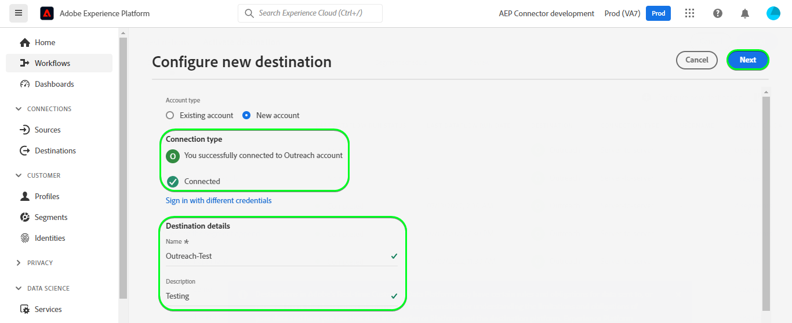

# [!DNL Outreach] 連接

## 總覽 {#overview}

[[!DNL Outreach]](https://www.outreach.io/) 是銷售執行平台，具有世界上最多的B2B買方 — 賣方交互資料，以及對專有AI技術的大量投資，用於將銷售資料轉換為智慧。 [!DNL Outreach] 幫助組織實現銷售互動的自動化，並對收入情報採取行動，以提高其效率、可預測性和增長性。

此 [!DNL Adobe Experience Platform] [目的地](/help/destinations/home.md) 利用 [外聯更新資源API](https://api.outreach.io/api/v2/docs#update-an-existing-resource)，可讓您更新中與潛在客戶對應之區段內的身分識別 [!DNL Outreach].

[!DNL Outreach] 使用OAuth 2搭配授權授權作為驗證機制，與 [!DNL Outreach] [!DNL Update Resource API]. 向您的 [!DNL Outreach] 執行個體進一步，在 [驗證到目標](#authenticate) 區段。

## 使用案例 {#use-cases}

身為行銷人員，您可以根據潛在客戶的Adobe Experience Platform設定檔屬性，提供個人化體驗。 您可以從離線資料建立區段，並將這些區段傳送至 [!DNL Outreach]，可在Adobe Experience Platform中更新區段和設定檔時，立即顯示在潛在客戶的動態消息中。

## 先決條件 {#prerequisites}

### Experience Platform必要條件 {#prerequisites-in-experience-platform}

在將資料啟用至 [!DNL Outreach] 目的地，您必須 [綱要](/help/xdm/schema/composition.md), [資料集](https://experienceleague.adobe.com/docs/platform-learn/tutorials/data-ingestion/create-datasets-and-ingest-data.html?lang=en)，和 [區段](https://experienceleague.adobe.com/docs/platform-learn/tutorials/segments/create-segments.html?lang=en) 建立於 [!DNL Experience Platform].

如需相關資訊，請參閱Adobe的檔案 [區段成員資格詳細資料結構欄位群組](/help/xdm/field-groups/profile/segmentation.md) 如果您需要區段狀態的指引。

### 外聯先決條件 {#prerequisites-destination}

請注意下列必要條件，位於 [!DNL Outreach]，以便將資料從Platform匯出至 [!DNL Outreach] 帳戶：

#### 您需要有外聯帳戶 {#prerequisites-account}

前往 [!DNL Outreach] [登入](https://accounts.outreach.io/users/sign_in) 頁面來註冊和建立帳戶（如果尚未建立帳戶）。 另請參閱 [!DNL Outreach] 支援 [頁面](https://support.outreach.io/hc/en-us/articles/207238607-Claim-Your-Outreach-Account) 以取得更多詳細資訊。

在驗證之前，請記下下列項目 [!DNL Outreach] CRM目標：

| 憑據 | 說明 |
|---|---|
| 電子郵件 | 您的 [!DNL Outreach] 帳戶電子郵件 |
| 密碼 | 您的 [!DNL Outreach] 帳戶密碼 |

#### 設定自訂欄位標籤 {#prerequisites-custom-fields}

[!DNL Outreach] 支援的自訂欄位 [前景](https://support.outreach.io/hc/en-us/articles/360001557554-Outreach-Prospect-Profile-Overview). 請參閱 [如何在外聯中新增自訂欄位](https://support.outreach.io/hc/en-us/articles/219124908-How-To-Add-a-Custom-Field-in-Outreach) 以取得其他指導。 為方便識別，建議手動將標籤更新為其對應的區段名稱，而非保留預設值。 例如：

[!DNL Outreach] 顯示自定義欄位的潛在客戶的設定頁。

[!DNL Outreach] 「設定」頁顯示自定義欄位，具有 *用戶友好* 與區段名稱相符的標籤。 您可以根據這些標籤在潛在客戶頁面上檢視區段狀態。

>[!NOTE]
>
> 標籤名稱僅用於便於識別。 更新潛在客戶時不會使用它們。

## 護欄

此 [!DNL Outreach] API的速率限制為每位使用者每小時10,000個請求。 如果達到此限制，您會收到 `429` 回應並顯示下列訊息： `You have exceeded your permitted rate limit of 10,000; please try again at 2017-01-01T00:00:00.`.

如果您收到此訊息，則必須更新區段匯出排程以符合比率臨界值。

請參閱 [[!DNL Outreach] 檔案](https://api.outreach.io/api/v2/docs#rate-limiting) 以取得其他詳細資訊。

## 支援的身分 {#supported-identities}

[!DNL Outreach] 支援下表所述的身分識別更新。 深入了解 [身分](/help/identity-service/namespaces.md).

| Target身分 | 說明 | 考量事項 |
|---|---|---|
| `OutreachId` | <ul><li>[!DNL Outreach] 識別碼。 這是與潛在客戶設定檔對應的數值。</li><li>ID必須符合 [!DNL Outreach] 潛在客戶的URL。</li><li>請參閱 [[!DNL Outreach] 檔案](https://api.outreach.io/api/v2/docs#update-an-existing-resource) 以取得詳細資訊。</li></ul> | 必要 |

## 匯出類型和頻率 {#export-type-frequency}

有關目標導出類型和頻率的資訊，請參閱下表。

| 項目 | 類型 | 附註 |
---------|----------|---------|
| 匯出類型 | **[!UICONTROL 設定檔]** | <ul><li> 您要匯出區段的所有成員，以及所需的結構欄位 *(例如：電子郵件地址、電話號碼、姓氏)*，根據您的欄位對應。</li><li> 中的每個區段狀態 [!DNL Outreach] 會根據 [!UICONTROL 對應ID] 值 [區段排程](#schedule-segment-export-example) 步驟。</li></ul> |
| 匯出頻率 | **[!UICONTROL 串流]** | <ul><li> 串流目的地是「一律開啟」API型連線。 一旦根據區段評估在Experience Platform中更新設定檔，連接器就會將更新傳送至下游的目的地平台。 深入了解 [串流目的地](/help/destinations/destination-types.md#streaming-destinations).</li></ul> |

{style="table-layout:auto"}

## 連接到目標 {#connect}

>[!IMPORTANT]
> 
> 若要連線至目的地，您需要 **[!UICONTROL 管理目的地]** [存取控制權限](/help/access-control/home.md#permissions). 閱讀 [存取控制概觀](/help/access-control/ui/overview.md) 或聯絡您的產品管理員以取得所需的權限。

若要連線至此目的地，請依照 [目的地設定教學課程](../../ui/connect-destination.md). 在設定目標工作流程中，填寫下列兩節所列的欄位。

內 **[!UICONTROL 目的地]** > **[!UICONTROL 目錄]** 搜尋 [!DNL Outreach]. 或者，您可以在CRM類別下找到它。

### 驗證到目標 {#authenticate}

要驗證到目標，請選擇 **[!UICONTROL 連接到目標]**.

您會看到 [!DNL Outreach] 登入頁面。 提供您的電子郵件。

下一步提供您的密碼。

* **[!UICONTROL 使用者名稱]**:您的 [!DNL Outreach] 帳戶電子郵件。
* **[!UICONTROL 密碼]**:您的 [!DNL Outreach] 帳戶密碼。

如果提供的詳細資料有效，UI會顯示 **已連接** 狀態（帶綠色複選標籤）。 接著，您可以繼續進行下一個步驟。

### 填寫目的地詳細資訊 {#destination-details}

若要設定目的地的詳細資訊，請填寫下方的必填和選填欄位。 UI中欄位旁的星號表示該欄位為必要欄位。

* **[!UICONTROL 名稱]**:日後您將透過此名稱識別此目的地。
* **[!UICONTROL 說明]**:未來可協助您識別此目的地的說明。

### 啟用警報 {#enable-alerts}

您可以啟用警報，接收有關資料流到目標狀態的通知。 從清單中選擇要訂閱的警報，以接收有關資料流狀態的通知。 如需警報的詳細資訊，請參閱 [使用UI訂閱目的地警報](../../ui/alerts.md).

完成提供目標連接的詳細資訊後，請選擇 **[!UICONTROL 下一個]**.

## 啟用此目的地的區段 {#activate}

>[!IMPORTANT]
> 
> 若要啟用資料，您需要 **[!UICONTROL 管理目的地]**, **[!UICONTROL 啟動目的地]**, **[!UICONTROL 檢視設定檔]**，和 **[!UICONTROL 檢視區段]** [存取控制權限](/help/access-control/home.md#permissions). 閱讀 [存取控制概觀](/help/access-control/ui/overview.md) 或聯絡您的產品管理員以取得所需的權限。

閱讀 [啟動設定檔和區段至串流區段匯出目的地](../../ui/activate-segment-streaming-destinations.md) 以取得啟用受眾區段至此目的地的指示。

### 對應考量事項和範例 {#mapping-considerations-example}

若要將您的對象資料從Adobe Experience Platform正確傳送至 [!DNL Outreach] 目的地，您必須執行欄位對應步驟。 對應包含在您的Platform帳戶中的Experience Data Model(XDM)結構欄位與目標目的地對應的欄位之間建立連結。 若要正確將XDM欄位對應至 [!DNL Outreach] 目標欄位，請遵循下列步驟：

1. 在 [!UICONTROL 對應] 步驟，按一下 **[!UICONTROL 新增對應]**. 畫面上會顯示新的對應列。
   

1. 在 [!UICONTROL 選擇源欄位] 窗口，選擇 **[!UICONTROL 選取身分命名空間]** 類別，然後新增所需的對應。
   

1. 在 [!UICONTROL 選擇目標欄位] 視窗中，選取您要將來源欄位對應至的目標欄位類型。
   * **[!UICONTROL 選取身分命名空間]**:選擇此選項可將源欄位從清單映射到標識命名空間。
      

   * 在XDM設定檔架構與 [!DNL Outreach] 例項： |XDM配置檔案架構|[!DNL Outreach] Instance|強制| |—|—|—| |`Oid`|`OutreachId`|是 |

   * **[!UICONTROL 選取自訂屬性]**:選擇此選項可將源欄位映射到您在 [!UICONTROL 屬性名稱] 欄位。 請參閱 [[!DNL Outreach] 潛在客戶檔案](https://api.outreach.io/api/v2/docs#prospect) 以取得支援屬性的完整清單。
      

   * 例如，根據您要更新的值，在XDM設定檔架構與 [!DNL Outreach] 例項： |XDM配置檔案架構|[!DNL Outreach] 例項| |—|—| |`person.name.firstName`|`firstName`| |`person.name.lastName`|`lastName`|

   * 使用這些對應的範例如下所示：
      

### 排程區段匯出和範例 {#schedule-segment-export-example}

* 執行 [排程區段匯出](../../ui/activate-segment-streaming-destinations.md) 步驟中，您必須手動將平台區段對應至 [!DNL Outreach].

* 若要這麼做，請選取每個區段，然後輸入對應至 *自訂欄位 `N` 標籤* 欄位 [!DNL Outreach] 在 **[!UICONTROL 對應ID]** 欄位。

   >[!IMPORTANT]
   >
   > * 數值 *(`N`)* 用於 [!UICONTROL 對應ID] 應符合尾碼為中數值的自訂屬性索引鍵 [!DNL Outreach]. 範例： *自訂欄位 `N` 標籤*.
   > * 您只需指定數值，而不需指定整個自訂欄位標籤。
   > * [!DNL Outreach] 最多支援150個自訂標籤欄位。
   > * 請參閱 [[!DNL Outreach] 潛在客戶檔案](https://api.outreach.io/api/v2/docs#prospect) 以取得詳細資訊。

   * 例如：

      | [!DNL Outreach] 欄位 | 平台對應ID |
      |---|---|
      | 自訂欄位 `4` 標籤 | `4` |

      

## 驗證資料匯出 {#exported-data}

若要驗證您是否已正確設定目的地，請遵循下列步驟：

1. 選擇 **[!UICONTROL 目的地]** > **[!UICONTROL 瀏覽]** 導覽至目的地清單。
   

1. 選取目標並驗證狀態為 **[!UICONTROL 已啟用]**.
   

1. 切換至 **[!DNL Activation data]** ，然後選取區段名稱。
   

1. 監控區段摘要，並確保設定檔計數與區段內建立的計數相對應。
   

1. 登入 [!DNL Outreach] 網站，然後導覽至 [!DNL Apps] > [!DNL Contacts] 頁面，並檢查區段中的設定檔是否已新增。 您可以在 [!DNL Outreach] 已根據 [!UICONTROL 對應ID] 值 [區段排程](#schedule-segment-export-example) 步驟。

## 資料使用與控管 {#data-usage-governance}

全部 [!DNL Adobe Experience Platform] 處理資料時，目的地符合資料使用原則。 有關如何 [!DNL Adobe Experience Platform] 強制實施資料控管，請參閱 [資料控管概觀](/help/data-governance/home.md).

## 錯誤和疑難排解 {#errors-and-troubleshooting}

檢查資料流運行時，您可能會看到以下錯誤消息： `Bad request reported while pushing events to the destination. Please contact the administrator and try again.`

若要修正此錯誤，請確認 [!UICONTROL 對應ID] 您在Platform中為 [!DNL Outreach] 區段有效且存在於 [!DNL Outreach].

## 其他資源 {#additional-resources}

此 [[!DNL Outreach] 檔案](https://api.outreach.io/api/v2/docs/) 有關 [錯誤回應](https://api.outreach.io/api/v2/docs#error-responses) 可用來除錯任何問題。
