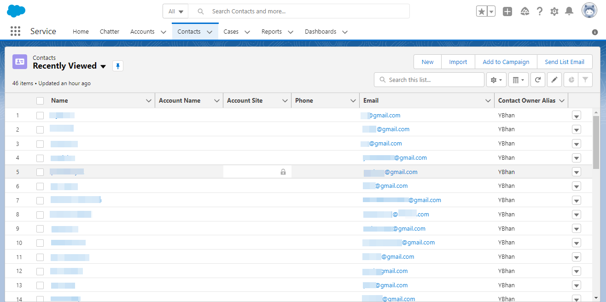
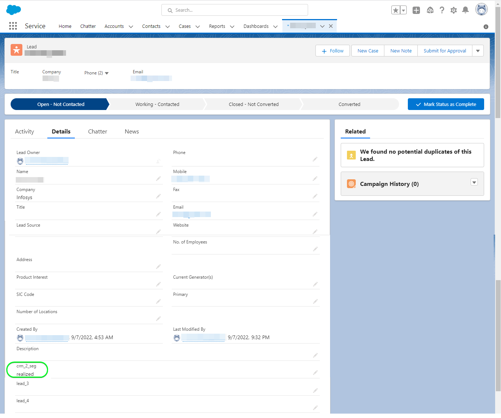

# [!DNL Salesforce CRM]個連線

## 概觀 {#overview}

[[!DNL Salesforce CRM]](https://www.salesforce.com/crm/)是熱門的客戶關係管理(CRM)平台，並支援下列描述的個人檔案型別：

* [銷售機會](https://developer.salesforce.com/docs/atlas.en-us.object_reference.meta/object_reference/sforce_api_objects_lead.htm) — 銷售機會是可能對您銷售的產品或服務感興趣（或不感興趣）的個人或公司名稱。
* [連絡人](https://developer.salesforce.com/docs/atlas.en-us.object_reference.meta/object_reference/sforce_api_objects_contact.htm) — 連絡人是您的代表已建立關係且已取得潛在客戶資格的個人。

此[!DNL Adobe Experience Platform] [目的地](/help/destinations/home.md)利用支援上述兩種設定檔型別的[[!DNL Salesforce composite API]](https://developer.salesforce.com/docs/atlas.en-us.api_rest.meta/api_rest/resources_composite_sobjects_collections_update.htm)。

當[啟用區段](#activate)時，您可以在潛在客戶或聯絡人之間選取，並將屬性和對象資料更新到[!DNL Salesforce CRM]中。

[!DNL Salesforce CRM]使用具有密碼授予的OAuth 2做為驗證機制，與Salesforce REST API通訊。 [向目的地驗證](#authenticate)區段中進一步說明如何向您的[!DNL Salesforce CRM]執行個體進行驗證。

## 使用案例 {#use-cases}

行銷人員可以根據使用者Adobe Experience Platform設定檔中的屬性，將個人化體驗提供給使用者。 您可以從您的離線資料建立受眾，並將這些受眾傳送至Salesforce CRM，以便在Adobe Experience Platform中更新受眾和設定檔後立即更新CRM會籍。

## 先決條件 {#prerequisites}

### Experience Platform的必要條件 {#prerequisites-in-experience-platform}

在啟用資料至Salesforce CRM目的地之前，您必須在[!DNL Experience Platform]中建立[結構描述](/help/xdm/schema/composition.md)、[資料集](https://experienceleague.adobe.com/docs/platform-learn/tutorials/data-ingestion/create-datasets-and-ingest-data.html)和[區段](https://experienceleague.adobe.com/docs/platform-learn/tutorials/segments/create-segments.html)。

### [!DNL Salesforce CRM]中的必要條件 {#prerequisites-destination}

若要將資料從Experience Platform匯出至您的Salesforce帳戶，請在[!DNL Salesforce CRM]中注意下列必要條件：

#### 您必須擁有[!DNL Salesforce]帳戶 {#prerequisites-account}

移至[!DNL Salesforce] [試用版](https://www.salesforce.com/in/form/signup/freetrial-sales/)頁面以註冊並建立[!DNL Salesforce]帳戶（如果尚未建立）。

#### 在[!DNL Salesforce]中設定連線應用程式 {#prerequisites-connected-app}

首先，如果您尚未設定[!DNL Salesforce]帳戶中的[[!DNL Salesforce] 連線應用程式](https://help.salesforce.com/s/articleView?id=sf.connected_app_create.htm&amp;language=en_US&amp;r=https%3A%2F%2Fhelp.salesforce.com%2F&amp;type=5)，請先設定。 [!DNL Salesforce CRM]將利用連線的應用程式連線至[!DNL Salesforce]。

接下來，為[!DNL Salesforce connected app]啟用[!DNL OAuth Settings for API Integration]。 請參閱[[!DNL Salesforce]](https://help.salesforce.com/s/articleView?id=connected_app_create_api_integration.htm&amp;type=5&amp;language=en_US)檔案以取得指引。

此外，請確定已針對[!DNL Salesforce connected app]選取下列提及的[範圍](https://help.salesforce.com/s/articleView?id=connected_app_create_api_integration.htm&amp;type=5&amp;language=en_US)。

* ``chatter_api``
* ``lightning``
* ``visualforce``
* ``content``
* ``openid``
* ``full``
* ``api``
* ``web``
* ``refresh_token``
* ``offline_access``

最後，確定已在您的[!DNL Salesforce]帳戶中啟用`password`授權。 若您需要指引，請參閱[!DNL Salesforce] [OAuth 2.0特殊案例的使用者名稱密碼流程](https://help.salesforce.com/s/articleView?id=sf.remoteaccess_oauth_username_password_flow.htm&amp;type=5)檔案。

>[!IMPORTANT]
>
>如果您的[!DNL Salesforce]帳戶管理員已限制受信任IP範圍的存取權，您必須連絡他們，才能取得[Experience Platform IP的](/help/destinations/catalog/streaming/ip-address-allow-list.md)加入允許清單。 如需其他指引，請參閱[!DNL Salesforce] [限制連線應用程式的受信任IP範圍存取](https://help.salesforce.com/s/articleView?id=sf.connected_app_edit_ip_ranges.htm&amp;type=5)檔案。

#### 在[!DNL Salesforce]中建立自訂欄位 {#prerequisites-custom-field}

將對象啟用至[!DNL Salesforce CRM]目的地時，您必須在&#x200B;**[對象排程](#schedule-segment-export-example)**&#x200B;步驟中，為每個已啟用的對象在&#x200B;**[!UICONTROL 對應ID]**&#x200B;欄位中輸入值。

[!DNL Salesforce CRM]需要此值才能正確讀取和解讀來自Experience Platform的對象，並在[!DNL Salesforce]內更新其對象狀態。 如果您需要對象狀態的指引，請參閱[對象成員資格詳細資料結構描述欄位群組](/help/xdm/field-groups/profile/segmentation.md)的Experience Platform檔案。

對於您從Experience Platform啟動到[!DNL Salesforce CRM]的每個對象，您需要在[!DNL Salesforce]內建立型別`Text Area (Long)`的自訂欄位。 您可以根據業務需求，定義任何大小的欄位字元長度，範圍在256到131,072個字元之間。 如需自訂欄位型別的其他資訊，請參閱[!DNL Salesforce] [自訂欄位型別](https://help.salesforce.com/s/articleView?id=sf.custom_field_types.htm&amp;type=5)檔案頁面。 如果您需要欄位建立的相關協助，也請參閱[!DNL Salesforce]檔案以[建立自訂欄位](https://help.salesforce.com/s/articleView?id=mc_cab_create_an_attribute.htm&amp;type=5&amp;language=en_US)。

>[!IMPORTANT]
>
>請勿在欄位名稱中包含空白字元。 請改用底線`(_)`字元做為分隔符號。
>您必須在[!DNL Salesforce]內建立自訂欄位，其欄位名稱為&#x200B;**[!UICONTROL 欄位名稱]**，與每個已啟動Experience Platform區段的&#x200B;**[!UICONTROL 對應ID]**&#x200B;中指定的值完全相符。 例如，底下熒幕擷圖顯示名為`crm_2_seg`的自訂欄位。 將對象啟用至此目的地時，請新增`crm_2_seg`做為&#x200B;**[!UICONTROL 對應ID]**，以將對象從Experience Platform填入至此自訂欄位。

在[!DNL Salesforce]，*步驟1 — 選取資料型別*中建立自訂欄位的範例如下所示：

在[!DNL Salesforce]，*步驟2 — 輸入自訂欄位*的詳細資料中建立自訂欄位的範例顯示如下：

>[!TIP]
>
>* 若要區分用於Experience Platform對象的自訂欄位和[!DNL Salesforce]內的其他自訂欄位，您可以在建立自訂欄位時包含可辨識的前置詞或後置詞。 例如，使用`Adobe_test_segment`或`test_segment_Adobe`代替`test_segment`
>* 如果您已在[!DNL Salesforce]中建立其他自訂欄位，您可以使用與Experience Platform區段相同的名稱，輕鬆識別[!DNL Salesforce]中的對象。

>[!NOTE]
>
>* Salesforce中的物件限製為25個外部欄位，請參閱[自訂欄位屬性](https://help.salesforce.com/s/articleView?id=sf.custom_field_attributes.htm&amp;type=5)。
>* 此限制表示您隨時最多只能有25個Experience Platform對象會籍處於作用中。
>* 如果您在Salesforce中達到此限制，則必須先從Salesforce中移除用來針對Experience Platform中舊版對象儲存對象狀態的自訂屬性，才能使用新的&#x200B;**[!UICONTROL 對應ID]**。

#### 收集[!DNL Salesforce CRM]認證 {#gather-credentials}

在驗證[!DNL Salesforce CRM]目的地之前，請記下以下專案：

| 認證 | 說明 | 範例 |
| --- | --- | --- |
| `Username` | 您的[!DNL Salesforce]帳戶使用者名稱。 | |
| `Password` | 您的[!DNL Salesforce]帳戶密碼。 | |
| `Security Token` | 您的[!DNL Salesforce]安全性權杖，您稍後會將其附加至[!DNL Salesforce]密碼的結尾，以建立串連字串，在[驗證目的地](#authenticate)時用作&#x200B;**[!UICONTROL 密碼]**。 請參閱[!DNL Salesforce]檔案以[重設您的安全性權杖](https://help.salesforce.com/s/articleView?id=sf.user_security_token.htm&amp;type=5)，瞭解如何從[!DNL Salesforce]介面重新產生沒有安全性權杖的權杖。 |  |
| `Custom Domain` | 您的[!DNL Salesforce]網域前置詞。  請參閱[[!DNL Salesforce] 檔案](https://help.salesforce.com/s/articleView?id=sf.domain_name_setting_login_policy.htm&amp;type=5)以瞭解如何從[!DNL Salesforce]介面取得此值。 | 如果您的[!DNL Salesforce]網域是  *`d5i000000isb4eak-dev-ed`.my.salesforce.com*， 您需要`d5i000000isb4eak-dev-ed`做為值。 |
| `Client ID` | 您的Salesforce `Consumer Key`。  請參閱[[!DNL Salesforce] 檔案](https://help.salesforce.com/s/articleView?id=sf.connected_app_rotate_consumer_details.htm&amp;type=5)以瞭解如何從[!DNL Salesforce]介面取得此值。 | |
| `Client Secret` | 您的Salesforce `Consumer Secret`。  請參閱[[!DNL Salesforce] 檔案](https://help.salesforce.com/s/articleView?id=sf.connected_app_rotate_consumer_details.htm&amp;type=5)以瞭解如何從[!DNL Salesforce]介面取得此值。 | |

### 護欄 {#guardrails}

[!DNL Salesforce]強制要求、速率和逾時限制，以平衡交易載入。 如需詳細資訊，請參閱[API要求限制和配置](https://developer.salesforce.com/docs/atlas.en-us.salesforce_app_limits_cheatsheet.meta/salesforce_app_limits_cheatsheet/salesforce_app_limits_platform_api.htm)。

如果您的[!DNL Salesforce]帳戶管理員已強制執行IP限制，您必須將[Experience Platform IP位址](/help/destinations/catalog/streaming/ip-address-allow-list.md)新增至您的[!DNL Salesforce]帳戶受信任的IP範圍。 如需其他指引，請參閱[!DNL Salesforce] [限制連線應用程式的受信任IP範圍存取](https://help.salesforce.com/s/articleView?id=sf.connected_app_edit_ip_ranges.htm&amp;type=5)檔案。

>[!IMPORTANT]
>
>當[啟用區段](#activate)時，您必須在&#x200B;*連絡人*&#x200B;或&#x200B;*潛在客戶*&#x200B;型別之間選取。 您必須確保您的對象擁有根據所選型別的適當資料對應。

## 支援的身分 {#supported-identities}

[!DNL Salesforce CRM]支援下表中描述的身分更新。 深入瞭解[身分](/help/identity-service/features/namespaces.md)。

| 目標身分 | 說明 | 考量事項 |
|---|---|---|
| `SalesforceId` | 您透過區段匯出或更新之連絡人或潛在客戶身分的[!DNL Salesforce CRM]識別碼。 | 強制 |

## 匯出型別和頻率 {#export-type-frequency}

請參閱下表以取得目的地匯出型別和頻率的資訊。

| 項目 | 類型 | 附註 |
|---------|----------|---------|
| 匯出類型 | **[!UICONTROL 以設定檔為基礎]** | <ul><li>您正在匯出區段的所有成員，以及所需的結構描述欄位&#x200B;*（例如：電子郵件地址、電話號碼、姓氏）* （根據您的欄位對應）。</li><li> 根據[對象排程](#schedule-segment-export-example)步驟期間提供的&#x200B;**[!UICONTROL 對應ID]**&#x200B;值，[!DNL Salesforce CRM]中的每個對象狀態都會以來自Experience Platform的對應對象狀態更新。</li></ul> |
| 匯出頻率 | **[!UICONTROL 串流]** | <ul><li>串流目的地是「一律開啟」的API型連線。 根據對象評估在Experience Platform中更新設定檔後，聯結器會立即將更新傳送至下游的目標平台。 深入瞭解[串流目的地](/help/destinations/destination-types.md#streaming-destinations)。</li></ul> |

{style="table-layout:auto"}

## 連線到目標 {#connect}

>[!IMPORTANT]
>
>若要連線到目的地，您需要&#x200B;**[!UICONTROL 檢視目的地]**&#x200B;和&#x200B;**[!UICONTROL 管理目的地]** [存取控制許可權](/help/access-control/home.md#permissions)。 閱讀[存取控制總覽](/help/access-control/ui/overview.md)或連絡您的產品管理員以取得必要的許可權。

若要連線到此目的地，請依照[目的地組態教學課程](../../ui/connect-destination.md)中所述的步驟進行。 在設定目標工作流程中，填寫以下兩個區段中列出的欄位。

在&#x200B;**[!UICONTROL 目的地]** > **[!UICONTROL 目錄]**&#x200B;內，搜尋[!DNL Salesforce CRM]。 或者，您可以在&#x200B;**[!UICONTROL CRM]**&#x200B;類別下找到它。

### 驗證目標 {#authenticate}

若要驗證到目的地，請填寫下列必填欄位，然後選取&#x200B;**[!UICONTROL 連線到目的地]**。 如需任何指引，請參閱[收集 [!DNL Salesforce CRM] 認證](#gather-credentials)區段。

| 認證 | 說明 |
| --- | --- |
| **[!UICONTROL 使用者名稱]** | 您的[!DNL Salesforce]帳戶使用者名稱。 |
| **[!UICONTROL 密碼]** | 由您的[!DNL Salesforce]帳戶密碼附加您的[!DNL Salesforce]安全性權杖所組成的串連字串。 串連值採用`{PASSWORD}{TOKEN}`的形式。 注意，請勿使用任何大括弧或空格。 例如，若您的[!DNL Salesforce]密碼為`MyPa$$w0rd123`，[!DNL Salesforce]安全性權杖為`TOKEN12345....0000`，則您將在&#x200B;**[!UICONTROL 密碼]**&#x200B;欄位中使用的串連值為`MyPa$$w0rd123TOKEN12345....0000`。 |
| **[!UICONTROL 自訂網域]** | 您的[!DNL Salesforce]網域前置詞。  例如，如果您的網域是&#x200B;*`d5i000000isb4eak-dev-ed`.my.salesforce.com*，您必須提供`d5i000000isb4eak-dev-ed`做為值。 |
| **[!UICONTROL 使用者端識別碼]** | 您的[!DNL Salesforce]已連線應用程式`Consumer Key`。 |
| **[!UICONTROL 使用者端密碼]** | 您的[!DNL Salesforce]已連線應用程式`Consumer Secret`。 |

如果提供的詳細資料有效，UI會以綠色勾號顯示&#x200B;**[!UICONTROL 已連線]**&#x200B;狀態，您就可以繼續進行下一個步驟。

### 填寫目標詳細資訊 {#destination-details}

若要設定目的地的詳細資訊，請填寫下方的必填和選用欄位。 UI中欄位旁的星號表示該欄位為必填欄位。
* **[!UICONTROL 名稱]**：您日後可辨識此目的地的名稱。
* **[!UICONTROL 描述]**：可協助您日後識別此目的地的描述。
* **[!UICONTROL Salesforce ID型別]**：
   * 如果您要匯出或更新身分的型別為&#x200B;*連絡人*，請選取&#x200B;**[!UICONTROL 連絡人]**。
   * 如果您要匯出或更新身分的型別為&#x200B;*銷售機會*，請選取&#x200B;**[!UICONTROL 銷售機會]**。

### 啟用警示 {#enable-alerts}

您可以啟用警報以接收有關傳送到您目的地的資料流狀態的通知。 從清單中選取警報以訂閱接收有關資料流狀態的通知。 如需警示的詳細資訊，請參閱[使用UI訂閱目的地警示](../../ui/alerts.md)的指南。

當您完成提供目的地連線的詳細資訊後，請選取&#x200B;**[!UICONTROL 下一步]**。

## 啟動此目標的對象 {#activate}

>[!IMPORTANT]
> 
>* 若要啟用資料，您需要&#x200B;**[!UICONTROL 檢視目的地]**、**[!UICONTROL 啟用目的地]**、**[!UICONTROL 檢視設定檔]**&#x200B;和&#x200B;**[!UICONTROL 檢視區段]** [存取控制許可權](/help/access-control/home.md#permissions)。 閱讀[存取控制總覽](/help/access-control/ui/overview.md)或連絡您的產品管理員以取得必要的許可權。
>* 若要匯出&#x200B;*身分*，您需要&#x200B;**[!UICONTROL 檢視身分圖表]** [存取控制許可權](/help/access-control/home.md#permissions)。  {width="100" zoomable="yes"}

閱讀[將設定檔和對象啟用至串流對象匯出目的地](/help/destinations/ui/activate-segment-streaming-destinations.md)，以瞭解啟用此目的地對象的指示。

### 對應考量事項和範例 {#mapping-considerations-example}

若要將對象資料從Adobe Experience Platform正確傳送至[!DNL Salesforce CRM]目的地，您必須完成欄位對應步驟。 對應包括在Experience Platform帳戶中的Experience Data Model (XDM)結構描述欄位與來自目標目的地的對應對應專案之間建立連結。

在&#x200B;**[!UICONTROL 目標欄位]**&#x200B;中指定的屬性應完全依照屬性對應表格中的說明命名，因為這些屬性將構成要求內文。

在&#x200B;**[!UICONTROL Source欄位]**&#x200B;中指定的屬性未遵循任何此類限制。 您可以視需要加以對應，但請根據[[!DNL Salesforce] 檔案](https://help.salesforce.com/s/articleView?id=sf.custom_field_attributes.htm&amp;type=5)確定輸入資料的格式有效。 如果輸入資料無效，對[!DNL Salesforce]的更新呼叫將會失敗，而且您的連絡人/潛在客戶將不會更新。

若要將您的XDM欄位正確對應到[!DNL (API) Salesforce CRM]目的地欄位，請遵循下列步驟：

1. 在&#x200B;**[!UICONTROL 對應]**&#x200B;步驟中，選取&#x200B;**[!UICONTROL 新增對應]**，您會在畫面上看到新的對應列。
   
1. 在&#x200B;**[!UICONTROL 選取來源欄位]**&#x200B;視窗中，選擇&#x200B;**[!UICONTROL 選取屬性]**&#x200B;類別並選取XDM屬性，或選擇&#x200B;**[!UICONTROL 選取身分名稱空間]**&#x200B;並選取身分。
1. 在&#x200B;**[!UICONTROL 選取目標欄位]**&#x200B;視窗中，選擇&#x200B;**[!UICONTROL 選取識別名稱空間]**&#x200B;並選取識別，或選擇&#x200B;**[!UICONTROL 選取自訂屬性]**&#x200B;類別並選取屬性，或視需要使用&#x200B;**[!UICONTROL 屬性名稱]**&#x200B;欄位定義屬性。 請參閱[[!DNL Salesforce CRM] 檔案](https://help.salesforce.com/s/articleView?id=sf.custom_field_attributes.htm&amp;type=5)以取得支援屬性的指引。
   * 重複這些步驟，在您的XDM設定檔結構描述與[!DNL (API) Salesforce CRM]之間新增下列對應：

   **使用連絡人**

   * 如果您正在使用區段中的&#x200B;*連絡人*，請參閱Salesforce中的[連絡人](https://developer.salesforce.com/docs/atlas.en-us.object_reference.meta/object_reference/sforce_api_objects_contact.htm)物件參考以定義要更新的欄位對應。
   * 您可以搜尋文字&#x200B;*Required*，以識別必填欄位，此文字在上述連結的欄位說明中有所提及。
   * 根據您要匯出或更新欄位，在您的XDM設定檔結構描述和[!DNL (API) Salesforce CRM]之間新增對應：

     | 來源欄位 | 目標欄位 | 附註 |
     | --- | --- | --- |
     | `IdentityMap: crmID` | `Identity: SalesforceId` | `Mandatory` |
     | `xdm: person.name.lastName` | `Attribute: LastName` | `Mandatory`。連絡人的姓氏，最多80個字元。 |
     | `xdm: person.name.firstName` | `Attribute: FirstName` | 連絡人的名字，最多40個字元。 |
     | `xdm: personalEmail.address` | `Attribute: Email` | 連絡人的電子郵件地址。 |

   * 以下顯示使用這些對應的範例：
     

   **使用銷售機會**

   * 如果您正在區段內使用&#x200B;*銷售機會*，請參閱Salesforce中的[銷售機會](https://developer.salesforce.com/docs/atlas.en-us.object_reference.meta/object_reference/sforce_api_objects_lead.htm)物件參考，以定義要更新欄位的對應。
   * 您可以搜尋文字&#x200B;*Required*，以識別必填欄位，此文字在上述連結的欄位說明中有所提及。
   * 根據您要匯出或更新欄位，在您的XDM設定檔結構描述和[!DNL (API) Salesforce CRM]之間新增對應：

     | 來源欄位 | 目標欄位 | 附註 |
     | --- | --- | --- |
     | `IdentityMap: crmID` | `Identity: SalesforceId` | `Mandatory` |
     | `xdm: person.name.lastName` | `Attribute: LastName` | `Mandatory`。銷售機會的姓氏，最多80個字元。 |
     | `xdm: b2b.companyName` | `Attribute: Company` | `Mandatory`。潛在客戶的公司。 |
     | `xdm: personalEmail.address` | `Attribute: Email` | 潛在客戶的電子郵件地址。 |

   * 以下顯示使用這些對應的範例：
     

當您完成提供目的地連線的對應時，請選取&#x200B;**[!UICONTROL 下一步]**。

### 排程對象匯出和範例 {#schedule-segment-export-example}

執行[排程對象匯出](/help/destinations/ui/activate-segment-streaming-destinations.md#scheduling)步驟時，您必須手動將從Experience Platform啟用的對象對應到[!DNL Salesforce]中其對應的自訂欄位。

若要這麼做，請選取每個區段，然後在[!DNL Salesforce CRM] **[!UICONTROL 對應ID]**&#x200B;欄位中輸入來自[!DNL Salesforce]的自訂欄位名稱。 如需在[!DNL Salesforce]中建立自訂欄位的相關指引和最佳作法，請參閱[在 [!DNL Salesforce]](#prerequisites-custom-field)中建立自訂欄位。

例如，若您的[!DNL Salesforce]自訂欄位是`crm_2_seg`，請在[!DNL Salesforce CRM] **[!UICONTROL 對應ID]**&#x200B;中指定此值，以將對象從Experience Platform填入此自訂欄位。

以下顯示來自[!DNL Salesforce]的自訂欄位範例：
![[!DNL Salesforce]顯示自訂欄位的UI熒幕擷圖。](../../assets/catalog/crm/salesforce/salesforce-custom-field.png)

以下顯示指示[!DNL Salesforce CRM] **[!UICONTROL 對應ID]**位置的範例：

如上所示，[!DNL Salesforce] **[!UICONTROL 欄位名稱]**&#x200B;與[!DNL Salesforce CRM] **[!UICONTROL 對應ID]**&#x200B;中指定的值完全相符。

根據您的使用案例，所有啟用的對象都可以對應至相同的[!DNL Salesforce]自訂欄位或[!DNL Salesforce CRM]中的不同&#x200B;**[!UICONTROL 欄位名稱]**。 以上圖影像為基礎的典型範例可能是。

| [!DNL Salesforce CRM]區段名稱 | [!DNL Salesforce] **[!UICONTROL 欄位名稱]** | [!DNL Salesforce CRM] **[!UICONTROL 對應ID]** |
| --- | --- | --- |
| crm_1_seg | `crm_1_seg` | `crm_1_seg` |
| crm_2_seg | `crm_2_seg` | `crm_2_seg` |

對每個已啟動的Experience Platform區段重複此章節。

## 驗證資料匯出 {#exported-data}

若要驗證您是否已正確設定目的地，請遵循下列步驟：

1. 選取&#x200B;**[!UICONTROL 目的地]** > **[!UICONTROL 瀏覽]**以瀏覽目的地清單。
   

1. 選取目的地並驗證狀態為&#x200B;**[!UICONTROL 已啟用]**。
   

1. 切換至&#x200B;**[!UICONTROL 啟用資料]**標籤，然後選取對象名稱。
   

1. 監控對象摘要，並確保設定檔計數對應於在區段內建立的計數。
   

1. 最後，登入Salesforce網站，並驗證對象的設定檔是否已新增或更新。

   **使用連絡人**

   * 如果您已在您的Experience Platform區段中選取&#x200B;*連絡人*，請瀏覽至&#x200B;**[!DNL Apps]** > **[!DNL Contacts]**頁面。
     

   * 選取&#x200B;*連絡人*&#x200B;並檢查欄位是否已更新。 您可以看到根據[對象排程](#schedule-segment-export-example)期間提供的&#x200B;**[!UICONTROL 對應ID]**&#x200B;值，[!DNL Salesforce CRM]中的每個對象狀態已更新為Experience Platform中的對應對象狀態。
     

   **使用銷售機會**

   * 如果您已在您的Experience Platform區段中選取&#x200B;*銷售機會*，請導覽至&#x200B;**[!DNL Apps]** > **[!DNL Leads]**頁面。
     

   * 選取&#x200B;*銷售機會*&#x200B;並檢查欄位是否已更新。 您可以看到根據[對象排程](#schedule-segment-export-example)期間提供的&#x200B;**[!UICONTROL 對應ID]**&#x200B;值，[!DNL Salesforce CRM]中的每個對象狀態已更新為Experience Platform中的對應對象狀態。
     

## 資料使用與控管 {#data-usage-governance}

處理您的資料時，所有[!DNL Adobe Experience Platform]目的地都符合資料使用原則。 如需[!DNL Adobe Experience Platform]如何強制資料控管的詳細資訊，請參閱[資料控管概觀](/help/data-governance/home.md)。

## 錯誤與疑難排解 {#errors-and-troubleshooting}

### 將事件推播到目的地時遇到未知錯誤 {#unknown-errors}

* 檢查資料流執行時，您可能會遇到下列錯誤訊息： `Unknown errors encountered while pushing events to the destination. Please contact the administrator and try again.`
  

   * 若要修正此錯誤，請確認您在啟動工作流程中提供的&#x200B;**[!UICONTROL 對應ID]**&#x200B;與[!DNL Salesforce CRM]目的地完全符合您在[!DNL Salesforce]中建立的自訂欄位型別的值。 請參閱[在 [!DNL Salesforce]](#prerequisites-custom-field)內建立自訂欄位區段以取得指引。

* 啟用區段時，您可能會收到錯誤訊息： `The client's IP address is unauthorized for this account. Allowlist the client's IP address...`
   * 若要修正此錯誤，請連絡您的[!DNL Salesforce]帳戶管理員，將[Experience Platform IP位址](/help/destinations/catalog/streaming/ip-address-allow-list.md)新增至您的[!DNL Salesforce]帳戶受信任的IP範圍。 如需其他指引，請參閱[!DNL Salesforce] [限制連線應用程式的受信任IP範圍存取](https://help.salesforce.com/s/articleView?id=sf.connected_app_edit_ip_ranges.htm&amp;type=5)檔案。

## 其他資源 {#additional-resources}

來自[Salesforce開發人員入口網站](https://developer.salesforce.com/)的其他實用資訊如下：
* [快速入門](https://developer.salesforce.com/docs/atlas.en-us.api_rest.meta/api_rest/quickstart.htm)
* [建立記錄](https://developer.salesforce.com/docs/atlas.en-us.api_rest.meta/api_rest/dome_sobject_create.htm)
* [自訂建議對象](https://developer.salesforce.com/docs/atlas.en-us.236.0.chatterapi.meta/chatterapi/connect_resources_recommendation_audiences_list.htm)
* [使用複合資源](https://developer.salesforce.com/docs/atlas.en-us.api_rest.meta/api_rest/using_composite_resources.htm?q=composite)
* 此目的地採用[Upsert Multiple Records](https://developer.salesforce.com/docs/atlas.en-us.api_rest.meta/api_rest/resources_composite_sobjects_collections_update.htm) API，而非[Upsert Single Record](https://developer.salesforce.com/docs/atlas.en-us.api_rest.meta/api_rest/dome_composite_upsert_example.htm?q=contacts) API呼叫。
